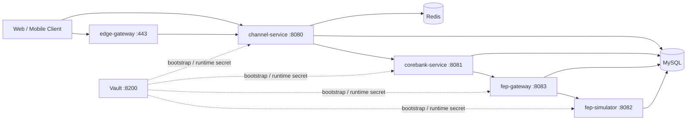

# FIXYZ

[](https://doyoulikefix.github.io/FIXYZ/)
[](https://github.com/DoYouLikeFIx/FIXYZ/actions/workflows/docs-publish.yml)
[](https://github.com/DoYouLikeFIx/FIXYZ/actions/workflows/supply-chain-security.yml)

FIXYZ is a Korean securities trading simulator built to show systems thinking beyond CRUD: Channel/CoreBanking/FEP separation, Redis-backed session integrity, risk-based MFA and order step-up, FIX 4.2 translation, pessimistic locking for position safety, and evidence-driven release readiness.

Current badge reality is intentional: the repository already publishes API docs and supply-chain evidence, while the broader acceptance and release gate rollout is tracked in Epic 10.

## Quick Start

The local stack is Vault-backed. `docker compose up` is not enough on its own because the runtime services fail fast until `INTERNAL_SECRET` is resolved from Vault.

```bash
cp .env.example .env
# set VAULT_DEV_ROOT_TOKEN_ID and INTERNAL_SECRET_BOOTSTRAP in .env

docker compose -f docker-compose.vault.yml up -d vault vault-init

export VAULT_RUNTIME_ROLE_ID="$(docker exec vault cat /vault/file/runtime-role-id)"
export VAULT_RUNTIME_SECRET_ID="$(docker exec vault cat /vault/file/runtime-secret-id)"
export INTERNAL_SECRET="$(
  VAULT_ADDR=http://localhost:8200 \
  VAULT_RUNTIME_ROLE_ID="$VAULT_RUNTIME_ROLE_ID" \
  VAULT_RUNTIME_SECRET_ID="$VAULT_RUNTIME_SECRET_ID" \
  ./docker/vault/scripts/read-internal-secret.sh
)"

docker compose up -d
docker exec channel-service curl -fsS http://localhost:18080/actuator/health
curl -k https://localhost/health/channel
```

Useful endpoints after startup:

- Channel API: `http://localhost:8080`
- Channel actuator health: `http://localhost:18080/actuator/health` via `docker exec channel-service`
- Edge health: `https://localhost/health/channel`
- Vault UI: `http://localhost:8200`
- Prometheus: `http://127.0.0.1:9090` with `COMPOSE_PROFILES=observability`
- Grafana: `http://127.0.0.1:3000` with `COMPOSE_PROFILES=observability`
- GitHub Pages API docs: `https://doyoulikefix.github.io/FIXYZ/`

If you want the FE app as part of the local walkthrough, use [FE/README.md](./FE/README.md) after the backend stack is healthy.

## Architecture Diagram



## What FIXYZ Demonstrates

- Position integrity under concurrent execution via pessimistic locking and proof tests.
- Mandatory login MFA plus elevated-risk order step-up instead of a flat auth model.
- Resilience4j circuit breakers and recovery-aware order-session UX on the FEP path.
- Explicit backend boundaries: Channel, CoreBanking, FEP Gateway, and FEP Simulator.
- Vault-backed secret bootstrap and edge gateway hardening that are visible in the repo, not hand-waved.
- FE/MOB parity backed by checked-in live and contract-oriented tests.

## Reviewer Paths

### Banking interviewer path

Open these in order if you want the "why this architecture?" explanation fast:

1. [README `Architecture Decisions`](#architecture-decisions)
2. [PositionConcurrencyIntegrationTest.java](./BE/corebank-service/src/test/java/com/fix/corebank/integration/PositionConcurrencyIntegrationTest.java)
3. [OrderExecutionService.java](./BE/channel-service/src/main/java/com/fix/channel/service/OrderExecutionService.java)
4. [AuditLogService.java](./BE/channel-service/src/main/java/com/fix/channel/service/AuditLogService.java)
5. [docs/ops/vault-secrets-foundation.md](./docs/ops/vault-secrets-foundation.md)

Conversation anchors:

- Why pessimistic locking over optimistic retry for position mutation
- Why Channel owns session and orchestration while CoreBanking owns ledger truth
- Why FIX 4.2 remains explicit even in a simulator-backed portfolio
- Why audit, masking, and session invalidation are treated as first-class behavior

### FinTech interviewer path

Open these if you want the "show me the proof" path:

1. [GitHub Pages API docs](https://doyoulikefix.github.io/FIXYZ/)
2. [PositionConcurrencyIntegrationTest.java](./BE/corebank-service/src/test/java/com/fix/corebank/integration/PositionConcurrencyIntegrationTest.java)
3. [FepClient.java](./BE/corebank-service/src/main/java/com/fix/corebank/client/FepClient.java)
4. [FE live order-session spec](./FE/e2e/live/order-session-live.spec.ts)
5. [Mobile live order test](./MOB/tests/e2e/mobile-order-live.e2e.test.ts)
6. [Root proof-test scripts](./package.json)

Suggested demo sequence:

```bash
# 1. Start backend stack with Vault-resolved INTERNAL_SECRET
# 2. Run the FE live suite against the local backend
cd FE
pnpm run e2e:live:if-healthy

# 3. Or inspect root proof suites
cd ..
npm run test:client-parity
npm run test:edge-gateway
```

For the circuit-breaker walkthrough, inject timeout behavior into the simulator and inspect the CoreBanking breaker state:

```bash
curl -X PUT "http://localhost:8082/fep-internal/rules" \
  -H "Content-Type: application/json" \
  -d '{"action_type":"TIMEOUT","delay_ms":3000,"failure_rate":1.0}'

curl http://localhost:8081/actuator/circuitbreakers
```

## Architecture Decisions

- Pessimistic locking for account and position mutation protects the "no over-sell" invariant.
  Proof: [OrderSessionRepository.java](./BE/channel-service/src/main/java/com/fix/channel/repository/OrderSessionRepository.java), [PositionConcurrencyIntegrationTest.java](./BE/corebank-service/src/test/java/com/fix/corebank/integration/PositionConcurrencyIntegrationTest.java), [_bmad-output/planning-artifacts/architecture.md](./_bmad-output/planning-artifacts/architecture.md)
- Redis-backed session management keeps logout and forced invalidation observable and testable across requests.
  Proof: [ChannelSessionConfig.java](./BE/channel-service/src/main/java/com/fix/channel/config/ChannelSessionConfig.java), [ChannelAuthSessionIntegrationTest.java](./BE/channel-service/src/test/java/com/fix/channel/integration/ChannelAuthSessionIntegrationTest.java)
- The FEP path uses Resilience4j circuit breakers so exchange-side failure cannot silently mutate local state.
  Proof: [FepClient.java](./BE/corebank-service/src/main/java/com/fix/corebank/client/FepClient.java), [_bmad-output/planning-artifacts/prd.md](./_bmad-output/planning-artifacts/prd.md)
- Nginx is the explicit edge baseline for TLS termination, deterministic deny paths, and SSE-compatible proxying.
  Proof: [adr-0001-edge-gateway-nginx.md](./docs/ops/adr/adr-0001-edge-gateway-nginx.md)
- Vault is the local and non-local secret-management baseline; runtime services consume a resolved `INTERNAL_SECRET` instead of shipping shared secrets in source.
  Proof: [docs/ops/vault-secrets-foundation.md](./docs/ops/vault-secrets-foundation.md), [BE/application-local.yml.template](./BE/application-local.yml.template)

## Security Architecture

FIXYZ treats security behavior as product behavior, not a postscript.

- Authentication and step-up: login MFA plus elevated-risk order re-authentication follow the OWASP Authentication Cheat Sheet rationale captured in [_bmad-output/planning-artifacts/prd.md](./_bmad-output/planning-artifacts/prd.md).
- CSRF: the web contract uses synchronizer-token semantics with `GET /api/v1/auth/csrf` bootstrap and `X-CSRF-TOKEN` on mutating requests.
  Proof: [ChannelSecurityConfig.java](./BE/channel-service/src/main/java/com/fix/channel/config/ChannelSecurityConfig.java), [ChannelCsrfBootstrapTest.java](./BE/channel-service/src/test/java/com/fix/channel/controller/ChannelCsrfBootstrapTest.java)
- Session security: logout and admin invalidation are backed by Redis rather than client-only token deletion.
  Proof: [ChannelSessionInvalidationService.java](./BE/channel-service/src/main/java/com/fix/channel/service/ChannelSessionInvalidationService.java), [AdminSessionAuditIntegrationTest.java](./BE/channel-service/src/test/java/com/fix/channel/integration/AdminSessionAuditIntegrationTest.java)
- Audit and masking: account/member numbers are masked and sensitive auth material stays out of logs, aligned to the OWASP Logging Cheat Sheet direction captured in the PRD.
  Proof: [AuditLogService.java](./BE/channel-service/src/main/java/com/fix/channel/service/AuditLogService.java), [_bmad-output/implementation-artifacts/8-2-pii-masking-enforcement.md](./_bmad-output/implementation-artifacts/8-2-pii-masking-enforcement.md)

## Environment Variables

The source of truth is split by runtime boundary:

- Root infra and Docker defaults: [.env.example](./.env.example)
- Backend reviewer-facing local profile template: [BE/application-local.yml.template](./BE/application-local.yml.template)
- Backend local runtime explanation: [BE/README.md](./BE/README.md)
- FE env and Vite proxy defaults: [FE/.env.example](./FE/.env.example)
- FE runtime and live E2E flow: [FE/README.md](./FE/README.md)
- MOB runtime modes, edge mode, and live auth flow: [MOB/README.md](./MOB/README.md)

Important local variables to understand first:

| Variable | Why it matters | Source |
| --- | --- | --- |
| `VAULT_DEV_ROOT_TOKEN_ID` | Boots local Vault dev mode | `.env.example` |
| `INTERNAL_SECRET_BOOTSTRAP` | Seeds the Vault-managed internal boundary secret | `.env.example` |
| `INTERNAL_SECRET` | Required at runtime before backend services will boot | Vault resolution step + `docker/vault/scripts/read-internal-secret.sh` |
| `MYSQL_USER`, `MYSQL_PASSWORD`, `MYSQL_ROOT_PASSWORD` | Shared MySQL bootstrap for local compose | `.env.example` |
| `VITE_DEV_PROXY_TARGET` | FE local proxy target for same-origin cookie and CSRF behavior | `FE/.env.example` |
| `MOB_API_INGRESS_MODE`, `MOB_EDGE_BASE_URL` | Mobile direct vs edge validation contract | `MOB/README.md` |

## Proof Tests

Representative proof points you can run or inspect directly:

- Backend concurrency proof: [PositionConcurrencyIntegrationTest.java](./BE/corebank-service/src/test/java/com/fix/corebank/integration/PositionConcurrencyIntegrationTest.java)
- Auth/session proof: [ChannelAuthSessionIntegrationTest.java](./BE/channel-service/src/test/java/com/fix/channel/integration/ChannelAuthSessionIntegrationTest.java)
- Admin invalidation and audit proof: [AdminSessionAuditIntegrationTest.java](./BE/channel-service/src/test/java/com/fix/channel/integration/AdminSessionAuditIntegrationTest.java)
- FE live flow proof: [order-session-live.spec.ts](./FE/e2e/live/order-session-live.spec.ts)
- FE notification proof: [notification-center-live.spec.ts](./FE/e2e/live/notification-center-live.spec.ts)
- Mobile live flow proof: [mobile-order-live.e2e.test.ts](./MOB/tests/e2e/mobile-order-live.e2e.test.ts)
- Cross-client parity proof: [tests/client-parity/order-session-parity.test.js](./tests/client-parity/order-session-parity.test.js)

Top-level proof commands:

```bash
npm run test:client-parity
npm run test:edge-gateway
npm run test:observability
npm run test:supply-chain
```

## API Reference

- Canonical public API docs: [GitHub Pages Swagger UI](https://doyoulikefix.github.io/FIXYZ/)
- Channel service local docs path: `/swagger-ui/index.html` and `/v3/api-docs` in local/openapi-enabled profiles
- Public API prefix: `/api/v1/`
- Internal API prefix: `/internal/v1/`
- FEP operational prefix: `/fep-internal/`

High-signal local endpoints:

- `GET http://localhost:8080/api/v1/auth/csrf`
- `POST http://localhost:8080/api/v1/auth/login`
- `POST http://localhost:8080/api/v1/orders/sessions`
- `GET  http://localhost:8080/api/v1/notifications/stream`
- `GET  http://localhost:8081/actuator/circuitbreakers`
- `PUT  http://localhost:8082/fep-internal/rules`

## Module Structure

```text
README.md              -> reviewer-facing entry point
BE/                    -> Spring Boot services + tests + OpenAPI generation
  channel-service/     -> auth, session, order orchestration, admin, notifications
  corebank-service/    -> ledger truth, positions, order execution, resilience
  fep-gateway/         -> FIX 4.2 translation, gateway control plane, market data
  fep-simulator/       -> simulator execution + chaos control plane
FE/                    -> React web client + Playwright live suites
MOB/                   -> React Native client + Vitest/Maestro coverage
docs/                  -> ADRs, ops runbooks, evidence packaging
tests/                 -> root governance, edge, vault, observability, parity checks
_bmad-output/          -> planning and implementation artifacts that explain scope
```

## Local Setup References

- [Backend runtime guide](./BE/README.md)
- [Frontend runtime guide](./FE/README.md)
- [Frontend release checklist](./FE/docs/release/web-readiness-checklist.md)
- [Frontend release notes template](./FE/docs/release/web-release-notes.md)
- [Mobile runtime guide](./MOB/README.md)
- [Backend local profile template](./BE/application-local.yml.template)
- [Shared environment defaults](./.env.example)
