# Channel System ERD (`channel_db`)

> Generated: 2026-02-24  
> Revised: 2026-02-24 (Party Mode P-1~P-7 + P-8~P-12 + P-13~P-17 + P-18~P-20 + P-21~P-27 반영)  
> Schema owner: `channel-service` (port 8080)  
> Flyway migrations: V0 ~ V3 (V0: members, V1: transfer_sessions, V2: audit, V3: notifications)

---

## Entity Relationship Diagram

```mermaid
erDiagram
    members {
        BIGINT       id                  PK  "AUTO_INCREMENT"
        VARCHAR(50)  username            UK  "NOT NULL"
        VARCHAR(100) email               UK  "NOT NULL (Q-7-5)"
        VARCHAR(255) password                "NOT NULL, BCrypt strength 12, @JsonIgnore"
        VARCHAR(100) name                    "NOT NULL (FR-01, Story 1.1)"
        VARCHAR(20)  role                    "NOT NULL, ROLE_USER | ROLE_ADMIN"
        VARCHAR(10)  status                  "NOT NULL, DEFAULT ACTIVE, ACTIVE|LOCKED (FR-06)"
        INT          login_fail_count        "NOT NULL, DEFAULT 0 — 5회 초과 시 LOCKED (P-8)"
        DATETIME     locked_at               "NULLABLE — status=LOCKED 전환 시각 (P-8)"
        DATETIME     created_at              "NOT NULL, @CreatedDate"
        DATETIME     updated_at              "NOT NULL, @LastModifiedDate"
    }

    transfer_sessions {
        BIGINT       id                  PK  "AUTO_INCREMENT"
        VARCHAR(36)  session_id          UK  "NOT NULL, UUID"
        BIGINT       member_id           FK  "NOT NULL → members.id"
        VARCHAR(20)  status                  "NOT NULL, OTP_PENDING|AUTHED|EXECUTING|COMPLETED|FAILED|EXPIRED (P-13)"
        BIGINT       from_account_id         "core_db.accounts.id (logical FK — no DB constraint, P-14)"
        BIGINT       receiver_account_id     "NULLABLE — 같은 은행=core_db FK, 타행=NULL (P-9)"
        VARCHAR(20)  receiver_account_number "NOT NULL, CHECK REGEXP ^[0-9]{10,14}$"
        BIGINT       amount                  "NOT NULL, CHECK > 0, 원화 Long (MVP → DECIMAL post-MVP)"
        VARCHAR(36)  client_request_id   UK  "NULLABLE, Idempotency — RULE-071"
        VARCHAR(36)  correlation_id          "X-Correlation-Id — Q-7-11"
        VARCHAR(10)  to_bank_code             "NULLABLE — 세션 생성 시 저장. 동일은행=내부코드, 타행=외부코드 (P-19)"
        VARCHAR(36)  transaction_id          "NULLABLE — COMPLETED 시 UUID 생성. FR-25 거래 참조번호 (P-18)"
        VARCHAR(100) fep_reference_id        "NULLABLE — FEP 외부 참조번호 (타행 이체 완료 후 저장, P-9)"
        VARCHAR(500) fail_reason             "NULLABLE — 실패 사유 코드 및 메시지 (P-9)"
        DATETIME     completed_at            "NULLABLE — COMPLETED/FAILED 전환 시각 (P-9)"
        DATETIME     created_at              "NOT NULL, @CreatedDate"
        DATETIME     updated_at              "NOT NULL, @LastModifiedDate"
    }

    audit_logs {
        BIGINT       id                  PK  "AUTO_INCREMENT"
        BIGINT       member_id           FK  "NOT NULL → members.id"
        VARCHAR(36)  transfer_session_id     "NULLABLE → transfer_sessions.session_id (logical, P-11)"
        VARCHAR(100) target_id               "NULLABLE — 감사 대상 ID (session_id/memberId 등 범용, P-23)"
        VARCHAR(50)  action                  "NOT NULL, ENUM 목록 참조"
        VARCHAR(45)  ip_address              "IPv4/IPv6"
        VARCHAR(500) user_agent
        TEXT         detail                  "JSON 직렬화 컨텍스트"
        DATETIME     created_at              "NOT NULL, @CreatedDate — purge after 90 days"
    }

    security_events {
        BIGINT       id                  PK  "AUTO_INCREMENT"
        BIGINT       member_id               "NULLABLE (미인증 이벤트 포함)"
        VARCHAR(50)  event_type              "NOT NULL, ENUM 목록 참조"
        VARCHAR(45)  ip_address
        TEXT         detail
        DATETIME     created_at              "NOT NULL, @CreatedDate — purge after 180 days"
    }

    notifications {
        BIGINT       id                  PK  "AUTO_INCREMENT"
        BIGINT       member_id           FK  "NOT NULL → members.id"
        VARCHAR(36)  transfer_id             "NULLABLE → transfer_sessions.session_id (logical, P-21)"
        VARCHAR(50)  type                    "NOT NULL, TRANSFER_COMPLETED|DEPOSIT|SECURITY_ALERT|SESSION_EXPIRY (P-22)"
        VARCHAR(200) title                   "NOT NULL"
        TEXT         message                 "NOT NULL"
        BOOLEAN      is_read                 "NOT NULL, DEFAULT false"
        DATETIME     created_at              "NOT NULL, @CreatedDate"
        DATETIME     updated_at              "NOT NULL, @LastModifiedDate (is_read 업데이트 시각)"
    }

    members         ||--o{ transfer_sessions  : "1명 → N개 이체세션"
    members         ||--o{ audit_logs         : "1명 → N개 감사로그"
    members         ||--o{ notifications      : "1명 → N개 알림"
    members         }o--o{ security_events    : "0..1명 → N개 보안이벤트(nullable)"
```



---

## 테이블 상세 설명

### `members`
- **역할**: 채널 인증 주체. Spring Security `UserDetails` 매핑 대상.
- **패스워드**: BCrypt strength 12 (D-011). `@JsonIgnore` + `@ToString.Exclude` 의무 적용. 응답 DTO 절대 포함 금지.
- **role**: `ROLE_USER` / `ROLE_ADMIN` (관리자 전용 `/api/v1/admin/**` 접근 제어).
- **email**: UK constraint. Q-7-5 시드 데이터 `admin@fix.com` 포함 필요.
- **name** (P-8): Story 1.1 가입 API `{ email, password, name }` — `VARCHAR(100) NOT NULL`.
- **status** (P-8): `ACTIVE` / `LOCKED` — 5회 연속 로그인 실패 시 `LOCKED` 전환 (FR-06). 관리자 해제 = `ACTIVE` 복원 (Epic 6). `FORCE_LOGOUT`은 Redis 세션 삭제, status는 별도 관리.
- **login_fail_count / locked_at** (P-8): DB 영속 관리 — Redis 주기적 만료와 달리 서비스 재시작 후에도 lockout 유지. 로그인 성공 시 count=0, locked_at=NULL 초기화.
- **비고**: seed data — `user` / `user@fix.com` (ROLE_USER, status=ACTIVE), `admin` / `admin@fix.com` (ROLE_ADMIN, status=ACTIVE). Story 8.3 README Quick Start 자격증명 기준 (P-27). 구 `jisu@fix.com` 적용 안 함.

### `transfer_sessions`
- **역할**: 이체 3단계 상태기계(`INPUT → AUTHED → EXECUTING → SUCCESS/FAILURE`)의 지속성 저장소 + 이체 히스토리 조회 소스.
- **Redis 미러**: `ch:txn-session:{sessionId}` TTL 600s — 빠른 상태 조회용.
- **`from_account_id`** (P-14): `core_db.accounts.id`를 _논리적으로_ 참조 (DB FK 없음 — 서비스 경계 분리). Story 2.1 SQL `AND from_account_id = ?` 기준. 1일 한도 쿼리: `WHERE from_account_id=? AND status IN ('OTP_PENDING','AUTHED','EXECUTING','COMPLETED') AND DATE(created_at)=CURDATE()`
- **`receiver_account_id`** (P-9): 같은 은행 이체 = `core_db.accounts.id` 논리 참조, 타행 이체 = NULL. `direction=RECEIVED` 필터 쿼리(`WHERE receiver_account_id IN :myAccountIds`) 지원.
- **`receiver_account_number`**: 숫자 10~14자리 (`^\d{10,14}$`). MySQL 8 `CHECK` 제약 권장.
- **`amount`**: 원화 정수 Long. MVP에서 `BIGINT NOT NULL, CHECK (amount > 0)`. post-MVP에서 `DECIMAL(19,4)` 전환.
- **`client_request_id`**: UNIQUE INDEX, NULLABLE — 중복 이체 방지 (RULE-071 Idempotency). NULL이면 일반 요청.
- **`fep_reference_id`** (P-9): FEP 외부 참조번호 — 타행 이체 완료 후 `FepResponse.referenceId`를 저장. Story 1.5 `GET /api/v1/transfers/{transferId}` 응답에 포함.
- **`fail_reason`** (P-9): 실패 사유 저장 — 예: `"INSUFFICIENT_BALANCE"`, `"FEP_TIMEOUT"`. Story 1.5 응답의 `failReason` 필드 소스.
- **`completed_at`** (P-9): `COMPLETED`/`FAILED` 전환 시각 명시 저장. Story 1.5 응답의 `completedAt` 필드 소스. `updated_at`과 함께 사용하되 의미가 명확한 별도 컬럼 유지.
- **status enum (P-13)**: `OTP_PENDING` (DB 초기 생성시), `AUTHED` (OTP 검증 후), `EXECUTING` (FEP 호출 중), `COMPLETED` (성공), `FAILED` (실패/OTP 횟수초과), `EXPIRED` (TTL 600s 만료). `INPUT`은 프론트엔드 UI 상태이며 DB에 저장되지 않음.
- **EXPIRED 처리 (P-17)**: `@PostConstruct` `TransferSessionRecoveryService` — 서비스 재시작 시 `EXECUTING` 상태 세션 전체를 `FAILED`로 전환. `@Scheduled` cleanup — `EXPIRED` 세션 주기 정리 (TTL 만료 후 DB 상태 동기화).
- **OTP 시도 횟수**: Redis `ch:otp-attempt-ts:{sessionId}` (NX EX 1s)로 debounce 관리. 최대 횟수 초과 = `security_events` 기록 후 세션 FAILURE 전환.
- **상태 전환**: `TransferSessionService.transition()` 전용 — 외부 직접 SET 금지 (RULE-026).
- **트랜잭션 경계 (Q-7-15)**: 잔액 차감 + `status=EXECUTING` 업데이트 후 트랜잭션 커밋 → FepClient.call() 호출 (트랜잭션 외부) → 결과에 따라 `COMPLETED`(`fep_reference_id`/`completed_at`) 또는 `FAILED`(`fail_reason`/`completed_at`) 저장.

### `audit_logs`
- **역할**: 관리자 감사 추적. `GET /api/v1/admin/audit-logs` (ROLE_ADMIN 전용).
- **보존**: 90일 후 자동 삭제 (`@Scheduled` purge). `idx_audit_logs_created_at` 인덱스로 범위 삭제.
- **`transfer_session_id`** (P-11): NULLABLE, `transfer_sessions.session_id` 논리 참조. `TRANSFER_*` 관련 감사 로그에 이체 세션 ID 연결. 로그인/로그아웃 등은 NULL.
- **`target_id`** (P-23): 감사 행동의 대상 식별자 — 이체: `transfer_sessions.session_id`, 계정 잠금 해제: `memberId`, 로그인: NULL. Story 6.2 Admin API `GET /admin/audit-logs` 응답의 `targetId` 필드 소스.
- **action 값 목록 (Story 6.1 기준, P-24):**

| action 값 | 발생 시점 |
|---|---|
| `LOGIN_SUCCESS` | 로그인 성공 |
| `LOGIN_FAILURE` | 로그인 실패 (P-24) |
| `LOGOUT` | 정상 로그아웃 |
| `FORCE_LOGOUT` | 관리자 강제 로그아웃 |
| `TRANSFER_INITIATED` | 이체 세션 생성 (P-24) |
| `OTP_ISSUED` | OTP 발급 (P-24) |
| `OTP_VERIFIED` | OTP 인증 성공 (P-24) |
| `OTP_FAILED` | OTP 인증 실패 (P-24) |
| `TRANSFER_EXECUTED` | 이체 실행 완료 (COMPLETED, P-24) |
| `TRANSFER_FAILED` | 이체 실패 (P-24) |
| `TRANSFER_RECOVERY_FAILED` | Recovery 스케줄러 EXECUTING→FAILED 전환 (P-20) |
| `TOKEN_REFRESH` | Access Token 재발급 |
| `ACCOUNT_LOCKED` | 로그인 실패 5회 → 계정 잠금 (FR-06) |
| `ACCOUNT_UNLOCKED` | 관리자 잠금 해제 (Epic 6) |

### `security_events`
- **역할**: 보안 이상징후 기록 (OTP 연속 실패, Rate Limit 도달, 세션 만료 등).
- **`member_id` nullable**: 미인증 상태(로그인 전)의 보안 이벤트도 수용. ERD 표기에서 `}o--o{` 관계로 수정됨.
- **보존**: 180일 후 자동 삭제. `idx_security_events_created_at` 인덱스로 범위 삭제.
- **event_type 값 목록:**

| event_type 값 | 설명 |
|---|---|
| `OTP_FAIL` | OTP 1회 불일치 |
| `OTP_MAX_ATTEMPTS` | OTP 5회 초과 (BusinessConstants.OTP_MAX_ATTEMPTS) |
| `SESSION_EXPIRE` | 세션 TTL 만료 (SSE 세션 만료 이벤트와 연동) |
| `RATE_LIMIT_LOGIN` | Login 5req/min/IP 초과 |
| `RATE_LIMIT_OTP` | OTP 3req/session 초과 |
| `RATE_LIMIT_TRANSFER` | Transfer Prepare 10req/min/userId 초과 |
| `REFRESH_TOKEN_INVALID` | Refresh Token 위변조 또는 만료 (Q-7-19B) |
| `FORCED_LOGOUT` | 관리자 강제 세션 무효화 (Story 6.2, P-25) — detail: `{ "adminId": N }` |

> **`detail` JSON schema 예시 (P-12):**
> - `OTP_FAIL`: `{ "remainingAttempts": 3, "sessionId": "uuid" }`
> - `RATE_LIMIT_LOGIN`: `{ "ip": "1.2.3.4", "retryAfterSeconds": 60 }`
> - `RATE_LIMIT_OTP`: `{ "sessionId": "uuid", "retryAfterSeconds": 60 }`
> - `ACCOUNT_LOCKED`: `{ "failCount": 5, "lockedAt": "ISO8601" }`

### `notifications`
- **역할**: SSE 실시간 전송 실패 시 폴백 + 알림 히스토리 (`GET /api/v1/notifications`).
- **Dual-write 순서**: DB persist → SseEmitter push (D-013). SSE 실패해도 DB 레코드 유지.
- **`transfer_id`** (P-21): `transfer_sessions.session_id` 논리 참조. 이체 알림 시 저장, 비이체 알림(로그인 등)은 NULL. Story 5.2 알림 항목 "거래 참조번호" 표시 소스.
- **`type`** (P-22): `TRANSFER_COMPLETED` / `DEPOSIT` / `SECURITY_ALERT` / `SESSION_EXPIRY`. 구 `TRANSFER_RESULT`는 Story 5.1 SSE 이벤트 정의 기준으로 교체됨.
- **`is_read`**: 목록 조회(`GET /api/v1/notifications`)에서 읽음 처리 시 UPDATE. `updated_at`으로 읽음 시각 추적.
- **`updated_at`**: `BaseTimeEntity` 상속으로 자동 관리 (`@LastModifiedDate`). `is_read=true` 전환 시 갱신됨. (Party Mode P-5)
- **SSE 폴백**: SSE 3회 재연결 실패 후 `GET /api/v1/notifications?since={lastEventTime}` 폴백 쿼리로 누락 알림 복구 (Q-7-7, Q-7-8).

---

## Flyway 마이그레이션 파일 목록

> **⚠️ architecture.md 버그 수정 (Party Mode P-1):** architecture.md Step 6 channel-service Flyway 목록(V1~V3)에 `members` 테이블 migration이 누락돼 있었음. `V0__create_member_table.sql`을 공식 추가함. architecture.md 업데이트 필요.

| 버전   | 파일명                                  | 대상 테이블                     | 비고 |
|--------|-----------------------------------------|---------------------------------|------|
| V0     | `V0__create_member_table.sql`           | `members`                       | ⚠️ architecture.md 누락 버그 수정 추가 |
| V1     | `V1__create_transfer_session_table.sql` | `transfer_sessions`             |  |
| V2     | `V2__create_audit_log_and_security.sql` | `audit_logs`, `security_events` |  |
| V3     | `V3__create_notification_table.sql`     | `notifications`                 |  |
| R\_\_  | `R__seed_data.sql` (dev/test only)      | 모든 테이블 시드                | `user@fix.com` (ROLE_USER), `admin@fix.com` (ROLE_ADMIN) — Story 8.3 기준 (P-27) |

---

## 인덱스 전략 (RULE-055)

| 테이블              | 인덱스명                                   | 컬럼                      | 목적                            |
|---------------------|--------------------------------------------|---------------------------|---------------------------------|
| `transfer_sessions` | `uk_transfer_sessions_session_id`          | `session_id`              | UNIQUE — UUID 조회              |
| `transfer_sessions` | `uk_transfer_sessions_client_request_id`   | `client_request_id`       | UNIQUE — Idempotency            |
| `transfer_sessions` | `idx_transfer_sessions_member_status`      | `member_id, status`       | 세션 상태 목록 조회             |
| `transfer_sessions` | `idx_transfer_sessions_daily_limit`        | `from_account_id, status, created_at` | 일일 한도 누적액 쿼리 (P-16)  |
| `transfer_sessions` | `idx_transfer_sessions_receiver_account`   | `receiver_account_id`     | RECEIVED 방향 필터 (P-9)        |
| `transfer_sessions` | `idx_transfer_sessions_completed_at`       | `completed_at`            | 완료 이체 기간 조회             |
| `members`           | `idx_members_status`                       | `status`                  | LOCKED 계정 목록 (Admin, P-8)   |
| `audit_logs`        | `idx_audit_logs_member_created`            | `member_id, created_at`   | 감사로그 페이지네이션           |
| `audit_logs`        | `idx_audit_logs_created_at`                | `created_at`              | 90일 purge 스케줄러             |
| `security_events`   | `idx_security_events_created_at`           | `created_at`              | 180일 purge 스케줄러            |
| `notifications`     | `idx_notifications_member_created`         | `member_id, created_at`   | 알림 히스토리 페이지네이션      |
| `notifications`     | `idx_notifications_member_unread`          | `member_id, is_read`      | 미읽음 알림 카운트              |

---

## Redis 연관 키 (channel_db와 함께 운용)

> **Q-7-21 네임스페이스 최종 확정:** `otp:`, `session:`, `rt:` prefix 기준. D-016의 `ch:` prefix 일부 교체됨.
>
> **⚠️ epics.md 충돌 경고 (P-10):** epics.md Story 1.2/1.3에 "Refresh Token 14일, Redis key `refresh:{memberId}:{tokenId}`" 로 기술되어 있으나, 이는 구버전. **최종 확정값은 architecture.md Q-7-19B/Q-7-21 기준: `rt:{memberId}:{tokenUUID}` TTL 7일**. 구현 시 epics.md 값 사용 금지. Story 6.2 Admin API `DELETE /admin/members/{id}/sessions`도 `rt:{memberId}:*` 패턴으로 SCAN+DEL 해야 함 (`refresh:` 아님, P-26).

| Redis Key Pattern                          | TTL    | 목적                                        | 출처 |
|--------------------------------------------|--------|---------------------------------------------|------|
| `spring:session:{sessionId}`               | 30 min | Spring Session (인증 세션)                  | Spring Session 관리 |
| `session:{jti}`                            | 30 min | Access Token 블랙리스트 (로그아웃)          | Q-7-21, Q-7-19B |
| `rt:{memberId}:{tokenUUID}`                | 7일    | Refresh Token (Rotation — Q-7-19B)          | Q-7-19B |
| `otp:{memberId}`                           | 180s   | OTP 레코드                                  | Q-7-21 |
| `ch:txn-session:{transferSessionId}`       | 600s   | 이체 세션 상태 캐시                         | D-016 |
| `ch:txn-lock:{transferSessionId}`          | 30s    | EXECUTING 중복 방지 NX 락 (RULE-073)        | D-016 |
| `ch:ratelimit:{endpoint}:{identifier}`     | 동적   | Bucket4j Rate Limit 버킷                    | D-016 |
| `ch:otp-attempts:{transferSessionId}`      | 180s   | OTP 시도 횟수 카운터 (DECR 원자적, 초기값=3, P-15) | Story 2.2 |
| `ch:otp-attempt-ts:{transferSessionId}`    | 1s     | OTP debounce NX 락 (RULE-015)               | D-016 |
| `ch:idempotency:{clientRequestId}`         | 600s   | Idempotency 키 (RULE-071)                   | D-016 |

---

## core_db 참조 관계 (논리적 외래키)

`channel_db`와 `core_db`는 **별도 MySQL 스키마**이므로 DB 수준 FK 없음.  
`transfer_sessions.from_account_id` / `receiver_account_id` → `core_db.accounts.id` 는 애플리케이션 레이어에서 관리.

```
channel_db.transfer_sessions.from_account_id        (P-14)
channel_db.transfer_sessions.receiver_account_id    (P-9, nullable)
        ↓ (logical reference — no DB constraint)
core_db.accounts.id
```

---

## architecture.md 수정 권고 사항 (Party Mode 발견)

| # | 위치 | 현재 내용 | 수정 필요 내용 |
|---|---|---|---|
| A-1 | Step 6 channel-service Flyway 목록 | V1~V3 (3개) | V0~V3 (4개) — `V0__create_member_table.sql` 누락 |
| A-2 | D-016 Redis 키 표 | `ch:otp:{userId}:{nonce}` | Q-7-21: `otp:{memberId}` 로 교체 |
| A-3 | D-016 Redis 키 표 | Refresh Token 키 없음 | Q-7-19B: `rt:{memberId}:{tokenUUID}` TTL 7일 추가 |
| A-4 | D-016 Redis 키 표 | AT Blacklist 없음 | Q-7-21: `session:{jti}` TTL 30min 추가 |
| A-5 | D-020 Seed data | email 컬럼 없음 | `jisu@fix.com`, `admin@fix.com` 추가 (Q-7-5) |
| A-6 | members Entity | name, status 컬럼 없음 | `name VARCHAR(100)`, `status VARCHAR(10) DEFAULT 'ACTIVE'`, `login_fail_count INT DEFAULT 0`, `locked_at DATETIME` 추가 (P-8) |
| A-7 | transfer_sessions Entity | fep_reference_id, fail_reason, completed_at, receiver_account_id 없음 | 4개 컬럼 추가 필요 (P-9) |
| A-8 | epics.md Story 1.2/1.3 | Refresh Token 14일, `refresh:` prefix | architecture.md Q-7-19B/Q-7-21 확정값: 7일, `rt:` prefix — epics.md 오기 (P-10) |
| A-9 | transfer_sessions.status | `INPUT\|AUTHED\|EXECUTING\|SUCCESS\|FAILURE` | `OTP_PENDING\|AUTHED\|EXECUTING\|COMPLETED\|FAILED\|EXPIRED` 로 교체 (P-13) |
| A-10 | transfer_sessions 컨럼명 | `sender_account_id` | Story 2.1 SQL 기준 `from_account_id` 으로 변경 (P-14) |
| A-11 | epics.md Story 2.2 | `ch:otp:{memberId}:{nonce}` | Q-7-21 확정값 `otp:{memberId}` 사용 (nonce suffix 제거, 덮어쓰기 방식) |
| A-12 | transfer_sessions Entity | `transaction_id`, `to_bank_code` 칸럼 없음 | FR-25 거래 참조번호 + 실행 경로 분기 코드 추가 필요 (P-18, P-19) |
| A-13 | notifications Entity | `transfer_id` 컬럼, `type=TRANSFER_RESULT` | `transfer_id VARCHAR(36)` 추가, type `TRANSFER_COMPLETED`로 교체 (P-21, P-22) |
| A-14 | audit_logs Entity | `target_id` 컬럼, action 명칭 오류 | `target_id VARCHAR(100) NULLABLE` 추가, action ENUM Story 6.1 기준 통일 (P-23, P-24) |
| A-15 | security_events event_type | `FORCED_LOGOUT` 없음 | Story 6.2 관리자 강제 무효화 이벤트 추가 (P-25) |
| A-16 | epics.md Story 6.2 | Redis `refresh:{memberId}:*` SCAN | `rt:{memberId}:*` 패턴으로 교체 (P-26) |
| A-17 | R__seed_data.sql | `jisu@fix.com` 사용 | Story 8.3 기준 `user@fix.com`으로 변경 (P-27) |
