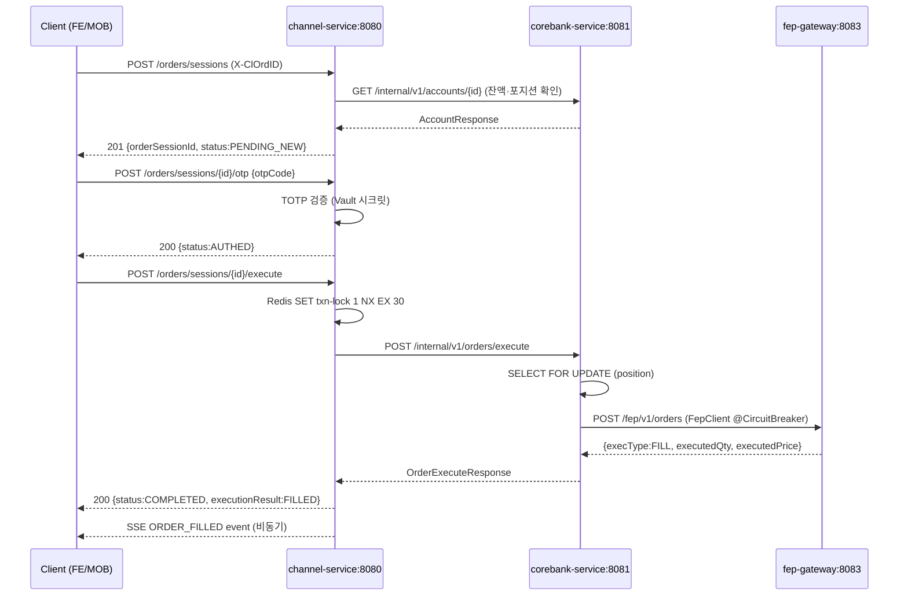
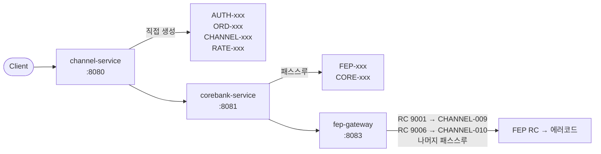

# FIX — 채널계 API 명세 (v1.0)

> **기준 서비스**: `channel-service:8080`  
> **버전 정책**: `/api/v1/` 고정 (MVP), 파괴적 변경 시만 v2 발행  
> **인증 방식**: Spring Session (HTTP-only cookie `SESSION`) + CSRF Synchronizer Token  
> **공통 요청 헤더**:

| 헤더 | 필수 | 설명 |
|---|---|---|
| `Content-Type` | POST/PUT | `application/json` |
| `X-CSRF-TOKEN` | 모든 non-GET | 로그인 전후 `/auth/csrf`에서 획득 |
| `Cookie: SESSION` | 인증 필요 엔드포인트 | Spring Session 쿠키 (HTTP-only, Secure, SameSite) |

> **공통 응답 봉투 (ApiResponse\<T\>)**:
```json
{
  "success": true,
  "data": { ... },
  "error": null,
  "traceId": "abc123def456"
}
```

> **오류 응답 봉투**:
```json
{
  "success": false,
  "data": null,
  "error": {
    "code": "AUTH-003",
    "message": "인증이 필요합니다.",
    "field": null
  },
  "traceId": "abc123def456"
}
```

> **CSRF 유효성 실패 응답 형식**: Spring Security CSRF 필터(`CsrfFilter`)는 `@ControllerAdvice`나 `ApiResponse` 봉투에  도달하기 전 단계에서 동작한다. 따라서 X-CSRF-TOKEN 누락·오류 시 **공통 `ApiResponse` 봉투가 아닌** Spring Security 기본 `403 Forbidden` 응답이 반환된다. HTTP Status=`403`, Body=`{"status":403,"error":"Forbidden","message":"Forbidden"}` 형태. 클라이언트는 `403` 수신 시  `response.status === 403`으로 분기하여 CSRF 토큰을 재조회한 후 요청을 재시도해야 한다. non-GET 요청 전 **항상 CSRF 토큰을 선행 조회**하는 것이 권장된 구현 패턴이다.

---

## 1. 인증 (Auth)

### 1.1 CSRF 토큰 조회

로그인 폼 제출 전, 모든 non-GET 요청 전에 반드시 획득해야 한다.  
`changeSessionId()` 이후(로그인 완료 후) 재조회 필수.

> **구 토큰 무효화**: 로그인 성공(`changeSessionId()` 실행) 시 이전 세션의 CSRF 토큰이 서버 측에서 즉시 무효화된다. 구 토큰으로 non-GET 요청 시 Spring Security가 `403 Forbidden`을 반환한다. 클라이언트는 로그인 응답 수신 직후 반드시 `/auth/csrf`를 재조회해야 한다.

```
GET /api/v1/auth/csrf
```

**인증 불필요** (`permitAll`)

**응답 200 OK**
```json
{
  "success": true,
  "data": {
    "csrfToken": "a1b2c3d4-e5f6-7890-abcd-ef1234567890",
    "headerName": "X-CSRF-TOKEN"
  },
  "error": null,
  "traceId": "trace-001"
}
```

---

### 1.2 회원 등록

```
POST /api/v1/auth/register
```

**인증 불필요** (`permitAll`)

**요청 바디**
```json
{
  "username": "user01",
  "password": "Test1234!",
  "email": "user01@fix.com",
  "name": "홍길동"
}
```

| 필드 | 타입 | 필수 | 제약 |
|---|---|---|---|
| `username` | String | ✅ | 4~20자, 영문/숫자/밑줄 |
| `password` | String | ✅ | 대문자 1개 이상, 숫자 1개 이상, 특수문자 1개 이상, 8자 이상 |
| `email` | String | ✅ | 이메일 형식 |
| `name` | String | ✅ | 2~20자 |

**응답 201 Created**
```json
{
  "success": true,
  "data": {
    "memberUuid": "m-uuid-xxxx",
    "username": "user01",
    "email": "user01@fix.com",
    "name": "홍길동",
    "role": "ROLE_USER",
    "totpEnrolled": false
  },
  "error": null,
  "traceId": "trace-002"
}
```

> **`totpEnrolled: false` 등록 응답 포함 근거**: 신규 가입 직후 TOTP 미등록 상태임을 등록 API 단계에서 즉시 알릴 수 있어, 세션 조회(`GET /auth/session`) 추가 호출 없이 클라이언트가 바로 TOTP 등록 플로우(`POST /api/v1/members/me/totp/enroll`)로 사용자를 유도할 수 있다. 등록 시점에는 항상 `false`이며, `true`로 변경되려면 `POST /api/v1/members/me/totp/confirm` 호출이 필요하다. `email` 중복 등록 시 `AUTH-008`이 없는 이유는 `email` 고유 제약 대신 `username` UNIQUE 제약만 적용하기 때문이다. `email` 중복은 서비스 정책으로 허용한다.

**오류 코드**
| 코드 | HTTP | 설명 |
|---|---|---|
| `AUTH-007` | 422 | 비밀번호 정책 위반 |
| `AUTH-008` | 409 | 이미 사용 중인 username |
| `VALIDATION-001` | 422 | 요청 필드 유효성 실패 |
| `CORE-001` | 503 | corebank-service 계좌 자동 생성 실패 (Saga 보상 후 클라이언트에 재등록 안내) |
| `SYS-001` | 500 | 내부 서버 오류 |

**부수 효과**: corebank-service에 계좌 자동 생성 (내부 REST 호출)

> **계좌 자동 생성 실패 시 보상 정책**: `corebank-service` 계좌 생성 호출 실패 시 `channel-service`는 회원 레코드를 즉시 삭제하는 보상 트랜잭션을 실행한다 (`@Transactional` 경계 밖 Saga 패턴). 보상 실패 시 `member.status = ACCOUNT_CREATION_FAILED`로 마킹하고 별도 배치 정리 작업에서 재처리한다. 클라이언트에는 `CORE-001 503`이 반환되며 재등록을 안내한다.

---

### 1.3 로그인

```
POST /api/v1/auth/login
```

**Rate Limit**: 5 req/min/IP (Bucket4j)  
**인증 불필요** (`permitAll`)

**요청 바디**
```json
{
  "username": "user01",
  "password": "Test1234!"
}
```

**응답 200 OK**
```json
{
  "success": true,
  "data": {
    "memberUuid": "m-uuid-xxxx",
    "username": "user01",
    "email": "user01@fix.com",
    "name": "홍길동",
    "role": "ROLE_USER",
    "totpEnrolled": true,
    "accountId": "ACC-001"
  },
  "error": null,
  "traceId": "trace-003"
}
```

> 세션 쿠키 `SESSION`이 `Set-Cookie` 헤더에 자동 발급된다.  
> 로그인 성공 후 CSRF 토큰 **반드시 재조회** (`changeSessionId()` 후 토큰 재발급).

> **`totpEnrolled: false` 사용자**: TOTP 미등록 사용자는 주문 세션 OTP 검증(Step B)를 수행할 수 없으므로 주문 기능이 비활성화된다. 로그인 응답에서 `totpEnrolled: false` 수신 시 클라이언트는 TOTP 등록 플로우(`POST /api/v1/members/me/totp/enroll`)로 사용자를 유도해야 한다. 미등록 상태로 OTP 검증 엔드포인트 호출 시 `ORD-011 403 (TOTP_NOT_ENROLLED)`이 반환되며 응답 body에 `"enrollUrl": "/settings/totp/enroll"` 필드가 포함된다.  
> `enrollUrl`은 **프론트엔드 React 라우터 경로(코드: `navigate(error.enrollUrl)`)** 이며 백엔드 API 경로가 아니다. 클라이언트는 이를 API URL로 직접 호출하지 않고 `react-router-dom`의 `navigate()`로 클라이언트 라우팅(페이지 이동)에 사용한다.

> **TOTP 등록 API 요약** (`POST /api/v1/members/me/totp/enroll`): 유효 세션 필요, 응답 `{secret, qrUri}`, idempotent(미확인 상태에서 재호출 가능). 확인은 `POST /api/v1/members/me/totp/confirm {otpCode}` 호출로 완료된다. 상세 명세는 TOTP 등록 플로우 문서(채널계 login_flow.md)를 참조한다.

**오류 코드**
| 코드 | HTTP | 설명 |
|---|---|---|
| `AUTH-001` | 401 | 자격증명 불일치 |
| `AUTH-002` | 401 | 계정 잠금 (5회 실패) |
| `AUTH-004` | 401 | 탈퇴한 계정 |
| `RATE-001` | 429 | 로그인 시도 초과 |
| `VALIDATION-001` | 422 | 요청 필드 유효성 실패 (`username`/`password` 누락 또는 빈 값) |
| `SYS-001` | 500 | 내부 서버 오류 (Redis 세션 생성 실패 등) |

---

### 1.4 로그아웃

```
POST /api/v1/auth/logout
```

**인증 필요**

**요청 바디**: 없음

**응답 200 OK**
```json
{
  "success": true,
  "data": { "message": "로그아웃 되었습니다." },
  "error": null,
  "traceId": "trace-004"
}
```

> Redis에서 세션 키 즉시 삭제, 브라우저 `SESSION` 쿠키 제거.

> **로그아웃 CSRF 방어**: `POST /auth/logout`은 인증된 세션이 필요하므로 `X-CSRF-TOKEN` 헤더를 반드시 포함해야 한다. CSRF 토큰 없이 호출 시 Spring Security가 `403 Forbidden`을 반환한다. 공통 요청 헤더 규칙(non-GET에 X-CSRF-TOKEN 필수)이 로그아웃에도 동일하게 적용된다.

**오류 코드**
| 코드 | HTTP | 설명 |
|---|---|---|
| `AUTH-003` | 401 | 미인증 (세션 쿠키 없거나 유효하지 않음) |
| `CHANNEL-001` | 410 | 쿠키 존재하나 Redis TTL로 세션 만료 |
| `SYS-001` | 500 | 내부 서버 오류 |

> **CSRF 토큰 누락 시 403 처리**: `X-CSRF-TOKEN` 헤더 누락·불일치 시 Spring Security `CsrfFilter`가 `@ControllerAdvice` 도달 전에 차단하여 **`ApiResponse` 봉투 없이** raw `403 Forbidden`을 반환한다. 에러 코드 `AUTH-006`이 아님. 클라이언트는 `403` 수신 시 CSRF 토큰을 재조회 후 요청을 재시도해야 한다 (§1 공통 헤더 노트 참조).

---

### 1.5 세션 상태 조회 (내 정보)

```
GET /api/v1/auth/session
```

**인증 필요**

**응답 200 OK**
```json
{
  "success": true,
  "data": {
    "memberUuid": "m-uuid-xxxx",
    "username": "user01",
    "email": "user01@fix.com",
    "name": "홍길동",
    "role": "ROLE_USER",
    "totpEnrolled": true,
    "accountId": "ACC-001"
  },
  "error": null,
  "traceId": "trace-005"
}
```

> **`accountId` 클라이언트 활용 정책**: 클라이언트는 로그인 응답(`POST /auth/login`) 또는 이 세션 조회에서 `accountId`를 수신하여 클라이언트 상태에 캐시해두어야 한다. Step A(`POST /orders/sessions`) 요청 바디의 `accountId` 필드는 이 값을 사용한다. 추가 API 호출 없이도 안전하게 사용하려면 로그인 응답과 이 세션 조회 응답 모두에서 `accountId`가 동일하게 포함되므로 어느 시점에 조회해도 안전하다.

**오류 코드**
| 코드 | HTTP | 설명 |
|---|---|---|
| `AUTH-003` | 401 | 미인증 (세션 쿠키 없거나 유효하지 않음) |
| `CHANNEL-001` | 410 | 쿠키 존재하나 Redis TTL로 세션 만료 |
| `SYS-001` | 500 | Redis 세션 저장소 조회 중 내부 오류 |

---

## 2. 주문 세션 & OTP (Order Session)

### 주문 3단계 흐름 (Sequence Diagram)



> **포지션 반영 타이밍**: `POST /execute` 응답 시점에 CoreBanking의 `@Transactional` 커밋이 완료되어 포지션이 즉시 반영된다. 
> 다음 `GET /internal/v1/accounts/{id}` 호출에서 업데이트된 수량이 반환된다. 
> SSE `POSITION_UPDATE` 이벤트는 커밋 직후 비동기(`@Async`)로 발행되므로, REST 폴링보다 항상 SSE가 먼저 수신될 수 없다 — **SSE 우선, REST는 폴백** 원칙을 따른다.

> **취소 흐름 (§2.6)**: Step C 완료 후 `EXECUTING` 상태에서 `POST /orders/sessions/{id}/cancel`을 호출할 수 있다. channel-service → corebank-service → fep-gateway FIX OrderCancelRequest → 거래소 응답(`ORDER_CANCELED` / `ORDER_PARTIAL_FILL_CANCEL`)으로 진행된다. 취소가 거래소에서 거절되면 `CHANNEL-010 409` 반환. 취소 흐름은 Sequence Diagram에 별도 표시되지 않으나 동일 레이어드 경로를 따른다.

---

### 2.1 주문 세션 생성 (Step A — Prepare)

```
POST /api/v1/orders/sessions
```

**인증 필요**  
**Rate Limit**: 10 req/min/userId  
**Idempotency**: `X-ClOrdID` 헤더로 멱등성 보장 (Redis NX, TTL 600s)

> **`clOrdId` 생성 주체**: **클라이언트**가 `X-ClOrdID` 헤더에 UUID v4를 생성하여 전송한다. 서버는 이를 FIX Tag 11(`ClOrdID`)로 사용하며 `order_session.cl_ord_id`에 DB UNIQUE 콘스트레인트로 저장한다.  
> **`ORD-007` 발생 조건**: 동일 `X-ClOrdID` 값을 (Redis NX 토큰 만료 후 또는 idempotency 키 없이 다른 요청에서) 재제시할 때 DB UNIQUE 위반으로 발생. 클라이언트가 UUID v4를 매 요청마다 신규 생성하는 한 충돌 확률은 무시 가능 수준이다.

> **`orderSessionId` vs `clOrdId` 관계**: 두 ID는 **서로 다른 UUID**이다. `clOrdId`는 클라이언트가 생성하여 요청 헤더로 전달하는 FIX 주문 ID(Tag 11)이고, `orderSessionId`는 서버가 주문 세션 레코드 생성 시 별도로 발급하는 세션 UUID이다. 1:1 대응이지만 값이 다르다.  
> - API 경로 기준: **`orderSessionId`** 기반 (`/orders/sessions/{orderSessionId}`)  
> - FIX 프로토콜/감사 기준: **`clOrdId`** 기반 (FEP Gateway, 거래소 조회 시)  
> - Step B 응답(`AUTHED`)에는 `orderSessionId`만 포함됨 — 클라이언트는 이미 Step A에서 `clOrdId`를 알고 있으므로 중복 포함 불필요.  
> - Step C 응답에는 두 값 모두 포함 — 감사/재처리 목적으로 `clOrdId`를 별도 참조해야 하기 때문.

**요청 헤더**
| 헤더 | 필수 | 설명 |
|---|---|---|
| `X-ClOrdID` | ✅ | 클라이언트 UUID v4 (FIX Tag 11) |

**요청 바디**
```json
{
  "accountId": "ACC-001",
  "symbol": "005930",
  "side": "BUY",
  "orderType": "LIMIT",
  "qty": 10,
  "price": 72000
}
```

| 필드 | 타입 | 필수 | 제약 |
|---|---|---|---|
| `accountId` | String | ✅ | 본인 소유 계좌 |
| `symbol` | String | ✅ | KRX 6자리 숫자 (`^\d{6}$`). `channel-service`가 내부 종목 매핑 테이블(`symbol_exchange_map`)로 `securityExchange`를 자동 결정한다 (코드베이스 라우팅 규칙: 005930~068270 → KRX, 미매핑 종목 코드 요청 시 `ORD-004 422`). 클라이언트는 `securityExchange`를 직접 지정하지 않는다. |
| `side` | Enum | ✅ | `BUY` \| `SELL` |

> **Step A에서의 TOTP 등록 여부 검증 정책**: `POST /orders/sessions` (Step A)는 TOTP 등록 여부를 서버 측에서 검증하지 않는다. TOTP 미등록 사용자도 주문 세션 **생성은 가능**하다. TOTP 검증(`ORD-011`)은 Step B(OTP 검증 엔드포인트) 호출 시점에만 발생한다. 클라이언트는 서버 차단을 기다리지 않고, 로그인 응답(`totpEnrolled: false`) 수신 즉시 UX 레이어에서 Step A 버튼을 비활성화하여 불필요한 세션 생성을 방지해야 한다.
| `orderType` | Enum | ✅ | `LIMIT` \| `MARKET` |
| `qty` | Integer | ✅ | 1 이상, 보유수량/잔액 이내 |
| `price` | Long | LIMIT 시 ✅ | 양수. `MARKET` 주문 시 포함하면 `VALIDATION-001 422` 반환. 클라이언트는 `MARKET` 선택 시 `price` 필드를 요청에서 제거해야 한다. |

> **`MARKET` 주문 잔액 검증 기준**: `MARKET` 주문 시 사전 잔액 검증은 `corebank-service`가 해당 종목의 직전 체결가(또는 현재 호가 조회 API)를 기준으로 수행한다. 슬리피지로 인해 실제 체결 금액이 검증 기준을 초과하면 거래소 측에서 `ORDER_REJECTED(FEP-003)`이 반환된다. 사전 검증은 best-effort이며 완전한 보장이 아님을 클라이언트 UX에 안내해야 한다.

**응답 201 Created**
```json
{
  "success": true,
  "data": {
    "orderSessionId": "sess-uuid-xxxx",
    "clOrdId": "client-uuid-xxxx",
    "status": "PENDING_NEW",
    "symbol": "005930",
    "side": "BUY",
    "orderType": "LIMIT",
    "qty": 10,
    "price": 72000,
    "expiresAt": "2026-03-01T10:10:00Z"
  },
  "error": null,
  "traceId": "trace-006"
}
```

> **`expiresAt` 타임존**: `expiresAt`는 UTC ISO-8601 형식(`Z` 접미사)으로 반환된다. 클라이언트는 표시 시 KST(UTC+09:00) 변환을 직접 수행해야 한다. 계산 기준: `PENDING_NEW` 생성 시각(UTC) + 600초. 사용자에게 잔여 시간을 노출할 때 `new Date(expiresAt)` 기준으로 countdown timer를 구현한다.

> **MARKET 주문 `price`/`orderType` 응답 정책**: `orderType: "MARKET"` 주문 세션의 응답 `data.price`는 **`null`로 반환**된다. 필드를 생략하지 않고 `null` 값으로 포함한다. 클라이언트는 `price: null` 분기를 반드시 처리해야 한다. `orderType`은 LIMIT/MARKET 모두 응답에 포함된다 — 클라이언트가 페이지 재로드 이후에도 세션 타입을 응답에서 직접 확인할 수 있어야 하기 때문이다.

**오류 코드**
| 코드 | HTTP | 설명 |
|---|---|---|
| `AUTH-003` | 401 | 인증 세션 만료 또는 미인증 |
| `CHANNEL-001` | 410 | 쿠키는 존재하나 Redis TTL로 세션 만료 |
| `ORD-001` | 403 | 계좌 소유권 불일치 |
| `ORD-004` | 422 | 종목코드 형식 오류 |
| `ORD-005` | 422 | 수량 초과 (보유수량 또는 매도 한도) |
| `ORD-006` | 422 | 잔액 부족 |
| `ORD-007` | 409 | `X-ClOrdID` 중복 (DB UNIQUE 위반 — 동일 clOrdId가 이미 존재) |
| `VALIDATION-001` | 422 | 요청 필드 유효성 실패 (예: `MARKET` 주문 시 `price` 필드 포함, 또는 필수 필드 누락) |
| `CORE-001` | 503 | 계좌 조회 실패 (CoreBanking 장애) |
| `RATE-001` | 429 | 주문 준비 횟수 초과 |
| `SYS-001` | 500 | 내부 서버 오류 |

**주문 세션 FSM 상태값**

```
PENDING_NEW → AUTHED → EXECUTING → COMPLETED
           ↘ FAILED (OTP 3회 초과)
           ↘ EXPIRED
                       ↘ FAILED
                       ↘ CANCELED (거래소 취소 승인 — 전량 취소)
                       ↘ CANCELED (PARTIAL_FILL_CANCEL — 일부 체결 후 잔량 취소)
                       ↘ REQUERYING → COMPLETED
                                    ↘ FAILED
                                    ↘ CANCELED (Race condition — Requery 응답 CANCELED 완전 취소)
                                    ↘ CANCELED (Race condition — Requery 응답 CANCELED, PARTIAL_FILL_CANCEL)
                                    ↘ ESCALATED → COMPLETED (Admin APPROVE Replay)
                                               ↘ FAILED    (Admin REJECT Replay)
                                               ↘ CANCELED  (Admin APPROVE Replay, Requery=CANCELED Race condition 완전 취소)
                                               ↘ CANCELED  (Admin APPROVE Replay, Requery=CANCELED Race condition PARTIAL_FILL_CANCEL)
```

> **`REQUERYING` · `ESCALATED` 상태**: 복구 스케줄러에 의해 `EXECUTING` 상태가 10분 이상 지속되면 `REQUERYING`으로 전환된다. FEP Requery 결과에 따라 `COMPLETED` 또는 `FAILED`로 종결되거나, Race condition 시 `CANCELED`(완전 취소) 또는 `CANCELED`(`executionResult: "PARTIAL_FILL_CANCEL"` — 부분 체결 후 잔량 취소)으로 종결될 수 있다 (거래소가 이미 취소한 주문 상태로 Requery 응답 시). 최대 재시도(`maxRetryCount=5`) 초과 시 `ESCALATED`로 전환되어 수동 처리 대기 상태가 된다. 이 두 상태는 클라이언트가 직접 유발할 수 없으며 서버 내부 전환만 가능하다.  
> **`ESCALATED` 상태와 Redis TTL**: `ESCALATED` 상태는 `channel_db.order_sessions` DB 레코드를 기준으로 유지된다. Redis 주문 세션 TTL이 이미 만료돼도 DB 레코드를 기준으로 자동 Replay API가 동작한다. 운영자가 `POST /api/v1/admin/orders/{clOrdId}/replay`를 호출하면 DB 상태가 `ESCALATED`인 지 검증하며 Redis 만료 여부를 무시한다. 복구 수행 후 DB를 `COMPLETED`(승인 체결) 또는 `FAILED`(REJECT) 또는 `CANCELED`(APPROVE+CANCELED Race condition 완전 취소, `executionResult: "CANCELED"`) 또는 `CANCELED`(APPROVE+CANCELED Race condition 부분 체결 후 잔량 취소, `executionResult: "PARTIAL_FILL_CANCEL"`)으로 업데이트한다.

> **세션 TTL 기산점**: TTL 600초는 `PENDING_NEW` 생성 시점부터 기산되며 `AUTHED` 전환 시 리셋되지 않는다. OTP 검증 완료 후 잔여 TTL 내에 Step C(execute)를 완료해야 한다. TTL 만료 시 현재 상태(PENDING_NEW 또는 AUTHED)와 무관하게 `EXPIRED`로 전환된다. 클라이언트는 생성 응답의 `expiresAt` 필드를 사용하여 사용자에게 잔여 시간을 노출해야 한다.

---

### 2.2 OTP 검증 (Step B — Verify)

```
POST /api/v1/orders/sessions/{orderSessionId}/otp
```

**인증 필요**  
**Rate Limit**: 3회/세션 (Redis 카운터)  
**Debounce**: `SET ch:otp-attempt-ts:{sessionId} 1 NX EX 1` — 1초 이내 재시도 차단

> **OTP Debounce Idempotency 정책**: 동일 `orderSessionId` 내에서 **동일 TOTP 30초 윈도우** 내에 이미 **성공한** OTP와 동일 코드를 재전송하면 **idempotent 200** 응답을 리턴한다. `attempt` 카운터가 추가 소비되지 않는다.  
> **실패한 OTP 코드는 idempotent 대상이 아니다**: 동일 윈도우 내에서라도 이전에 `ORD-002`로 실패한 코드를 재전송하면 `attempt`이 추가 소비되며 `ORD-002`를 다시 리턴한다.  
> 다음 TOTP 윈도우(T+31s 이후)의 요청은 이전 윈도우에 저장된 idempotency 키와 구분되므로 정상 처리(attempt 소비).

> **OTP 성공 Idempotency Redis 키 스키마**: 성공한 TOTP 코드를 `ch:otp-success:{sessionId}:{windowIndex}` 키로 저장한다 (`windowIndex` = `floor(unixTimestamp / 30)`, 즉 TOTP 30초 윈도우 인덱스). TTL은 60초(2 윈도우)로 설정한다. 동일 키가 존재하면 `attempt` 소비 없이 idempotent 200을 반환한다. 다음 윈도우(`windowIndex` 변경) 요청은 키 불일치로 정상 처리(attempt 소비)된다. replay attack 방지를 위해 성공 마크는 세션 상태가 `AUTHED`로 전환된 이후에만 설정된다.  
> **디바운스와 Idempotency 상호작용**: 디바운스(`SET ch:otp-attempt-ts:{sessionId} 1 NX EX 1`)는 모든 OTP 요청에 **먼저** 적용된다. 따라서 성공한 OTP 코드를 1초 이내에 재전송하면 idempotent 200이 아닌 `RATE-001 429`가 반환된다. 세션이 이미 `AUTHED`인 경우는 디바운스 체크 없이 즉시 `ORD-009 409`을 반환한다. **이는 idempotency 키 조회(`ch:otp-success:{sessionId}:{windowIndex}`)도 건너뜀을 의미한다**: AUTHED 상태이면 이미 성공이 확정된 상태이므로 Redis 키 존재 여부와 무관하게 ORD-009를 반환하는 것이 의도적 설계이다.

> **OTP 요청 처리 우선순위 (서버 검증 순서)**:
> 1. **세션 존재 확인** — `EXISTS`로 세션 키 존재 여부 확인. 없거나 EXPIRED → `ORD-008 404`
> 2. **세션 상태 확인** — 이미 `AUTHED` 이상이면 → `ORD-009 409` (이 단계에서 반환. 디바운스/idempotency 건너뜀)  
>    AUTHED 이상이 아닌 경우에만 아래 단계 진행
> 3. **TOTP 등록 여부 확인** — `totpEnrolled = false` → `ORD-011 403`
> 4. **디바운스** — `SET ch:otp-attempt-ts:{sessionId} 1 NX EX 1` 실패 → `RATE-001 429`
> 5. **시도 횟수 확인** — attempt ≥ 3 → `ORD-003 403` (세션 FAILED 전환)
> 6. **Idempotency 확인** — `ch:otp-success:{sessionId}:{windowIndex}` 존재 → `200 OK` (attempt 소비 없음)
> 7. **TOTP 코드 검증** — 불일치 → `ORD-002 422` (attempt 증가), 일치 → `200 OK` + 성공 키 설정

**경로 파라미터**
| 파라미터 | 설명 |
|---|---|
| `orderSessionId` | 주문 세션 UUID |

**요청 바디**
```json
{
  "otpCode": "123456"
}
```

**응답 200 OK** (OTP 검증 성공)
```json
{
  "success": true,
  "data": {
    "orderSessionId": "sess-uuid-xxxx",
    "status": "AUTHED"
  },
  "error": null,
  "traceId": "trace-007"
}
```

> OTP 검증 성공 시 `remainingAttempts` 필드는 응답에서 제외된다. 실패(`ORD-002`) 시 오류 응답의 **`error.remainingAttempts`** 에 잔여 시도 횟수가 포함된다. 공통 봉투의 `data`는 `success: false` 시 항상 `null`이므로 `data.remainingAttempts`로 접근하지 않는다.
> ```json
> {
>   "success": false,
>   "data": null,
>   "error": {
>     "code": "ORD-002",
>     "message": "OTP 코드가 일치하지 않습니다.",
>     "field": null,
>     "remainingAttempts": 1
>   },
>   "traceId": "trace-007"
> }
> ```
> 잔여 시도 횟수 값은 `2` → `1` 두 가지만 클라이언트에 노출된다. 세 번째 실패(attempt=3)는 `ORD-003 403`으로 처리되어 `remainingAttempts: 0`은 반환되지 않는다.

**오류 코드**
| 코드 | HTTP | 설명 |
|---|---|---|
| `AUTH-003` | 401 | 미인증 (세션 쿠키 없거나 유효하지 않음) |
| `CHANNEL-001` | 410 | 쿠키는 존재하나 Redis TTL로 세션 만료 |
| `ORD-002` | 422 | OTP 코드 불일치 |
| `ORD-003` | 403 | OTP 시도 횟수 초과 (세션 FAILED 전환). SSE `ORDER_FAILED`(`failureReason: "OTP_EXCEEDED"`) 이벤트 발행 |
| `ORD-008` | 404 | 세션 없음 또는 만료 |
| `ORD-009` | 409 | 세션 상태 전이 불가 — **이미 AUTHED 이상** (전진 차단). 동일 sessionId로 OTP를 재제출 시 반환. |
| `ORD-011` | 403 | TOTP 미등록 (`enrollUrl` 포함) |
| `RATE-001` | 429 | 1초 이내 재시도 차단 |
| `SYS-001` | 500 | 내부 서버 오류 |

> **`enrollUrl` 응답 봉투 위치**: `ORD-011` 오류 시 `error` 객체에 비표준 추가 프로퍼티로 포함된다.
> ```json
> {
>   "success": false,
>   "data": null,
>   "error": {
>     "code": "ORD-011",
>     "message": "TOTP가 등록되지 않은 사용자입니다.",
>     "field": null,
>     "enrollUrl": "/settings/totp/enroll"
>   },
>   "traceId": "trace-007"
> }
> ```
> `enrollUrl`은 `error` 객체의 추가 프로퍼티로 직렬화되며, 클라이언트는 `error.enrollUrl` 경로로 접근한다. **`enrollUrl` 값(`/settings/totp/enroll`)은 프론트엔드 React 라우터 경로이며 백엔드 API 경로가 아니다.** 클라이언트는 이 값을 `fetch(enrollUrl)` API 호출이 아니라 `navigate(error.enrollUrl)` (react-router-dom) 클라이언트 라우팅으로 사용해야 한다. 서버는 `@JsonInclude(NON_NULL)` + 커스텀 직렬화로 표준 `ApiErrorDto`에 `enrollUrl` 필드를 조건부 추가한다. 역직렬화는 `@JsonAnySetter` / `additionalProperties` Map 패턴으로 처리한다.

---

### 2.3 주문 실행 (Step C — Execute)

```
POST /api/v1/orders/sessions/{orderSessionId}/execute
```

**인증 필요**  
**Rate Limit**: 세션당 1회 실행 (Redis `SET ch:txn-lock:{sessionId} 1 NX EX 30` 기반 자연 제한 — 동일 세션 중복 실행 시 `ORD-010 409` 반환)  
**동시성 보호**: Redis `SET ch:txn-lock:{sessionId} 1 NX EX 30`

> **txn-lock TTL 경합 조건**: FepClient의 HTTP 연결 타임아웃은 최대 28초`(spring.cloud.openfeign.client.config.fep.readTimeout=28000ms)`로 설정되어 락(30초) TTL보다 항상 짧다. 따라서 FEP 타임아웃 발생 시에도 락이 취득된 상태에서 execute 응답이 반환되므로, 락 자동해제로 인한 중복 execute 진입이 방지된다. 28초 타임아웃 이후 락은 여전히 유효(잔여 2초)하다.

**경로 파라미터**
| 파라미터 | 설명 |
|---|---|
| `orderSessionId` | 주문 세션 UUID (`AUTHED` 상태여야 함) |

**요청 바디**: 없음

**응답 200 OK** (전량 체결 — `executionResult: "FILLED"`)
```json
{
  "success": true,
  "data": {
    "orderSessionId": "sess-uuid-xxxx",
    "clOrdId": "client-uuid-xxxx",
    "status": "COMPLETED",
    "symbol": "005930",
    "side": "BUY",
    "orderType": "LIMIT",
    "qty": 10,
    "price": 72000,
    "executionResult": "FILLED",
    "executedQty": 10,
    "leavesQty": 0,
    "executedPrice": 72000,
    "externalOrderId": "FEP-KRX-20260301-0001",
    "executedAt": "2026-03-01T10:05:30Z"
  },
  "error": null,
  "traceId": "trace-008"
}
```

**응답 200 OK** (부분 체결 — `executionResult: "PARTIAL_FILL"`)
```json
{
  "success": true,
  "data": {
    "orderSessionId": "sess-uuid-xxxx",
    "clOrdId": "client-uuid-xxxx",
    "status": "COMPLETED",
    "symbol": "005930",
    "side": "BUY",
    "orderType": "LIMIT",
    "qty": 10,
    "price": 72000,
    "executionResult": "PARTIAL_FILL",
    "executedQty": 5,
    "leavesQty": 5,
    "executedPrice": 72000,
    "externalOrderId": "FEP-KRX-20260301-0001",
    "executedAt": "2026-03-01T10:05:30Z"
  },
  "error": null,
  "traceId": "trace-008"
}
```

> **PARTIAL_FILL 처리 정책**: 부분 체결 시 OrderSession 상태는 `COMPLETED`로 종결된다. 잔여 수량(`leavesQty`)에 대한 추가 세션은 생성되지 않는다. 잔여 수량 재주문은 사용자가 새 세션(Step A)을 시작해야 한다. SSE `ORDER_FILLED` 이벤트에도 `executedQty`, `executedPrice`, `leavesQty`, `executedAt`이 포함된다.

> **`externalOrderId` 매핑**: FIX `Tag 37 (OrderID)` — FEP Simulator가 부여한 체결 ID. `core_db.order_history.external_order_id` 컬럼에 저장. 수동 재처리·감사 로그 조회 시 사용.  
> **`externalOrderId`는 nullable이다.** 거래소 `NEW` 확인(ExecType=0) 시점에는 Tag 37이 아직 발급 전이므로 `null`이 반환된다. `FILLED` · `PARTIAL_FILL` ExecutionReport 수신 이후에만 값이 보장된다. 클라이언트 및 `corebank-service` 구현 시 null 분기를 반드시 처리해야 한다.

> **`executedAt` 타임스탬프**: 모든 타임스탬프는 **UTC (`Z` 접미사)**로 반환된다. `executedAt`은 FIX `TransactTime(Tag 60)` 값을 UTC ISO-8601로 변환한 것이며 FEP Gateway가 KST 변환 없이 직접 UTC를 전달한다. 클라이언트는 표시 시 KST 변환을 수행해야 한다 (UTC+09:00).

**오류 코드**
| 코드 | HTTP | 설명 | Retry-After(초) |
|---|---|---|---|
| `AUTH-003` | 401 | 인증 세션 만료 또는 미인증 | — |
| `ORD-008` | 404 | 세션 없음 또는 만료 — Step B 처리 중 TTL 만료 시나리오 포함 | — |
| `ORD-009` | 409 | 세션 상태 전이 불가 — **AUTHED 아님** (전제 조건 미충족, PENDING_NEW 상태에서 execute 호출 시) | — |
| `ORD-010` | 409 | 동시 실행 중 (Redis 락 충돌) | — |
| `CORE-003` | 409 | CoreBanking 동시성 충돌 (position lock) | — |

> **`CORE-003` → `failureReason: "POSITION_LOCK"` 연결 정책**: `CORE-003 409`가 반환되는 경우는 두 가지다. ① `corebank-service`가 Execute 시 사전 잔액·포지션 상한 검증을 실패하여 주문을 거절할 때, ② FEP 전송 전 DB 레벨 동시성 락 충돌이 발생할 때. ① 시나리오에서 `corebank-service`는 주문을 거절하고 `channel-service`는 OrderSession을 `FAILED`로 전환하며 `failureReason: "POSITION_LOCK"`을 설정한다. ② 시나리오는 동시 요청 충돌이므로 클라이언트는 재시도가 가능하지만 짧은 지연 후 1회만 재시도해야 한다. 두 케이스 모두 `CORE-003 409`로 응답되므로 클라이언트는 응답 수신 시 재시도 1회 후 실패 처리한다.

| `FEP-001` | 503 | FEP 서비스 불가 — 아래 4가지 RC가 모두 `FEP-001`로 통합 반환됨: **RC=9098 CIRCUIT_OPEN** (차단기 열림, `Retry-After: 10`), **RC=9002 POOL_EXHAUSTED** (SIGNED_ON FIX 세션 없음), **RC=9003 NOT_LOGGED_ON** (선택 세션 미로그인), **RC=9005 KEY_EXPIRED** (키 만료, 긴급 갱신 필요, 재시도 불가). `Retry-After: 10`은 CIRCUIT_OPEN 전용. 9002·9003·9005는 `retryAfterSeconds: null` | CIRCUIT_OPEN: 10 / 나머지: — |
| `FEP-002` | 504 | FEP 타임아웃 — 타임아웃 후 SSE `ORDER_FILLED`/`ORDER_FAILED`/`ORDER_CANCELED`/`ORDER_PARTIAL_FILL_CANCEL` 수신 대기. Retry-After 없음, 재조회(`GET /orders/sessions/{id}`)로 상태 판단 | — |
| `FEP-003` | 400 | FEP 거래 거절 (`ORDER_REJECTED`) — OrderSession `FAILED` 전환, `failureReason: "FEP_REJECTED"` 설정. SSE `ORDER_FAILED`(`failureReason: "FEP_REJECTED"`) 발행. | — |
| `SYS-001` | 500 | 내부 오류 | — |
| `CHANNEL-001` | 410 | 쿠키는 존재하나 Redis TTL로 채널 세션 만료 | — |

> **사용자 노출 메시지 가이드**:
> - `FEP-001` → "일시적으로 주문이 불가합니다. 약 10초 후 재시도해 주세요."
> - `FEP-002` → "주문 처리 중입니다. 잠시 후 알림으로 결과를 받으실 수 있습니다."

> 실행 결과는 SSE `ORDER_FILLED` / `ORDER_FAILED` / `ORDER_CANCELED` / `ORDER_PARTIAL_FILL_CANCEL` 이벤트로도 비동기 수신 가능하다.

> **FEP NEW(ExecType=0) 수신 시 클라이언트 처리 정책**: `POST /execute`가 내부적으로 FEP에 전송한 주문에 대해 FIX Simulator가 `ExecType=0(NEW)` 응답을 먼저 보내고 체결 응답을 보내지 않는 경우, fep-gateway의 28초 타임아웃이 만료되어 `FEP-002 504`가 반환된다. 이 경우 `channel-service`는 `status: "EXECUTING"`을 유지한다(종결 코드가 아님). 클라이언트는 `FEP-002 504` 수신 시:
> 1. "주문 처리 중입니다. 알림을 기다려주세요." UX 메시지 표시
> 2. SSE `ORDER_FILLED` / `ORDER_FAILED` / `ORDER_CANCELED` / `ORDER_PARTIAL_FILL_CANCEL` 이벤트 대기
> 3. SSE 수신이 없으면 `GET /api/v1/orders/sessions/{id}`(§2.4)로 일정 간격(30초) 폴링
> 4. `status: "ESCALATED"` 수신 시 "고객센터에 문의해 주세요." 안내

---

### 2.4 주문 세션 상태 조회

```
GET /api/v1/orders/sessions/{orderSessionId}
```

**인증 필요**

**응답 200 OK** (진행 중 상태 예시 — `status: "EXECUTING"`)
```json
{
  "success": true,
  "data": {
    "orderSessionId": "sess-uuid-xxxx",
    "clOrdId": "client-uuid-xxxx",
    "status": "EXECUTING",
    "symbol": "005930",
    "side": "BUY",
    "orderType": "LIMIT",
    "qty": 10,
    "price": 72000,
    "executionResult": null,
    "executedQty": null,
    "leavesQty": null,
    "executedPrice": null,
    "externalOrderId": null,
    "failureReason": null,
    "executedAt": null,
    "canceledAt": null,
    "createdAt": "2026-03-01T10:00:00Z",
    "updatedAt": "2026-03-01T10:05:00Z"
  },
  "error": null,
  "traceId": "trace-009"
}
```

**응답 200 OK** (완료 상태 예시 — `status: "COMPLETED"`)
```json
{
  "success": true,
  "data": {
    "orderSessionId": "sess-uuid-xxxx",
    "clOrdId": "client-uuid-xxxx",
    "status": "COMPLETED",
    "symbol": "005930",
    "side": "BUY",
    "orderType": "LIMIT",
    "qty": 10,
    "price": 72000,
    "executionResult": "FILLED",
    "executedQty": 10,
    "leavesQty": 0,
    "executedPrice": 72000,
    "externalOrderId": "FEP-KRX-20260301-0001",
    "failureReason": null,
    "executedAt": "2026-03-01T10:05:30Z",
    "canceledAt": null,
    "createdAt": "2026-03-01T10:00:00Z",
    "updatedAt": "2026-03-01T10:05:30Z"
  },
  "error": null,
  "traceId": "trace-009"
}
```

> **폴백 조회 시 실행 결과**: SSE를 수신하지 못한 클라이언트는 이 엔드포인트를 폴백으로 사용하여 `COMPLETED` 상태와 함께 `executionResult`, `executedQty`, `executedPrice`, `externalOrderId`, `executedAt`를 얻을 수 있다. `externalOrderId`는 ExecType=0(NEW) 단계에서는 `null`일 수 있으므로 반드시 null 분기를 처리해야 한다.

**응답 200 OK** (부분 체결 폴백 — `executionResult: "PARTIAL_FILL"`, Requery 기반 COMPLETED)
```json
{
  "success": true,
  "data": {
    "orderSessionId": "sess-uuid-xxxx",
    "clOrdId": "client-uuid-xxxx",
    "status": "COMPLETED",
    "symbol": "005930",
    "side": "BUY",
    "orderType": "LIMIT",
    "qty": 10,
    "price": 72000,
    "executionResult": "PARTIAL_FILL",
    "executedQty": 5,
    "leavesQty": 5,
    "executedPrice": 72000,
    "externalOrderId": "FEP-KRX-20260301-0001",
    "failureReason": null,
    "executedAt": "2026-03-01T10:05:30Z",
    "canceledAt": null,
    "createdAt": "2026-03-01T10:00:00Z",
    "updatedAt": "2026-03-01T10:05:45Z"
  },
  "error": null,
  "traceId": "trace-009"
}
```

> **Requery PARTIALLY_FILLED 폴백 조회**: 복구 스케줄러가 Requery 응답으로 `ordStatus: "PARTIALLY_FILLED"`를 수신한 경우 `executionResult: "PARTIAL_FILL"`, `executedQty: 5`, `leavesQty: 5`로 COMPLETED 종결된 주문은 이 엔드포인트에서 실체결 수량이 포함된 응답으로 확인할 수 있다. 잔여 수량 재주문은 사용자가 새 세션(Step A)을 시작해야 한다.

> **`FAILED` · `ESCALATED` 상태 응답**: `status`가 `FAILED`일 때 `failureReason`의 가능한 값과 의미는 다음과 같다. `"FEP_REJECTED"` = FEP 거래소 거절, `"FEP_TIMEOUT"` = FEP 타임아웃, `"POSITION_LOCK"` = 잔액·포지션 부족으로 서버 측에서 거절, `"MANUAL_REJECT"` = 운영자 Admin Replay로 REJECT 처리, `"OTP_EXCEEDED"` = OTP 시도 3회 초과로 세션 강제 종료. `status`가 `ESCALATED`일 때는 `failureReason: "ESCALATED_MANUAL_REVIEW"`로 고정 반환되며 이는 수동 처리 대기 상태임을 나타낸다 (종료 코드가 아님). 클라이언트는 이 값을 사용자에게 노출하지 않고 UX 메시지 매핑에만 사용해야 한다.

**응답 200 OK** (실패 상태 예시 — `status: "FAILED"`)
```json
{
  "success": true,
  "data": {
    "orderSessionId": "sess-uuid-xxxx",
    "clOrdId": "client-uuid-xxxx",
    "status": "FAILED",
    "symbol": "005930",
    "side": "BUY",
    "orderType": "LIMIT",
    "qty": 10,
    "price": 72000,
    "executionResult": null,
    "executedQty": null,
    "leavesQty": null,
    "executedPrice": null,
    "externalOrderId": null,
    "failureReason": "FEP_REJECTED",
    "executedAt": null,
    "canceledAt": null,
    "createdAt": "2026-03-01T10:00:00Z",
    "updatedAt": "2026-03-01T10:05:40Z"
  },
  "error": null,
  "traceId": "trace-009"
}
```

**응답 200 OK** (재조회 중 — `status: "REQUERYING"`)
```json
{
  "success": true,
  "data": {
    "orderSessionId": "sess-uuid-xxxx",
    "clOrdId": "client-uuid-xxxx",
    "status": "REQUERYING",
    "symbol": "005930",
    "side": "BUY",
    "orderType": "LIMIT",
    "qty": 10,
    "price": 72000,
    "executionResult": null,
    "executedQty": null,
    "leavesQty": null,
    "executedPrice": null,
    "externalOrderId": null,
    "failureReason": null,
    "executedAt": null,
    "canceledAt": null,
    "createdAt": "2026-03-01T10:00:00Z",
    "updatedAt": "2026-03-01T10:15:00Z"
  },
  "error": null,
  "traceId": "trace-009"
}
```

> `REQUERYING` 상태 수신 시 클라이언트는 SSE `ORDER_FILLED` / `ORDER_FAILED` / `ORDER_CANCELED` / `ORDER_PARTIAL_FILL_CANCEL` 이벤트를 대기하거나 일정 간격(예: 30초)으로 폴링을 계속한다.

**응답 200 OK** (수동 처리 대기 — `status: "ESCALATED"`)
```json
{
  "success": true,
  "data": {
    "orderSessionId": "sess-uuid-xxxx",
    "clOrdId": "client-uuid-xxxx",
    "status": "ESCALATED",
    "symbol": "005930",
    "side": "BUY",
    "orderType": "LIMIT",
    "qty": 10,
    "price": 72000,
    "executionResult": null,
    "executedQty": null,
    "leavesQty": null,
    "executedPrice": null,
    "externalOrderId": null,
    "failureReason": "ESCALATED_MANUAL_REVIEW",
    "executedAt": null,
    "canceledAt": null,
    "createdAt": "2026-03-01T10:00:00Z",
    "updatedAt": "2026-03-01T10:20:00Z"
  },
  "error": null,
  "traceId": "trace-009"
}
```

> `ESCALATED` 상태 수신 시 클라이언트는 "처리 중 문제가 발생했습니다. 고객센터에 문의해주세요." 등의 안내 메시지를 표시한다. 운영자가 Admin API로 재처리 완료하면 SSE `ORDER_FILLED`(승인 체결) 또는 `ORDER_CANCELED`(APPROVE+CANCELED Race condition 완전 취소) 또는 `ORDER_PARTIAL_FILL_CANCEL`(APPROVE+CANCELED Race condition 부분 체결 후 잔량 취소) 또는 `ORDER_FAILED`(REJECT) 이벤트로 최종 결과가 전달된다.

**응답 200 OK** (취소 완료 — `status: "CANCELED"`)
```json
{
  "success": true,
  "data": {
    "orderSessionId": "sess-uuid-xxxx",
    "clOrdId": "client-uuid-xxxx",
    "status": "CANCELED",
    "symbol": "005930",
    "side": "BUY",
    "orderType": "LIMIT",
    "qty": 10,
    "price": 72000,
    "executionResult": "CANCELED",
    "executedQty": 0,
    "leavesQty": 10,
    "executedPrice": null,
    "externalOrderId": null,
    "failureReason": null,
    "executedAt": null,
    "canceledAt": "2026-03-01T10:06:00Z",
    "createdAt": "2026-03-01T10:00:00Z",
    "updatedAt": "2026-03-01T10:06:00Z"
  },
  "error": null,
  "traceId": "trace-009"
}
```

> **CANCELED 상태 조회**: §2.6 주문 취소 요청(`POST /api/v1/orders/sessions/{id}/cancel`) 성공 후 이 엔드포인트를 폴백으로 조회하면 `status: "CANCELED"`, `executionResult: "CANCELED"`가 반환된다. 부분 체결 후 취소된 경우 `executionResult: "PARTIAL_FILL_CANCEL"`, `executedQty`에 기체결 수량, `leavesQty`에 취소된 잔여 수량이 포함된다. SSE `ORDER_CANCELED`(완전 취소) 또는 `ORDER_PARTIAL_FILL_CANCEL`(부분 취소) 이벤트를 수신하지 못한 클라이언트는 이 엔드포인트로 최종 상태를 확인해야 한다.

**응답 200 OK** (부분 체결 후 취소 확인 — `executionResult: "PARTIAL_FILL_CANCEL"`)
```json
{
  "success": true,
  "data": {
    "orderSessionId": "sess-uuid-xxxx",
    "clOrdId": "client-uuid-xxxx",
    "status": "CANCELED",
    "symbol": "005930",
    "side": "BUY",
    "orderType": "LIMIT",
    "qty": 10,
    "price": 72000,
    "executionResult": "PARTIAL_FILL_CANCEL",
    "executedQty": 5,
    "leavesQty": 5,
    "executedPrice": 72000,
    "externalOrderId": "FEP-KRX-20260301-0001",
    "failureReason": null,
    "executedAt": "2026-03-01T10:05:30Z",
    "canceledAt": "2026-03-01T10:06:00Z",
    "createdAt": "2026-03-01T10:00:00Z",
    "updatedAt": "2026-03-01T10:06:00Z"
  },
  "error": null,
  "traceId": "trace-009"
}
```

**응답 200 OK** (Admin Replay UNKNOWN / PENDING / MALFORMED 승인 — `executionResult: "VIRTUAL_FILL"`)
```json
{
  "success": true,
  "data": {
    "orderSessionId": "sess-uuid-vvv",
    "clOrdId": "client-uuid-vvv",
    "status": "COMPLETED",
    "symbol": "005930",
    "side": "BUY",
    "orderType": "LIMIT",
    "qty": 10,
    "price": 72000,
    "executionResult": "VIRTUAL_FILL",
    "executedQty": 10,
    "leavesQty": 0,
    "executedPrice": 72000,
    "externalOrderId": null,
    "failureReason": null,
    "executedAt": "2026-03-01T12:00:00Z",
    "canceledAt": null,
    "createdAt": "2026-03-01T03:55:00Z",
    "updatedAt": "2026-03-01T12:00:00Z"
  },
  "error": null,
  "traceId": "trace-009"
}
```

> **VIRTUAL_FILL 폴백 조회**: Admin Replay에서 Requery 결과가 `UNKNOWN`, `PENDING`, 또는 `MALFORMED`인 채로 APPROVE 처리된 주문은 `status: "COMPLETED"`, `executionResult: "VIRTUAL_FILL"`, `externalOrderId: null`로 반환된다. `executedPrice`는 LIMIT 주문의 경우 지정가, MARKET 주문의 경우 관리자 입력가를 사용한다. SSE `ORDER_FILLED`(`executionResult: "VIRTUAL_FILL"`) 이벤트를 수신하지 못한 클라이언트는 이 엔드포인트로 최종 상태를 확인해야 한다.

> **`canceledAt` 필드 정책**: `CANCELED` 상태(완전 취소·부분 취소 모두)에서만 `canceledAt`이 포함된다. `EXECUTING`·`REQUERYING`·`ESCALATED`·`FAILED`·`COMPLETED` 상태에서는 `null`로 반환된다.

**오류 코드**
| 코드 | HTTP | 설명 |
|---|---|---|
| `AUTH-003` | 401 | 미인증 (세션 쿠키 없거나 유효하지 않음) |
| `CHANNEL-001` | 410 | 쿠키는 존재하나 Redis TTL로 채널 세션 만료 |
| `ORD-008` | 404 | 세션 없음 — `orderSessionId`에 해당하는 세션이 존재하지 않거나 이미 DB에서 삭제됨 |
| `SYS-001` | 500 | 내부 서버 오류 |

---

### 2.5 주문 이력 조회 (폴백 API)

```
GET /api/v1/orders?page=0&size=20&sort=createdAt,desc
```

**인증 필요**

**쿼리 파라미터**
| 파라미터 | 기본값 | 설명 |
|---|---|---|
| `page` | 0 | 0-based 페이지 번호 |
| `size` | 20 | 페이지당 항목 수 (최대 100) |
| `sort` | `createdAt,desc` | 정렬 기준 |

**응답 200 OK**
```json
{
  "success": true,
  "data": {
    "content": [
      {
        "orderSessionId": "sess-uuid-xxx",
        "clOrdId": "client-uuid-xxx",
        "symbol": "005930",
        "side": "BUY",
        "orderType": "LIMIT",
        "qty": 10,
        "price": 72000,
        "status": "COMPLETED",
        "executionResult": "FILLED",
        "executedQty": 10,
        "leavesQty": 0,
        "executedPrice": 72000,
        "externalOrderId": "FEP-KRX-20260301-0001",
        "failureReason": null,
        "executedAt": "2026-03-01T10:05:30Z",
        "canceledAt": null,
        "createdAt": "2026-03-01T10:00:00Z"
      },
      {
        "orderSessionId": "sess-uuid-yyy",
        "clOrdId": "client-uuid-yyy",
        "symbol": "005930",
        "side": "SELL",
        "orderType": "LIMIT",
        "qty": 5,
        "price": 73000,
        "status": "FAILED",
        "executionResult": null,
        "executedQty": null,
        "leavesQty": null,
        "executedPrice": null,
        "externalOrderId": null,
        "failureReason": "FEP_REJECTED",
        "executedAt": null,
        "canceledAt": null,
        "createdAt": "2026-03-01T09:00:00Z"
      },
      {
        "orderSessionId": "sess-uuid-zzz",
        "clOrdId": "client-uuid-zzz",
        "symbol": "005930",
        "side": "BUY",
        "orderType": "LIMIT",
        "qty": 10,
        "price": 72000,
        "status": "COMPLETED",
        "executionResult": "PARTIAL_FILL",
        "executedQty": 5,
        "leavesQty": 5,
        "executedPrice": 72000,
        "externalOrderId": "FEP-KRX-20260301-0002",
        "failureReason": null,
        "executedAt": "2026-03-01T10:10:30Z",
        "canceledAt": null,
        "createdAt": "2026-03-01T10:05:00Z"
      },
      {
        "orderSessionId": "sess-uuid-www",
        "clOrdId": "client-uuid-www",
        "symbol": "005930",
        "side": "BUY",
        "orderType": "LIMIT",
        "qty": 10,
        "price": 72000,
        "status": "ESCALATED",
        "executionResult": null,
        "executedQty": null,
        "leavesQty": null,
        "executedPrice": null,
        "externalOrderId": null,
        "failureReason": "ESCALATED_MANUAL_REVIEW",
        "executedAt": null,
        "canceledAt": null,
        "createdAt": "2026-03-01T08:00:00Z"
      },
      {
        "orderSessionId": "sess-uuid-qqq",
        "clOrdId": "client-uuid-qqq",
        "symbol": "005930",
        "side": "BUY",
        "orderType": "LIMIT",
        "qty": 10,
        "price": 72000,
        "status": "CANCELED",
        "executionResult": "CANCELED",
        "executedQty": 0,
        "leavesQty": 10,
        "executedPrice": null,
        "externalOrderId": null,
        "failureReason": null,
        "executedAt": null,
        "canceledAt": "2026-03-01T07:00:30Z",
        "createdAt": "2026-03-01T07:00:00Z"
      },
      {
        "orderSessionId": "sess-uuid-ppp",
        "clOrdId": "client-uuid-ppp",
        "symbol": "005930",
        "side": "BUY",
        "orderType": "LIMIT",
        "qty": 10,
        "price": 72000,
        "status": "CANCELED",
        "executionResult": "PARTIAL_FILL_CANCEL",
        "executedQty": 5,
        "leavesQty": 5,
        "executedPrice": 72000,
        "externalOrderId": "FEP-KRX-20260301-0003",
        "failureReason": null,
        "executedAt": "2026-03-01T06:30:00Z",
        "canceledAt": "2026-03-01T06:31:00Z",
        "createdAt": "2026-03-01T06:25:00Z"
      },
      {
        "orderSessionId": "sess-uuid-rrr",
        "clOrdId": "client-uuid-rrr",
        "symbol": "005930",
        "side": "BUY",
        "orderType": "LIMIT",
        "qty": 10,
        "price": 72000,
        "status": "REQUERYING",
        "executionResult": null,
        "executedQty": null,
        "leavesQty": null,
        "executedPrice": null,
        "externalOrderId": null,
        "failureReason": null,
        "executedAt": null,
        "canceledAt": null,
        "createdAt": "2026-03-01T05:00:00Z"
      },
      {
        "orderSessionId": "sess-uuid-vvv",
        "clOrdId": "client-uuid-vvv",
        "symbol": "005930",
        "side": "BUY",
        "orderType": "LIMIT",
        "qty": 10,
        "price": 72000,
        "status": "COMPLETED",
        "executionResult": "VIRTUAL_FILL",
        "executedQty": 10,
        "leavesQty": 0,
        "executedPrice": 72000,
        "externalOrderId": null,
        "failureReason": null,
        "executedAt": "2026-03-01T04:00:00Z",
        "canceledAt": null,
        "createdAt": "2026-03-01T03:55:00Z"
      }
    ],
    "totalElements": 42,
    "totalPages": 3,
    "number": 0,
    "size": 20
  },
  "error": null,
  "traceId": "trace-010"
}
```

> **`ESCALATED` 상태 이력 항목 정책**: `REQUERYING` 최대 재시도(`maxRetryCount=5`) 초과 시 `ESCALATED`로 전환된 주문은 이력 조회에서 `status: "ESCALATED"`, `failureReason: "ESCALATED_MANUAL_REVIEW"`로 반환된다. `executedQty`·`executedPrice`·`executedAt`·`externalOrderId`는 모두 `null`이다. 운영자 Admin Replay API 처리 후 `status`가 `COMPLETED`(승인 체결) 또는 `FAILED`(REJECT) 또는 `CANCELED`(APPROVE+CANCELED Race condition 완전 취소, `executionResult: "CANCELED"`) 또는 `CANCELED`(APPROVE+CANCELED Race condition 부분 체결 후 잔량 취소, `executionResult: "PARTIAL_FILL_CANCEL"`, `executedQty`·`executedPrice` non-null)로 갱신되면 다음 이력 조회에서 변경된 값이 반영된다.

> **`REQUERYING` 상태 이력 항목 정책**: 복구 스케줄러가 Requery를 진행 중인 주문은 이력 목록에 `status: "REQUERYING"`, 모든 체결 필드 `null`로 반환된다. 클라이언트는 `REQUERYING` 항목 표시 시 "체결 확인 중" 레이블을 표시하고 SSE `ORDER_FILLED` / `ORDER_FAILED` / `ORDER_CANCELED` / `ORDER_PARTIAL_FILL_CANCEL` 이벤트 또는 일정 간격(30초) 폴링으로 최종 상태를 확인해야 한다. `REQUERYING` 상태는 종결 상태가 아니므로 이력 목록에서 UI 상 주의 표시가 필요하다.

**에러 응답**
| 코드 | HTTP | 설명 |
|---|---|---|
| `AUTH-003` | 401 | 인증 세션 없음 (쿠키 없거나 유효하지 않음) |
| `CHANNEL-001` | 410 | 쿠키는 존재하나 Redis TTL로 세션 만료 |
| `VALIDATION-001` | 422 | 쿼리 파라미터 유효성 실패 (`size > 100`, 잘못된 `sort` 파라미터 형식 등) |
| `RATE-001` | 429 | Rate Limit 초과 (10 req/min/session). `Retry-After` 헤더 포함 (동적 계산값, 최대 60초) |
| `SYS-001` | 500 | 내부 서버 오류 |

**Rate Limit**: 인증 세션당 10 req/min.

---

### 2.6 주문 취소 요청

```
POST /api/v1/orders/sessions/{orderSessionId}/cancel
```

**인증 필요**  
**Rate Limit**: 세션당 1회 (중복 취소 시에 `ORD-009 409` 반환)  
**동시성 보호**: Redis `SET ch:cancel-lock:{sessionId} 1 NX EX 30` — 잠금 취득 실패 시 `ORD-009 409` 반환. 취소 FIX 요청의 FepClient readTimeout(28초)보다 잠금 TTL(30초)이 길므로 취소 응답 수신 전 안전하게 잠금이 유지된다.

> **취소 가능 상태**: `EXECUTING` 상태인 주문 세션에 한해 취소를 요청할 수 있다. `COMPLETED`·`FAILED`·`CANCELED`·`ESCALATED`·`EXPIRED`·`PENDING_NEW`·`AUTHED`·`REQUERYING` 상태의 세션에 취소 요청 시 `ORD-009 409`를 반환한다 (FEP 단계에 도달하지 않은 주문은 취소 API가 아닌 세션 TTL 만료로 자연 소멸).

> **취소 처리 흐름**: `channel-service` → `corebank-service` → `fep-gateway`(`POST /fep/v1/orders/{clOrdId}/cancel`) → FIX OrderCancelRequest → 거래소(Simulator) 순으로 동기 블로킹 처리된다. 거래소가 OrderCancelAck(FIX ExecutionReport ExecType=4)를 반환하면 성공 응답, OrderCancelReject(MsgType=9)를 반환하면 `CHANNEL-010 409`가 반환된다.

**경로 파라미터**
| 파라미터 | 설명 |
|---|---|
| `orderSessionId` | 취소할 주문 세션 UUID |

**요청 바디**: 없음

**응답 200 OK** (완전 취소 — 미체결 잔량 전량 취소)
```json
{
  "success": true,
  "data": {
    "orderSessionId": "sess-uuid-xxxx",
    "clOrdId": "client-uuid-xxxx",
    "status": "CANCELED",
    "symbol": "005930",
    "side": "BUY",
    "orderType": "LIMIT",
    "qty": 10,
    "price": 72000,
    "executionResult": "CANCELED",
    "executedQty": 0,
    "leavesQty": 10,
    "executedPrice": null,
    "externalOrderId": null,
    "canceledAt": "2026-03-01T10:06:00Z"
  },
  "error": null,
  "traceId": "trace-cancel-001"
}
```

**응답 200 OK** (부분 체결 후 잔량 취소 — `executionResult: "PARTIAL_FILL_CANCEL"`)
```json
{
  "success": true,
  "data": {
    "orderSessionId": "sess-uuid-xxxx",
    "clOrdId": "client-uuid-xxxx",
    "status": "CANCELED",
    "symbol": "005930",
    "side": "BUY",
    "orderType": "LIMIT",
    "qty": 10,
    "price": 72000,
    "executionResult": "PARTIAL_FILL_CANCEL",
    "executedQty": 5,
    "leavesQty": 5,
    "executedPrice": 72000,
    "externalOrderId": "FEP-KRX-20260301-0001",
    "executedAt": "2026-03-01T10:05:45Z",
    "canceledAt": "2026-03-01T10:06:00Z"
  },
  "error": null,
  "traceId": "trace-cancel-002"
}
```

> **PARTIAL_FILL_CANCEL 처리**: 거래소가 취소 처리 중 일부 수량이 이미 체결된 경우, `executedQty` 분의 포지션 반영 + `leavesQty` 분 잔액 환원. `OrderSession.status = CANCELED`, `executionResult = "PARTIAL_FILL_CANCEL"`로 종결된다. SSE `ORDER_PARTIAL_FILL_CANCEL` 이벤트(`executedQty`, `canceledQty`, `executedPrice`, `executedAt` 포함)도 발행된다.

> **비동기 이벤트**: 취소 성공 후 SSE `ORDER_CANCELED` (완전 취소) 또는 `ORDER_PARTIAL_FILL_CANCEL` (부분 취소) 이벤트도 발행된다. SSE 수신에 실패한 클라이언트는 `GET /api/v1/orders/sessions/{orderSessionId}`(§2.4)로 최종 상태를 확인할 수 있다.

> **FEP-002 타임아웃 시**: `corebank-service`의 FepClient readTimeout(28초) 내에 거래소로부터 OrderCancelAck/OrderCancelReject를 수신하지 못하면 `FEP-002 504`를 반환한다. 이 경우 `OrderSession.status`는 `EXECUTING` 유지이며 SSE `ORDER_CANCELED` 또는 `ORDER_PARTIAL_FILL_CANCEL` 이벤트를 대기하거나 §2.4로 폴링해야 한다.

**오류 코드**
| 코드 | HTTP | 설명 |
|---|---|---|
| `AUTH-003` | 401 | 미인증 (세션 쿠키 없거나 유효하지 않음) |
| `CHANNEL-001` | 410 | 쿠키는 존재하나 Redis TTL로 채널 세션 만료 |
| `ORD-008` | 404 | 주문 세션 없음 또는 만료 |
| `ORD-009` | 409 | 세션 상태 전이 불가 — `EXECUTING` 상태 아님 (이미 종결·만료된 세션에 취소 시도 시) |
| `CHANNEL-010` | 409 | 취소 거절 — 거래소가 이미 체결/종결된 주문에 대해 취소를 거절 (FEP RC=9006). 최신 상태는 §2.4로 재조회 필요 |
| `FEP-001` | 503 | FEP 서비스 불가 (CB OPEN 등) |
| `FEP-002` | 504 | FEP 취소 요청 타임아웃 — SSE 이벤트 또는 §2.4 폴링으로 최종 상태 확인 |
| `SYS-001` | 500 | 내부 서버 오류 |

---

## 3. 실시간 알림 (SSE Notifications)

### 3.1 SSE 스트림 연결

```
GET /api/v1/notifications/stream
```

**인증 필요**  
**CORS**: `allowCredentials=true` 필수  
**클라이언트**: `new EventSource(url, { withCredentials: true })`

**응답**: `text/event-stream`  
**타임아웃**: `SseEmitter(Long.MAX_VALUE)` (서버 측 무제한)  
**Heartbeat**: 서버는 30초 주기로 빈 comment(`: heartbeat`)를 전송하여 Nginx 등 프록시의 읽기 타임아웃을 초기화하고 좀비 연결을 방지한다. `retry: 30000` 지시자는 이와 **별개로** 초기 연결 수립 시 1회 전송하여 클라이언트 자동 재연결 대기 시간을 30초로 설정한다. `: heartbeat` comment는 실제 데이터 전송이므로 프록시 타임아웃 방지에 효과가 있지만, `retry:` 지시자는 클라이언트 재연결 딜레이 설정만이므로 heartbeat 대체 불가. 두 지시자는 혼용하거나 대체될 수 없다. `SseEmitter.send()` 호출 시 `IOException` 발생 시 즉시 `emitter.complete()`를 호출하여 서버 자원을 해제한다. 비정상 종료 감지를 위해 `onError`·`onTimeout` 콜백을 반드시 등록해야 한다.  
**운영 요건**: 배포 환경의 리버스 프록시·로드밸런서(Nginx 등) `proxy_read_timeout`은 heartbeat 주기(30초)보다 엄격하게 커야 한다 (권장: 65초 이상). 이보다 짧으면 heartbeat에도 불구하고 연결이 끊어지며 클라이언트는 반복 재연결을 시도한다.

**이벤트 페이로드 구조**
```
# 전량 체결 (executionResult: "FILLED", leavesQty: 0)
data: {"type":"ORDER_FILLED","orderSessionId":"sess-uuid-xxxx","clOrdId":"client-uuid-xxxx","symbol":"005930","side":"BUY","executionResult":"FILLED","executedQty":10,"leavesQty":0,"executedPrice":72000,"executedAt":"2026-03-01T10:05:30Z","timestamp":"2026-03-01T10:05:30Z"}

# 부분 체결 (executionResult: "PARTIAL_FILL", leavesQty > 0)
data: {"type":"ORDER_FILLED","orderSessionId":"sess-uuid-xxxx","clOrdId":"client-uuid-xxxx","symbol":"005930","side":"BUY","executionResult":"PARTIAL_FILL","executedQty":5,"leavesQty":5,"executedPrice":72000,"executedAt":"2026-03-01T10:05:30Z","timestamp":"2026-03-01T10:05:30Z"}

# Admin Replay UNKNOWN / PENDING / MALFORMED 승인 체결 (executionResult: "VIRTUAL_FILL", leavesQty: 0, externalOrderId 미확인)
data: {"type":"ORDER_FILLED","orderSessionId":"sess-uuid-vvv","clOrdId":"client-uuid-vvv","symbol":"005930","side":"BUY","executionResult":"VIRTUAL_FILL","executedQty":10,"leavesQty":0,"executedPrice":72000,"executedAt":"2026-03-01T12:00:00Z","timestamp":"2026-03-01T12:00:00Z"}

# 주문 실패 (FEP 거절 또는 복구 스케줄러 FAILED 종결)
data: {"type":"ORDER_FAILED","orderSessionId":"sess-uuid-xxxx","clOrdId":"client-uuid-xxxx","symbol":"005930","side":"BUY","failureReason":"FEP_REJECTED","timestamp":"2026-03-01T10:05:35Z"}

# OTP 시도 초과 실패 (OTP 3회 초과 — failureReason: "OTP_EXCEEDED")
data: {"type":"ORDER_FAILED","orderSessionId":"sess-uuid-xxxx","clOrdId":"client-uuid-xxxx","symbol":"005930","side":"BUY","failureReason":"OTP_EXCEEDED","timestamp":"2026-03-01T10:05:35Z"}

# 일부 체결 후 잔량 취소 (취소 요청에 대한 거래소 응답)
data: {"type":"ORDER_PARTIAL_FILL_CANCEL","orderSessionId":"sess-uuid-xxxx","clOrdId":"client-uuid-xxxx","symbol":"005930","side":"BUY","executedQty":5,"canceledQty":5,"executedPrice":72000,"executedAt":"2026-03-01T10:05:45Z","timestamp":"2026-03-01T10:06:00Z"}

# 완전 취소 (미체결 주문 전량 취소)
data: {"type":"ORDER_CANCELED","orderSessionId":"sess-uuid-xxxx","clOrdId":"client-uuid-xxxx","symbol":"005930","side":"BUY","canceledQty":10,"canceledAt":"2026-03-01T10:06:00Z","timestamp":"2026-03-01T10:06:00Z"}

data: {"type":"POSITION_UPDATE","accountId":"ACC-001","symbol":"005930","newQty":110,"timestamp":"2026-03-01T10:05:31Z"}

data: {"type":"SESSION_EXPIRY","message":"세션이 5분 후 만료됩니다. 재로그인 해주세요.","remainingSeconds":300,"timestamp":"2026-03-01T10:25:00Z"}

data: {"type":"SECURITY_ALERT","message":"다른 기기에서 로그인이 감지되었습니다.","timestamp":"2026-03-01T10:01:00Z"}
```

**이벤트 타입**
| 타입 | 설명 |
|---|---|
| `ORDER_FILLED` | 주문 체결 완료 (`executionResult: "FILLED"` \| `"PARTIAL_FILL"` \| `"VIRTUAL_FILL"`). 페이로드에 `executedQty`, `executedPrice`, `leavesQty`, `executedAt`(FIX ExecutionReport TransactTime 기준 거래소 체결 확정 시각, ISO-8601 UTC) 포함. `"VIRTUAL_FILL"`은 Admin Replay에서 `UNKNOWN`, `PENDING`, 또는 `MALFORMED` 상태 승인 시에만 발행 (§4.2). |
| `ORDER_FAILED` | 주문 실패 (FEP 거절, 장애 등). 페이로드에 `failureReason` 필드 포함: `"FEP_REJECTED"` \| `"FEP_TIMEOUT"` \| `"POSITION_LOCK"` \| `"MANUAL_REJECT"` \| `"OTP_EXCEEDED"` (OTP 3회 초과로 세션 강제 종료) |
| `ORDER_CANCELED` | 주문 취소 완료 (완전 취소 — 미체결 주문 전량 취소). 페이로드에 `canceledQty`(취소 수량)와 `canceledAt`(FIX ExecutionReport TransactTime 기준 거래소 취소 확정 시각, ISO-8601 UTC) 필드 포함. |
| `ORDER_PARTIAL_FILL_CANCEL` | 취소 요청에 대해 거래소가 일부 체결 후 잔량 취소로 응답한 경우 (`executedQty`/`canceledQty`/`executedPrice`/`executedAt` 포함). `executedAt`은 FIX ExecutionReport TransactTime(Tag 60) 기준 거래소 체결 확정 시각. UI에서 "일부 체결 후 취소됨" 메시지와 `executedQty`만 포지션 반영 확인 프롬프트 표시. |
| `POSITION_UPDATE` | 포지션 변경 |
| `SESSION_EXPIRY` | 세션 만료 임박 (만료 **5분 전** 알림 — **슬라이딩(Sliding) TTL 기반**: Spring Session `maxInactiveInterval=30분`. 최종 인증 요청 기준 25분 비활동 경과 시점에 발행. 요청이 있으면 TTL이 갱신되어 발행 타이밍도 연장됨. "세션 생성 후 25분"이 아닌 **"최종 요청 후 25분"**이 기준임을 클라이언트 UX에서 고려해야 한다.) |
| `SECURITY_ALERT` | 보안 이벤트 (다중 로그인 등) |
| `CB_STATE_CHANGE` | FEP 회로 차단기 상태 변경 (`OPEN`→`HALF_OPEN`→`CLOSED`). 페이로드 필드: `state`(현재 상태), `previousState`(이전 상태), `retryAfterSeconds`(`state: "OPEN"` 시에만 포함 — 회로 차단기 재시도 대기 시간(초); `state: "CLOSED"` 또는 `"HALF_OPEN"`일 때는 필드 자체가 생략됨) |

**SSE 재연결 정책 (Last-Event-ID)**

서버는 모든 SSE 이벤트에 `id` 필드를 포함하여 전송한다. 클라이언트가 연결을 재설정할 때 `Last-Event-ID` 헤더를 포함하면 서버는 해당 ID 이후 누락된 이벤트를 재전송한다.

```
id: notif-uuid-abc
data: {"type":"ORDER_FILLED","orderSessionId":"sess-uuid-xxxx",...}

id: notif-uuid-def
data: {"type":"CB_STATE_CHANGE","state":"CLOSED","previousState":"HALF_OPEN","timestamp":"2026-03-01T10:06:00Z"}

id: notif-uuid-ghi
data: {"type":"CB_STATE_CHANGE","state":"OPEN","previousState":"CLOSED","retryAfterSeconds":10,"timestamp":"2026-03-01T10:10:00Z"}
```

| 항목 | 상세 |
|---|---|
| SSE `id` 필드 | `notification_id` (UUID) — 재연결 기준 커서. **`CB_STATE_CHANGE` 이벤트는 버퍼에 저장되지 않으므로 해당 `id` 필드는 재연결 커서로 사용되지 않는다** (broadcast 전용 임시 UUID). `ORDER_FILLED`·`ORDER_FAILED`·`ORDER_CANCELED`·`ORDER_PARTIAL_FILL_CANCEL` 이벤트는 사용자별 중요 이벤트이므로 Redis 버퍼에 저장되며 재연결 시 재전송 대상이다. |
| `Last-Event-ID` 헤더 | 재연결 시 마지막 수신 ID 포함 → 서버가 최대 **100건** 재전송 |
| 재전송 버퍼 | Redis `SORTED SET` (`sse:{userId}:buffer`), TTL 5분 — **`CB_STATE_CHANGE` 이벤트는 버퍼 저장 제외** (broadcast 성격, 사용자별 저장 원리와 부합하지 않음) |
| Redis 버퍼 미스 시 | 서버가 재연결 `200 OK` 초기 응답 헤더에 `X-SSE-Buffer-Miss: true` 포함 → 클라이언트는 `GET /notifications?since={lastTimestamp}` REST 폴백 실행. `{lastTimestamp}`는 마지막 수신 SSE 이벤트 페이로드의 **`timestamp` 필드값**(ISO-8601 UTC)을 사용한다. |
| 재전송 한도 초과 시 | 버퍼에 이벤트가 있으나 100건을 초과한 경우, 서버가 재연결 `200 OK` 초기 응답 헤더에 `X-SSE-Truncated: true` 포함. `X-SSE-Buffer-Miss` 또는 `X-SSE-Truncated` 중 하나라도 수신하면 클라이언트는 REST 폴백 실행. SSE 프로토콜 특성상 두 헤더는 모두 스트림 확립 전 HTTP 응답 헤더로만 전달 가능하다 — 연결 수립 후 별도 이벤트로 전달하지 않는다. |

> **CB_STATE_CHANGE UX 가이드**  
> - `state: OPEN` 수신 시: 주문 버튼 비활성화 + countdown timer(`retryAfterSeconds`) 표시.  
> - `state: HALF_OPEN` 수신 시: **주문 버튼 비활성화 유지** — Resilience4j CB `HALF_OPEN` 상태는 내부적으로 제한된 시험 요청만 통과시키는 중간 상태이므로 일반 사용자의 주문은 차단된다. `retryAfterSeconds` 없이 "연결 복구 중입니다…" 안내 문구만 표시하고, `CB_STATE_CHANGE(CLOSED)` 이벤트 수신 시 즉시 재활성화한다.  
> - `state: CLOSED` 수신 시: 마운트 즉시 재활성화 + `retryAfterSeconds` countdown 없이 주문 재시도 가능.  
> - `CB_STATE_CHANGE`는 시스템 전역 이벤트이므로 `channel-service`가 5초 주기로 `corebank-service` 내부 CB 상태 엔드포인트(`GET http://corebank-service:8081/actuator/circuitbreakers`)를 폴링하여 상태가 변경되면 SSE로 push한다 (최대 5초 지연). `channel-service`는 `fep-gateway`를 **직접** 호출하지 않는다.  
> **CB 상태 소유권**: 폴링 대상은 `corebank-service`의 `FepClient` `@CircuitBreaker(name="fep")` CB 상태이다. `fep-gateway`의 `GET /fep/v1/circuit-breaker/status`는 운영자용 별도 조회 엔드포인트이며 SSE push에 사용되지 않는다. 두 엔드포인트의 상태가 일시적으로 다를 수 있으나 SSE는 항상 `corebank-service` CB 기준으로 발행된다.

> `CB_STATE_CHANGE` 이벤트(`state: CLOSED`)를 수신하면 클라이언트는 `retryAfterSeconds` countdown 없이 즉시 주문을 재시도할 수 있다.

> **CB_STATE_CHANGE 재연결 시 누락 처리**: `CB_STATE_CHANGE`는 Redis 버퍼에 저장되지 않으므로, 클라이언트가 SSE 연결이 끊겼다가 재연결할 때 이 이벤트는 재전송되지 않는다. 클라이언트는 **SSE 재연결 직후** `GET /api/v1/orders/cb-status` 엔드포인트를 호출하여 현재 CB 상태를 직접 조회해야 한다. 이 엔드포인트는 `channel-service`가 `corebank-service` CB 상태를 중계한다.
>
> ```
> GET /api/v1/orders/cb-status
> 인증 필요
> 응답: { "cbState": "CLOSED" | "OPEN" | "HALF_OPEN", "retryAfterSeconds": 10 | null }
> ```
>
> 클라이언트 재연결 시 처리 흐름:
> 1. SSE 재연결 성공
> 2. `GET /api/v1/orders/cb-status` 즉시 호출
> 3. 응답에 따라 주문 버튼 활성화/비활성화 상태 복원
> 4. 이후 SSE `CB_STATE_CHANGE` 이벤트로 실시간 상태 변경 반영

**오류 코드** (초기 연결 수립 시 HTTP 상태로 반환)
| 코드 | HTTP | 설명 |
|---|---|---|
| `AUTH-003` | 401 | 미인증 — 세션 쿠키 없거나 유효하지 않음. `EventSource` 생성 전 `GET /api/v1/auth/session`으로 선제 확인 권장. |
| `CHANNEL-001` | 410 | 세션 만료 — 쿠키는 존재하나 Redis TTL로 세션 만료. 재로그인 후 재연결 필요. |
| `SYS-001` | 500 | 내부 서버 오류 — SSE 에미터 초기화 실패. 30초 후 재연결 시도. |

> **SSE 오류 처리 주의**: 브라우저 `EventSource` API는 `onerror` 콜백에서 HTTP 상태 코드를 직접 노출하지 않는다. 401/410/500 구분이 필요한 경우 `EventSource` 생성 전 `fetch(url, { credentials: "include" })`로 상태 코드를 선행 확인한다.

---

### 3.2 알림 이력 조회

```
GET /api/v1/notifications?page=0&size=20&since=
```

**인증 필요**  
**Rate Limit**: 10 req/min/session

**쿼리 파라미터**
| 파라미터 | 타입 | 필수 | 설명 |
|---|---|---|---|
| `page` | Integer | ❌ | 페이지 번호 (0부터, 기본 0) |
| `size` | Integer | ❌ | 페이지 크기 (기본 20) |
| `since` | ISO-8601 UTC | ❌ | 이 시각 이후 생성된 알림만 조회 (SSE 버퍼 미스 폴백 용도) |

> **SSE 버퍼 미스 폴백**: 서버가 `X-SSE-Buffer-Miss: true` 헤더를 포함하면 클라이언트는 `GET /notifications?since={lastTimestamp}`를 호출하여 SSE 누락 알림을 REST로 보충한다. `{lastTimestamp}`는 마지막 수신 SSE 이벤트 페이로드의 `timestamp` 필드값(ISO-8601 UTC)을 사용한다.

**응답 200 OK**
```json
{
  "success": true,
  "data": {
    "content": [
      {
        "notificationId": "notif-uuid-xxx",
        "type": "ORDER_FILLED",
        "payload": { "orderSessionId": "sess-uuid-xxxx", "clOrdId": "client-uuid-xxxx", "symbol": "005930", "side": "BUY", "executedQty": 10, "leavesQty": 0, "executedPrice": 72000, "executionResult": "FILLED", "executedAt": "2026-03-01T10:05:30Z" },
        "isRead": false,
        "createdAt": "2026-03-01T10:05:30Z"
      },
      {
        "notificationId": "notif-uuid-yyy",
        "type": "ORDER_FAILED",
        "payload": { "orderSessionId": "sess-uuid-yyyy", "clOrdId": "client-uuid-yyyy", "symbol": "005930", "side": "BUY", "failureReason": "FEP_REJECTED" },
        "isRead": false,
        "createdAt": "2026-03-01T10:05:35Z"
      },
      {
        "notificationId": "notif-uuid-zzz",
        "type": "ORDER_CANCELED",
        "payload": { "orderSessionId": "sess-uuid-zzzz", "clOrdId": "client-uuid-zzzz", "symbol": "005930", "side": "BUY", "canceledQty": 10, "canceledAt": "2026-03-01T10:06:00Z" },
        "isRead": false,
        "createdAt": "2026-03-01T10:06:00Z"
      },
      {
        "notificationId": "notif-uuid-aaa",
        "type": "ORDER_PARTIAL_FILL_CANCEL",
        "payload": { "orderSessionId": "sess-uuid-aaaa", "clOrdId": "client-uuid-aaaa", "symbol": "005930", "side": "BUY", "executedQty": 5, "canceledQty": 5, "executedPrice": 72000, "executedAt": "2026-03-01T10:05:45Z" },
        "isRead": false,
        "createdAt": "2026-03-01T10:07:00Z"
      },
      {
        "notificationId": "notif-uuid-vvv",
        "type": "ORDER_FILLED",
        "payload": { "orderSessionId": "sess-uuid-vvv", "clOrdId": "client-uuid-vvv", "symbol": "005930", "side": "BUY", "executedQty": 10, "leavesQty": 0, "executedPrice": 72000, "executionResult": "VIRTUAL_FILL" },
        "isRead": false,
        "createdAt": "2026-03-01T12:00:00Z"
      }
    ],
    "totalElements": 5,
    "totalPages": 1,
    "number": 0,
    "size": 20
  },
  "error": null,
  "traceId": "trace-011"
}
```

> **`payload` 타입별 스키마**: `type` 값에 따라 `payload` 내부 필드가 달라진다.
> - `ORDER_FILLED`: `{ orderSessionId, clOrdId, symbol, side, executedQty, leavesQty, executedPrice, executionResult, executedAt }` — `executionResult`는 `"FILLED"` \| `"PARTIAL_FILL"` \| `"VIRTUAL_FILL"`. `leavesQty`는 부분 체결 잔여 수량이며 전량 체결 시 `0`. `executedAt`은 FIX ExecutionReport `TransactTime(Tag 60)` 기준 거래소 체결 확정 시각 (ISO-8601 UTC). `"VIRTUAL_FILL"`은 Admin Replay에서 `UNKNOWN`, `PENDING`, 또는 `MALFORMED` 상태 승인 시 발행 (§4.2).
> - `ORDER_FAILED`: `{ orderSessionId, clOrdId, symbol, side, failureReason }` — `failureReason`은 `"FEP_REJECTED"` \| `"FEP_TIMEOUT"` \| `"POSITION_LOCK"` \| `"MANUAL_REJECT"` \| `"OTP_EXCEEDED"` (OTP 3회 초과).
> - `ORDER_CANCELED`: `{ orderSessionId, clOrdId, symbol, side, canceledQty, canceledAt }` — 미체결 주문 전량 취소. `canceledQty`는 취소된 잔여 수량. `canceledAt`은 FIX ExecutionReport `TransactTime(Tag 60)` 기준 거래소 취소 확정 시각 (ISO-8601 UTC).
> - `ORDER_PARTIAL_FILL_CANCEL`: `{ orderSessionId, clOrdId, symbol, side, executedQty, canceledQty, executedPrice, executedAt }` — 부분 체결 후 잔량 취소. `executedQty`만 포지션 반영. `executedAt`은 FIX ExecutionReport `TransactTime(Tag 60)` 기준 거래소 체결 확정 시각 (ISO-8601 UTC).
>
> 이 스키마는 SSE 이벤트 페이로드(§3.1)와 **거의 동일한 필드 집합**을 갖는다. 단, SSE 페이로드에는 `timestamp` 필드가 포함되지만 알림 이력 응답에서는 `timestamp` 대신 상위 레벨 `createdAt`을 사용한다. 클라이언트 파싱 로직에서 `payload.timestamp` 대신 `createdAt`을 참조해야 한다. SSE 누락 시 REST 폴백(`since` 파라미터 사용)으로 동일한 구조의 데이터를 수신하므로 파싱 로직을 재사용할 수 있다 (`timestamp` 매핑 처리 제외).

> **`isRead` 필드 정책**: MVP 범위에서 읽음 처리 API(`PATCH /notifications/{id}/read` 등)를 제공하지 않는다. 따라서 `isRead` 필드는 항상 `false`로 반환된다. 클라이언트는 읽음 상태를 서버 동기화 없이 **로컬 스토리지(LocalStorage 또는 세션 내 메모리)**에서만 관리한다. 향후 읽음 처리 API가 추가될 경우 이 필드가 업데이트되므로 클라이언트 구현 시 `isRead: true` 분기를 미리 처리해두는 것이 권장된다.

**오류 코드**
| 코드 | HTTP | 설명 |
|---|---|---|
| `AUTH-003` | 401 | 세션 만료 또는 미인증 |
| `CHANNEL-001` | 410 | 쿠키는 존재하나 Redis TTL로 세션 만료 |
| `VALIDATION-001` | 422 | `since` 파라미터 형식 불량 (ISO-8601 UTC 아님) |
| `RATE-001` | 429 | Rate Limit 초과 (10 req/min/session). `Retry-After` 헤더 포함 |
| `SYS-001` | 500 | 내부 서버 오류 |

---

### 3.3 CB 상태 조회 (재연결 폴백)

```
GET /api/v1/orders/cb-status
```

**인증 필요**

> SSE 재연결 후 `CB_STATE_CHANGE` 이벤트 누락을 보완하기 위한 폴백 엔드포인트. `channel-service`가 `corebank-service` CB 상태를 중계한다.

**응답 200 OK**
```json
{
  "success": true,
  "data": {
    "cbState": "OPEN",
    "retryAfterSeconds": 7
  },
  "error": null,
  "traceId": "trace-cb-001"
}
```

| 필드 | 타입 | 설명 |
|---|---|---|
| `cbState` | String | `CLOSED` / `OPEN` / `HALF_OPEN` |
| `retryAfterSeconds` | Integer \| null | OPEN 상태에서 `channel-service`가 `corebank-service`의 `openUntil` 타임스탬프를 수신하여 `max(0, openUntil − now())` 초를 계산하여 반환. **CLOSED/HALF_OPEN 시 `null`** — `HALF_OPEN`은 내부적으로 제한 시험 요청만 허용하는 중간 상태이므로 `retryAfterSeconds` 없이 버튼을 비활성화 유지해야 한다(`CLOSED` 수신까지). |

> **계산 주체**: `retryAfterSeconds`는 **`channel-service`**가 계산하여 반환한다. `corebank-service`가 CB `openUntil` 타임스탬프를 내부 Actuator 응답에 포함하면 `channel-service`가 현재 시각과의 차이를 계산한다.  
> 클라이언트는 이 값을 countdown timer에 직접 사용하면 된다. 네트워크 지연으로 최대 1~2초 오차가 발생할 수 있으므로 타이머 완료 후 SSE `CB_STATE_CHANGE(CLOSED)` 수신 전까지 재시도 버튼을 비활성화 상태로 유지하는 것을 권장한다.

**에러 응답**
| 코드 | HTTP | 설명 |
|---|---|---|
| `AUTH-003` | 401 | 인증 세션 없음 (쿠키 없거나 유효하지 않음) |
| `CHANNEL-001` | 410 | 쿠키는 존재하나 Redis TTL로 세션 만료 |
| `CORE-001` | 503 | CB 상태 중계 실패 (`corebank-service` 장애) |
| `RATE-001` | 429 | Rate Limit 초과 (세션당 10 req/min). `Retry-After` 헤더 포함 (동적 계산값, 최대 60초) |
| `SYS-001` | 500 | 내부 서버 오류 |

**Rate Limit**: 인증 세션당 10 req/min.

---

## 4. 관리자 (Admin, ROLE_ADMIN 전용)

### 4.1 감사 로그 조회

```
GET /api/v1/admin/audit-logs?page=0&size=20&from=2026-03-01T00:00:00Z&to=2026-03-01T23:59:59Z
```

**인증 필요** + **`ROLE_ADMIN`**

**Rate Limit**: 관리자 세션당 20 req/min (Bucket4j). `Retry-After` 헤더 포함 (동적 계산값).

**쿼리 파라미터**
| 파라미터 | 필수 | 설명 |
|---|---|---|
| `page` | ❌ | 기본값 0 |
| `size` | ❌ | 기본값 20, 최대 100 |
| `from` | ❌ | ISO-8601 시작 시각 |
| `to` | ❌ | ISO-8601 종료 시각 |
| `memberId` | ❌ | 특정 회원 필터 |
| `eventType` | ❌ | 이벤트 타입 필터. 가능한 값: `LOGIN_SUCCESS` · `LOGIN_FAIL` · `LOGOUT` · `ADMIN_FORCE_LOGOUT` · `ORDER_SESSION_CREATE` · `ORDER_OTP_SUCCESS` · `ORDER_OTP_FAIL` · `ORDER_EXECUTE` · `ORDER_CANCEL` · `MANUAL_REPLAY` · `TOTP_ENROLL` · `TOTP_CONFIRM` |

> **`ADMIN_FORCE_LOGOUT` 발생 조건**: 관리자가 `DELETE /api/v1/admin/members/{memberUuid}/sessions`(§4.3)를 호출하면 해당 회원의 모든 세션이 무효화되고 `ADMIN_FORCE_LOGOUT` 이벤트가 감사 로그에 기록된다. `ip`, `userAgent` 컬럼에는 호출한 **관리자**의 정보가 기록된다. `clOrdId`·`orderSessionId`는 `null`이다.

**응답 200 OK**
```json
{
  "success": true,
  "data": {
    "content": [
      {
        "auditId": "audit-uuid-xxx",
        "memberUuid": "m-uuid-xxx",
        "username": "user01",
        "eventType": "LOGIN_SUCCESS",
        "ipAddress": "192.168.1.1",
        "userAgent": "Mozilla/5.0 (Macintosh; Intel Mac OS X 10_15_7)...",
        "description": "로그인 성공",
        "clOrdId": null,
        "orderSessionId": null,
        "createdAt": "2026-03-01T10:00:00Z"
      },
      {
        "auditId": "audit-uuid-yyy",
        "memberUuid": "m-uuid-xxx",
        "username": "user01",
        "eventType": "ORDER_OTP_FAIL",
        "ipAddress": "192.168.1.1",
        "userAgent": "Mozilla/5.0 (Macintosh; Intel Mac OS X 10_15_7)...",
        "description": "OTP 검증 실패 (2회째 시도)",
        "clOrdId": "client-uuid-xxxx",
        "orderSessionId": "sess-uuid-xxxx",
        "createdAt": "2026-03-01T10:05:00Z"
      },
      {
        "auditId": "audit-uuid-zzz",
        "memberUuid": "m-uuid-xxx",
        "username": "user01",
        "eventType": "MANUAL_REPLAY",
        "ipAddress": "10.0.0.1",
        "userAgent": "AdminPortal/1.0",
        "description": "관리자 수동 재처리 승인 (APPROVE)",
        "clOrdId": "client-uuid-xxxx",
        "orderSessionId": "sess-uuid-xxxx",
        "createdAt": "2026-03-01T10:20:00Z"
      }
    ],
    "totalElements": 150,
    "totalPages": 8,
    "number": 0,
    "size": 20
  },
  "error": null,
  "traceId": "trace-012"
}
```

> **`clOrdId` · `orderSessionId` 필드 정책**: 주문 관련 이벤트(`ORDER_SESSION_CREATE`, `ORDER_OTP_SUCCESS`, `ORDER_OTP_FAIL`, `ORDER_EXECUTE`, `ORDER_CANCEL`, `MANUAL_REPLAY`)에서는 `clOrdId`·`orderSessionId` 필드에 해당 값이 채워진다. 비주문 이벤트(`LOGIN_SUCCESS`, `LOGIN_FAIL`, `LOGOUT`, `ADMIN_FORCE_LOGOUT`, `TOTP_ENROLL`, `TOTP_CONFIRM`)에서는 두 필드 모두 `null`로 반환된다. 클라이언트는 null 분기를 반드시 처리해야 한다.

**오류 코드**
| 코드 | HTTP | 설명 |
|---|---|---|
| `AUTH-003` | 401 | 미인증 (세션 쿠키 없거나 유효하지 않음) |
| `AUTH-006` | 403 | 권한 부족 (`ROLE_ADMIN` 필요) |
| `CHANNEL-001` | 410 | 쿠키는 존재하나 Redis TTL로 관리자 세션 만료 |
| `VALIDATION-001` | 422 | 쿼리 파라미터 유효성 실패 (`size` 최대 100 초과, `from`/`to` ISO-8601 형식 오류 등) |
| `RATE-001` | 429 | Rate Limit 초과 (관리자 세션당 20 req/min). `Retry-After` 헤더 포함 |
| `SYS-001` | 500 | 내부 서버 오류 |

---

### 4.2 주문 수동 재처리

```
POST /api/v1/admin/orders/{clOrdId}/replay
```

**인증 필요** + **`ROLE_ADMIN`**

**Rate Limit**: 관리자 세션당 20 req/min (Bucket4j). `Retry-After` 헤더 포함 (동적 계산값).

> **호출 흐름**: 이 엔드포인트가 호출되면 `channel-service`는 `corebank-service`를 경유하여 `POST /fep/v1/orders/{clOrdId}/replay`를 호출한다. `fep-gateway`를 직접 호출하지 않는다.

**경로 파라미터**
| 파라미터 | 설명 |
|---|---|
| `clOrdId` | 재처리할 주문의 ClOrdID. 세션 상태가 `ESCALATED`여야 한다. |

**요청 바디**
```json
{
  "manualDecision": "APPROVE",
  "reason": "KRX 시스템 장애 후 수동 체결 확인",
  "executionPrice": null
}
```

| 필드 | 타입 | 필수 | 설명 |
|---|---|---|---|
| `manualDecision` | Enum | ✅ | `APPROVE` (체결 확정) \| `REJECT` (취소·보상) |
| `reason` | String | ✅ | 처리 사유 (감사 로그 기록용) |
| `executionPrice` | Long | ❌ | Virtual Fill 시 사용할 실체결 가격(KRW). **MARKET 주문 + FEP 상태 UNKNOWN / PENDING / MALFORMED** 인 경우 필수. `null`이거나 0 이하인 경우 `VALIDATION-001 422` 반환. LIMIT 주문이나 Requery로 체결가를 확인한 경우 null 가능. |

> **MARKET 주문 Virtual Fill 정책**: `orderType = MARKET`이고 Requery 결과가 `UNKNOWN`, `PENDING`, 또는 `MALFORMED`인 경우, `executionPrice` 필드가 없으면 `VALIDATION-001 422`를 반환한다. 운영자는 거래소 장부를 직접 확인한 실체결 가격을 `executionPrice`에 입력해야 한다. 입력된 `executionPrice`는 감사 로그에 `"source": "MANUAL_INPUT"`으로 기록된다.

> **`operatorId` 자동 주입**: 요청 바디에는 `operatorId`를 포함하지 않는다. `channel-service`가 현재 로그인한 관리자의 `memberUuid`를 Spring Security `SecurityContext`에서 추출하여 내부적으로 `corebank-service` 호출 시와 감사 로그에 자동 주입한다.

> **`APPROVE` 처리 데이터 소스 정책**:
> 1. `channel-service`는 먼저 `corebank-service` 경유로 `GET /fep/v1/orders/{clOrdId}/status` (Requery)를 1회 재호출하여 최신 FEP 상태를 확인한다.
> 2. Requery 결과가 `FILLED` 또는 `PARTIALLY_FILLED`이면 해당 체결 데이터(`fepOrderId`, `executedQty`, `executedPrice`)를 그대로 사용하여 정상 COMPLETED 처리한다.
> 3. Requery 응답이 여전히 `UNKNOWN`이면 **관리자 판단(Virtual Fill)**으로 처리한다: `reason` 필드가 감사 로그에 강제 기록되고, `fepOrderId = null`, `executedQty = order.qty`, `executedPrice`는 주문 유형에 따라 달리 적용된다: **LIMIT 주문**의 경우 `executedPrice = order.price`(지정가)를 사용하고, **MARKET 주문**의 경우 `order.price = null`이므로 요청 바디의 `executionPrice` 필드가 존재하지 않으면 `VALIDATION-001 422`를 반환하며, 존재하면 해당 값을 `executedPrice`로 사용한다. MARKET 주문에 Virtual Fill을 적용하면 실거래소 체결가와 차이가 날 수 있으므로 운영자 책임 하에 수행한다.
> 3a. Requery 응답이 `PENDING`(FIX NewOrderSingle 전송 완료, ExecutionReport 대기 중)이면 **UNKNOWN과 동일하게 Virtual Fill로 처리**한다. 거래소로부터 응답이 아직 없는 상황(FIX 메시지 전송은 됐으나 체결 미확인)이므로 step 3과 동일한 Virtual Fill 판단 기준을 적용한다. (fep-gateway §3.2 Requery `PENDING` 정책과 일관성 유지)
> 3b. Requery 응답이 `MALFORMED`(FIX ExecutionReport 파싱 오류)이면 **UNKNOWN/PENDING과 동일하게 Virtual Fill로 처리**한다. 거래소 응답을 파싱할 수 없어 체결 여부 판정이 불가능한 상태이므로 운영자 판단(Virtual Fill)이 필요하다. step 3과 동일한 Virtual Fill 판단 기준을 적용한다. (fep-gateway §3.2 Requery `MALFORMED` 정책 및 §9 MALFORMED 저널 기록 정책과 일관성 유지)
> 4. Requery 응답이 `CANCELED`이면 **Race condition(거래소가 이미 취소한 케이스)** 처리한다: `CumQty = 0`(완전 취소)인 경우 포지션 전량 해제(보상 트랜잭션) 후 OrderSession을 `CANCELED`로 종결한다. `finalStatus: "CANCELED"`, `executionSource: null`로 응답하며 SSE `ORDER_CANCELED` 이벤트(`canceledAt` 포함)를 발행한다. `CumQty > 0`(부분 체결 후 잔량 취소)인 경우 실체결 수량만 포지션 확정 + 잔량 환원 후 OrderSession을 `CANCELED`(`executionResult: "PARTIAL_FILL_CANCEL"`)로 종결하며 SSE `ORDER_PARTIAL_FILL_CANCEL` 이벤트(`executedAt`·`executedPrice`·`executedQty`·`canceledQty` 포함)를 발행한다.
> `REJECT` 처리 시: `corebank-service`가 보상 포지션 해제를 실행하고 OrderSession을 FAILED로 종결한다. SSE `ORDER_FAILED`(`failureReason: "MANUAL_REJECT"`) 이벤트를 발행하여 클라이언트에 최종 실패 결과를 전달한다.

**응답 200 OK** (APPROVE 결정)
```json
{
  "success": true,
  "data": {
    "clOrdId": "client-uuid-xxxx",
    "finalStatus": "COMPLETED",
    "executionSource": "FILLED",
    "executedQty": 10,
    "executedPrice": 72000,
    "processedBy": "admin-uuid",
    "processedAt": "2026-03-01T12:00:00Z"
  },
  "error": null,
  "traceId": "trace-admin-001"
}
```

> **`executionSource` 값 정의**: `"FILLED"` = Requery API가 실체결 데이터를 반환하여 해당 `executedPrice`를 그대로 사용한 경우. `"VIRTUAL_FILL"` = Requery가 `UNKNOWN`, `PENDING`(ExecutionReport 미수신), 또는 `MALFORMED`(FIX 파싱 오류)로 반환되어 관리자가 입력한 `executionPrice`(MARKET) 또는 지정가(LIMIT)를 사용한 경우 — 세 케이스 모두 Virtual Fill 대상. REJECT 결정 시: `executionSource`, `executedQty`, `executedPrice` 세 필드 모두 `null`, `finalStatus: "FAILED"`. APPROVE + Requery=CANCELED(완전 취소, `CumQty = 0`) 시: 세 필드 모두 `null`, `finalStatus: "CANCELED"`. APPROVE + Requery=CANCELED(부분 체결 후 잔량 취소, `CumQty > 0`) 시: `executionSource: null`, `executedQty`(실체결 수량)·`executedPrice` non-null, `finalStatus: "CANCELED"`, `executionResult: "PARTIAL_FILL_CANCEL"`로 반환된다.

**응답 200 OK** (APPROVE 결정 — Requery 응답 PARTIALLY_FILLED, 부분 체결 확정)
```json
{
  "success": true,
  "data": {
    "clOrdId": "client-uuid-xxxx",
    "finalStatus": "COMPLETED",
    "executionSource": "FILLED",
    "executedQty": 5,
    "executedPrice": 72000,
    "processedBy": "admin-uuid",
    "processedAt": "2026-03-01T12:00:00Z"
  },
  "error": null,
  "traceId": "trace-admin-004"
}
```

> **Requery=PARTIALLY_FILLED 처리**: `executionSource: "FILLED"`, `executedQty: 5`(실체결 수량), `executedPrice: 72000`으로 포지션 확정. OrderSession COMPLETED 종결. 잔여 수량 재주문은 사용자가 새 세션(Step A)을 시작해야 한다. SSE `ORDER_FILLED`(`executionResult: "PARTIAL_FILL"`, `executedQty: 5`, `executedPrice: 72000`, `leavesQty: 5`, `executedAt: (FIX TransactTime)`) 이벤트 발행.

**응답 200 OK** (APPROVE 결정 — Requery 응답 UNKNOWN / PENDING / MALFORMED, Virtual Fill)
```json
{
  "success": true,
  "data": {
    "clOrdId": "client-uuid-xxxx",
    "finalStatus": "COMPLETED",
    "executionSource": "VIRTUAL_FILL",
    "executedQty": 10,
    "executedPrice": 72000,
    "processedBy": "admin-uuid",
    "processedAt": "2026-03-01T12:00:00Z"
  },
  "error": null,
  "traceId": "trace-admin-005"
}
```

> **VIRTUAL_FILL 체결**: Requery가 `UNKNOWN`, `PENDING`, 또는 `MALFORMED` 상태인 채로 APPROVE 처리 시 `executionSource: "VIRTUAL_FILL"`로 반환된다. LIMIT: `executedPrice = order.price`(§4.2 정책 step 3 참조). MARKET: `executedPrice = executionPrice` 요청 필드값. `externalOrderId`는 교환소 미확인으로 `null`.

**응답 200 OK** (REJECT 결정 — `finalStatus: "FAILED"`)
```json
{
  "success": true,
  "data": {
    "clOrdId": "client-uuid-xxxx",
    "finalStatus": "FAILED",
    "executionSource": null,
    "executedQty": null,
    "executedPrice": null,
    "processedBy": "admin-uuid",
    "processedAt": "2026-03-01T12:05:00Z"
  },
  "error": null,
  "traceId": "trace-admin-002"
}
```

**응답 200 OK** (APPROVE 결정 — Requery 응답 CANCELED, Race condition 완전 취소)
```json
{
  "success": true,
  "data": {
    "clOrdId": "client-uuid-xxxx",
    "finalStatus": "CANCELED",
    "executionSource": null,
    "executedQty": null,
    "executedPrice": null,
    "processedBy": "admin-uuid",
    "processedAt": "2026-03-01T12:10:00Z"
  },
  "error": null,
  "traceId": "trace-admin-003"
}
```

**응답 200 OK** (APPROVE 결정 — Requery 응답 CANCELED, Race condition 부분 체결 후 잔량 취소)
```json
{
  "success": true,
  "data": {
    "clOrdId": "client-uuid-xxxx",
    "finalStatus": "CANCELED",
    "executionResult": "PARTIAL_FILL_CANCEL",
    "executionSource": null,
    "executedQty": 5,
    "executedPrice": 72000,
    "processedBy": "admin-uuid",
    "processedAt": "2026-03-01T12:10:00Z"
  },
  "error": null,
  "traceId": "trace-admin-006"
}
```

> **PARTIAL_FILL_CANCEL Race condition 응답**: Requery 결과 `CANCELED`이나 `CumQty > 0`인 경우 `finalStatus: "CANCELED"`, `executedQty`(실체결 수량)·`executedPrice` non-null로 반환된다. `executionResult: "PARTIAL_FILL_CANCEL"`이 `channel_db`에 기록되며 SSE `ORDER_PARTIAL_FILL_CANCEL` 이벤트로 최종 결과가 클라이언트에 전달된다.

**오류 코드**
| 코드 | HTTP | 설명 |
|---|---|---|
| `AUTH-003` | 401 | 미인증 (세션 쿠키 없거나 유효하지 않음) |
| `AUTH-006` | 403 | 권한 부족 (`ROLE_ADMIN` 필요) |
| `CHANNEL-001` | 410 | 쿠키는 존재하나 Redis TTL로 관리자 세션 만료 |
| `ORD-008` | 404 | 주문 세션 없음 |
| `ORD-009` | 409 | 세션 상태가 `ESCALATED`가 아님 |
| `VALIDATION-001` | 422 | `executionPrice` 값 유효성 실패 (null 또는 0 이하, MARKET+UNKNOWN/PENDING/MALFORMED APPROVE 시 필수값 누락) |
| `RATE-001` | 429 | Rate Limit 초과 (관리자 세션당 20 req/min). `Retry-After` 헤더 포함 |
| `CORE-001` | 503 | CoreBanking 장애 (자동 재시도 1회. 실패 시 `ESCALATED` 유지, 운영자가 재호출 필요) |
| `SYS-001` | 500 | 내부 서버 오류 |

---

### 4.3 강제 로그아웃

```
DELETE /api/v1/admin/members/{memberUuid}/sessions
```

**인증 필요** + **`ROLE_ADMIN`**

**Rate Limit**: 관리자 세션당 20 req/min (Bucket4j). `Retry-After` 헤더 포함 (동적 계산값).

**경로 파라미터**
| 파라미터 | 설명 |
|---|---|
| `memberUuid` | 대상 회원 UUID |

**응답 200 OK**
```json
{
  "success": true,
  "data": {
    "memberUuid": "m-uuid-xxx",
    "invalidatedCount": 3,
    "message": "모든 세션이 강제 종료되었습니다."
  },
  "error": null,
  "traceId": "trace-013"
}
```

> Redis에서 대상 회원의 세션 키를 일괄 삭제 (`SpringSessionBackedSessionRegistry`).

> **감사 로그 기록**: 이 엔드포인트 호출이 성공하면 `ADMIN_FORCE_LOGOUT` 이벤트가 감사 로그(`audit_log`)에 기록된다. `ip` · `userAgent` 컬럼에는 **호출한 관리자**의 정보가 기록되며, `clOrdId` · `orderSessionId`는 `null`이다 (§4.1 `ADMIN_FORCE_LOGOUT` 발생 조건 참조). `invalidatedCount: 0`인 멱등 요청(활성 세션 없음)에도 감사 로그는 기록된다.

> **`invalidatedCount: 0` 정책**: 대상 회원이 존재하나 활성 세션이 없는 경우 `200 OK`에 `invalidatedCount: 0`, `message: "종료할 활성 세션이 없습니다."` 로 반환된다. 이는 멱등 설계로, 운영자가 중복 호출해도 안전하다.

**오류 코드**
| 코드 | HTTP | 설명 |
|---|---|---|
| `AUTH-003` | 401 | 미인증 (세션 쿠키 없거나 유효하지 않음) |
| `AUTH-006` | 403 | 권한 부족 (`ROLE_ADMIN` 필요) |
| `CHANNEL-001` | 410 | 쿠키는 존재하나 Redis TTL로 관리자 세션 만료 |
| `AUTH-005` | 404 | 대상 `memberUuid` 회원 없음 (존재하지 않는 회원 UUID) |
| `RATE-001` | 429 | Rate Limit 초과 (관리자 세션당 20 req/min). `Retry-After` 헤더 포함 |
| `SYS-001` | 500 | 내부 서버 오류 (Redis 세션 일괄 삭제 실패 등) |

---

## 5. 에러 코드 전체 목록

### 에러 전파 규칙 (Error Propagation Policy)



`channel-service`는 에러를 아래 두 방식으로 클라이언트에게 반환한다:

| 방식 | 조건 | 대상 코드 |
|---|---|---|
| **직접 생성** | 채널계 자체 검증·세션·권한 오류 | `AUTH-xxx`, `ORD-xxx`, `CHANNEL-xxx`, `RATE-xxx`, `VALIDATION-xxx` |
| **패스스루** | `corebank-service`로부터 수신한 오류를 변환 없이 전달 | `FEP-001`, `FEP-002`, `FEP-003`, `CORE-001`, `CORE-003` |

> `FEP-xxx` 코드가 채널계 응답에 포함되는 것은 패스스루 정책에 의한 것이다. `corebank-service`가 FEP Gateway와 통신 중 발생한 오류가 체인으로 전달된 결과이며, `channel-service`가 FEP 레이어를 직접 호출하는 것이 아니다.  
> **변환 예외 목록**: 아래 RC 코드들은 패스스루 대신 의미 있는 채널계 에러코드로 변환된다.
> - FEP Gateway RC `9001 (NO_ROUTE)` → `corebank-service`가 `CHANNEL-009`로 변환 후 반환.
> - FEP Gateway RC `9006 (CANCEL_REJECTED)` → `corebank-service`가 `CHANNEL-010`으로 변환 후 반환.

---

| 에러 코드 | HTTP | 발생 조건 |
|---|---|---|
| `AUTH-001` | 401 | 자격증명 불일치 |
| `AUTH-002` | 401 | 계정 잠금 |
| `AUTH-003` | 401 | 미인증 / 세션 만료 |
| `AUTH-004` | 401 | 탈퇴 계정 |
| `AUTH-005` | 404 | 대상 `memberUuid` 회원 없음 (강제 로그아웃 대상 회원이 DB에 존재하지 않음 — §4.3) |
| `AUTH-006` | 403 | 권한 부족 (`ROLE_ADMIN` 필요). **CSRF 토큰 누락 시는 `AUTH-006`이 아닙**니다 — CSRF 실패는 Spring Security `CsrfFilter`가 `ApiResponse` 봉투 없이 raw `403 Forbidden`을 반환한다 (§1 공통 헤더 노트 참조). |
| `AUTH-007` | 422 | 비밀번호 정책 위반 |
| `AUTH-008` | 409 | username 중복 |
| `ORD-001` | 403 | 계좌 소유권 불일치 |
| `ORD-002` | 422 | OTP 코드 불일치 |
| `ORD-003` | 403 | OTP 시도 횟수 초과 |
| `ORD-004` | 422 | 종목코드 형식 오류 |
| `ORD-005` | 422 | 수량 초과 |
| `ORD-006` | 422 | 잔액 부족 |
| `ORD-007` | 409 | ClOrdID 중복 (DB UNIQUE 위반) |
| `ORD-008` | 404 | 세션 없음 또는 만료 |
| `ORD-009` | 409 | 세션 상태 전이 불가 (§2.2: "이미 AUTHED 이상" / §2.3: "AUTHED 아님" / §4.2: "ESCALATED 아님" — 동일 코드가 컨텍스트에 따라 상이. 클라이언트는 호출 엔드포인트 기준으로 분기 처리) |
| `ORD-010` | 409 | 동시 실행 중 |
| `ORD-011` | 403 | TOTP 미등록 사용자 (주문 OTP 검증 불가) |
| `CORE-001` | 503 | CoreBanking 조회 실패 |
| `CORE-003` | 409 | CoreBanking 동시성 충돌 |
| `FEP-001` | 503 | FEP 서비스 불가 — RC=9098 CIRCUIT_OPEN (`retryAfterSeconds: 10`) / RC=9002 POOL_EXHAUSTED / RC=9003 NOT_LOGGED_ON (`retryAfterSeconds: null`) / RC=9005 KEY_EXPIRED(키 만료, 재시도 불가 — 긴급 키 갱신 필요. `retryAfterSeconds: null`) |
| `FEP-002` | 504 | FEP 타임아웃 (복구 후 SSE 알림 수신) |
| `FEP-003` | 400 | FEP 거래 거절 |
| `CHANNEL-001` | 410 | 채널 세션 만료 (Redis TTL). 쿠키는 존재하나 세션이 Redis에서 비활동 TTL(30분)로 만료된 경우 **모든 인증 필요 엔드포인트**에서 반환. `AUTH-003(401)`과의 차이: `AUTH-003`은 세션 쿠키 자체가 없거나 유효하지 않음, `CHANNEL-001`은 쿠키는 있으나 Redis TTL 만료(세션 키 삭제됨). |
| `CHANNEL-009` | 400 | FEP 라우팅 설정 오류 (NO_ROUTE) |
| `CHANNEL-010` | 409 | 취소 거절 (`OrderCancelReject`, FEP RC 9006) — 거래소 CxlRejReason 값과 무관하게 정규화. 사유: 취소 불가 시점 초과(TOO_LATE_TO_CANCEL), 알 수 없는 주문(UNKNOWN_ORDER), 이미 체결된 주문(ORDER_ALREADY_FILLED) 모두 포함 |
| `RATE-001` | 429 | Rate Limit 초과 |
| `VALIDATION-001` | 422 | 요청 필드 유효성 실패 |
| `SYS-001` | 500 | 내부 서버 오류 |

> **CHANNEL 코드 범위 안내**: `CHANNEL-002`~`CHANNEL-008`은 예약 범위이다. 현재 사용하지 않으며 향후 오류 유형 확장 시 순차 할당 예정.

---

## 6. 보안 정책

| 정책 | 상세 |
|---|---|
| 세션 TTL | **30분 슬라이딩(Sliding) TTL** — Spring Session `maxInactiveInterval=1800s`. 모든 인증된 요청 수신 시 Redis TTL이 갱신된다. 비활동(요청 없음) 상태로 30분 경과 시 자동 만료. `SESSION_EXPIRY` SSE 이벤트는 마지막 활동 기준 25분 경과 시점에 발행. |
| OTP TTL | **TOTP 코드 유효 윈도우**: 30초 (RFC 6238 TOTP 표준). **OTP Idempotency 키 TTL**: 60초 (`ch:otp-success:{sessionId}:{windowIndex}`, 2 윈도우). **OTP 시도 TTL**: 주문 세션 TTL(600초)과 연동 — 세션 만료 시 attempt 카운터도 소멸. |
| 주문 세션 TTL | 600초 (Redis `EXPIRE`) |
| CSRF | Synchronizer Token (`HttpSessionCsrfTokenRepository`), 로그인 후 재조회 필수 |
| PII 마스킹 | 계좌번호 `AccountNumber.masked()` — 로그·응답에서 전체 번호 노출 금지 |
| Rate Limiting | Bucket4j (Redis 백엔드): 로그인 5/min/IP, 주문준비 10/min/userId, 주문실행(`POST /api/v1/orders/sessions/.../execute`) 세션당 1회(Redis NX lock), 주문취소(`POST /api/v1/orders/sessions/.../cancel`) 세션당 1회(Redis NX lock), 주문이력 조회(`GET /api/v1/orders`) 10/min/session, 알림 이력 조회(`GET /api/v1/notifications`) 10/min/session, CB 상태 조회(`GET /api/v1/orders/cb-status`) 10/min/session, 관리자 감사로그 조회(`GET /api/v1/admin/audit-logs`) · 수동재처리(`POST /api/v1/admin/orders/.../replay`) · 강제로그아웃(`DELETE /api/v1/admin/members/.../sessions`) 20/min/session; OTP 시도: 3/session (Redis 카운터 — Bucket4j 별도 아님, §2.2 attempt 카운터 기반) |
| 429 응답 헤더 | 모든 Rate Limit 초과 응답에 HTTP 표준 `Retry-After` 헤더 포함 (단위: 초, **동적 계산값**). Bucket4j 토큰 리필 기반으로 현재 윈도우 잔여 시간을 계산하여 반환한다. 최대값: 로그인 60초, 주문 준비 60초. OTP 디바운스: 고정 `Retry-After: 1`. |
| Cookie | `HttpOnly=true`, `Secure=true`, `SameSite=Strict` (local) / `SameSite=None; Secure` (deploy) |
| CORS (배포) | `SameSite=None` 적용 환경에서는 `allowedOrigins`를 명시적으로 허용 오리진 목록으로 제한해야 한다. 와일드카드(`*`) 금지. 예: `https://fix.yourdomain.com`. CORS 설정 오류 시 `SameSite=None` + `allowCredentials=true` 조합으로 CSRF 방어가 무력화될 수 있다. |
| Trace | `traceparent` + `X-Correlation-Id` 헤더 → MDC 주입 → 모든 응답 `traceId` 포함 |
