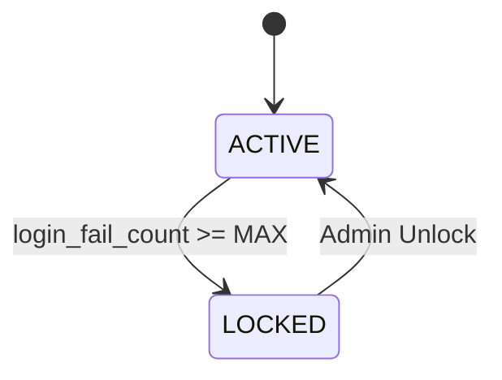
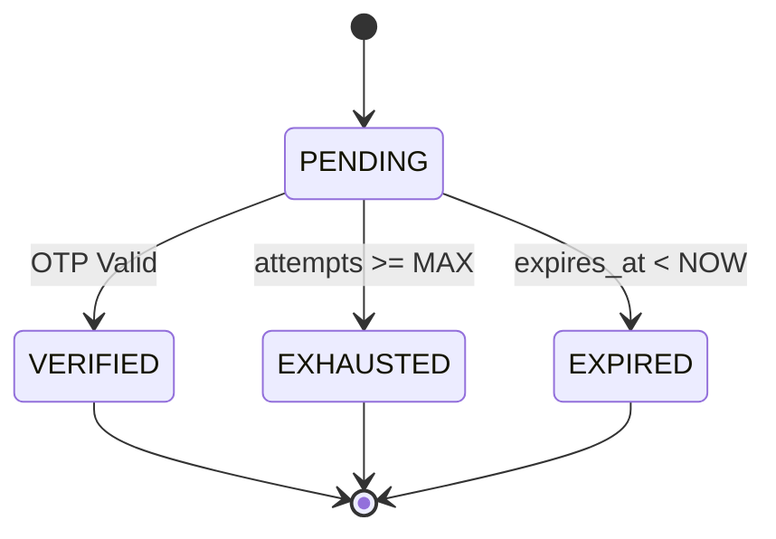
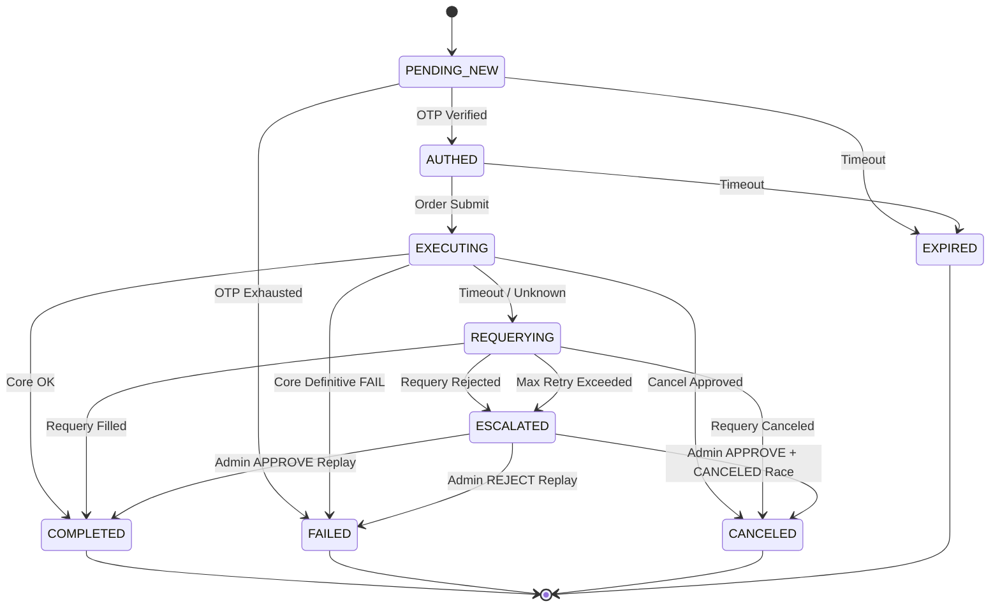
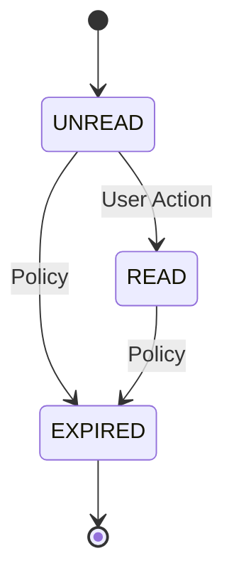
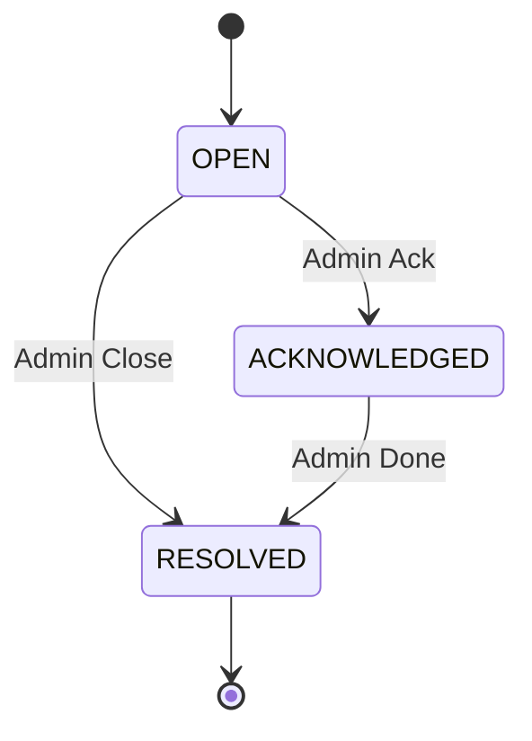

# 채널 시스템 — 상태 모델 설계 (v1.0)

채널계는 **4개의 독립 상태 머신**으로 구성된다.

| 테이블 | 상태 컬럼 | 상태 전이 권한 |
| --- | --- | --- |
| `members` | `status` | 서비스 로직만 (Admin 잠금 해제 포함) |
| `otp_verifications` | `status` | 서비스 로직만 |
| `order_sessions` | `status` | 서비스 로직만 |
| `notifications` | `status` | 사용자 액션(READ) / 배치 정책(EXPIRED) |
| `security_events` | `status` | Admin 전용 워크플로 |

> **원칙**: 타임스탬프는 감사 증거이지 상태 판정의 주체가 아니다.
> 상태는 오직 `status` 컬럼으로 결정한다.

---

# 1. `members.status` 상태 머신

## 1.1 상태 정의

| 상태 | 의미 |
| --- | --- |
| `ACTIVE` | 정상 인증 가능 |
| `LOCKED` | 로그인 차단 상태 |

## 1.2 전이 규칙



### 전이 상세

| 전이 | 트리거 | 부작용 |
| --- | --- | --- |
| `ACTIVE → LOCKED` | `login_fail_count >= 정책 임계치` | `locked_at` 기록, SECURITY_EVENTS 생성(`ACCOUNT_LOCKED`), **NOTIFICATIONS 생성(`ACCOUNT_LOCKED`, UNREAD)** |

| `LOCKED → ACTIVE` | Admin 잠금 해제 API 호출 | `login_fail_count = 0`, `locked_at = NULL`, AUDIT_LOGS 기록(`ACCOUNT_UNLOCKED`), SECURITY_EVENTS 전이(`RESOLVED`) |

## 1.3 Lazy Reset 정책

- 성공 로그인 시 `login_fail_count = 0`, `last_fail_at = NULL` 초기화
- `LOCKED` 상태에서는 성공 로그인 자체를 허용하지 않으므로, 반드시 Admin 해제 후에만 초기화 가능

## 1.4 소프트 삭제와 상태의 관계

- `deleted_at IS NOT NULL` 회원은 상태와 무관하게 인증 차단
- 삭제된 회원의 주문/감사 이력은 보존: `members.deleted_at`은 채널 레이어 필터이지, `audit_logs` / `order_sessions`의 삭제가 아님

---

# 2. `otp_verifications.status` 상태 머신

## 2.1 상태 정의

| 상태 | 의미 |
| --- | --- |
| `PENDING` | OTP 발급됨, 검증 대기 |
| `VERIFIED` | 검증 성공 |
| `EXHAUSTED` | 최대 시도 횟수 초과 |
| `EXPIRED` | 유효 시간 만료 |

## 2.2 전이 규칙



### 전이 상세

| 전이 | 트리거 | 부작용 |
| --- | --- | --- |
| `PENDING → VERIFIED` | OTP 코드 검증 성공 | `verified_at` 기록, `ORDER_SESSIONS.status → AUTHED` 가능 상태 |

| `PENDING → EXHAUSTED` | `attempt_count++` 후 `>= max_attempts` | SECURITY_EVENTS 생성(`OTP_MAX_ATTEMPTS`) |
| `PENDING → EXPIRED` | 검증 시도 시 `expires_at < NOW()` or 배치 판정 | ORDER_SESSIONS도 `EXPIRED` 전이 |

## 2.3 OTP 코드 값은 DB에 저장하지 않는다

- OTP 코드는 인메모리 캐시(Redis 등)에서 검증 후 폐기
- DB는 "몇 번 시도했는가, 성공했는가"만 기록 — DB 침해 시 코드 노출 없음

---

# 3. `order_sessions.status` 상태 머신

## 3.1 상태 정의

| 상태 | 의미 |
| --- | --- |
| `PENDING_NEW` | OTP 인증 대기 |
| `AUTHED` | OTP 검증 완료, 실행 승인 |
| `EXECUTING` | 코어 주문 실행 중 |
| `REQUERYING` | timeout/불확실 상태 재조회 중 |
| `ESCALATED` | 자동 복구 한계 초과, 수동 처리 대기 |
| `COMPLETED` | 정상 완료 |
| `FAILED` | 명확한 실패 |
| `CANCELED` | 주문 취소 완료(완전/부분 취소 포함) |
| `EXPIRED` | 세션 만료 |

## 3.2 전이 규칙



## 3.3 전이별 상세 규칙

| 전이 | 조건 | 부작용 |
| --- | --- | --- |
| `PENDING_NEW → AUTHED` | `OTP_VERIFICATIONS.status = VERIFIED` 확인 (4.11 원자적 트랜잭션) | AUDIT_LOGS 기록(`OTP_VERIFIED`) |
| `PENDING_NEW → FAILED` | OTP 시도 횟수 초과(`EXHAUSTED`) | `failure_reason_code='OTP_EXCEEDED'`, NOTIFICATIONS(`ORDER_REJECTED`), AUDIT_LOGS(`ORDER_FAILED`) |
| `PENDING_NEW → EXPIRED` | `expires_at < NOW()` | NOTIFICATIONS 생성(`SESSION_EXPIRY`) |
| `AUTHED → EXECUTING` | 주문 실행 API 진입 | AUDIT_LOGS 기록(`ORDER_SUBMITTED`), `executing_started_at` 기록 |
| `AUTHED → EXPIRED` | `expires_at < NOW()` (배치 수행) | NOTIFICATIONS 생성(`SESSION_EXPIRY`) |
| `EXECUTING → COMPLETED` | 코어 성공 응답 수신 | `ledger_uuid` 저장, `post_execution_balance` 스냅샷, NOTIFICATIONS 생성(`ORDER_FILLED`), AUDIT_LOGS(`ORDER_EXECUTED`) |
| `EXECUTING → FAILED` | 코어 명확한 실패 응답(잔액/포지션/검증 거절 등) | `failure_reason_code` 저장, NOTIFICATIONS 생성(`ORDER_REJECTED`), AUDIT_LOGS(`ORDER_FAILED`) |
| `EXECUTING → REQUERYING` | `executing_started_at` 기준 timeout 초과 | 복구 스케줄러 Requery 경로 진입 |
| `REQUERYING → COMPLETED` | Requery 결과 FILLED/PARTIAL_FILL | 체결 스냅샷 확정, NOTIFICATIONS(`ORDER_FILLED`) |
| `REQUERYING → ESCALATED` | Requery 결과 REJECTED 또는 max retry 초과 | `failure_reason_code='ESCALATED_MANUAL_REVIEW'`, AUDIT_LOGS(`ORDER_ESCALATED`) |
| `REQUERYING → CANCELED` | Requery 결과 CANCELED (완전/부분취소) | `executionResult` 기록, NOTIFICATIONS(`ORDER_CANCELED` 또는 `ORDER_PARTIAL_FILL_CANCEL`) |
| `ESCALATED → COMPLETED/FAILED/CANCELED` | Admin Replay 결정 | 최종 상태 확정 + 대응 알림 발행 |

## 3.4 멱등(Idempotency) — 채널 레이어

- `client_request_id UNIQUE`: DB 1차 방어선
- 동일 `client_request_id` 재요청 → 기존 세션 조회 → 현재 `status`와 스냅샷으로 응답 재현
- `COMPLETED` 상태면 `post_execution_balance` + `ledger_uuid`로 동일 응답 재구성

## 3.5 상태 조합 매트릭스 (전체)

| order_session.status | otp_verifications.status | 의미 | 허용 여부 |
| --- | --- | --- | --- |
| PENDING_NEW | PENDING | 정상 — OTP 입력 대기 중 | ✅ 관리 대상 |
| PENDING_NEW | EXHAUSTED | 비정상 — OTP 소진, 세션 FAILED(`OTP_EXCEEDED`) 전이 필요 | ⚠️ 즉시 처리 |
| PENDING_NEW | EXPIRED | 비정상 — OTP 만료, 세션도 EXPIRED 전이 | ⚠️ 즉시 처리 |
| AUTHED | VERIFIED | 정상 — 실행 가능 상태 | ✅ |
| AUTHED | VERIFIED | 만료 배치 진입 시 EXPIRED 전이 대상 | ⚠️ 만료 배치 대상 |
| EXECUTING | VERIFIED | 정상 — 실행 중 | ✅ |
| REQUERYING | VERIFIED | 복구 재조회 진행 중 | ⚠️ 배치 대상 |
| ESCALATED | VERIFIED | 자동 복구 한계 초과, 수동 처리 대기 | ⚠️ 운영자 처리 |
| COMPLETED | VERIFIED | 정상 완료 | ✅ |
| FAILED | VERIFIED | 실행 후 실패 | ✅ |
| CANCELED | VERIFIED | 취소 종결 | ✅ |
| EXPIRED | PENDING\|EXHAUSTED\|EXPIRED | 세션 만료 | ✅ |
| EXECUTING | \* | **timeout 위험 상태** — `executing_started_at` 기준 30초 초과 시 복구 스캔 대상 | ⚠️ 배치 대상 |

---

# 4. `notifications.status` 상태 머신

## 4.1 상태 정의

| 상태 | 의미 |
| --- | --- |
| `UNREAD` | 사용자가 아직 확인하지 않음 |
| `READ` | 사용자가 확인함 |
| `EXPIRED` | 보존 기간 만료 |

## 4.2 전이 규칙



### 전이 상세

| 전이 | 트리거 | 부작용 |
| --- | --- | --- |

| `UNREAD → READ` | 사용자 명시적 읽음 처리 | `read_at` 기록 |
| `UNREAD/READ → EXPIRED` | 보존 정책 배치 (`expires_at < NOW()`) | 이후 배치 삭제 대상 |

## 4.3 SSE 재연결 보장

- SSE 전송 실패 → DB 레코드는 `UNREAD` 유지
- 클라이언트 재연결 → `UNREAD` 알림 재발행
- 이미 `READ`/`EXPIRED`이면 재발행 안 함

---

# 5. `security_events.status` 상태 머신

## 5.1 상태 정의

| 상태 | 의미 |
| --- | --- |
| `OPEN` | 미처리 사건 |
| `ACKNOWLEDGED` | 담당자 확인 |
| `RESOLVED` | 종결 |

## 5.2 전이 규칙



### 전이 상세

| 전이 | 조건 | 부작용 |

| --- | --- | --- |
| `OPEN → ACKNOWLEDGED` | Admin API 호출 | `admin_member_id` 기록, AUDIT_LOGS 추가 |
| `ACKNOWLEDGED → RESOLVED` | Admin API 호출 | `resolved_at` 기록 |
| `OPEN → RESOLVED` | Admin 직접 처리 | `admin_member_id`, `resolved_at` 기록 |

## 5.3 자동 생성 트리거 (이벤트 타입별)

| 이벤트 타입 | 트리거 | 기본 심각도 |
| --- | --- | --- |
| `ACCOUNT_LOCKED` | `members.status → LOCKED` | HIGH |
| `OTP_MAX_ATTEMPTS` | `otp_verifications.status → EXHAUSTED` | HIGH |
| `FORCED_LOGOUT` | Admin 강제 로그아웃 API | MEDIUM |
| `ACCOUNT_UNLOCKED` | `members.status → ACTIVE` (Admin 해제) | LOW |
| `RATE_LIMIT_LOGIN` | 로그인 레이트 리밋 초과 | MEDIUM |
| `RATE_LIMIT_OTP` | OTP 레이트 리밋 초과 | MEDIUM |
| `RATE_LIMIT_ORDER` | 주문 레이트 리밋 초과 | MEDIUM |

---

# 6. 전체 상태 연동 흐름

## 6.1 정상 주문 시나리오

```
[1] POST /orders/sessions
    → ORDER_SESSIONS 생성 (PENDING_NEW)
    → OTP_VERIFICATIONS 생성 (PENDING)
    → AUDIT_LOGS(ORDER_SUBMITTED)

[2] POST /otp/verify
    → OTP_VERIFICATIONS(PENDING → VERIFIED)
    → ORDER_SESSIONS(PENDING_NEW → AUTHED)
    → AUDIT_LOGS(OTP_VERIFIED)

[3] POST /orders/execute
    → ORDER_SESSIONS(AUTHED → EXECUTING)
    → [Core API 호출]
    → 성공: ORDER_SESSIONS(EXECUTING → COMPLETED)
             post_execution_balance 스냅샷
             NOTIFICATIONS 생성(ORDER_FILLED, UNREAD)
             AUDIT_LOGS(ORDER_EXECUTED)
```

## 6.2 OTP 소진 시나리오

```
[1~N] POST /otp/verify (틀린 코드 반복)
    → attempt_count++
    → N번째: OTP_VERIFICATIONS(PENDING → EXHAUSTED)
              SECURITY_EVENTS 생성(OTP_MAX_ATTEMPTS, OPEN, HIGH)
              ORDER_SESSIONS(PENDING_NEW → FAILED, failure_reason_code='OTP_EXCEEDED')
              NOTIFICATIONS 생성(ORDER_REJECTED, UNREAD)
              AUDIT_LOGS(ORDER_FAILED)
```

## 6.3 세션 만료 시나리오

```
[배치/정책 스캔]
    → ORDER_SESSIONS WHERE status IN ('PENDING_NEW','AUTHED') AND expires_at < NOW()
    → ORDER_SESSIONS(PENDING_NEW|AUTHED → EXPIRED)
    → OTP_VERIFICATIONS(PENDING → EXPIRED)
    → NOTIFICATIONS 생성(SESSION_EXPIRY, UNREAD)
```

## 6.4 주문 실패 시나리오

```
[3] POST /orders/execute
    → ORDER_SESSIONS(AUTHED → EXECUTING), executing_started_at 기록
    → [Core API 호출 명확한 실패 응답]
    → ORDER_SESSIONS(EXECUTING → FAILED)
       failure_reason_code 저장
       NOTIFICATIONS 생성(ORDER_REJECTED, UNREAD)
       AUDIT_LOGS(ORDER_FAILED)
```

## 6.5 EXECUTING timeout 복구 시나리오

```
[복구 대시보드/스케줄러]
    → ORDER_SESSIONS WHERE status='EXECUTING'
         AND executing_started_at < NOW()-30s
    → 채널 서비스: ORDER_SESSIONS(EXECUTING → REQUERYING)
    → Core/FEP Requery 호출로 외부 상태 확인
    → FILLED/PARTIAL_FILL: ORDER_SESSIONS(REQUERYING → COMPLETED) + 스냅샷
    → REJECTED: ORDER_SESSIONS(REQUERYING → ESCALATED, failure_reason_code='ESCALATED_MANUAL_REVIEW')
    → CANCELED: ORDER_SESSIONS(REQUERYING → CANCELED)
    → UNKNOWN 지속 & maxRetryCount 초과: ORDER_SESSIONS(REQUERYING → ESCALATED, failure_reason_code='ESCALATED_MANUAL_REVIEW')
```

---

# 7. 계정계(Core) 상태 매핑 전략

**목표**: `channel_db.order_sessions`와 `core_db.journal_entries`/`order_records` 간의 상태 정합성 보장.

## 7.1 상태 매핑 테이블

| Channel Session Status | Core Journal Status | Core Record Status | 설명 |
| --- | --- | --- | --- |
| `PENDING_NEW` | (없음) | (없음) | 채널 내부 인증 단계 |
| `AUTHED` | (없음) | (없음) | 인증 완료, Core 호출 전 |
| `EXECUTING` | (없음) or `PENDING` | (없음) or `PENDING` | Core 호출 중 / 처리 중 |
| `REQUERYING` | `PENDING` / `POSTED` / `CANCELED` / 불확실 | `EXECUTING` / `COMPLETED` / `CANCELED` / `ESCALATED` | 복구 재조회 중 |
| `ESCALATED` | `PENDING` 또는 불확실 | `ESCALATED` | 자동 복구 한계 초과, 수동 조치 |
| `COMPLETED` | `POSTED` | `COMPLETED` | **최종 성공 동기화** |
| `FAILED` | `FAILED` | `FAILED` | **최종 실패 동기화** |
| `CANCELED` | `CANCELED` | `CANCELED` | **최종 취소 동기화** |

## 7.2 불일치 해소 (Reconciliation)

*   **상황**: Channel은 `EXECUTING`인데, Core 응답을 못 받음 (Timeout).
*   **전략**:
    *   Channel은 timeout 감지 시 먼저 `REQUERYING`으로 전이한다.
    *   `client_request_id`로 Core `GetOrder`/FEP Requery를 수행해 상태를 수렴시킨다.
    *   **Case 1 (Core 성공)**: Core가 `POSTED`라면 Channel `COMPLETED`.
    *   **Case 2 (Core 거절)**: Core/FEP가 명확한 거절이면 Channel `FAILED`.
    *   **Case 3 (Core 취소)**: Core/FEP가 `CANCELED`면 Channel `CANCELED`.
    *   **Case 4 (불확실 지속)**: 재시도 한도 초과 시 Channel `ESCALATED` (수동 Replay 대상).

---

## Password Recovery State Addendum (Story 1.7, 2026-03-05)

### Reset token lifecycle

- `ACTIVE` (represented by `active_slot=1`, `consumed_at IS NULL`, `expires_at > now`)
- `CONSUMED` (`consumed_at IS NOT NULL`, `active_slot IS NULL`)
- `EXPIRED` (`expires_at < now`, `active_slot IS NULL`)
- `INVALIDATED_BY_REISSUE` (`active_slot` changed from `1` to `NULL` on new issue)

Transition rules:
- `ACTIVE -> CONSUMED` on successful password reset
- `ACTIVE -> INVALIDATED_BY_REISSUE` on new forgot issue
- `ACTIVE -> EXPIRED` by time

### Member status domain extension (Story 1.7 override)

`members.status` domain is extended as:
- `ACTIVE`
- `LOCKED`
- `WITHDRAWN`
- `DEACTIVATED`
- `ADMIN_SUSPENDED`
- `POLICY_LOCKED`

Reset effect rule:
- Password reset only clears credential-failure lock path (`LOCKED`/`AUTH-002`).
- `WITHDRAWN`, `DEACTIVATED`, `ADMIN_SUSPENDED`, `POLICY_LOCKED` are non-credential states and remain unchanged.

### Expiry normalization note

- `EXPIRED` is defined by `expires_at < now` regardless of `active_slot`.
- Cleanup/validation path normalizes expired rows to terminal state by setting `active_slot = NULL`.
