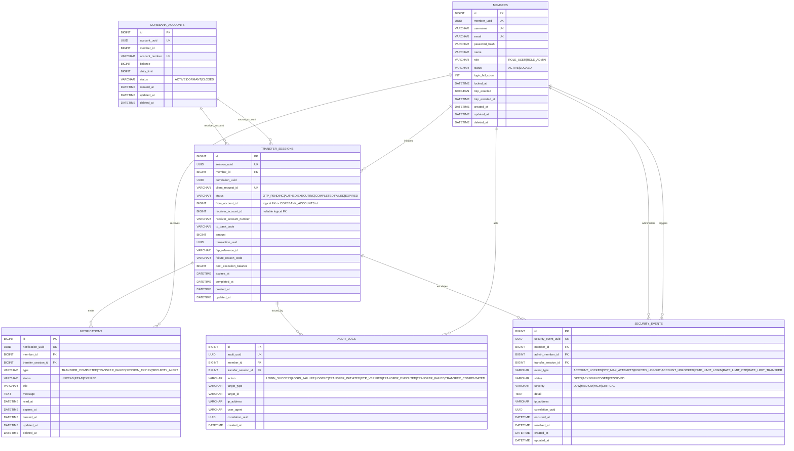

# Channel System ERD (Epic 0~8 Consolidated)

This ERD is derived from all epics (0 through 8) and applies two design rules:
1. Every core table has both numeric `PK` and business `UUID`.
2. Stateful behavior is controlled by explicit `status` columns, not inferred only from timestamps.

## Status-driven lifecycle rules

- `MEMBERS.status`
  - `ACTIVE -> LOCKED` when login failure threshold is exceeded.
  - `LOCKED -> ACTIVE` only by admin unlock flow.

- `TRANSFER_SESSIONS.status`
  - `OTP_PENDING -> AUTHED -> EXECUTING -> COMPLETED|FAILED|EXPIRED`.
  - Transition authority is service logic; timestamps are audit evidence, not primary state.

- `NOTIFICATIONS.status`
  - `UNREAD -> READ` by user action.
  - `UNREAD|READ -> EXPIRED` by retention policy.

- `SECURITY_EVENTS.status`
  - `OPEN -> ACKNOWLEDGED -> RESOLVED` for security operation workflow.

## Constraint summary

- Every table uses:
  - `id` (BIGINT PK, internal join/performance)
  - `*_uuid` (UUID UK, external API reference/idempotency-safe exposure)
- Cross-schema references (`TRANSFER_SESSIONS` -> `COREBANK_ACCOUNTS`) are logical FKs by service boundary.
- TOTP secret is not stored in DB (Vault-managed); DB keeps only enrollment state (`totp_enabled`, `totp_enrolled_at`).
- `DATETIME` fields are consistently stored in **UTC** or **Asia/Seoul (KST)** based on system-wide configuration.
- Soft delete (`deleted_at`) is applied where lifecycle-level hiding/restoration is meaningful:
  - Applied: `MEMBERS`, `NOTIFICATIONS`, `COREBANK_ACCOUNTS`
  - Not applied (immutable/forensic record): `TRANSFER_SESSIONS`, `AUDIT_LOGS`, `SECURITY_EVENTS`

## Soft delete policy

- Generic rule
  - Soft delete means `deleted_at IS NOT NULL`.
  - Default read query must include `deleted_at IS NULL`.
  - Physical delete is allowed only by explicit retention/archival job.
- `MEMBERS`
  - Soft deleted member cannot authenticate and is excluded from normal member queries.
  - Existing transfer/audit/security history remains preserved by design.
- `NOTIFICATIONS`
  - User-side hide/delete action can set `deleted_at`; history can still be retained for ops retention window.
- `COREBANK_ACCOUNTS`
  - Primary lifecycle is still `status` (`ACTIVE|DORMANT|CLOSED`).
  - `deleted_at` is for administrative soft retirement, not for transfer-state decisions.

## Table-by-table details

### 1) `MEMBERS`

- Purpose
  - Identity/authentication anchor for channel users and admins.
  - Owns account-level security state (lockout, TOTP enrollment flag).
- PK + UUID usage
  - `id`: internal joins and index efficiency.
  - `member_uuid`: external-safe identifier for APIs/log correlation.
- Important columns
  - `role`: authorization boundary (`ROLE_USER`, `ROLE_ADMIN`).
  - `status`: account lifecycle state (`ACTIVE`, `LOCKED`).
  - `login_fail_count`, `locked_at`: lockout control source of truth.
  - `totp_enabled`, `totp_enrolled_at`: step-up auth enrollment state only (secret is in Vault).
  - `deleted_at`: member soft delete marker.
- Status policy
  - `ACTIVE -> LOCKED`: failed login threshold exceeded.
  - `LOCKED -> ACTIVE`: admin unlock action only.
- Integrity/security rules
  - `username`, `email` unique.
  - `password_hash` only (no plaintext), never exposed in response/log.
  - Soft deleted rows are filtered by `deleted_at IS NULL` in normal auth/user flows.

#### Field Specifications

| Column Name | Type | Key | Nullable | Description |
| :--- | :--- | :--- | :--- | :--- |
| `id` | BIGINT | PK | NO | Internal index/join key |
| `member_uuid` | UUID | UK | NO | Public reference and API key |
| `username` | VARCHAR(50) | UK | NO | User login ID |
| `email` | VARCHAR(100) | UK | NO | User contact and recovery email |
| `password_hash` | VARCHAR(255) | | NO | Bcrypt/Argon2 hash of password |
| `name` | VARCHAR(100) | | NO | Member full name |
| `role` | VARCHAR(20) | | NO | `ROLE_USER` or `ROLE_ADMIN` |
| `status` | VARCHAR(20) | | NO | `ACTIVE`, `LOCKED` |
| `login_fail_count` | INT | | NO | Consecutive failures (Lazy reset logic applied) |
| `last_fail_at` | DATETIME | | YES | Timestamp of last failed login |
| `locked_at` | DATETIME | | YES | Timestamp when account was locked |
| `totp_enabled` | BOOLEAN | | NO | Whether 2FA is active (Default: false) |
| `totp_enrolled_at` | DATETIME | | YES | Timestamp of TOTP activation |
| `created_at` | DATETIME | | NO | Record creation time |
| `updated_at` | DATETIME | | NO | Last update time |
| `deleted_at` | DATETIME | | YES | Soft delete timestamp (NULL if active) |

### 2) `TRANSFER_SESSIONS`

- Purpose
  - Main transfer workflow aggregate for the channel layer.
  - Represents request intent, OTP gate, execution, and final result.
- PK + UUID usage
  - `id`: relational joins and paging.
  - `session_uuid`: public transfer-session reference.
- Important columns
  - `status`: transfer state machine.
  - `client_request_id`: idempotency key (duplicate prevention).
  - `from_account_id`, `receiver_account_id`: logical account refs (cross-schema).
  - `amount`, `to_bank_code`: execution routing context.
  - `transaction_uuid`, `fep_reference_id`: completion and interbank traceability.
  - `failure_reason_code`: structured failure reason.
  - `post_execution_balance`: completed response replay without recalculation.
  - `expires_at`: session validity boundary.
- Status policy
  - `OTP_PENDING -> AUTHED -> EXECUTING -> COMPLETED|FAILED|EXPIRED`.
  - State transitions are explicit service operations, not timestamp inference.
- Integrity rules
  - `client_request_id` unique.
  - Must keep status/result fields consistent (e.g., `COMPLETED` requires `transaction_uuid`).
  - No soft delete: transfer execution history is treated as immutable financial evidence.

#### Field Specifications

| Column Name | Type | Key | Nullable | Description |
| :--- | :--- | :--- | :--- | :--- |
| `id` | BIGINT | PK | NO | Internal index key |
| `session_uuid` | UUID | UK | NO | Public API reference |
| `member_id` | BIGINT | FK | NO | References `MEMBERS.id` |
| `correlation_uuid` | UUID | | NO | Trace ID for observability |
| `client_request_id` | VARCHAR(64) | UK | NO | Idempotency key from client |
| `status` | VARCHAR(20) | | NO | `OTP_PENDING`, `AUTHED`, `EXECUTING`, `COMPLETED`, `FAILED`, `EXPIRED` |
| `from_account_id` | BIGINT | | NO | Sender account (Core context) |
| `receiver_account_id` | BIGINT | | YES | Internal receiver account (if internal transfer) |
| `receiver_account_number` | VARCHAR(30) | | NO | Receiver account number string |
| `to_bank_code` | VARCHAR(10) | | NO | Destination bank routing code |
| `amount` | BIGINT | | NO | Transfer amount (in smallest currency unit) |
| `transaction_uuid` | UUID | | YES | CoreBank ledger transaction ID (on success) |
| `fep_reference_id` | VARCHAR(50) | | YES | External payment gateway reference |
| `failure_reason_code` | VARCHAR(50) | | YES | Standardized error code if FAILED |
| `post_execution_balance` | BIGINT | | YES | Sender balance snapshot after transfer |
| `expires_at` | DATETIME | | NO | Session timeout deadline |
| `completed_at` | DATETIME | | YES | When final state was reached |
| `created_at` | DATETIME | | NO | Session start time |
| `updated_at` | DATETIME | | NO | Last state change time |

### 3) `NOTIFICATIONS`

- Purpose
  - Durable notification store for SSE + reconnect fallback.
  - User-visible event history and read-state tracking.
- PK + UUID usage
  - `id`: fast pagination/order operations.
  - `notification_uuid`: external-safe event reference.
- Important columns
  - `type`: domain event classification (`TRANSFER_COMPLETED`, `TRANSFER_FAILED`, `SESSION_EXPIRY`, `SECURITY_ALERT`).
  - `status`: read lifecycle (`UNREAD`, `READ`, `EXPIRED`).
  - `transfer_session_id`: optional linkage to transfer context.
  - `read_at`, `expires_at`: read/retention control points.
  - `deleted_at`: user/admin soft delete marker.
- Status policy
  - `UNREAD -> READ`: explicit user action.
  - `UNREAD|READ -> EXPIRED`: retention cleanup policy.
- Integrity rules
  - Notification persistence is primary; SSE delivery failure must not lose DB record.
  - Soft delete hides records in UI while avoiding immediate hard delete.

#### Field Specifications

| Column Name | Type | Key | Nullable | Description |
| :--- | :--- | :--- | :--- | :--- |
| `id` | BIGINT | PK | NO | Internal index/join key |
| `notification_uuid` | UUID | UK | NO | Public reference ID |
| `member_id` | BIGINT | FK | NO | Recipient member |
| `transfer_session_id` | BIGINT | FK | YES | Associated transfer session if applicable |
| `type` | VARCHAR(50) | | NO | Event category identifier |
| `status` | VARCHAR(20) | | NO | `UNREAD`, `READ`, `EXPIRED` |
| `title` | VARCHAR(100) | | NO | Notification summary/headline |
| `message` | TEXT | | NO | Detailed notification body |
| `read_at` | DATETIME | | YES | When user marked as read |
| `expires_at` | DATETIME | | YES | Retention/display timeout |
| `created_at` | DATETIME | | NO | When event occurred |
| `updated_at` | DATETIME | | NO | Last state update |
| `deleted_at` | DATETIME | | YES | Soft delete timestamp |

### 4) `AUDIT_LOGS`

- Purpose
  - Immutable audit trail of user/system actions for investigation and admin query.
- PK + UUID usage
  - `id`: efficient chronological paging.
  - `audit_uuid`: stable external log reference.
- Important columns
  - `action`: normalized action taxonomy (login/otp/transfer lifecycle).
  - `member_id`: actor identity.
  - `target_type`, `target_id`: target object linkage.
  - `correlation_uuid`: cross-service request chain.
  - `ip_address`, `user_agent`: forensic context.
- Operational policy
  - Append-only (no in-place business mutation).
  - Retention purge job removes old rows by policy window.
  - No soft delete: audit records are forensic evidence.

#### Field Specifications

| Column Name | Type | Key | Nullable | Description |
| :--- | :--- | :--- | :--- | :--- |
| `id` | BIGINT | PK | NO | Chronological key |
| `audit_uuid` | UUID | UK | NO | Compliance reference |
| `member_id` | BIGINT | FK | YES | Actor (NULL if system action) |
| `transfer_session_id` | BIGINT | FK | YES | Related transfer session |
| `action` | VARCHAR(50) | | NO | `LOGIN_SUCCESS`, `TRANSFER_EXECUTED`, etc. |
| `target_type` | VARCHAR(50) | | YES | Entity affected (e.g., `MEMBER`, `TRANSFER`) |
| `target_id` | VARCHAR(100) | | YES | ID of the target entity |
| `ip_address` | VARCHAR(45) | | YES | Client IP (IPv4/IPv6) |
| `user_agent` | TEXT | | YES | Client device/browser signature |
| `correlation_uuid` | UUID | | YES | Distributed trace ID |
| `created_at` | DATETIME | | NO | Exact timestamp of occurrence |

### 5) `SECURITY_EVENTS`

- Purpose
  - Dedicated security-incident stream separated from general audit.
  - Supports incident workflow and privileged operation tracking.
- PK + UUID usage
  - `id`: operational query performance.
  - `security_event_uuid`: stable incident reference.
- Important columns
  - `event_type`: security signal category (lockout, OTP max attempts, force logout, rate limits, etc.).
  - `status`: response workflow (`OPEN`, `ACKNOWLEDGED`, `RESOLVED`).
  - `severity`: triage priority.
  - `member_id`, `admin_member_id`: subject and privileged actor trace.
  - `occurred_at`, `resolved_at`: incident timeline markers.
- Status policy
  - `OPEN -> ACKNOWLEDGED -> RESOLVED` via security/admin operations.
- Integrity rules
  - Keep event details structured (`detail`) for incident reconstruction.
  - Retention policy longer than general audit where required.
  - No soft delete: security-event timeline must remain tamper-resistant.

#### Field Specifications

| Column Name | Type | Key | Nullable | Description |
| :--- | :--- | :--- | :--- | :--- |
| `id` | BIGINT | PK | NO | Internal index key |
| `security_event_uuid` | UUID | UK | NO | Incident workflow ID |
| `event_type` | VARCHAR(50) | | NO | `ACCOUNT_LOCKED`, `OTP_MAX_ATTEMPTS`, etc. |
| `status` | VARCHAR(20) | | NO | `OPEN`, `ACKNOWLEDGED`, `RESOLVED` |
| `severity` | VARCHAR(10) | | NO | `LOW`, `MEDIUM`, `HIGH`, `CRITICAL` |
| `member_id` | BIGINT | FK | YES | Subject member (if applicable) |
| `admin_member_id` | BIGINT | FK | YES | Admin who took action (if applicable) |
| `transfer_session_id` | BIGINT | FK | YES | Related transfer event (if applicable) |
| `detail` | TEXT | | YES | JSON or text dump of incident context |
| `ip_address` | VARCHAR(45) | | YES | Source IP of the event |
| `correlation_uuid` | UUID | | YES | Trace identifier |
| `occurred_at` | DATETIME | | NO | Time of incident |
| `resolved_at` | DATETIME | | YES | When status became RESOLVED |
| `created_at` | DATETIME | | NO | Record ingestion time |
| `updated_at` | DATETIME | | NO | Last update time |

### 6) `COREBANK_ACCOUNTS` (Referenced External Domain)

- Purpose
  - CoreBank-owned account ledger head used by channel transfer validation/execution.
  - Included here because `TRANSFER_SESSIONS` references it logically.
- PK + UUID usage
  - `id`: internal relational key in `core_db`.
  - `account_uuid`: external-safe account reference.
- Important columns
  - `balance`: current monetary state used during transfer checks.
  - `daily_limit`: per-account daily transfer limit.
  - `status`: account availability (`ACTIVE`, `DORMANT`, `CLOSED`).
  - `deleted_at`: administrative soft retirement marker.
- Integration policy
  - Channel does not own this table directly.
  - Cross-schema link is logical (service boundary), enforced by API/business checks.

#### Field Specifications

| Column Name | Type | Key | Nullable | Description |
| :--- | :--- | :--- | :--- | :--- |
| `id` | BIGINT | PK | NO | Core ledger internal ID |
| `account_uuid` | UUID | UK | NO | Public account identifier |
| `member_id` | BIGINT | | NO | Owner Member ID (logical, or FK inside Core) |
| `account_number` | VARCHAR(30) | UK | NO | Unique bank account number |
| `balance` | BIGINT | | NO | Current balance (signed, atomic currency unit) |
| `daily_limit` | BIGINT | | NO | Max daily withdrawal cap |
| `status` | VARCHAR(20) | | NO | `ACTIVE`, `DORMANT`, `CLOSED` |
| `created_at` | DATETIME | | NO | Account creation date |
| `updated_at` | DATETIME | | NO | Last balance/status change |
| `deleted_at` | DATETIME | | YES | Soft closed/archive date |
