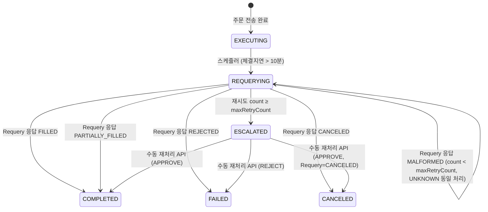

# FIX — 대외계 API 명세 (v1.0)

> **시스템 경계**: 내부(채널계·계정계) ↔ **FEP Gateway (:8083)** ↔ **FEP Simulator (:8082, KRX/KOSDAQ 대리)**  
> **호출 방향**:  
> - 계정계 → FEP Gateway (JSON/HTTP): 주문 전송·상태 조회·취소  
> - FEP Gateway → FEP Simulator (FIX 4.2 TCP / QuickFIX/J): NewOrderSingle·OrderCancelRequest  
> - FEP Simulator → FEP Gateway (FIX 4.2 TCP): ExecutionReport  
> **내부 보안**: 모든 서비스 간 호출에 `X-Internal-Secret` 헤더 필수 (`InternalSecretFilter` 검증)

---

## 1. 시스템 구성 및 네트워크 분리

```
[channel-service:8080] ─── core-net ──→ [corebank-service:8081]
                                                │
                                            gateway-net
                                                │
                                         [fep-gateway:8083]
                                                │
                                             fep-net
                                                │
                                         [fep-simulator:8082]
                                    (QuickFIX/J SocketAcceptor, 가상 거래소)
```

> Docker 네트워크 격리 정책: `gateway-net`은 corebank ↔ fep-gateway 전용.  
> `fep-gateway`, `fep-simulator`의 포트는 외부(host)에 노출하지 않는다.

---

## 2. 공통 규격

### 2.1 계정계 → FEP Gateway (JSON/HTTP)

**인증**: `X-Internal-Secret: {INTERNAL_API_SECRET}` 헤더 필수

**공통 요청 헤더**
| 헤더 | 필수 | 설명 |
|---|---|---|
| `Content-Type` | POST | `application/json` |
| `X-Internal-Secret` | ✅ | 내부 서비스 인증 시크릿 |
| `X-Correlation-Id` | ✅ | 요청 추적 ID (traceparent 연동) |
| `X-ClOrdID` | 주문 요청 시 ✅ | FIX Tag 11 (ClOrdID), UUID v4 |

**공통 응답 봉투**
```json
{
  "success": true,
  "rc": "0000",
  "data": { ... },
  "error": null,
  "traceId": "trace-fep-001"
}
```

**오류 응답 봉투**
```json
{
  "success": false,
  "rc": "9004",
  "data": null,
  "error": {
    "code": "FEP-002",
    "message": "FEP 응답 타임아웃",
    "rcDescription": "TIMEOUT",
    "retryAfterSeconds": null
  },
  "traceId": "trace-fep-001"
}
```

> **`retryAfterSeconds` 필드 정의**: `error` 객체의 선택적 필드. `RC=9098 CIRCUIT_OPEN` 시 10(사이클 대기 시간), 기타 모든 오류 코드에서는 `null`. 클라이언트는 `null` 분기를 반드시 처리해야 하며, non-null일 때 countdown timer를 표시하여 사용자 UX를 개선한다.

### 2.2 FEP Gateway → FEP Simulator (FIX 4.2 TCP)

**프로토콜**: QuickFIX/J `SocketInitiator` (FEP Gateway) ↔ `SocketAcceptor` (FEP Simulator)  
**인증**: FIX Logon(MsgType=A) 시 `Username(Tag 553)` + `Password(Tag 554)` + TLS  
**주요 FIX 메시지 타입**

| MsgType | 이름 | 방향 |
|---|---|---|
| `A` | Logon | Gateway → Simulator (세션 시작) |
| `0` | Heartbeat | 양방향 (주기적 회선 점검) |
| `D` | NewOrderSingle | Gateway → Simulator (주문 전송) |
| `F` | OrderCancelRequest | Gateway → Simulator (취소 요청) |
| `H` | OrderStatusRequest | Gateway → Simulator (§3.2 Requery 시 주문 현재 상태 조회) |
| `8` | ExecutionReport | Simulator → Gateway (체결/거절 응답) |
| `9` | OrderCancelReject | Simulator → Gateway (취소 거절 응답 — §5.4 별도 명세) |
| `5` | Logout | 양방향 (세션 종료) |

---

## 3. FEP Gateway API — 계정계가 호출하는 엔드포인트

### 3.1 주문 전송

```
POST /fep/v1/orders
```

**호출자**: `corebank-service` (FepClient 빈, `@CircuitBreaker(name="fep")` 적용)  
**회로 차단기**: Resilience4j `slidingWindowSize=3`, `failureRateThreshold=100`, `waitDurationInOpenState=10s`

**요청 헤더**
| 헤더 | 필수 | 설명 |
|---|---|---|
| `X-Internal-Secret` | ✅ | 내부 서비스 인증 |
| `X-Correlation-Id` | ✅ | 추적 ID |
| `X-ClOrdID` | ✅ | FIX Tag 11, UUID v4 |

**요청 바디** (LIMIT 주문)
```json
{
  "clOrdId": "client-uuid-xxxx",
  "accountId": "ACC-001",
  "symbol": "005930",
  "securityExchange": "KRX",
  "side": "BUY",
  "orderType": "LIMIT",
  "qty": 10,
  "price": 72000,
  "currency": "KRW",
  "referenceId": "ref-uuid-xxxx"
}
```

**요청 바디** (MARKET 주문 — `price` 필드 완전 생략)
```json
{
  "clOrdId": "client-uuid-xxxx",
  "accountId": "ACC-001",
  "symbol": "005930",
  "securityExchange": "KRX",
  "side": "BUY",
  "orderType": "MARKET",
  "qty": 10,
  "currency": "KRW",
  "referenceId": "ref-uuid-xxxx"
}
```

> **MARKET 주문 `price` 생략 규칙**: `orderType: "MARKET"` 시 `price` 필드를 `null`로 전송하는 것이 아니라 **필드 자체를 완전 제거**해야 한다. FIX 4.2 표준상 Tag 44 미포함 전송 규칙(§5.1 참조). `price: null` 전송 시 `VALIDATION-001 422` 반환.

| 필드 | 타입 | FIX Tag | 필수 | 설명 |
|---|---|---|---|---|
| `clOrdId` | String | Tag 11 | ✅ | 클라이언트 주문 ID (UUID v4). **`X-ClOrdID` 헤더와 반드시 동일한 값이어야 한다.** 불일치 시 `VALIDATION-001 422` 반환. fep-gateway는 `X-ClOrdID` 헤더를 멱등성 키로, 바디 `clOrdId`를 FIX Tag 11 값으로 사용하므로 두 값이 다르면 멱등성 보장이 깨진다. |
| `accountId` | String | Tag 1 | ✅ | 주문 계좌 ID |
| `symbol` | String | Tag 55 | ✅ | KRX 6자리 종목코드 |
| `securityExchange` | String | Tag 207 | ✅ | `KRX` \| `KOSDAQ` (라우팅 기준) |
| `side` | Enum | Tag 54 | ✅ | `BUY`(1) \| `SELL`(2) |
| `orderType` | Enum | Tag 40 | ✅ | `LIMIT`(2) \| `MARKET`(1) |
| `qty` | Integer | Tag 38 | ✅ | 주문 수량 |
| `price` | Long | Tag 44 | LIMIT만 ✅ | 지정 가격 (KRW, 소수점 없음) |
| `currency` | String | Tag 15 | ✅ | `KRW` |
| `referenceId` | String | Tag 58 (`Text`, 비표준 삽입) | ✅ | 내부 트레이스 참조 ID |

**응답 200 OK** (체결 성공 — `ExecType=FILL`)
```json
{
  "success": true,
  "rc": "0000",
  "data": {
    "clOrdId": "client-uuid-xxxx",
    "fepOrderId": "FEP-KRX-20260301-0001",
    "execType": "FILL",
    "ordStatus": "FILLED",
    "executedQty": 10,
    "executedPrice": 72000,
    "leavesQty": 0,
    "transactTime": "2026-03-01T10:05:30Z"
  },
  "error": null,
  "traceId": "trace-fep-002"
}
```

> **`fepOrderId` 매핑**: FIX `Tag 37 (OrderID)` — FEP Simulator(KRX/KOSDAQ)가 부여한 주문 ID.
> `corebank-service`는 이 값을 `core_db.order_history.external_order_id VARCHAR(50)` 컬럼에 저장한다.
> `channel-service`에는 `externalOrderId`로 노출된다. 체결 확인·회계감사·수동 재처리 시 참조 키로 사용.

**응답 200 OK** (부분 체결 — `ExecType=PARTIAL_FILL`)
```json
{
  "success": true,
  "rc": "0000",
  "data": {
    "clOrdId": "client-uuid-xxxx",
    "fepOrderId": "FEP-KRX-20260301-0001",
    "execType": "PARTIAL_FILL",
    "ordStatus": "PARTIALLY_FILLED",
    "executedQty": 5,
    "executedPrice": 72000,
    "leavesQty": 5,
    "transactTime": "2026-03-01T10:05:30Z"
  },
  "error": null,
  "traceId": "trace-fep-002"
}
```

**FEP RC 코드 (Response Code) 전체 목록**

| RC 코드 | 설명 | HTTP | 재시도 |
|---|---|---|---|
| `0000` | 정상 처리 | 200 | — |
| `9001` | `NO_ROUTE` — 라우팅 규칙 없음 | 400 | ❌ |
| `9002` | `POOL_EXHAUSTED` — 사용 가능 FIX 세션 없음 | 503 | ✅ (백오프) |
| `9003` | `NOT_LOGGED_ON` — FIX 세션 미로그인 | 503 | ✅ (재로그인 후) |
| `9004` | `TIMEOUT` — FIX Simulator 무응답 | 504 | ✅ |
| `9005` | `KEY_EXPIRED` — TLS/Logon 키 만료 | 503 | ❌ (키 갱신 필요) |
| `9006` | `CANCEL_REJECTED` — 취소 불가 상태 (이미 체결된 주문) | 409 | ❌ |
| `9097` | `ORDER_REJECTED` — Simulator가 주문 거절 | 400 | ❌ |
| `9098` | `CIRCUIT_OPEN` — 회로 차단기 OPEN (fast-fail) | 503 | ✅ (10초 후) |
| `9099` | `CONCURRENCY_FAILURE` — 동시성 충돌 | 409 | ❌ |
| `9401` | `AUTH_FAILED` — `X-Internal-Secret` 헤더 누락 또는 일치 실패 | 401 | ❌ |
| `9999` | `UNKNOWN_ERROR` — 내부 오류 | 500 | ❌ |
| — | `VALIDATION-001` — 입력값 유효성 실패 (`clOrdId`/`X-ClOrdID` 불일치, MARKET주문 `price` 필드 없이 `null` 전송 등 채널계 전반 검증에도 사용되는 코드) | 422 | ❌ |
| `9008` | `ORDER_NOT_FOUND` — Replay 대상 `clOrdId` 없음 (§10.2 전용) | 404 | ❌ |
| `9009` | `INVALID_SESSION_STATUS` — Replay 대상 세션이 `ESCALATED` 아님 (§10.2 전용) | 409 | ❌ |
| `9010` | `SESSION_ALREADY_LOGGED_ON` — FIX 세션이 이미 `LOGGED_ON` 상태 (§8.1 전용) | 409 | ❌ |
| `9422` | `CHAOS_VALIDATION_FAILURE` — Chaos API 요청 필드 유효성 실패 (§4.1 전용) | 422 | ❌ |

**오류 응답 예시** (RC=9098, 회로 차단기 OPEN)
```json
{
  "success": false,
  "rc": "9098",
  "data": null,
  "error": {
    "code": "FEP-001",
    "message": "FEP 회로 차단기가 열려 있습니다. 잠시 후 재시도하세요.",
    "rcDescription": "CIRCUIT_OPEN",
    "retryAfterSeconds": 10
  },
  "traceId": "trace-fep-003"
}
```

**오류 응답 예시** (RC=9004, FIX Simulator 타임아웃)
```json
{
  "success": false,
  "rc": "9004",
  "data": null,
  "error": {
    "code": "FEP-002",
    "message": "FEP 응답 타임아웃. 주문 상태를 재조회 중입니다.",
    "rcDescription": "TIMEOUT",
    "retryAfterSeconds": null
  },
  "traceId": "trace-fep-004"
}
```

> **CB OPEN 선제 차단**: `CIRCUIT_OPEN`인 경우 `@Transactional`을 시작하지 않고, 주문 레코드 생성 없이, 포지션 변경 없이 즉시 반환한다.

> **`referenceId` FIX 전송 방식**: `referenceId`는 FIX Tag 58(`Text`) 필드에 `REF:{referenceId}` 포맷으로 삽입된다. FEP Simulator는 Tag 58 값을 파싱하지 않고 무시한다(패스스루). 추가 커스텀 FIX 태그는 사용하지 않으며, 표준 FIX 4.2 파싱에 영향을 주지 않는다. 감사 트레이싱 목적으로만 사용된다.
> **`MARKET` 주문 사전 잔액 검증**: `corebank-service`는 `MARKET` 주문 수신 시 해당 종목의 직전 체결가(또는 BBO 정보가 없으면 현재 호가 조회 API)를 기준으로 `qty × 추정가` 금액을 사전 체크한다. 슬리피지로 실제 체결 금액이 추정가를 초과하면 FEP Simulator가 `ORDER_REJECTED(ExecType=8)`를 반환하며 클라이언트는 `FEP-003`을 수신한다. 사전 잔액 검증은 best-effort이며 슬리피지로 인한 초과 체결은 완전히 방지할 수 없음을 클라이언트에게 UX로 안내해야 한다.

> **§3.1 동기 블로킹 정책**: `POST /fep/v1/orders` 요청은 **FIX ExecutionReport를 수신할 때까지 HTTP 응답을 블로킹**하는 동기 패턴이다. `corebank-service`의 `FeignClient` `readTimeout=28s` 설정에 따라 최대 28초 대기 후 타임아웃 시 `9004 TIMEOUT` 응답이 반환된다. FIX Simulator가 `ExecType=0(NEW)` → `ExecType=2(FILL)` 순서로 두 번 ExecutionReport를 전송할 경우, fep-gateway는 `ExecType=0`을 수신하면 계속 대기하고 **`ExecType=2(FILL)` 또는 기타 종결 응답을 수신할 때**만 HTTP 응답을 반환한다. `ExecType=0(NEW)` 단독 수신 후 28초 경과 시 `9004 TIMEOUT`를 반환하며, 이 주문은 복구 스케줄러에 의해 Requery 처리된다.
---

### 3.2 주문 상태 조회 (Requery)

```
GET /fep/v1/orders/{clOrdId}/status
```

**호출자**: 복구 스케줄러 (`OrderSessionRecoveryService`), UNKNOWN 상태 재조회 시

**경로 파라미터**
| 파라미터 | 설명 |
|---|---|
| `clOrdId` | 조회할 주문의 ClOrdID (FIX Tag 11) |

**요청 헤더**
| 헤더 | 필수 | 설명 |
|---|---|---|
| `X-Internal-Secret` | ✅ | 내부 서비스 인증 |
| `X-Correlation-Id` | ✅ | 추적 ID |

**응답 200 OK** (조회 성공)
```json
{
  "success": true,
  "rc": "0000",
  "data": {
    "clOrdId": "client-uuid-xxxx",
    "fepOrderId": "FEP-KRX-20260301-0001",
    "ordStatus": "FILLED",
    "execType": "FILL",
    "executedQty": 10,
    "executedPrice": 72000,
    "leavesQty": 0,
    "transactTime": "2026-03-01T10:05:30Z",
    "queryTime": "2026-03-01T10:10:00Z"
  },
  "error": null,
  "traceId": "trace-fep-004"
}
```

**응답 200 OK** (알 수 없음 — Simulator도 모름)
```json
{
  "success": true,
  "rc": "0000",
  "data": {
    "clOrdId": "client-uuid-xxxx",
    "fepOrderId": null,
    "ordStatus": "UNKNOWN",
    "message": "외부 시스템에서 해당 주문 정보를 확인할 수 없습니다.",
    "queryTime": "2026-03-01T10:10:00Z"
  },
  "error": null,
  "traceId": "trace-fep-004"
}
```

> **`ordStatus: "UNKNOWN"` Requery 정책**: FIX Simulator가 OrderStatusRequest(MsgType=H)에 응답했으나 해당 주문을 인식하지 못하거나 처리 결과를 확인할 수 없는 경우 반환된다. fep-gateway는 `fep_transaction_journal.tx_status = UNKNOWN`으로 업데이트하고(`failure_reason` 컬럼에 Simulator 반환 메시지 기록, `needs_reconciliation = 1`), 복구 스케줄러에게 재조회 처리를 위임한다. 복구 스케줄러는 재조회 카운터를 증가시키고 `maxRetryCount` 초과 시 `ESCALATED`로 에스컬레이션한다.

**응답 200 OK** (부분 체결 — `ordStatus: "PARTIALLY_FILLED"`)
```json
{
  "success": true,
  "rc": "0000",
  "data": {
    "clOrdId": "client-uuid-xxxx",
    "fepOrderId": "FEP-KRX-20260301-0001",
    "ordStatus": "PARTIALLY_FILLED",
    "execType": "PARTIAL_FILL",
    "executedQty": 5,
    "executedPrice": 72000,
    "leavesQty": 5,
    "transactTime": "2026-03-01T10:05:30Z",
    "queryTime": "2026-03-01T10:10:00Z"
  },
  "error": null,
  "traceId": "trace-fep-004"
}
```

> **PARTIAL_FILL Requery 복구 동작**: `ordStatus: "PARTIALLY_FILLED"` 수신 시 복구 스케줄러는 `executedQty` 만큼만 포지션 반영 후 OrderSession을 `COMPLETED`로 종결한다. 잔여 수량에 대한 추가 세션은 생성하지 않는다.

**응답 200 OK** (FIX 전송 후 ExecutionReport 미수신 중 — `ordStatus: "PENDING"`)
```json
{
  "success": true,
  "rc": "0000",
  "data": {
    "clOrdId": "client-uuid-xxxx",
    "fepOrderId": null,
    "ordStatus": "PENDING",
    "message": "FIX NewOrderSingle 전송 완료, ExecutionReport 대기 중입니다.",
    "queryTime": "2026-03-01T10:10:00Z"
  },
  "error": null,
  "traceId": "trace-fep-004"
}
```

> **`ordStatus: "PENDING"` Requery 정책**: NewOrderSingle이 FIX Simulator로 이미 전송됐으나 ExecutionReport가 아직 돌아오지 않은 공시 잠복 상태를 나타낸다. fep-gateway는 `fep_transaction_journal.tx_status = PENDING`인 레코드를 확인하고 이 응답을 반환한다. **복구 스케줄러는 `PENDING`을 `UNKNOWN`과 동일하게 처리한다** — 재조회 카운터를 증가시키고 `maxRetryCount` 초과 시 `ESCALATED`로 에스컬레이션한다. `fepOrderId`는 ExecutionReport 미수신 시점이므로 `null`로 반환된다.

**응답 200 OK** (거절 — `ordStatus: "REJECTED"`)
```json
{
  "success": true,
  "rc": "0000",
  "data": {
    "clOrdId": "client-uuid-xxxx",
    "fepOrderId": null,
    "ordStatus": "REJECTED",
    "execType": "REJECTED",
    "rejectReason": "INSUFFICIENT_FUNDS",
    "transactTime": "2026-03-01T10:05:30Z",
    "queryTime": "2026-03-01T10:10:00Z"
  },
  "error": null,
  "traceId": "trace-fep-004"
}
```

> **`fepOrderId` nullable 정책 (REJECTED)**: `ExecType=8(REJECTED)` 시 FIX Simulator가 `Tag 37 (OrderID)`를 반환하지 않을 수 있다. Simulator 구현에 따라 빈 문자열 또는 미포함 상태로 올 수 있으며, fep-gateway는 빈 문자열과 미포함 모두 `null`로 정규화하여 반환한다. 클라이언트는 REJECTED 응답에서 `fepOrderId: null` 분기를 반드시 처리해야 한다. FILLED/PARTIAL_FILL 응답에서는 `fepOrderId`가 항상 non-null임이 보장된다.

> **Requery REJECTED 복구 동작**: `ordStatus: "REJECTED"` 수신 시 복구 스케줄러는 OrderSession을 `FAILED`로 전환하고 사전 차감된 포지션/잔액의 보상 트랜잭션을 `corebank-service`에서 실행한다. `rejectReason`은 `fep_transaction_journal.failure_reason`에 기록된다.

> **`rejectReason` FIX 태그 매핑**: `rejectReason` 값은 ExecutionReport의 `Tag 103 (OrdRejReason)`을 문자열로 변환한 값이다. `Tag 58 (Text)`에 추가 사유가 있으면 `failure_reason` 컬럼에 함께 병합(`"TAG103:{value};TEXT:{tag58}"`). 가능한 열거값:
> | `rejectReason` 값 | Tag 103 코드 | 설명 |
> |---|---|---|
> | `UNKNOWN_SYMBOL` | 1 | 미등록 종목 |
> | `EXCHANGE_CLOSED` | 2 | 거래소 폐장 |
> | `INSUFFICIENT_FUNDS` | 3 | 잔액 부족 |
> | `INVALID_PRICE` | 4 | 가격 오류 |
> | `ORDER_EXCEEDS_LIMIT` | 6 | 주문 한도 초과 |
> | `OTHER` | 0 / 기타 | 기타 (Text 필드 참조) |

**응답 200 OK** (취소 완료 — `ordStatus: "CANCELED"`)
```json
{
  "success": true,
  "rc": "0000",
  "data": {
    "clOrdId": "client-uuid-xxxx",
    "fepOrderId": null,
    "ordStatus": "CANCELED",
    "execType": "CANCELED",
    "canceledQty": 10,
    "transactTime": "2026-03-01T10:06:00Z",
    "queryTime": "2026-03-01T10:10:00Z"
  },
  "error": null,
  "traceId": "trace-fep-004"
}
```

**응답 200 OK** (부분 체결 후 취소 확인 — Requery `OrdStatus=4, CumQty > 0`)
```json
{
  "success": true,
  "rc": "0000",
  "data": {
    "clOrdId": "client-uuid-xxxx",
    "fepOrderId": "FEP-KRX-20260301-0001",
    "ordStatus": "CANCELED",
    "execType": "CANCELED",
    "executedQty": 5,
    "executedPrice": 72000,
    "canceledQty": 5,
    "transactTime": "2026-03-01T10:06:00Z",
    "queryTime": "2026-03-01T10:10:00Z"
  },
  "error": null,
  "traceId": "trace-fep-004"
}
```

> **`ordStatus: "CANCELED"` Requery 복구 동작**: 주문이 이미 취소된 상태에서 Requery(`OrderStatusRequest`) 응답으로 `OrdStatus=4(CANCELED)`를 수신한 경우, 복구 스케줄러는 FIX `CumQty`(Tag 14) 값에 따라 두 케이스를 구분 처리한다.
> - **완전 취소 (`CumQty = 0`)**: `OrderSession.status = CANCELED`, 사전 차감 포지션/잔액 온전 환원. SSE `ORDER_CANCELED` 이벤트(`canceledQty`, `canceledAt` 포함) 발행.
> - **부분 체결 후 취소 (`CumQty > 0`)**: `executedQty` 분 포지션 확정 + `canceledQty` 분 잔액 환원. `OrderSession.status = CANCELED`, `executionResult = "PARTIAL_FILL_CANCEL"`. SSE `ORDER_PARTIAL_FILL_CANCEL` 이벤트(`executedQty`, `canceledQty`, `executedPrice`, `executedAt` 포함) 발행.
>
> 일반적으로 취소는 §3.3 `cancel` 엔드포인트를 통해 확인되지만, 취소 요청과 Requery 스케줄러가 동시에 실행되는 레이스 콘디션에서만 발생하는 케이스이다.

**응답 200 OK** (FIX 파싱 오류 — `ordStatus: "MALFORMED"`)
```json
{
  "success": true,
  "rc": "0000",
  "data": {
    "clOrdId": "client-uuid-xxxx",
    "fepOrderId": null,
    "ordStatus": "MALFORMED",
    "message": "FIX ExecutionReport 파싱 오류. 수동 검토가 필요합니다.",
    "parseError": "PARSE_ERROR:Tag 39 missing or invalid",
    "queryTime": "2026-03-01T10:10:00Z"
  },
  "error": null,
  "traceId": "trace-fep-015"
}
```

> **`ordStatus: "MALFORMED"` Requery 복구 동작**: Chaos API `MALFORMED_RESP` 액션 활성화 상태에서 FEP Simulator가 잘못된 FIX 메시지를 반환하여 ExecutionReport 파싱이 실패한 경우 이 응답이 반환된다. 복구 스케줄러는 `MALFORMED`를 `UNKNOWN`/`PENDING`과 동일하게 처리한다 — 재조회 카운터를 증가시키고 `maxRetryCount` 초과 시 `ESCALATED`로 에스컬레이션한다. `fep_transaction_journal.tx_status = MALFORMED`, `failure_reason = "PARSE_ERROR:{message}"`, `needs_reconciliation = 1`로 기록되어 수동 검토 대상이 된다 (§9 MALFORMED 저널 기록 정책 참조).

**오류 코드**
| RC | HTTP | 설명 |
|---|---|---|
| `9401` | 401 | `X-Internal-Secret` 누락 또는 불일치 |
| `9002` | 503 | FEP 세션 풀 소진 — `OrderStatusRequest(MsgType=H)` 전송 시에도 FIX 세션이 필요하므로 발생 가능. 재시도 가능 (`Retry-After` 없음) |
| `9003` | 503 | FEP 세션 미로그인 — Requery 전송 전 세션 미로그인 확인 시 발생. 재시도 가능 (`Retry-After` 없음) |
| `9004` | 504 | 조회 타임아웃 (재시도 가능) |
| `9098` | 503 | 회로 차단기 OPEN |
| `9999` | 500 | `SYS-001` — 내부 오류 |

> 스케줄러 임계치 초과 시(반복 UNKNOWN) → 에스컬레이션 시그널 발생, 수동 재처리 API 트리거.

---

### 3.3 주문 취소 요청

```
POST /fep/v1/orders/{clOrdId}/cancel
```

**호출자**: `corebank-service` (보상 트랜잭션 시)

**경로 파라미터**
| 파라미터 | 설명 |
|---|---|
| `clOrdId` | 취소할 주문의 ClOrdID |

**요청 바디**
```json
{
  "origClOrdId": "client-uuid-xxxx",
  "symbol": "005930",
  "side": "BUY",
  "cancelQty": 10,
  "reason": "COMPENSATION"
}
```

| 필드 | FIX Tag | 설명 |
|---|---|---|
| `origClOrdId` | Tag 41 | 원주문 ClOrdID |
| `symbol` | Tag 55 | 종목코드 |
| `side` | Tag 54 | 원주문과 동일 |
| `cancelQty` | Tag 38 | 취소 수량 |
| `reason` | — | `COMPENSATION` \| `EXPIRED` \| `ADMIN` |

> **`cancelClOrdId` 생성 주체**: 취소 요청의 FIX Tag 11(`ClOrdID`)은 **`fep-gateway`가 UUID v4를 auto-generate**하여 FIX OrderCancelRequest에 삽입한다. 요청 바디에 취소 요청용 ClOrdID 필드를 포함하지 않으면 된다. 응답의 `cancelClOrdId`가 이 auto-generated UUID이며, 감사 로그에 `fep_transaction_journal.tx_id`와 함께 기록된다.

**응답 200 OK**
```json
{
  "success": true,
  "rc": "0000",
  "data": {
    "origClOrdId": "client-uuid-xxxx",
    "cancelClOrdId": "cancel-uuid-xxxx",
    "status": "CANCELED",
    "canceledQty": 10,
    "canceledAt": "2026-03-01T10:06:00Z"
  },
  "error": null,
  "traceId": "trace-fep-005"
}
```

**응답 200 OK** (부분 체결 후 잔량 취소 — `PARTIAL_FILL_CANCEL`)
```json
{
  "success": true,
  "rc": "0000",
  "data": {
    "origClOrdId": "client-uuid-xxxx",
    "cancelClOrdId": "cancel-uuid-xxxx",
    "status": "PARTIAL_FILL_CANCEL",
    "executedQty": 5,
    "canceledQty": 5,
    "executedPrice": 72000,
    "executedAt": "2026-03-01T10:05:45Z",
    "canceledAt": "2026-03-01T10:06:00Z"
  },
  "error": null,
  "traceId": "trace-fep-005"
}
```

> **PARTIAL_FILL_CANCEL 정책**: 거래소가 `PARTIAL_FILL` 상태(일부 체결 후 잔량 취소)로 응답할 때의 처리.  
> - `executedQty` 분은 체결 확정 → `corebank-service`가 해당 수량만큼 포지션 반영 + `OrderSession.status = CANCELED`, `executionResult = "PARTIAL_FILL_CANCEL"`.  
> - `canceledQty` 분은 보상 없이 잔량 해제 → 사전 차감 금액 중 `canceledQty × order.price`(원주문 지정가, LIMIT 주문 기준) 분만 환원. MARKET 주문에서는 사전 차감이 추정가 기준으로 이루어졌으므로 `canceledQty × 주문 시점 추정가`분을 환원한다.  
> - **`executedAt`**: FIX ExecutionReport TransactTime(Tag 60) 기준 거래소 체결 확정 시각 (ISO-8601 UTC). channel-service SSE `ORDER_PARTIAL_FILL_CANCEL` 이벤트의 `executedAt` 필드에 매핑된다.  
> - **`canceledAt`**: FIX ExecutionReport TransactTime(Tag 60) 기준 거래소 취소 확정 시각 (ISO-8601 UTC). 동일 FIX 메시지에서 두 시각이 함께 반환되므로 체결·취소 순서는 `executedAt ≤ canceledAt`이 보장된다. channel-service 주문 세션 상태 조회 응답(`GET /api/v1/orders/sessions/{id}`)의 `canceledAt` 필드에 포함된다.  
> 취소가 불가한 상태에서 취소 요청 시 RC `9006` → HTTP 409 리턴 (`CHANNEL-010`).

**오류 코드**
| RC | HTTP | 설명 |
|---|---|---|
| `9006` | 409 | `CANCEL_REJECTED` — 취소 불가 상태 (이미 체결/종결된 주문에 취소 시도) |
| `9004` | 504 | `TIMEOUT` — FIX Simulator가 OrderCancelAck/OrderCancelReject를 28초(FepClient readTimeout) 내에 대응하지 않은 경우. 취소 확인을 위해 `GET /fep/v1/orders/{clOrdId}/status` (Requery)로 후속 확인 필요 |
| `9002` | 503 | `POOL_EXHAUSTED` — SIGNED_ON 세션 또는 유효 풀 없음 (§6.1 참조). 주문 전송과 동일한 라우팅 경로를 사용하므로 동일 조건에서 발생. 재시도 가능 (백오프) |
| `9003` | 503 | `NOT_LOGGED_ON` — FIX 세션 미로그인 상태에서 취소 요청 시 반환. §3.1과 동일한 라우팅 경로를 사용하므로 동일 조건에서 발생 가능. `retryAfterSeconds: null` |
| `9099` | 409 | `CONCURRENCY_FAILURE` — 취소 요청 처리 중 `fep_transaction_journal` 레코드 무결성 충돌 |
| `VALIDATION-001` | 422 | 요청 바디 필드 유효성 실패 — `origClOrdId`/`symbol`/`side`/`cancelQty`/`reason` 누락 또는 잘못된 값 |
| `9098` | 503 | CB OPEN — 회로 차단기 활성화 (fast-fail, `waitDuration=10s` 경과 후 재시도) |
| `9001` | 400 | `NO_ROUTE` — 취소 대상 주문의 라우팅 규칙 없음 (§6.1 일치, 운영 설정 확인 필요, 재시도 불가) |
| `9401` | 401 | `X-Internal-Secret` 누락 또는 불일치 |
| `9999` | 500 | `SYS-001` — 내부 오류 |

---

### 3.4 FEP 회로 차단기 상태 조회

```
GET /fep/v1/circuit-breaker/status
```

**호출자**: 운영자, 모니터링 시스템

**요청 헤더**
| 헤더 | 필수 | 설명 |
|---|---|---|
| `Authorization` | ✅ | `Bearer {ADMIN_TOKEN}` — `fep_security_keys` 테이블에 `key_type = ADMIN_TOKEN`으로 등록된 ACTIVE 토큰 |

**응답 200 OK** (CLOSED 상태)
```json
{
  "success": true,
  "rc": "0000",
  "data": {
    "state": "CLOSED",
    "failureCount": 1,
    "successCount": 0,
    "halfOpenPermittedCalls": 1,
    "openDurationSeconds": 10,
    "lastFailureAt": "2026-03-01T09:50:00Z",
    "openUntil": null
  },
  "error": null,
  "traceId": "trace-fep-006"
}
```

**응답 200 OK** (OPEN 상태 — fast-fail 활성화)
```json
{
  "success": true,
  "rc": "0000",
  "data": {
    "state": "OPEN",
    "failureCount": 3,
    "successCount": 0,
    "halfOpenPermittedCalls": 1,
    "openDurationSeconds": 10,
    "lastFailureAt": "2026-03-01T10:05:00Z",
    "openUntil": "2026-03-01T10:05:10Z"
  },
  "error": null,
  "traceId": "trace-fep-006"
}
```

**응답 200 OK** (HALF_OPEN 상태 — 시험 중)
```json
{
  "success": true,
  "rc": "0000",
  "data": {
    "state": "HALF_OPEN",
    "failureCount": 0,
    "successCount": 0,
    "halfOpenPermittedCalls": 1,
    "openDurationSeconds": 10,
    "lastFailureAt": "2026-03-01T10:04:58Z",
    "openUntil": null
  },
  "error": null,
  "traceId": "trace-fep-006"
}
```

**CB 상태값**
| 상태 | 설명 |
|---|---|
| `CLOSED` | 정상 동작 중 |
| `OPEN` | 차단 중 (fast-fail, `openUntil` 까지) |
| `HALF_OPEN` | 제한적 통과 (`halfOpenPermittedCalls`회 성공 시 CLOSED 전환) |

**응답 필드 설명**
| 필드 | 타입 | 설명 |
|---|---|---|
| `state` | String | 현재 CB 상태 (`CLOSED`/`OPEN`/`HALF_OPEN`) |
| `failureCount` | Integer | 현재 슬라이딩 윈도우 내 실패 횟수 |
| `successCount` | Integer | HALF_OPEN 시험 성공 횟수 |
| `halfOpenPermittedCalls` | Integer | HALF_OPEN에서 허용하는 시험 요청 횟수 (= Resilience4j `permitted-number-of-calls-in-half-open-state`) |
| `openDurationSeconds` | Integer | CB OPEN 유지 시간(초). 현재 설정값 10초 (`waitDurationInOpenState`)와 일치함 |
| `lastFailureAt` | ISO-8601 \| null | 마지막 실패 발생 시각. CLOSED + 실패 이력 없으면 `null` |
| `openUntil` | ISO-8601 \| null | OPEN 상태 해제 예정 시각. CLOSED/HALF_OPEN 시 `null` |

> Actuator 엔드포인트: `GET http://localhost:8081/actuator/circuitbreakers` (corebank-service 측에서도 확인 가능, 인증 없이 접근 가능한 데모용 엔드포인트)

**오류 코드**
| RC | HTTP | 설명 |
|---|---|---|
| `9401` | 401 | 인증 실패 — Authorization Bearer 토큰 누락 또는 불유효 |
| `9999` | 500 | 내부 서버 오류 (`SYS-001`) |

---

## 4. FEP Chaos Control API (데모·테스트 전용)

> ⚠️ 이 엔드포인트는 **데모 스크린샷 촬영 및 수동 검증 전용**이다. 자동 CI에 포함하지 않는다.  
> **프로덕션 격리**: `spring.profiles.active=prod` 프로파일에서 `/fep-internal/**` 엔드포인트가 완전 비활성화된다 (`@Profile("!prod")` 적용). `X-Internal-Secret` 시크릿 유출만으로는 프로덕션에서 카오스 주입이 불가능하다. 스테이징/로컬 환경에서만 사용 가능하다.

### 4.1 Chaos 규칙 설정

```
PUT /fep-internal/rules
```

**호출자**: 운영자 (데모 시)  
**헤더**: `X-Internal-Secret` 필수 (`InternalSecretFilter` 검증)

**요청 바디**
```json
{
  "action": "TIMEOUT",
  "targetSymbol": "005930",
  "targetExchange": "KRX",
  "ttlSeconds": 60,
  "matchAmount": null,
  "probability": 1.0
}
```

| 필드 | 타입 | 필수 | 설명 |
|---|---|---|---|
| `action` | Enum | ✅ | `APPROVE` \| `DECLINE` \| `IGNORE` \| `DISCONNECT` \| `MALFORMED_RESP` \| `TIMEOUT` |
| `targetSymbol` | String | ❌ | 매칭 종목코드 (null = 전체 종목에 적용) |
| `targetExchange` | String | ✅ | 매칭 거래소 (`KRX` \| `KOSDAQ`) |
| `ttlSeconds` | Integer | ✅ | 규칙 유효 기간 (초). 0 이하이면 `9422` 반환 |
| `matchAmount` | Long | ❌ | 특정 금액 조건 매칭 (null = 금액 무관) |
| `probability` | Double | ❌ | 적용 확률 0.0~1.0 (null 시 기본값 1.0 적용). 범위 초과 시 `9422` 반환 |

**Chaos 액션 설명**
| 액션 | FIX 동작 | 설명 |
|---|---|---|
| `APPROVE` | `ExecutionReport(ExecType=FILL)` | 즉시 **전량** 체결. PARTIAL_FILL 시뮬레이션은 미지원 — 잔량이 있는 부분 체결 재현이 필요하면 별도 `matchAmount` 조건 없이 직접 FIX Simulator 로그를 조작해야 한다. |
| `DECLINE` | `ExecutionReport(ExecType=REJECTED)` | 주문 거절 |
| `IGNORE` | 무응답 | 타임아웃 유도 |
| `DISCONNECT` | FIX Session 강제 종료 | `NOT_LOGGED_ON` 유도 |
| `MALFORMED_RESP` | 잘못된 FIX 메시지 반환 | 파싱 오류 유도 |
| `TIMEOUT` | 응답 지연 후 무응답 | 회로 차단기 트리거 시나리오 |

**응답 200 OK**
```json
{
  "success": true,
  "rc": "0000",
  "data": {
    "ruleId": "rule-uuid-xxxx",
    "action": "TIMEOUT",
    "targetSymbol": "005930",
    "targetExchange": "KRX",
    "matchAmount": null,
    "probability": 1.0,
    "appliedAt": "2026-03-01T10:00:00Z",
    "expiresAt": "2026-03-01T10:01:00Z"
  },
  "error": null,
  "traceId": "trace-fep-007"
}
```

**오류 코드**
| RC | HTTP | 설명 |
|---|---|---|
| `9401` | 401 | `X-Internal-Secret` 헤더 누락 또는 불일치 — `InternalSecretFilter` 검증 실패 |
| `9422` | 422 | 요청 필드 유효성 실패 (`action` 미인식 열거값, `probability` 범위 0.0~1.0 초과, `ttlSeconds` 0 이하 등) |
| `9999` | 500 | `SYS-001` — 내부 오류 |

> **`9401`과 Bearer 토큰 인증 구분**: Chaos API는 `Authorization Bearer` 토큰 대신 `X-Internal-Secret` 헤더로 인증한다 (`@Profile("!prod")` 환경 전용). `X-Internal-Secret` 불일치 시에도 HTTP 401을 반환하며, RC는 `9401`로 동일하다. 운영자는 에러 메시지(`"secret mismatch"`) 로 구분한다.

### 4.2 현재 Chaos 규칙 조회

```
GET /fep-internal/rules
```

**응답 200 OK**
```json
{
  "success": true,
  "rc": "0000",
  "data": {
    "activeRules": [
      {
        "ruleId": "rule-uuid-xxxx",
        "action": "TIMEOUT",
        "targetSymbol": "005930",
        "targetExchange": "KRX",
        "matchAmount": null,
        "probability": 1.0,
        "appliedAt": "2026-03-01T10:00:00Z",
        "expiresAt": "2026-03-01T10:01:00Z"
      }
    ]
  },
  "error": null,
  "traceId": "trace-fep-008"
}
```

**오류 코드**
| RC | HTTP | 설명 |
|---|---|---|
| `9401` | 401 | `X-Internal-Secret` 헤더 누락 또는 불일치 |
| `9999` | 500 | 내부 서버 오류 (`SYS-001`) |

### 4.3 Chaos 규칙 초기화

```
DELETE /fep-internal/rules
```

**응답 200 OK**
```json
{
  "success": true,
  "rc": "0000",
  "data": { "message": "모든 Chaos 규칙이 초기화되었습니다." },
  "error": null,
  "traceId": "trace-fep-009"
}
```

**오류 코드**
| RC | HTTP | 설명 |
|---|---|---|
| `9401` | 401 | `X-Internal-Secret` 헤더 누락 또는 불일치 |
| `9999` | 500 | 내부 서버 오류 (`SYS-001`) |

---

## 5. FIX 4.2 메시지 명세 (Gateway ↔ Simulator)

### 5.1 NewOrderSingle (MsgType=D) — 주문 전송

| FIX Tag | 필드명 | 데이터 타입 | 필수 | 예시값 | 설명 |
|---|---|---|---|---|---|
| 35 | MsgType | Char | ✅ | `D` | 메시지 유형 |
| 11 | ClOrdID | String | ✅ | `client-uuid-xxxx` | 클라이언트 주문 ID |
| 1 | Account | String | ✅ | `ACC-001` | 주문 계좌 |
| 55 | Symbol | String | ✅ | `005930` | 종목코드 |
| 207 | SecurityExchange | String | ✅ | `KRX` | 거래소 코드 |
| 54 | Side | Char | ✅ | `1`(BUY), `2`(SELL) | 매매 구분 |
| 58 | Text | String | ✅ | `REF:ref-uuid` | 내부 참조 ID (`REF:{referenceId}` 포맷). §3.1 `referenceId` 요청 필드가 필수이므로 항상 포함된다. FEP Simulator는 이 값을 무시(패스스루)하며, 감사 트레이싱 목적으로만 사용된다. |
| 40 | OrdType | Char | ✅ | `2`(LIMIT), `1`(MARKET) | 주문 유형 |
| 38 | OrderQty | Qty | ✅ | `10` | 주문 수량 |
| 44 | Price | Price | LIMIT만 ✅ | `72000` | 지정 가격. **`MARKET` 주문 시 Tag 44를 완전 생략**한다 (`0`으로 전송하지 않는다). FIX 4.2 표준에 따라 불필요 태그 포함 시 Simulator가 거절할 수 있다. |
| 15 | Currency | Currency | ✅ | `KRW` | 통화 |
| 60 | TransactTime | UTCTimestamp | ✅ | `20260301-01:05:00.000` | 요청 시각 |
| 49 | SenderCompID | String | ✅ | `FEP_GATEWAY` | 송신 시스템 |
| 56 | TargetCompID | String | ✅ | `KRX_SIM` | 수신 시스템 |

### 5.2 ExecutionReport (MsgType=8) — 체결 응답

| FIX Tag | 필드명 | 데이터 타입 | 설명 |
|---|---|---|---|
| 35 | MsgType | Char | `8` |
| 37 | OrderID | String | Simulator 부여 주문 ID |
| 11 | ClOrdID | String | 원주문 ClOrdID (상관관계) |
| 17 | ExecID | String | 체결 ID (유니크) |
| 150 | ExecType | Char | `0`=NEW, `1`=PARTIAL_FILL, `2`=FILL, `4`=CANCELED (OrderCancelAck), `8`=REJECTED |
| 39 | OrdStatus | Char | `0`=NEW, `1`=PARTIALLY_FILLED, `2`=FILLED, `4`=CANCELED, `8`=REJECTED |

> **`OrdStatus` → 응답 JSON `ordStatus` 매핑**: FEP Gateway는 FIX 원시 char값을 다음과 같이 JSON 문자열로 정규화한다. `'0'(NEW)` → `"NEW"`, `'1'(PARTIALLY_FILLED)` → `"PARTIALLY_FILLED"`, `'2'(FILLED)` → `"FILLED"`, `'4'(CANCELED)` → `"CANCELED"`, `'8'(REJECTED)` → `"REJECTED"`. ExecutionReport 파싱 실패 · 미인식 char값 수신 시 → `"UNKNOWN"` 응답 반환 + `tx_status = MALFORMED`로 저널 기록 (`failure_reason = "PARSE_ERROR:{message}"`, `needs_reconciliation = 1`). `ExecType`(Tag 150)이 실제 판정 주체이며, `OrdStatus`(Tag 39)는 보조 교차검증에 사용된다. 두 값이 의미 불일치(`ExecType='2'`이나 `OrdStatus='1'` 등)할 경우 `ExecType`을 우선순위로 처리하고 불일치 상황을 `fep_transaction_journal.failure_reason`에 기록한다.
| 55 | Symbol | String | 종목코드 |
| 54 | Side | Char | `1`(BUY), `2`(SELL) |
| 14 | CumQty | Qty | 누적 체결 수량 |
| 31 | LastPx | Price | 마지막 체결 가격 |
| 151 | LeavesQty | Qty | 잔여 수량 |
| 60 | TransactTime | UTCTimestamp | 거래소 이벤트 확정 시각 — `ExecType=2(FILL)` · `ExecType=1(PARTIAL_FILL)` 시 체결 확정 시각, `ExecType=4(CANCELED)` 시 취소 확정 시각. fep-gateway는 이 값을 JSON 응답의 `executedAt`(체결 케이스) 또는 `canceledAt`(취소 케이스)으로 매핑하여 반환한다. |
| 58 | Text | String | 거절 사유 (ExecType=8 시) |

**ExecType 판정 로직 (FEP Gateway)**

```
ExecType = '2' (FILL)         → ORDER_FILLED                                    (RC=0000, tx_status=APPROVED)
ExecType = '1' (PARTIAL_FILL) → ORDER_FILLED (executionResult: "PARTIAL_FILL")  (RC=0000, tx_status=PARTIAL_FILL)
ExecType = '8' (REJECTED)     → ORDER_REJECTED                                  (RC=9097, tx_status=DECLINED)
ExecType = '4' (CANCELED)     → ORDER_CANCELED — §3.3 취소 요청 또는 §3.2 Requery에서 OrdStatus=4 수신 시 (Race condition 포함)  (RC=0000, tx_status=CANCELED (CumQty=0) 또는 PARTIAL_FILL_CANCEL (CumQty>0))
ExecType = '0' (NEW)          → ORDER_ACCEPTED (미체결, 대기 상태)               (RC=0000, tx_status=PENDING 유지 — 터미널 ExecutionReport 수신 전까지 UPDATE 없음, 채널계에 별도 에러 응답 없음)
파싱 실패 / 미인식 FIX 메시지  → tx_status=MALFORMED, failure_reason="PARSE_ERROR:{message}", needs_reconciliation=1 — 복구 스케줄러 Requery 대상 (§9 MALFORMED 저널 기록 정책 참조), 주문은 UNKNOWN 상태로 유지
```

### 5.3 OrderCancelRequest (MsgType=F) — 취소 요청

| FIX Tag | 필드명 | 데이터 타입 | 설명 |
|---|---|---|---|
| 35 | MsgType | Char | `F` |
| 41 | OrigClOrdID | String | 원주문 ClOrdID |
| 11 | ClOrdID | String | 취소 요청 고유 ID (fep-gateway auto-generate) |
| 55 | Symbol | String | 종목코드 |
| 54 | Side | Char | 원주문 매매 구분과 동일 |
| 38 | OrderQty | Qty | 취소 수량 |
| 60 | TransactTime | UTCTimestamp | 취소 요청 시각 |
| 49 | SenderCompID | String | `FEP_GATEWAY` |
| 56 | TargetCompID | String | `KRX_SIM` |

### 5.4 OrderCancelReject (MsgType=9) — 취소 거절 응답

> 거래소(Simulator)가 취소 요청을 거부할 때 반환. `RC 9006 → HTTP 409 (CHANNEL-010)` 으로 변환됨.

| FIX Tag | 필드명 | 데이터 타입 | 설명 |
|---|---|---|---|
| 35 | MsgType | Char | `9` |
| 37 | OrderID | String | 원주문 거래소 ID |
| 11 | ClOrdID | String | 취소 요청 ClOrdID |
| 41 | OrigClOrdID | String | 원주문 ClOrdID |
| 39 | OrdStatus | Char | 현재 주문 상태 (`2`=FILLED 등 — 이미 종결된 상태) |
| 102 | CxlRejReason | Int | 거절 사유 코드. `0`=TOO_LATE_TO_CANCEL, `1`=UNKNOWN_ORDER, `3`=ORDER_ALREADY_FILLED |
| 58 | Text | String | 거절 사유 텍스트 |
| 60 | TransactTime | UTCTimestamp | 거절 처리 시각 |

> **`CxlRejReason` → `CHANNEL-010` 매핑**: `CxlRejReason` 값과 무관하게 fep-gateway는 `9006 CANCEL_REJECTED`로 정규화하여 반환한다. 세부 거절 사유는 `fep_transaction_journal.failure_reason` 컬럼에 `"CXL_REJ:{code};TEXT:{text}"` 형식으로 기록된다.

### 5.5 OrderStatusRequest (MsgType=H) — Requery 주문 상태 조회

> `GET /fep/v1/orders/{clOrdId}/status`(§3.2)가 내부적으로 FIX Simulator에 전송하는 메시지. Simulator는 현재 주문 상태로 ExecutionReport(MsgType=8)를 응답한다.

| FIX Tag | 필드명 | 데이터 타입 | 필수 | 설명 |
|---|---|---|---|---|
| 35 | MsgType | Char | ✅ | `H` |
| 11 | ClOrdID | String | ✅ | 조회할 클라이언트 주문 ID (FIX Tag 11) |
| 41 | OrigClOrdID | String | ✅ | 원주문 ClOrdID (조회 주문과 동일) |
| 54 | Side | Char | ✅ | 원주문 매매 구분 (`1`=BUY, `2`=SELL) |
| 60 | TransactTime | UTCTimestamp | ✅ | 요청 시각 |
| 49 | SenderCompID | String | ✅ | `FEP_GATEWAY` |
| 56 | TargetCompID | String | ✅ | `KRX_SIM` |

---

## 6. 라우팅 정책

### 6.1 라우팅 결정 흐름

```
주문 수신 → SecurityExchange(Tag 207) 추출 → fep_routing_rules 조회
→ 매칭 규칙 (exchange_code 또는 symbol_prefix 범위) 선택
→ fep_connections에서 SIGNED_ON + connection_weight > 0 세션 선택
→ Weighted Round-Robin으로 세션 배분
→ 선택 세션으로 FIX NewOrderSingle 전송
```

**라우팅 실패 조건**
| 조건 | RC 코드 |
|---|---|
| 매칭되는 라우팅 규칙 없음 | `9001 NO_ROUTE` |
| SIGNED_ON 세션 없음 또는 SIGNED_ON이나 모두 `connection_weight = 0` (유효 풀 없음) | `9002 POOL_EXHAUSTED` |
| 선택 세션 미로그인 | `9003 NOT_LOGGED_ON` |

> **`connection_weight = 0` 처리**: Weighted Round-Robin 후보 풀은 `SIGNED_ON + connection_weight > 0` 조건으로 필터링된다. SIGNED_ON 세션이 존재하더라도 **모두 `weight = 0`**이면 유효 풀이 비어 `9002 POOL_EXHAUSTED`로 처리된다. 이는 점진적 트래픽 제거(draining) 시 의도적으로 weight를 0으로 설정하여 신규 주문 유입을 차단할 때 활용된다. `weight = 0` 설정은 `PATCH /api/v1/chaos/connections/{id}` 또는 DB 직접 수정으로만 가능하다.

> **`9003 NOT_LOGGED_ON` 발생 조건**: `fep_connections` 테이블의 `status = SIGNED_ON`이고 Weighted Round-Robin으로 선택까지 됐으나, QuickFIX/J 세션이 **실제 FIX Logon 핸드셰이크를 아직 완료하지 않은 상태**이거나 직전에 끊어진 경우 발생한다. DB 상태(`SIGNED_ON`)와 실제 FIX 세션 상태 간의 일시적 불일치(race condition)가 주 원인이다. 이 경우 `retryAfterSeconds: null`로 반환되며 클라이언트는 즉시 재시도하지 않아야 한다 (§3.1 RC 코드 표 참조).

### 6.2 거래소별 서비스 매핑

| SecurityExchange | 대상 | 설명 |
|---|---|---|
| `KRX` | FEP Simulator (KRX 세션) | KOSPI 종목 |
| `KOSDAQ` | FEP Simulator (KOSDAQ 세션) | KOSDAQ 종목 |

> **`securityExchange` 결정 주체**: `channel-service`가 주문 세션 생성(`POST /orders/sessions`) 시 `symbol`(6자리 코드)을 내부 `symbol_exchange_map` 테이블에 조회하여 `securityExchange`를 결정한 다음 `corebank-service`에 전달한다. 클라이언트는 이 값을 직접 지정하지 않는다. `symbol_exchange_map` 미매핑 종목 코드 요청 시 `ORD-004 422` 반환 (FEP가 `9001 NO_ROUTE`를 반환하기 전에 `channel-service`가 선제적으로 차단). `symbol_exchange_map`이 DB 테이블로 관리되며 KRX/KOSDAQ 시작/폐장 시마다 실시간 업데이트된다.

---

## 7. 회로 차단기 (Circuit Breaker) 정책

| 파라미터 | Resilience4j 설정명 | 값 | 설명 |
|---|---|---|---|
| `slidingWindowSize` | `sliding-window-size` | 3 | 최근 N개 요청 기준 |
| `failureRateThreshold` | `failure-rate-threshold` | 100% | 3/3 실패 시 OPEN |
| `waitDurationInOpenState` | `wait-duration-in-open-state` | 10s | OPEN 유지 시간 |
| `halfOpenPermittedCalls` | `permitted-number-of-calls-in-half-open-state` | 1 | HALF_OPEN 시험 전송 1회 — 실패 시 즉시 OPEN 재전환. **⚠️ 데모/MVP 전용 설정** — 운영 전환 시 조정 필요 (아래 주석 참조) |

**CB 상태 전이표**

```
CLOSED ────(3개 모두 실패)────→ OPEN
OPEN   ────(10s 경과)─────────→ HALF_OPEN
HALF_OPEN ─(시험 성공)─────────→ CLOSED
HALF_OPEN ─(시험 실패)─────────→ OPEN
```

> `corebank-service FepClient`에서 관리 (`@CircuitBreaker(name="fep")`).  
> CB OPEN이면 `@Transactional` 미시작, 주문 레코드 미생성, 포지션 미변경 — 즉시 `FEP-001` 반환.

> **슬라이딩 윈도우 초기화 시점**: Resilience4j는 `HALF_OPEN → CLOSED` 또는 `HALF_OPEN → OPEN` 상태 전환 시 슬라이딩 윈도우를 **초기화(리셋)**한다. 즉, HALF_OPEN 시험 성공으로 CLOSED로 전환된 직후에는 이전 3개 실패 기록이 윈도우에서 제거되고, 이후 요청부터 새로운 윈도우가 시작된다. `2실패 + 1성공(67%)`은 `failureRateThreshold=100%` 미달로 CLOSED를 유지한다. 하지만 CLOSED 진입 후 첫 3요청에서 다시 3개 모두 실패하면 즉시 OPEN 전환된다.

> **CB 설정 근거 및 트레이드오프**: `halfOpenPermittedCalls=1` + `slidingWindowSize=3` + `failureRateThreshold=100%` 조합은 데모 환경에서 FEP Simulator 장애/복구를 빠르게 시연하기 위한 의도적 설정이다. 이 설정은 일시적 네트워크 지터(jitter) 1회에도 OPEN 재전환이 발생하므로 운영 환경에서는 적합하지 않다.  
> **운영 환경 권장 설정**: `halfOpenPermittedCalls=3`, `slidingWindowSize=10`, `failureRateThreshold=50` — 일시적 불안정으로 인한 OPEN 장기화 방지.

---

## 8. TLS 자격증명 관리 (Key Management)

| 키 타입 | 설명 | 갱신 정책 |
|---|---|---|
| `TLS_CERT` | FIX TCP 세션 암호화 인증서 | D-7 만료 전 알림, 수동 갱신 |
| `LOGON_PASSWORD` | FIX Logon(MsgType=A) 패스워드 | D-7 만료 전 알림, 수동 갱신 |
| `ADMIN_TOKEN` | 관리 API 인증 토큰 | D-7 만료 전 알림, 수동 갱신 |

**키 상태 전이**

```
PENDING → ACTIVE → EXPIRING(D-7 알림) → EXPIRED
                ↘ EXPIRED (신규 키 ACTIVE 전환 시 DB Trigger 강제 만료)
                                       ↑
                              (EXPIRED → ACTIVE 역전이 금지)
```

> 동일 기관/키 타입에 ACTIVE 상태 중복 불허 (`DB Trigger` 강제).  
> 만료 D-7 알림 스케줄러: 5분 주기 실행, `alert_sent_at`으로 중복 발송 방지.

> **키 만료 긴급 대응 절차**: `EXPIRED` 키 발생 시 FIX 세션이 `NOT_LOGGED_ON` 상태로 전환되어 모든 주문에 `RC=9003 → FEP-001` 오류가 발생한다.  
> 복구 단계: ① 신규 키를 `PENDING` 상태로 삽입 → ② `PENDING → ACTIVE` 전환 (DB Trigger가 기존 ACTIVE 키를 `EXPIRED`로 강제 전환) → ③ FEP Gateway FIX Logon 재시도 트리거 (재시작 또는 `/fep/v1/admin/reconnect` 호출).  
> `EXPIRED → ACTIVE` 역전이는 DB Trigger로 차단되므로 신규 키 생성만이 유효한 복구 경로이다.

### 8.1 FIX 세션 재연결 강제 트리거

```
POST /fep/v1/admin/reconnect
```

**인증**: Bearer Token (`ROLE_ADMIN`)

> 키 갱신(`PENDING → ACTIVE`) 후 서비스 재시작 없이 FIX Logon 재시도를 즉시 트리거한다. 내부적으로 QuickFIX/J `SessionFactory.resetSession()` 호출 후 Logon 메시지(MsgType=A)를 재전송한다. 요청 처리는 비동기이므로 응답 수신 시점에 세션이 이미 복구 완료됐음을 보장하지 않는다. FIX 세션 복구 여부는 다음 두 가지 방법으로 확인한다. ① `GET /fep/v1/circuit-breaker/status`(§3.4) 응답의 `state`가 `CLOSED`로 전환되면 FIX 세션이 정상 복구됐음을 간접적으로 확인할 수 있다 (CB는 세션 정상화 이후 `NOT_LOGGED_ON` 오류가 사라지면 CLOSED로 전환됨). ② 실제 주문 요청(`POST /fep/v1/orders`, §3.1)을 테스트하여 `RC=9003` 대신 `RC=0000`이 반환되면 세션 복구 완료이다.

**요청 본문**: 없음

**응답 202 Accepted**
```json
{
  "success": true,
  "data": {
    "requestedAt": "2026-03-01T10:00:00Z",
    "currentFixState": "NOT_LOGGED_ON",
    "message": "FIX Logon 재시도가 예약되었습니다."
  },
  "error": null,
  "traceId": "trace-reconnect-001"
}
```

> **`currentFixState`**: 응답 시점의 QuickFIX/J 세션 상태. `NOT_LOGGED_ON` (재연결 필요) · `LOGGED_ON` (이미 연결됨, `9010` 반환 조건).

**오류 코드**
| 코드 | HTTP | 설명 |
|---|---|---|
| `9010` | 409 | `FIX_ALREADY_CONNECTED` — 세션이 이미 `LOGGED_ON` 상태. 재연결 불필요 |
| `9005` | 503 | `KEY_EXPIRED` — ACTIVE 상태 키 없음. 키 갱신 선행 후 재호출 필요 |
| `9401` | 401 | `Authorization` 헤더 누락 또는 `Bearer` 토큰 불유효 (`ROLE_ADMIN` 권한 없는 토큰 포함) |
| `9999` | 500 | `SYS-001` — 내부 오류 |

---

## 9. FEP 트랜잭션 저널 (감사)

모든 FIX 메시지는 `fep_transaction_journal` 테이블에 기록된다.

| 필드 | 타입 | 설명 |
|---|---|---|
| `tx_id` | CHAR(36) | 트랜잭션 UUID. **내부 감사 전용** — 외부 API 응답에 직접 노출되지 않는다. 감사 조회(`GET /api/v1/admin/audit-logs`)에서 `description` 필드에 참조 ID로 기록된다. 클라이언트가 직접 참조하는 식별자는 `externalOrderId`(FIX Tag 37) 또는 `clOrdId`(FIX Tag 11)이다. |
| `stan` | VARCHAR(6) | System Trace Audit Number — `fep_stan_sequence` 테이블의 일자별 DB Sequence로 생성. `000001`~`999999` 범위, 자정(KST 00:00) 기준 재시작. `(stan_date, stan)` 복합 UNIQUE 제약으로 중복 방지. |
| `stan_date` | DATE NOT NULL | STAN 일자 파티션 키. `(stan_date, stan)` 복합 UNIQUE 인덱스 구성에 필수. 일자별 재시작 시 `stan_date`가 변경되어 동일 `stan` 값을 다른 날짜와 구분한다. |
| `org_code` | VARCHAR(10) | 기관 코드 |
| `pan_masked` | VARCHAR(25) | PII 마스킹된 계좌번호 |
| `tx_status` | VARCHAR(20) | `PENDING` \| `APPROVED` \| `PARTIAL_FILL` \| `PARTIAL_FILL_CANCEL` \| `CANCELED` \| `DECLINED` \| `TIMEOUT` \| `UNKNOWN` \| `MALFORMED` |

> **`CANCELED` 저널 기록 정책**: §3.3 주문 취소 요청(`POST /fep/v1/orders/{clOrdId}/cancel`)이 성공하여 거래소로부터 `OrderCancelAck(FIX Execution Report, ExecType=4, OrdStatus=4)`를 수신한 경우 `tx_status = CANCELED`로 기록된다. `PARTIAL_FILL_CANCEL`은 취소 요청에 대해 일부 체결 후 잔량 취소로 응답한 경우이므로 완전 취소(`CANCELED`)와 별도 코드로 구분된다.

> **`DECLINED` 저널 기록 정책**: `tx_status = DECLINED`는 두 케이스를 통합한다. ① 실제 거래소(KRX/Simulator)가 `ExecutionReport(ExecType=8, OrdStatus=8)`로 주문을 거절한 경우. ② Chaos API `DECLINE` 액션이 활성화된 상태에서 FEP Simulator가 거절 응답을 반환한 경우. 두 케이스 모두 동일한 FIX `ExecType=8` 메시지로 수신되므로 `DECLINED`로 통합 기록되며, 케이스 구분이 필요한 경우 `failure_reason` 컬럼의 `rejectReason` 값(FIX Tag 103)으로 판별한다.

> **`CIRCUIT_REJECTED` 제외 근거**: CB OPEN 시 `corebank-service FepClient`가 `@CircuitBreaker` 수준에서 이미 차단하여 `FEP-001`을 즉시 반환하므로 FIX 메시지가 `fep-gateway`까지 도달하지 않는다. 따라서 `fep_transaction_journal` INSERT 자체가 발생하지 않으므로 `CIRCUIT_REJECTED` 사태는 기록 불가하다. 해당 사태는 `corebank-service`의 CB 내부 메커니즘으로만 유지되므로 Journal에 별도 코드가 필요 없다.

> **`PARTIAL_FILL` / `PARTIAL_FILL_CANCEL` 저널 정책**: 일부 체결 시 `tx_status = PARTIAL_FILL`로 기록. 일부 체결 후 잔량 취소 시 `tx_status = PARTIAL_FILL_CANCEL`로 기록. 두 코드 모두 `needs_reconciliation = 0`(정상 마감), `reversal_ref_tx_id = null`로 처리.

> **`MALFORMED` 저널 기록 정책**: Chaos API `MALFORMED_RESP` 액션 활성화 상태에서 FEP Simulator가 잘못된 FIX 메시지를 반환하여 fep-gateway가 ExecutionReport 파싱에 실패할 때 `tx_status = MALFORMED`로 기록된다. `failure_reason` 컬럼에 파싱 오류 상세(`"PARSE_ERROR:{message}"` 형식)가 기록되고 `needs_reconciliation = 1`로 설정되어 수동 검토 대상이 된다. MALFORMED 레코드는 복구 스케줄러에서 `UNKNOWN`/`PENDING`과 동일하게 Requery 처리 대상으로 분류된다.

> **`UNKNOWN` 저널 기록 정책**: FIX Simulator가 Requery(OrderStatusRequest)에 응답했으나 해당 주문 정보를 확인할 수 없다고 반환한 경우 `tx_status = UNKNOWN`으로 업데이트된다. `failure_reason` 컬럼에 Simulator 반환 메시지가 기록되고 `needs_reconciliation = 1`로 설정된다. UNKNOWN 레코드는 복구 스케줄러에서 `PENDING`/`MALFORMED`와 동일하게 재조회 처리 대상으로 분류되며, `maxRetryCount` 초과 시 `ESCALATED`로 에스컬레이션된다 (§3.2 UNKNOWN Requery 정책 및 §10.1 step 7 참조).

> **`tx_status` vs `order_session.status` 레이어 구분**: `fep_transaction_journal.tx_status`는 **FIX 트랜잭션 레벨** 결과(FEP ↔ Simulator 간 프로토콜 상태)를 반영한다. `channel_db.order_sessions.status`는 **비즈니스 세션 레벨** 상태(채널계)이다. 두 값은 별개이며 항상 일치하지 않는다. 예: ExecutionReport 수신 전(FEP 처리 중)에는 `tx_status = PENDING`이지만 `order_session.status = EXECUTING`일 수 있다. 저널 레코드 기록 시점(`FEP가 ExecutionReport를 수신한 시점`)과 채널 상태 전환 시점이 다를 수 있으며, 구현 시 두 값을 혼용하지 않아야 한다.
| `message_type` | VARCHAR(4) | FIX MsgType |
| `amount` | DECIMAL(20, 0) | 주문 금액 (qty × 주문 단가). KRW는 소수점 없으므로 `DECIMAL(20, 0)` 사용. **외화 지원 확장 시 `DECIMAL(20, 4)`로 콜럼 정의를 변경해야 한다** — 사전 마이그레이션 계획 수립 필수. MARKET 주문에서는 주문 시점 추정가 기준으로 기록한다. |
| `execution_amount` | DECIMAL(20, 0) NULL | 실제 체결 금액 (executedQty × executedPrice). `APPROVED`(전량 체결) · `PARTIAL_FILL` 이후에만 값이 설정된다. 미체결(대기 중) 또는 `DECLINED`(거절) 시 `NULL`. MARKET 주문의 슬리피지 분석 기준 수치. |

> **`execution_amount` INSERT/UPDATE 정책**: 저널 레코드는 FIX NewOrderSingle 전송 시점에 `tx_status = PENDING`, `execution_amount = NULL`로 **최초 INSERT**된다. FIX ExecutionReport 수신 시 해당 레코드를 `UPDATE`하여 `execution_amount`와 `tx_status`를 갱신한다 (`ExecType=FILL` → `tx_status = APPROVED`, `ExecType=PARTIAL_FILL` → `tx_status = PARTIAL_FILL`). INSERT-then-UPDATE 방식이므로 ExecutionReport 수신 전 트랜잭션 롤백(예: DB 장애)이 발생하면 `execution_amount = NULL`인 PENDING 레코드가 잔류할 수 있다. 이 경우 `needs_reconciliation`을 1로 설정하는 별도 배치 스캔으로 감지한다 (`stale_threshold = created_at < NOW() − 30분 AND tx_status = PENDING`).

> **stale PENDING 감지 후 처리 행동**: 배치 스캔이 `tx_status = PENDING AND created_at < NOW() − 30분` 레코드를 발견하면 다음 순서로 처리한다:
> 1. `tx_status = TIMEOUT`으로 UPDATE (최종 상태 마킹)
> 2. `needs_reconciliation = 1` 설정
> 3. 모니터링 시스템(Slack/이메일 알람)으로 해당 `tx_id`, `clOrdId`를 포함한 경보 발행
>
> 자동 보상 트랜잭션은 실행하지 않는다. 수동 검토 후 Admin Replay API(`POST /fep/v1/orders/{clOrdId}/replay`)로 처리한다.

| `duration_ms` | INT | 요청~응답 소요 시간 (ms) |
| `failure_reason` | VARCHAR(100) | 실패 사유 (nullable) |
| `needs_reconciliation` | TINYINT(1) | 수기 재처리 필요 여부 |
| `reversal_ref_tx_id` | CHAR(36) | 보상 트랜잭션 참조 (nullable) |

**데이터 보존 정책**: 전자금융거래법 제22조 — **최소 5년** 보존 의무.

> **`stan_date` INSERT 정책**: 애플리케이션이 FIX 메시지 수신/전송 시점에 KST `LocalDate.now(ZoneId.of("Asia/Seoul"))`를 명시적으로 계산하여 주입한다. DB 서버의 `NOW()` 또는 기본 타임존에 의존하지 않는다. UTC 15:00(= KST 00:00) 전후 거래가 UTC 날짜와 KST 날짜가 달라지는 시간대 경계 문제를 방지하기 위해 애플리케이션 레이어에서 KST LocalDate를 계산한다. 서버 JVM 타임존 및 DB `time_zone` 설정이 Asia/Seoul로 고정되어 있더라도 이 정책을 명시적으로 적용한다.

> **STAN 오버플로우 정책**: 동일 일자 내 `999999` 도달 시 `000001`로 wrap-around하며 해당 저널 레코드에 `needs_reconciliation = 1`을 설정하고 `failure_reason = "STAN_OVERFLOW"`를 기록하여 수동 조사 대상으로 분류한다. 해당 거래 자체는 정상 체결이더라도 `needs_reconciliation = 1`이 감사자에게 STAN 고유성 경계를 알린다. 정상적인 일일 거래량에서는 발생하지 않는 엣지 케이스이나 감사 무결성을 위해 명시한다.
---

## 10. 복구 흐름 (Recovery)

### 10.1 UNKNOWN 상태 재조회 스케줄러

`OrderSessionRecoveryService` (channel-service, `@Scheduled(fixedDelay=60s)`)

> **`order_session` 테이블 소유권**: `order_sessions` 테이블은 `channel_db` (channel-service 소유)에 있다. `channel-service`가 직접 상태를 `EXECUTING → REQUERYING → COMPLETED/FAILED/CANCELED/ESCALATED`로 업데이트한다. `corebank-service`는 `core_db.order_history`를 별도 관리하며 `channel_db.order_sessions`에 직접 쓰지 않는다. 상태 전환은 `channel-service`가 `corebank-service` Requery API를 호출한 다음 반환 결과를 바탕으로 `channel_db`를 업데이트한다.

```
1. EXECUTING 상태 + updated_at < NOW() − staleThresholdMinutes분인 OrderSession 스캔  
   > **스캔 기준 컬럼**: `created_at`(세션 생성 시각)이 아닌 **`updated_at`**(EXECUTING 상태 전환 시각) 기준으로 스테일 여부를 판단한다. `created_at` 기준이면 PENDING_NEW → AUTHED 단계에서 소요된 시간이 포함돼 EXECUTING 이후 실제 경과 시간을 과대 계산한다.
2. `channel-service` → `corebank-service` → `GET /fep/v1/orders/{clOrdId}/status` 호출  
   > **호출 경로**: `channel-service`는 `corebank-service`를 경유하여 상태를 조회한다. `fep-gateway`를 직접 호출하지 않는다.  
   > **구현 노트**: `corebank-service`는 `FepStatusQueryService#requery(clOrdId)` 내부 서비스 메서드(또는 `FeignClient` 프록시 빈)를 통해 `fep-gateway`의 Requery 엔드포인트를 중계한다. `channel-service`→`fep-gateway` 직접 의존 없이 아키텍처 레이어드 원칙을 유지한다.
3. FILLED  → COMPLETED 전환 + 포지션 확정
4. PARTIALLY_FILLED(≈ `ordStatus: "PARTIALLY_FILLED"`) → 실제 체결 수량만 포지션 반영 + OrderSession `COMPLETED`. 잔여 수량에 대한 추가 세션은 없으며 잔여 재주문은 새 세션(Step A)에서 수행한다. SSE `ORDER_FILLED` 이벤트(`executionResult: "PARTIAL_FILL"`, `executedQty`, `executedPrice`, `leavesQty`, `executedAt` 포함)로 클라이언트에 부분체결 결과를 전달한다. `ORDER_PARTIAL_FILL_CANCEL`은 취소 요청에 대한 응답 케이스이므로 이 흐름에서 사용하지 않는다.
5. REJECTED → FAILED 전환 + 보상 포지션 해제
6. CANCELED(≈ `ordStatus: "CANCELED"`) → OrderSession `CANCELED` 전환 + 포지션 해제. **완전 취소(전량 미체결)**인 경우: SSE `ORDER_CANCELED` 이벤트(`canceledQty`, `canceledAt` 포함)로 클라이언트에 전달. **부분 체결 후 잔량 취소**인 경우: `executionResult: "PARTIAL_FILL_CANCEL"`, SSE `ORDER_PARTIAL_FILL_CANCEL` 이벤트(`executedQty`, `canceledQty`, `executedPrice`, `executedAt` 포함)로 클라이언트에 전달 (§3.1 독립 이벤트 타입). 두 케이스 모두 `tx_status = CANCELED` 또는 `PARTIAL_FILL_CANCEL`로 저널 기록.
7. UNKNOWN 또는 PENDING 또는 MALFORMED → 재조회 카운터 증가 (PENDING은 FIX 전송 완료 후 ExecutionReport 미수신 임시상태로 UNKNOWN과 동일 처리 — §3.2 PENDING Requery 정책 참조. MALFORMED는 FIX 파싱 오류로 응답 판정 불가한 상태로 UNKNOWN과 동일 처리 — §3.2 MALFORMED Requery 정책 및 §9 MALFORMED 저널 기록 정책 참조)
8. 재조회 횟수 `maxRetryCount`를 초과하면 `order_session.status = ESCALATED` 업데이트 + 수동 처리 에스컬레이션 트리거

**복구 스케줄러 설정 파라미터**

| 파라미터 | `application.yml` 키 | 기본값 | 설명 |
|---|---|---|---|
| `maxRetryCount` | `recovery.max-retry-count` | **5** | UNKNOWN 상태 최대 재조회 횟수 |
| `scanInterval` | `recovery.scan-interval-ms` | **60000** | 스케줄러 주기 (ms) |
| `staleThresholdMinutes` | `recovery.stale-threshold-minutes` | **10** | EXECUTING 상태 스테일(stale) 판단 기준 (min) |

**UNKNOWN 복구 흐름 다이어그램**



### 10.2 수동 재처리 API

```
POST /fep/v1/orders/{clOrdId}/replay
```

**요청 헤더**
| 헤더 | 필수 | 설명 |
|---|---|---|
| `X-Internal-Secret` | ✅ | 내부 서비스 인증 |
| `X-Correlation-Id` | ✅ | 추적 ID |
> **호출자 및 레이어드 경로**: 운영자는 `channel-service` Admin API(`POST /api/v1/admin/orders/{clOrdId}/replay`)를 통해 수동 재처리를 요청한다. `channel-service`는 `corebank-service` 내부 서비스를 경유하여 이 엔드포인트를 호출한다. `channel-service`에서 `fep-gateway`를 직접 호출하지 않는다(아키텍처 레이어드 원칙 준수).

> **`operatorId` 주입 주체**: 요청 바디의 `operatorId`는 **`channel-service`가 Spring Security `SecurityContext`에서 추출한 관리자 `memberUuid`를 자동 주입**하는 값이다. 직접적인 클라이언트(브라우저) 입력값이 아니며, fep-gateway는 이 값을 신뢰하고 감사 로그에 기록한다. fep-gateway 구현 시 이 필드를 요청자가 임의로 위조 가능한 값으로 취급해서는 안 된다(`X-Internal-Secret` 인증이 선행됨).

> **`operatorId` nullable 정책**: `operatorId` 필드는 요청 바디에서 **필수**이다. `null` 또는 빈 문자열인 경우 fep-gateway는 `VALIDATION-001 422`를 반환한다. 내부 테스트·스크립트가 직접 이 엔드포인트를 호출하는 경우에도 `operatorId`를 반드시 포함해야 하며, 테스트용 고정값(예: `"system-test-operator"`)을 사용한다. 감사 로그에 null `operatorId`가 기록되는 것을 방지하기 위한 강제 규칙이다.
**요청 바디**
```json
{
  "manualDecision": "APPROVE",
  "operatorId": "admin-uuid",
  "reason": "KRX 시스템 장애 후 수동 체결 확인",
  "executionPrice": null
}
```

| 필드 | 타입 | 필수 | 설명 |
|---|---|---|---|
| `manualDecision` | String | ✅ | `APPROVE` 또는 `REJECT` |
| `operatorId` | String(UUID) | ✅ | 운영자 UUID (channel-service가 주입) |
| `reason` | String | ✅ | 처리 사유 (감사 로그 기록) |
| `executionPrice` | Long | ❌ (MARKET+UNKNOWN/PENDING/MALFORMED 시 ✅ 필수) | Virtual Fill 시 사용할 실체결 가격(KRW 단위, 원화 정수). MARKET 주문에서 FEP 상태가 `UNKNOWN`, `PENDING`, 또는 `MALFORMED`인 채로 `APPROVE`하는 경우 필수. `null`이거나 0 이하인 경우 `VALIDATION-001 422` 반환. LIMIT 주문 또는 `REJECT` 처리 시에는 무시된다. |

| manualDecision | 동작 |
|---|---|
| `APPROVE` | Requery 결과 `FILLED` 또는 `PARTIALLY_FILLED`이면 해당 체결 데이터로 포지션 확정, OrderSession COMPLETED. Requery가 여전히 `UNKNOWN` 또는 `PENDING`(FIX 전송 완료·ExecutionReport 미수신 상태) 또는 `MALFORMED`(FIX 파싱 오류·응답 판정 불가)이면 **UNKNOWN과 동일하게 Virtual Fill** (채널계 §4.2 정책 적용 — PENDING · MALFORMED 모두 거래소 응답 미확인 상태이므로 UNKNOWN 동일 기준). Requery 결과 `CANCELED`(Race condition)이면 `CumQty = 0`(완전 취소)인 경우 OrderSession CANCELED(SSE `ORDER_CANCELED`) + 포지션 전량 해제, `CumQty > 0`(부분 체결 후 잔량 취소)인 경우 OrderSession CANCELED(`executionResult = "PARTIAL_FILL_CANCEL"`, SSE `ORDER_PARTIAL_FILL_CANCEL`) + 실체결 수량 포지션 확정 + 잔량 환원. |
| `REJECT` | REJECTED 처리 — 보상 포지션 해제, OrderSession FAILED |

**응답 200 OK** (APPROVE 결정 — `finalStatus: "COMPLETED"`)
```json
{
  "success": true,
  "rc": "0000",
  "data": {
    "clOrdId": "client-uuid-xxxx",
    "finalStatus": "COMPLETED",
    "executionSource": "FILLED",
    "executedQty": 10,
    "executedPrice": 72000,
    "processedBy": "admin-uuid",
    "processedAt": "2026-03-01T12:00:00Z"
  },
  "error": null,
  "traceId": "trace-fep-010"
}
```

> **`executionSource` 값**: `"FILLED"` = Requery 실체결 데이터 사용. `"VIRTUAL_FILL"` = Requery `UNKNOWN` 또는 `PENDING`(ExecutionReport 미수신) 또는 `MALFORMED`(FIX 파싱 오류) 유지로 관리자 입력가 또는 지정가 사용 — PENDING · MALFORMED 모두 UNKNOWN과 동일하게 Virtual Fill 대상. REJECT 결정 시: `executionSource: null`, `executedQty: null`, `executedPrice: null`, `finalStatus: "FAILED"`. APPROVE + Requery=CANCELED Race condition(완전 취소, `CumQty = 0`) 시: `executionSource: null`, `executedQty: null`, `executedPrice: null`, `finalStatus: "CANCELED"`. APPROVE + Requery=CANCELED Race condition(부분 체결 후 잔량 취소, `CumQty > 0`) 시: `executionSource: null`, `executedQty`(실체결 수량)·`executedPrice` non-null, `finalStatus: "CANCELED"`, `executionResult: "PARTIAL_FILL_CANCEL"`. `corebank-service`는 이 필드를 기준으로 `core_db.order_history.execution_source` 콜럼에 기록한다.

**응답 200 OK** (APPROVE 결정 — Requery 응답 PARTIALLY_FILLED, 부분 체결 확정)
```json
{
  "success": true,
  "rc": "0000",
  "data": {
    "clOrdId": "client-uuid-xxxx",
    "finalStatus": "COMPLETED",
    "executionSource": "FILLED",
    "executedQty": 5,
    "executedPrice": 72000,
    "processedBy": "admin-uuid",
    "processedAt": "2026-03-01T12:00:00Z"
  },
  "error": null,
  "traceId": "trace-fep-013"
}
```

**응답 200 OK** (APPROVE 결정 — Requery 응답 UNKNOWN / PENDING / MALFORMED, Virtual Fill)
```json
{
  "success": true,
  "rc": "0000",
  "data": {
    "clOrdId": "client-uuid-xxxx",
    "finalStatus": "COMPLETED",
    "executionSource": "VIRTUAL_FILL",
    "executedQty": 10,
    "executedPrice": 72000,
    "processedBy": "admin-uuid",
    "processedAt": "2026-03-01T12:00:00Z"
  },
  "error": null,
  "traceId": "trace-fep-014"
}
```

> **VIRTUAL_FILL 체결**: Requery가 여전히 `UNKNOWN` 또는 `PENDING`(ExecutionReport 미수신) 또는 `MALFORMED`(FIX 파싱 오류) 상태인 채로 APPROVE 처리 시 `executionSource: "VIRTUAL_FILL"`로 반환된다. LIMIT 주문은 지정가(`executedPrice = 요청 price`), MARKET 주문은 관리자가 `executionPrice` 필드로 명시한 가격이 `executedPrice`로 기록된다. `externalOrderId`는 교환소 미확인으로 `null`이다. `corebank-service`는 이 응답을 기준으로 포지션을 확정한다.

**응답 200 OK** (REJECT 결정 — `finalStatus: "FAILED"`)
```json
{
  "success": true,
  "rc": "0000",
  "data": {
    "clOrdId": "client-uuid-xxxx",
    "finalStatus": "FAILED",
    "executionSource": null,
    "executedQty": null,
    "executedPrice": null,
    "processedBy": "admin-uuid",
    "processedAt": "2026-03-01T12:05:00Z"
  },
  "error": null,
  "traceId": "trace-fep-011"
}
```

**응답 200 OK** (APPROVE 결정 — Requery 응답 CANCELED, Race condition 완전 취소)
```json
{
  "success": true,
  "rc": "0000",
  "data": {
    "clOrdId": "client-uuid-xxxx",
    "finalStatus": "CANCELED",
    "executionSource": null,
    "executedQty": null,
    "executedPrice": null,
    "processedBy": "admin-uuid",
    "processedAt": "2026-03-01T12:10:00Z"
  },
  "error": null,
  "traceId": "trace-fep-012"
}
```

**응답 200 OK** (APPROVE 결정 — Requery 응답 CANCELED, Race condition 부분 체결 후 잔량 취소)
```json
{
  "success": true,
  "rc": "0000",
  "data": {
    "clOrdId": "client-uuid-xxxx",
    "finalStatus": "CANCELED",
    "executionResult": "PARTIAL_FILL_CANCEL",
    "executionSource": null,
    "executedQty": 5,
    "executedPrice": 72000,
    "processedBy": "admin-uuid",
    "processedAt": "2026-03-01T12:10:00Z"
  },
  "error": null,
  "traceId": "trace-fep-013"
}
```

> **PARTIAL_FILL_CANCEL Race condition 응답**: Requery 결과 `CANCELED`이나 `CumQty > 0`(부분 체결 발생)인 경우 `finalStatus: "CANCELED"`, `executedQty`(실체결 수량)·`executedPrice` non-null로 반환된다. `executionResult: "PARTIAL_FILL_CANCEL"`이 `core_db`에 기록되며 channel-service SSE `ORDER_PARTIAL_FILL_CANCEL` 이벤트로 최종 결과가 클라이언트에 전달된다.

**오류 코드**
| RC | HTTP | 설명 |
|---|---|---|
| `9401` | 401 | `X-Internal-Secret` 누락 또는 불일치 |
| `VALIDATION-001` | 422 | `manualDecision` 누락 또는 잘못된 값, `operatorId` 누락/빈 문자열, MARKET+UNKNOWN/PENDING/MALFORMED 시 `executionPrice` 누락/0 이하, `reason` 누락 |
| `9008` | 404 | `clOrdId`에 해당하는 주문 없음 |
| `9009` | 409 | 세션 상태가 `ESCALATED`가 아님 |
| `9999` | 500 | 내부 서버 오류 (`SYS-001`) |

> **Replay 완료 후 채널계 SSE 발행 흐름**: `POST /fep/v1/orders/{clOrdId}/replay` 200 OK 응답을 수신한 `corebank-service`는 결과를 `channel-service`에 동기 반환한다. `channel-service`는 응답 수신 즉시 ① `channel_db.order_sessions.status`를 `COMPLETED`(APPROVE 체결) 또는 `CANCELED`(APPROVE + Requery=CANCELED Race condition) 또는 `FAILED`(REJECT)로 업데이트하고 ② SSE `ORDER_FILLED`(`executionResult: "FILLED"` 또는 `"PARTIAL_FILL"`(Requery=PARTIALLY_FILLED 케이스) 또는 `"VIRTUAL_FILL"`, 모두 `executedAt`·`executedPrice`·`executedQty`·`leavesQty` 포함) 또는 `ORDER_CANCELED`(APPROVE+CANCELED 완전 취소 케이스, `canceledAt`·`canceledQty` 포함) 또는 `ORDER_PARTIAL_FILL_CANCEL`(APPROVE+CANCELED 부분 체결 후 잔량 취소 케이스, `executedAt`·`executedPrice`·`executedQty`·`canceledQty` 포함) 또는 `ORDER_FAILED` 이벤트를 해당 회원 SSE 스트림에 발행한다. SSE 발행 주체는 반드시 **`channel-service`**이며 `fep-gateway`는 HTTP 응답만 반환하고 SSE에 직접 관여하지 않는다. 이 이벤트는 Redis 버퍼(TTL 5분)에 저장되므로 5분 이내 SSE 재연결 시 `Last-Event-ID` 기반으로 재수신 가능하다. 버퍼 TTL 경과 후 재연결하거나 SSE 연결이 없는 경우에는 `GET /api/v1/orders/sessions/{orderSessionId}`(§2.4) 폴링으로 최종 상태를 확인해야 한다.

---

## 11. 에러 코드 전체 매핑

| FEP RC | 채널계 에러코드 | HTTP | 재시도 가능 | 설명 |
|---|---|---|---|---|
| `0000` | — | 200 | — | 정상 |
| `9001` | `CHANNEL-009` | 400 | ❌ | 라우팅 설정 오류 (NO_ROUTE) |
| `9002` | `FEP-001` | 503 | ✅ (`Retry-After` 없음) | FEP 세션 풀 소진 — 재시도 간격은 클라이언트 재량. 채널계 `FEP-001` 응답의 `retryAfterSeconds: null` |
| `9003` | `FEP-001` | 503 | ✅ (`Retry-After` 없음) | FEP 세션 미로그인 — 키 갱신 없이 자동 재접속 대기 후 재시도. 채널계 `FEP-001` 응답의 `retryAfterSeconds: null` |
| `9004` | `FEP-002` | 504 | ✅ | FEP 타임아웃 (CB failure++) |
| `9005` | `FEP-001` | 503 | ❌ | 키 만료 (긴급 갱신) |
| `9006` | `CHANNEL-010` | 409 | ❌ | 취소 거절 (`OrderCancelReject`) — `CxlRejReason` 값과 무관하게 정규화. 사유: `0`=TOO_LATE_TO_CANCEL, `1`=UNKNOWN_ORDER, `3`=ORDER_ALREADY_FILLED 모두 포함 |
| `9097` | `FEP-003` | 400 | ❌ | FEP 주문 거절 |
| `9098` | `FEP-001` | 503 | ✅ (10초 후) | 회로 차단기 OPEN (retryAfterSeconds: 10) |
| `9008` | — | 404 | ❌ | Replay 대상 주문(`clOrdId`) 없음 (§10.2 전용) |
| `9009` | — | 409 | ❌ | Replay 대상 세션 상태가 `ESCALATED`가 아님 (§10.2 전용) |
| `9010` | — | 409 | ❌ | FIX 세션이 이미 `LOGGED_ON` 상태 — 재연결 불필요 (§8.1 전용) |
| `9099` | `CORE-003` | 409 | ❌ | 동시성 충돌 |
| `9401` | — | 401 | ❌ | 인증 실패. **두 가지 케이스**: ① 내부 서비스 호출(§3.1·§3.2·§3.3·§4.x·§10.x) 시 `X-Internal-Secret` 헤더 누락 또는 불일치 — 채널계까지 전파되지 않음. ② Admin API(§8.1) Bearer 토큰 누락 또는 `ROLE_ADMIN` 권한 없는 토큰 |
| `9422` | — | 422 | ❌ | Chaos API 요청 필드 유효성 실패 — `action` 미인식 열거값, `probability` 범위 초과, `ttlSeconds` 0 이하 등 (§4.1 전용) |
| — | `VALIDATION-001` | 422 | ❌ | 입력값 유효성 실패 (§3.1 `clOrdId`/`X-ClOrdID` 불일치, §3.3 `origClOrdId`/`symbol`/`side`/`cancelQty`/`reason` 누락, §10.2 `manualDecision`·`operatorId`·`reason` 누락, MARKET+UNKNOWN/PENDING/MALFORMED `executionPrice` 누락/0 이하, §8.1 등 전반 유효성 실패) |
| `9999` | `SYS-001` | 500 | ❌ | 알 수 없는 오류 |
