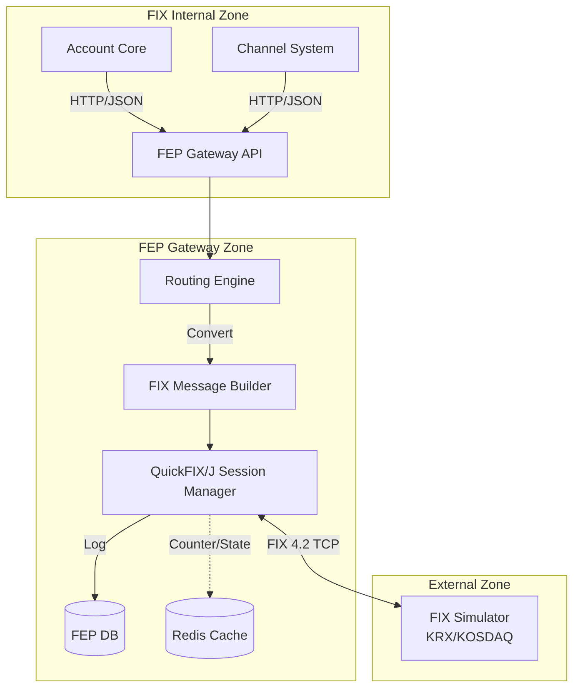

# FEP Gateway (Internal) — 시스템 아키텍처 (v2.0 — FIX 4.2)

FEP Gateway는 내부 시스템(Channel, Account)과 FIX Simulator(KRX/KOSDAQ 대외계)를 연결하는 **중계 관문(Gateway)** 이다.
내부 표준 규격(JSON/HTTP)을 FIX 4.2 프로토콜(QuickFIX/J TCP)으로 변환하고, 세션/보안 채널을 관리한다.

---

## 1. 시스템 구성도 (System Architecture)

---

## 2. 핵심 컴포넌트 (Key Components)

### 2.1 Routing Engine (라우팅 엔진)
- 주문 요청의 **시장(SecurityExchange, Tag 207)** 와 **종목 코드(Symbol, Tag 55)** 를 기반으로 대상 FIX Session을 결정한다.
- **로드밸런싱**: 동일 시장에 대해 다중 FIX Session(Active-Active)을 지원한다.
- **장애 우회**: 주 Session 장애 시 자동 예비 Session 전환(Circuit Breaker).

### 2.2 FIX Message Builder (FIX 메시지 빌더)
- **JSON ↔ FIX 4.2 메시지** 변환을 담당한다.
  - 주문: `NewOrderSingle` (MsgType=D, Tag 35=D)
  - 체결: `ExecutionReport` (MsgType=8, Tag 35=8)
  - 취소: `OrderCancelRequest` (MsgType=F, Tag 35=F)
- FIX Tag 매핑: Tag 11(ClOrdID), Tag 55(Symbol), Tag 54(Side), Tag 38(OrderQty), Tag 44(Price), Tag 40(OrdType), Tag 207(SecurityExchange).

### 2.3 QuickFIX/J Session Manager (연결 관리자)
- FIX Simulator와의 **FIX 4.2 TCP 소켓 연결**을 맺고 유지(Keep-Alive).
- **Session Pool**: SENDER_COMP_ID/TARGET_COMP_ID 기반 세션 풀 관리.
- **Health Check**: 주기적으로 `Heartbeat` (MsgType=0) 전송하여 회선 상태 점검.

### 2.4 TLS Credential Management (보안 모듈)
- FIX 세션 인증에 필요한 **TLS_CERT / LOGON_PASSWORD / ADMIN_TOKEN**을 PKI/CA 기반으로 관리.
- FIX Logon(MsgType=A): `Username`(Tag 553) + `Password`(Tag 554) + TLS 코드인증.
- MAC/PIN Block 계산 없음 — FIX 4.2는 트랜스포트 계층 TLS로 무결성 보장.

---

## 3. 데이터 흐름 (Order Flow)

1.  **Request Ingress**:
    *   Account Core가 `POST /fep/orders` 호출 (JSON, `symbol: "005930"`, `side: "BUY"`).
2.  **Routing**:
    *   `SecurityExchange` 라우팅 규칙 조회 → `KRX_FIX42_v1` FIX Session 매핑.
3.  **Translation**:
    *   JSON 필드를 FIX 4.2 `NewOrderSingle` Tag 매핑으로 변환.
4.  **Security**:
    *   **[FIX Logon]** TLS 핸드셰크 + Logon(MsgType=A) 시 `Password`(Tag 554) 기반 세션 인증.
    *   **[TLS]** 모든 FIX 메시지는 TLS로 엔드-투-엔드 암호화 또는 무결성 보장.
5.  **Outbound (선행 조건 검증)**:
    *   QuickFIX/J Session Manager는 `SessionState`가 `LOGGED_ON`인 Session만 풀에서 선택.
    *   **[Circuit Breaker 확인]** `fep_circuit_breaker_state.state`를 조회. `OPEN`이면 RC=9098로 fast-fail. `HALF_OPEN`이면 제한적 통과.
    *   **[Session 상태 확인]** Session이 `LOGGED_ON`이어야 `NewOrderSingle` 전송. 켜지 않은 Session으로 전송 시 RC=9999 반환.
    *   검증 통과 후 FIX 메시지 전송.
6.  **Response Handling**:
    *   `ExecutionReport`(MsgType=8) 수신 → `ExecType`(Tag 150) 판정  
      - `2`(FILL) → ORDER_FILLED  
      - `8`(REJECTED) → ORDER_REJECTED
    *   성공 시 JSON 변환.
7.  **Reply Egress**:
    *   Account Core에게 최종 결과(`200 OK`) 반환.

### 3.1 오류 경로 (Error Paths)

| 발생 지점 | 오류 조건 | Gateway 처리 | Core 응답 코드 |
| --- | --- | --- | --- |
| Step 2 (Routing) | 매칭 규칙 없음 | 즉시 거절 | `RC=9001 NO_ROUTE` |
| Step 5 (Circuit Breaker) | state = OPEN | Fast-fail | `RC=9098 CIRCUIT_OPEN` |
| Step 5 (Pool) | 유휠 Session 없음 | 대기 후 Timeout | `RC=9002 POOL_EXHAUSTED` |
| Step 5 (Session) | Session 미로그인 | QuickFIX/J 자동 Logon 재시도 → 성공 시 원래 주문 재전송. 실패 시 Core에게 반환 | `RC=9003 NOT_LOGGED_ON` |
| Step 5 (Read Timeout) | FIX Simulator 무응답 | Timeout 처리, CB failure++ | `RC=9004 TIMEOUT` |
| Step 6 (Session) | ExecType=REJECTED | 거절 처리 | `RC=9097 ORDER_REJECTED` |

---
