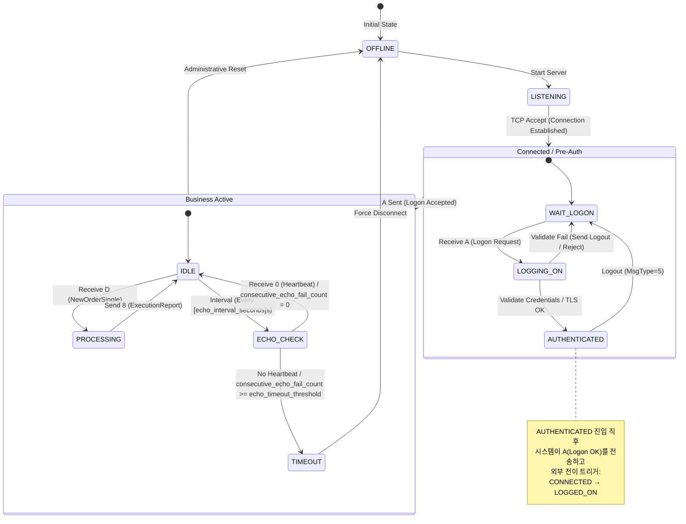
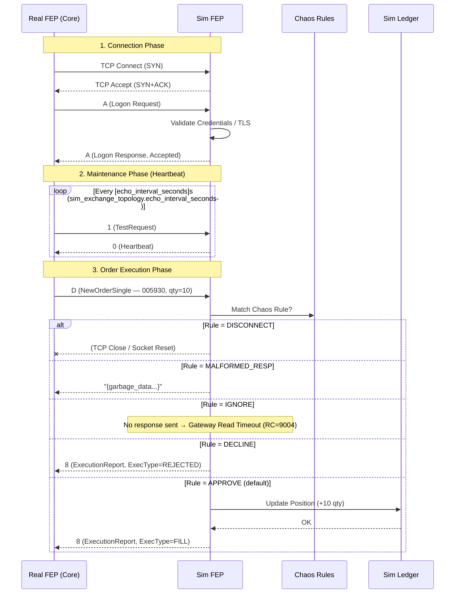

# FIX Simulator & Sim Counterpart FEP — 상태 전이 모델 (v2.0)

이 문서는 **FEP (Gateway) ↔ FIX Simulator (Counterpart)** 간의 **프로토콜 상태 전이 (Connection State)** 와 비즈니스 처리 흐름을 정의한다.

---

## 1. FEP 연결 상태 (Connectivity State Machine)

단순한 요청 처리가 아니라, **로그온(Logon) → 하트비트(Heartbeat/Idle) → 거래(Active) → 로그아웃(Logout)** 과정을 시뮬레이션한다.

> **`[echo_interval_seconds]` 파라미터 설명**: Simulator는 Gateway의 `fep_connections.keep_alive_interval` DB 값을 직접 읽을 수 없다. Simulator의 TIMEOUT 판단은 오직 `consecutive_echo_fail_count >= echo_timeout_threshold`로만 이루어진다. Heartbeat 발송 주기는 **`sim_exchange_topology.echo_interval_seconds`** 컨럼에 기관별로 저장되며(기본값 30초), 배포 시 Gateway의 `keep_alive_interval`과 일치시키는 것이 운영 원칙이다. (`echo_timeout_threshold`는 `sim_fep_connectivity.echo_timeout_threshold` 컨럼으로 기관별 설정 가능)

---

## 2. 메시지 처리 흐름 (Message Processing Flow)

FEP 간 메시지 교환 시 **Protocol Handshake**와 **Business Logic**의 분리를 보여준다.

---

## 3. 프로토콜별 메시지 타입 비교

| 메시지 구분 | FIX 4.2 (Tag 35) | HTTP/REST (OpenAPI) | 비고 |
| --- | --- | --- | --- |
| **로그온 (Logon)** | `A` Logon | `POST /v1/auth/login` | TLS + 세션 인증 |
| **로그아웃 (Logout)** | `5` Logout | `DELETE /v1/auth/logout` | |
| **Heartbeat (연결 확인)** | `0` Heartbeat / `1` TestRequest | `GET /health` | 연결 유지 |
| **주문 (NewOrder)** | `D` NewOrderSingle / `8` ExecutionReport | `POST /v1/orders` | |
| **취소 (Cancel)** | `F` OrderCancelRequest / `9` OrderCancelReject | `DELETE /v1/orders/{id}` | |
