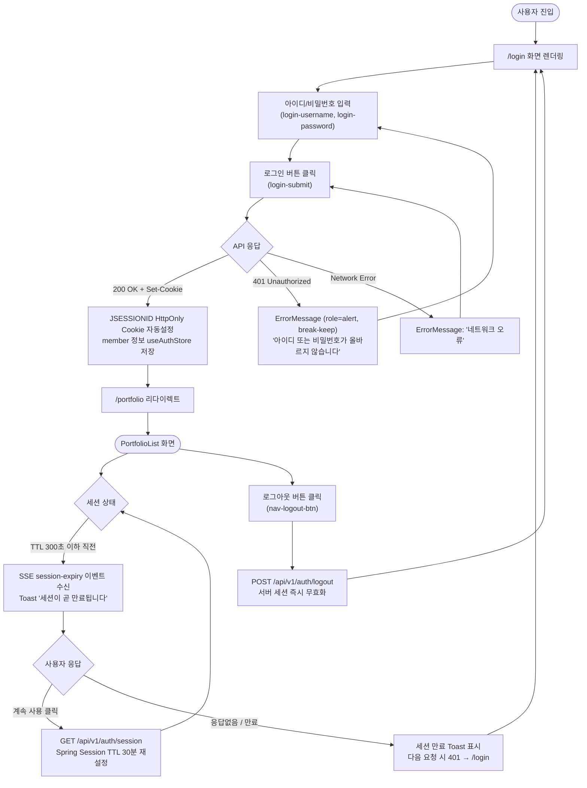
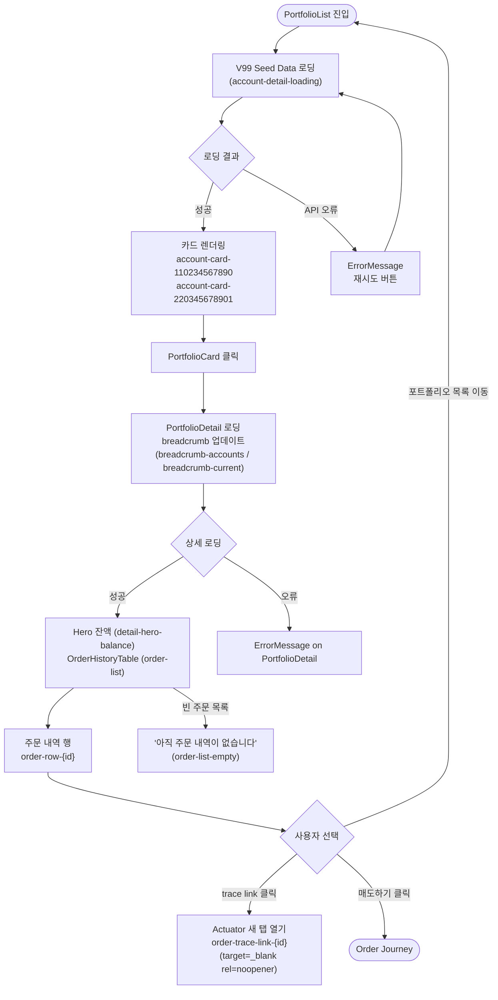
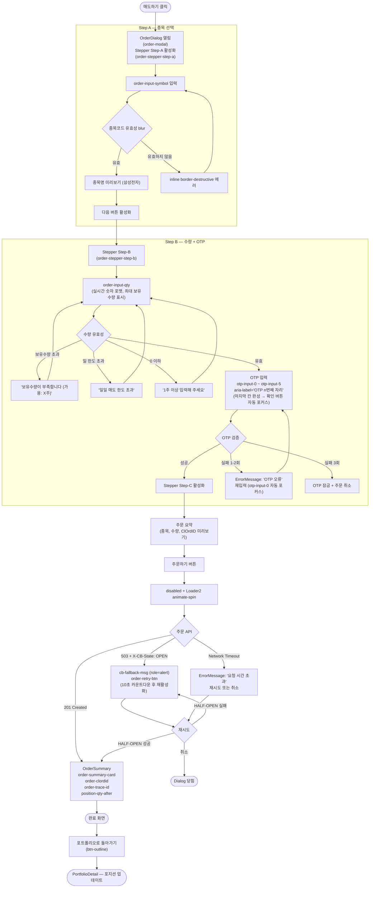
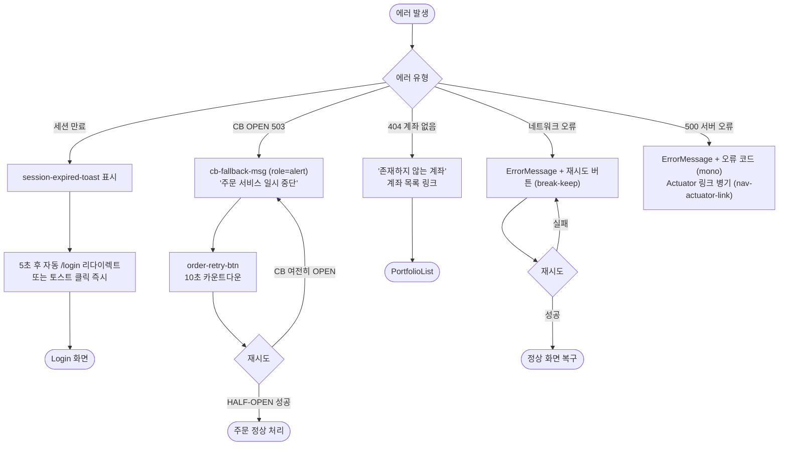

# UX Design Specification FIX

**Author:** yeongjae
**Date:** 2026-02-20

---

## Executive Summary

### Project Vision

FIX UI is a demonstration layer for a Korean bank-affiliated securities exchange simulator (은행계 증권사). Its primary purpose is to make backend engineering decisions visible and explainable during technical interviews. The UI enables live walk-throughs of securities domain flows — authentication, order state machines, real-time notifications — without requiring evaluators to read source code directly.

The UI is not an end-user product. It is a structured portfolio artifact where every design decision either proves a backend claim or enables a narrative during a 5-minute screenshare demo.

### Target Users

**yeongjae (Demonstrator)**
Technical expert. Uses the 5-screen React app during live screenshare (~5 min demo window) to narrate architectural decisions. Needs: smooth flow without unexpected errors, Korean securities vocabulary to drive narrative, and ability to trigger error states on demand to demonstrate resilience patterns.

**Securities Firm Interviewer Track — Evaluator A (Bank-affiliated: KB증권/신한투자증권)**
Mental model: "이 시스템이 리테일 증권사 내부 시스템처럼 보이는가?" Looks for: Korean-language order error messages, masked account numbers (계좌번호 마스킹), step-up OTP UI, Order Book 체결 로직, KRX/금융투자협회 준수 구조. Success signal: recognizes the 체널계/계정계/대외계 3계층 아키텍처 vocabulary used at Korean bank-affiliated securities firms.

**FinTech Interviewer Track — Evaluator B**
Mental model: "Is this well-engineered React?" Looks for: clean component structure, CI badge passing, GitHub Pages API Docs accessible at `https://<org>.github.io/<repo>/`, SSE EventSource visible in Network tab, no Document-type requests during modal transitions. Success signal: can independently verify architectural claims within 5 minutes using Browser DevTools.

### Key Design Challenges

1. **Domain authenticity vs. demo efficiency:** 한국 은행계 증권사 앱의 실제 주문 플로우(OTP 단계별 진행, 보유수량 검증, Order Book 체결)를 충분히 모사하면서도, 시연 중 30초 이내에 주문을 완료할 수 있어야 한다.

2. **Dual-audience information hierarchy:** 같은 스크린이 Bank interviewer에게는 보안 패턴(마스킹, OTP, 세션 만료 메시지)을, FinTech interviewer에게는 컴포넌트 구조와 상태 관리 패턴을 동시에 전달해야 한다.

3. **Error state as portfolio proof:** 보유수량 부족, OTP 만료, 세션 만료, FEP 장애 에러는 단순한 방어 코드가 아니라 백엔드 계약(FR-54, NFR-S5, NFR-R2)이 동작함을 시각적으로 증명해야 한다. 에러 UX가 허술하면 백엔드 신뢰성 주장이 약해진다.

4. **Navigation & routing clarity:** Order Flow의 3단계(A→B→C)는 URL 변경 없는 modal state로 관리되어야 한다 (NFR-UX1). 이 설계 결정이 "SPA 이해"를 증명하는 동시에 네트워크 탭에서 검증 가능한 패턴을 만든다.

### Design Opportunities

1. **DevTools-as-Second-Screen:** FIX의 실제 UX는 두 개의 화면이다 — 앱 UI + Browser DevTools. Network tab에서 SSE `EventSource` 연결이 visible하고, modal 전환 시 Document 타입 요청이 발생하지 않으며, Application tab에서 `HttpOnly; SameSite=Strict` 쿠키가 확인된다. FinTech interviewer는 이 두 번째 화면을 통해 아키텍처를 직접 검증한다.

2. **Portfolio-grade polish signals seniority:** 일관된 Korean banking typography/spacing, 정확한 원화(₩) 포맷, 가려진 계좌번호 패턴(123-\*\*-456789) — 이 디테일들이 "도메인을 이해하고 만든 사람"의 신호다.

3. **Dual demo script built into flows:** 5개 스크린이 PRD의 두 인터뷰어 트랙(Bank track 5단계 / FinTech track 5단계)에 직접 매핑된다. 스크린 전환 순서 자체가 시연 스크립트다.

4. **Empty state as production mindset:** 계좌 목록이 비어있을 때, 알림이 없을 때의 empty state 처리는 기능 구현이 아니라 프로덕션 배려를 보여주는 시그널이다. 씨드 데이터 안내 또는 "데이터가 없습니다" 메시지로 완성도를 높인다.

---

## Navigation & Routing Decisions

| Transition                         | Type                  | URL Change           | Rationale                          |
| ---------------------------------- | --------------------- | -------------------- | ---------------------------------- |
| Login → Portfolio List              | Full navigation       | `/portfolio`         | Session 수립 후 새 컨텍스트 진입   |
| Portfolio List → Position Detail   | Route navigation      | `/portfolio/:symbol` | 딥링크 가능, 뒤로가기 지원         |
| Position Detail → Order Flow (A)  | Modal overlay         | 없음                 | NFR-UX1 — no Document request      |
| Order Flow A → B → C              | Modal step transition | 없음                 | `useState`/`useReducer` — URL 불변 |
| Order Flow Close / Complete        | Modal dismiss         | `/portfolio/:symbol` 복귀 | 이전 컨텍스트 유지                 |
| Any screen → Notification Feed     | Route navigation      | `/notifications`     | 독립 화면                          |
| Session expiry (any screen)        | Forced redirect       | `/login`             | FR-05, NFR-S7                      |

**Order Flow implementation note:** React `useState` 또는 `useReducer`로 step(`A`\|`B`\|`C`) 관리. `react-router-dom` route 변경 없음. Browser DevTools Network tab에서 modal 전환 시 Document 타입 요청 0건 — NFR-UX1 검증 수단.

---

## Loading State Behaviors

| Screen / Action          | Loading Trigger                 | UX Behavior                                                 | Max Duration |
| ------------------------ | ------------------------------- | ----------------------------------------------------------- | ------------ |
| Login submit             | `POST /api/v1/auth/login`                       | 버튼 비활성화 + spinner                                     | p95 500ms    |
| Portfolio List load      | `GET /api/v1/portfolio`                         | skeleton placeholder                                        | p95 500ms    |
| Order Prepare            | `POST /api/v1/orders/sessions`                  | 버튼 비활성화 + spinner                                     | p95 1,000ms  |
| OTP input (6자리 완성)   | 자동 또는 수동 submit           | 즉각 피드백, 버튼 비활성화                                  | p95 500ms    |
| Order Execute            | `POST /api/v1/orders/sessions/{sessionId}/execute` | "주문 체결 중입니다" + 버튼 비활성화                             | p95 1,000ms  |
| Circuit Breaker fallback | OPEN state response             | RC=9098: "대외 연결 회선이 일시 차단 중입니다. 잠시 후 다시 시도해 주세요." / RC=9004: "대외 기관 응답 시간이 초과되었습니다." | 즉시         |
| SSE connection           | `GET /api/v1/notifications/stream`              | 연결 indicator (선택)                                       | —            |

**Double-submit prevention:** Order Execute 버튼은 submit 후 응답 수신까지 완전히 비활성화. FR-20 idempotency(ClOrdID)와 함께 이중 주문 방지.

---

## Screen Validation Matrix

| Screen            | Happy Path                                     | Critical Error State                                                                          |
| ----------------- | ---------------------------------------------- | --------------------------------------------------------------------------------------------- |
| Login             | 자격증명 입력 → 세션 생성 → Portfolio List 이동 | 잘못된 비밀번호 → 에러 메시지 (계정 잠금 카운터 노출 금지)                                    |
| Portfolio List    | 포지션 목록 로드 → 종목별 보유수량 표시        | 세션 만료 → 로그인 화면 redirect (401)                                                        |
| Order Flow A      | 종목/수량 입력 → OTP 발송 성공 → Step B        | 보유수량 부족 → "보유수량이 부족합니다. 가용수량: X주 / 주문수량: Y주"                        |
| Order Flow B      | OTP 6자리 입력 → 검증 성공 → Step C            | OTP 만료 (600초) → "주문 세션이 만료되었습니다. 주문 정보를 다시 입력해 주세요." + [처음으로] |
| Order Flow C      | 주문 체결 → ClOrdID 표시 + 포지션 업데이트     | FEP 장애 → Gateway CB OPEN(RC=9098) → "대외 연결 회선이 일시 차단 중입니다."                 |
| Account Detail    | 계좌 상세 + 최근 주문 내역                     | 빈 주문 내역 → empty state 메시지                                                             |
| Notification Feed | SSE 연결 → 실시간 알림 표시                    | SSE 연결 끊김 → 3초 내 자동 재연결 (NFR-UX2) / 연결 중 indicator                              |

---

## Core User Experience

### Defining Experience

FIX의 핵심 경험은 주문 플로우 완주다. 주문 modal(A→B→C)은 FIX가 주장하는 모든 백엔드 결정을 단 하나의 연속된 사용자 행동으로 증명한다: 포지션 수량 검증 → OTP 단계인증 → 원자적 포지션 기록 → 실시간 체결 알림 도착. 주문 플로우가 매끄럽게 완주되는 순간, FIX의 포트폴리오 가치가 전달된다.

### Platform Strategy

Target platform: React Web (SPA), desktop browser, local Docker Compose environment. Primary interaction mode: mouse + keyboard. Screenshare-optimized layout — content visible at 1080p without scrolling during key demo moments. React Native is Phase 2 (post-MVP Growth scope).

### Effortless Interactions

1. **OTP auto-submit:** 6자리 숫자 입력 완성 시 수동 "확인" 버튼 없이 자동 검증 진행 — 한국 모바일 뱅킹 표준 UX 패턴과 동일.

2. **Post-order notification:** 주문 체결 modal의 ClOrdID + FILLED 표시와 동시 또는 직전에 Notification Feed에 알림 항목 생성 (SSE 실시간 전달).

3. **Zero-config startup:** `docker compose up` → 브라우저 → 로그인 — 별도 설정 없이 3단계로 데모 준비 완료.

4. **Demo seed data (자동 설정):** Flyway `R__seed_data.sql` — `docker compose up` 시 자동 실행. 포지션: 005930 삼성전자 500주 (`user` 계정), 현금 ₩5,000,000, 매도 한도 500주/일. Admin 계정: `admin` / `Admin1234!` (FEP Chaos 조작 전용). README Quick Start에 자격증명 명시.

### Critical Success Moments

1. **주문 체결 화면:** ClOrdID + FILLED 상태 + 포지션 업데이트 표시 → "이 시스템이 실제로 주문을 체결한다"는 증거.

2. **한국어 에러 메시지:** 보유수량 부족 시 정확한 수량 포함 에러 → "도메인 어휘를 이해하고 만든 사람"의 신호.

3. **DevTools 검증 가능성:** Network tab에서 modal 전환 중 Document 요청 0건, SSE EventSource 연결 유지 → NFR-UX1, UX2 실제 구현 확인.

4. **Circuit Breaker 즉시 fallback:** FEP 장애 시나리오에서 fallback 응답이 지연 없이 도착 → "Resilience4j 설정이 올바르다"는 라이브 증명.

### Experience Principles

1. **Backend claims, UX-proven:** 모든 UX 결정은 최소 하나의 백엔드 아키텍처 주장을 눈에 보이게 만들어야 한다.

2. **Korean securities vocabulary first:** 에러 메시지, 레이블, 안내 문구는 한국 은행계 증권사 서비스의 실제 어휘를 사용한다.

3. **Demo-path optimization:** 로그인부터 주문 체결까지 10 actions 이내, 3분 이내. 최소 데모 경로: 아이디 입력 → 비밀번호 입력 → 로그인(3) → 매수/매도 클릭(4) → 종목코드 입력 → 수량 입력 → 다음(7) → OTP 6자리 auto-submit(8) → FILLED 확인(9).

4. **Failure states are features:** 에러 화면은 방어 코드가 아니라 포트폴리오 증거물이다. 보유수량 부족, OTP 만료, CB fallback은 설계된 demo 포인트다.

### Architecture Claim-to-Screen Mapping

| 아키텍처 주장                   | 증명 화면                  | 가시적 증거                         | E2E Selector                                  |
| ------------------------------- | -------------------------- | ----------------------------------- | --------------------------------------------- |
| Pessimistic locking (포지션 동시체결) | Order Flow C            | 보유수량 일관성 — 음수 발생 없음    | `[data-testid="position-qty-after"]` ≥ 0      |
| Order Book 체결 + Position Ledger | Order Flow C            | ClOrdID + FILLED + 포지션 업데이트 | `[data-testid="order-clordid"]` 존재           |
| Step-up OTP authentication      | Order Flow B            | OTP 입력 단계가 주문 실행 전 강제됨 | `[data-testid="otp-input"]` 존재              |
| Session security                | 세션 만료 에러             | 401 → 로그인 화면 redirect          | URL = `/login`                                |
| FEP Gateway CB (기관별 임계치)  | Order Flow C (FEP 장애) | RC=9098 fallback 메시지 즉시 표시 + `/actuator/circuitbreakers`에서 OPEN 상태 확인 가능 | `[data-testid="cb-fallback-msg"]`             |
| FIX 4.2 프로토콜 변환          | Order Flow C (완료)     | trace ID + FEP Gateway `fep_order_log` 연결 — FinTech interviewer가 "FIX 4.2 뉴오더싱글 필드 변환이 보이네"를 인지 | `[data-testid="order-trace-id"]` 존재      |
| SSE real-time notification      | Notification Feed          | 주문 체결 후 알림 자동 표시         | `[data-testid="notification-item"]` count > 0 |
| Idempotency (ClOrdID)           | Order Flow C            | 동일 ClOrdID 재시도 시 동일 결과   | response `clOrdID` 동일                    |

### Accessibility Minimum Standards

- `<label htmlFor>` 모든 form 입력 필드에 필수
- OTP 입력: `aria-label="인증번호 {n}번째 자리"` (n=1~6)
- 에러 메시지: `role="alert"` live region — 스크린리더 즉시 읽기
- 로딩 버튼: `aria-busy="true"` + `aria-disabled="true"`

### `data-testid` Naming Convention

Pattern: `{screen}-{element}-{variant?}`

```
login-submit-btn          portfolio-list-item (반복)
order-qty-input           order-otp-input
order-clordid             position-qty-after
cb-fallback-msg           notification-item (반복)
session-error-msg         account-detail-position
```

**Note:** `data-testid` attributes are included in all builds (including production). No `NODE_ENV` conditional stripping — portfolio project, always present.

---

## Desired Emotional Response

### Primary Emotional Goals

FIX의 감정 설계 대상은 일반 사용자가 아니라 기술 면접관과 시연자(yeongjae)다.

**면접관 (Evaluator):**

- **Trust before reading code:** README와 UI만으로 "이 사람이 실제로 이해하고 만들었다"는 신뢰가 형성되어야 한다.
- **Domain recognition (Bank track):** 한국어 에러 메시지, 마스킹 패턴, OTP 단계 — "이 어휘와 패턴을 나는 안다"는 인정의 감정.
- **Pleasant surprise:** 기대치를 상회하는 완성도에서 오는 긍정적 놀라움. 구체적 트리거:
  1. `docker compose up` 하나로 4개 백엔드 서비스 + MySQL + Redis (+Vault/vault-init)가 120초 이내 준비 완료 — "설정 없이 바로 되네?"
  2. `https://<org>.github.io/<repo>/`에서 Channel/CoreBank/FEP Gateway/FEP Simulator API 문서 selector가 즉시 확인됨 — "포트폴리오인데 이 수준까지?"
  3. 보유수량 부족 에러가 `"보유수량이 부족합니다. 가용수량: 500주 / 주문수량: 600주"` 형식 — "한국 증권사 시스템이랑 똑같네"
- **Confidence to advance:** "이 사람과 다음 단계 인터뷰를 진행하고 싶다."

**yeongjae (Demonstrator):**

- **Prepared confidence:** 어떤 질문이 와도 코드와 UI로 즉시 답할 수 있다는 통제감.

### Emotional Journey Mapping

| 단계                                     | 감정 목표         | 설계 수단                                      |
| ---------------------------------------- | ----------------- | ---------------------------------------------- |
| 첫 진입 (`docker compose up` → 브라우저) | 기대감, 호기심    | 깔끔한 로그인 화면, 한국어 어휘                |
| 로그인 성공                              | 안도, 신뢰 시작   | 즉각적 세션 응답, HttpOnly 쿠키                |
| 계좌 목록 확인                           | 인정 (Bank track) | 마스킹된 계좌번호, 원화 포맷                   |
| 주문 체결 완주                         | 확신, 놀라움      | ClOrdID, SSE 체결 알림 도착                        |
| 에러 상태 경험                           | 신뢰 강화         | 한국어 에러, 정확한 보유수량 표시                  |
| DevTools 확인                            | 전문성 인정       | SSE stream, no Document reload                 |
| Curiosity trigger 활성화                 | "더 알고 싶다"    | FEP 장애 버튼, trace ID, Actuator 링크         |
| 시연 종료 후                             | 심화 질문 유도    | CB, ledger, locking 설명으로 자연스럽게 이어짐 |

### Micro-Emotions

- **Confidence over Confusion:** 모든 화면 전환이 예측 가능하고 설명 없이도 이해된다.
- **Trust over Skepticism:** 실제 동작하는 코드 + 통과하는 CI = 주장의 근거.
- **Accomplishment over Frustration:** 에러 상태조차 의도된 설계임이 명확하다.
- **Recognition over Isolation:** Bank interviewer는 자신의 언어로 시스템을 읽는다.
- **Calm through predictability:** 면접관이 시연을 보는 동안 yeongjae가 당황하거나 예상치 못한 에러를 만나지 않는다. Seed data, deterministic flows, pre-scripted error triggers 모두 Calm을 위한 설계다. 한국 은행 내부 시스템의 핵심 UX 감정은 안정감이다 — FIX도 그것을 모사한다.

### Design Implications

- **Trust → Korean vocabulary everywhere:** 에러 메시지, 레이블, 안내 문구가 한국 은행 내부 어휘를 사용할 때 Bank interviewer의 신뢰가 즉시 형성된다.
- **Pleasant surprise → Error states polished:** 에러 화면이 허술하면 기대치 상향이 무너진다. 에러도 설계된 경험이어야 한다.
- **Calm → Demo-path friction-free:** 시연자가 예상치 못한 오류로 당황하는 순간 신뢰가 손상된다. Seed data, auto-submit, deterministic flows.
- **Recognition → Domain-first design:** 기술 스펙 용어(REST, SSE)보다 도메인 용어(주문, 원장, 한도)가 UI에서 우선한다.
- **Curiosity → Intentional trigger UI:** FEP 장애 시뮬레이션 드롭다운(`data-testid="fep-chaos-select"`, ROLE_ADMIN 표시), 주문 체결 화면의 `traceparent` trace ID 표시, Navigation의 Actuator 링크 — 면접관이 스스로 질문하게 만드는 설계된 대화 진입점.

### Emotional Design Principles

1. **신뢰는 코드 이전에 형성된다:** UI의 첫인상이 기술적 깊이보다 먼저 면접관의 판단에 영향을 준다.

2. **에러 감정도 포트폴리오다:** 실패 상태에서도 면접관이 "의도된 설계"를 느껴야 한다. Panic이 아닌 Proof.

3. **두 청중의 인정 신호는 다르다:** Bank interviewer = Korean vocabulary. FinTech interviewer = DevTools pattern. 두 신호를 동시에 설계한다.

4. **Curiosity triggers are designed, not accidental:** 면접관이 "이게 뭐죠?"라고 자연스럽게 묻게 만드는 UI 요소를 의도적으로 배치한다. ⚡ FEP 장애 시뮬레이션 드롭다운, Actuator 대시보드 링크, 주문 체결 화면의 trace ID — 이 세 개의 curiosity trigger는 설계된 대화 진입점이다.

5. **Emotional success = PRD success:** Emotional design 목표(Trust, Recognition, Pleasant Surprise, Curiosity, Calm)가 달성되면 PRD Success Criteria가 자동으로 달성된다: Trust → "within 4 weeks, at least one interviewer asks about a specific implementation detail"; Curiosity → "technical interview invitation within 8 weeks"; Pleasant Surprise → "dual-audience README answers first 3 questions without scrolling." 감정 설계는 장식이 아니라 비즈니스 성과의 전달 메커니즘이다.

---

## UX Pattern Analysis & Inspiration

### Face of FIX: Touch Sequence

면접관이 FIX를 처음 만나는 접촉 순서:

```
1. GitHub README       → 첫인상 (Pre-demo UX)
2. docker compose up   → 실행 경험 (Zero-config)
3. App UI              → 도메인 경험 (In-app UX)
4. Swagger UI          → 기술 검증 (API exploration)
5. DevTools / Actuator → 심화 탐색 (Curiosity triggers)
```

이 Touch Sequence 전체가 FIX의 UX 설계 범위다. 단일 화면이 아니라 **면접관의 전체 여정**이 포트폴리오다.

### Dual Funnel: 청중별 진입 경로

```
Bank Interviewer Track
  이력서/LinkedIn → GitHub README → docker compose up
  → App UI (Korean domain 확인) → Error states → 심화 질문

FinTech/General Interviewer Track
  GitHub profile → Repository → README → CI Badge
  → Swagger UI → App UI → DevTools → Actuator → trace ID → 심화 질문
```

각 영감 소스는 이 두 funnel의 특정 접점을 지원하도록 선택됐다.

### Inspiring Products Analysis

#### Pre-demo UX

**GitHub Portfolio Repository**

- **핵심 문제 해결:** 면접관이 코드를 실행하기 전에 "이 사람이 무엇을 만들었는가"를 30초 안에 파악할 수 있게 한다.
- **주요 UX 특성:**
  - 최상단 Badge row: CI 상태, 커버리지 %, 기술 스택 아이콘 — fold above of README
  - Architecture Diagram이 스크롤 없이 첫 화면에 노출
  - "5분만에 실행" Quick Start 섹션 — docker 명령어가 묻히지 않고 전면 배치
- **FIX 적용 접점:** FinTech track funnel 2번째 접점 (CI Badge), 두 track 모두의 첫 접점

#### In-app UX

**토스 (Toss)** — Bank Track Primary Reference

- **핵심 문제 해결:** 복잡한 금융 작업을 단계별 모달로 분해해 인지 부하를 최소화한다.
- **주요 UX 특성:**
  - 주문 플로우: 종목/수량 입력 → OTP 확인 → 체결, 3-step 모달 (FIX A→B→C의 직접 참조)
  - OTP 6자리 입력 후 즉시 자동 submit — 사용자 확인 버튼 없음
  - 에러 메시지: 원인 + 현황 동시 노출 형식
  - 주문 체결 후 Summary Card: 종목 + 수량 + ClOrdID 구조
  - 주문 실패 시 "다시 주문하기" Retry CTA 제공
  - 금액 포맷: ₩1,000,000 (원화 기호 + 천 단위 콤마)
- **FIX 적용 접점:** Bank/FinTech 양 track funnel — 주문 핵심 플로우

**카카오뱅크 (KakaoBank)** — Bank Track Domain Reference

- **핵심 문제 해결:** 인터넷 은행이면서도 '은행다움'을 유지 — 도메인 어휘와 패턴이 기존 은행 직원에게 즉각적 신뢰를 준다.
- **주요 UX 특성:**
  - 계좌번호 마스킹: `110-***-123456` 패턴
  - 계좌 유형 구분 배지: 주식매매 / CMA / 위탁계좌 — PortfolioList 화면에서 유형 식별
  - 매도 한도 표시: 포지션 + 오늘 매도 가능 수량 동시 노출
  - 날짜별 주문 내역 그루핑
  - HttpOnly 쿠키 기반 세션 + 세션 만료 Toast 경고 → 자동 로그아웃
  - 주문 실패 시 "다시 주문하기" CTA 제공
- **FIX 적용 접점:** Bank track funnel 전용 — 도메인 어휘 및 계좌 화면

**Stripe Dashboard** — FinTech Track Primary Reference

- **핵심 문제 해결:** 개발자 도구이면서도 비기술 팀원도 읽을 수 있는 UX. 기술적 투명성을 미덕으로 만든다.
- **주요 UX 특성:**
  - Request ID / Payment Intent ID 등 기술 식별자가 UI에 항상 노출
  - 웹훅 이벤트 실시간 스트림 — SSE 패턴의 UI 표현법
  - 상태 배지: `succeeded` / `failed` / `pending` — 색상 + 레이블 조합
  - Monospace 폰트로 ID/코드값 구분
  - 에러 시 `error_code` + `message` 동시 노출
  - 주문 실패 시 "재시도" 버튼 항상 제공
- **FIX 적용 접점:** FinTech track funnel — DevTools, trace ID, SSE stream

**Stripe API Docs** — FinTech Track Developer Experience Reference

- **핵심 문제 해결:** API 문서 자체가 제품 경험이다. "Try it out"이 마찰 없이 동작한다.
- **주요 UX 특성:**
  - 좌측 사이드바 네비게이션 + 우측 코드 예시 두 컬럼
  - 모든 파라미터에 realistic example value pre-fill
  - 코드 예시가 실제 동작하는 request 형식
- **FIX 적용 접점:** FinTech track funnel — Swagger "Try it out" 경험

**Spring Boot Actuator UI** — System Transparency Reference

- **핵심 문제 해결:** 별도 대시보드 없이 브라우저 URL 하나로 전체 시스템 상태를 투명하게 보여준다 (zero-config system transparency).
- **주요 UX 특성:**
  - `/actuator/health`: DB, Redis, Circuit Breaker 상태를 단일 JSON으로 노출
  - `/actuator/metrics`: JVM, HTTP 요청 수, 응답 시간 실시간 확인
  - 별도 설치/설정 없이 즉시 사용 가능
- **FIX 적용 접점:** 두 track 모두 — Curiosity trigger (P1 수준)

### Transferable UX Patterns

#### Navigation Patterns

- **단계형 모달 플로우 (토스):** 주문 A→B→C를 페이지 이동 없이 모달 스텝으로 처리. `useReducer`로 step 상태 관리, URL 변경 없음 → FIX 주문 플로우에 직접 적용
- **세션 만료 Toast (카카오뱅크):** 자동 로그아웃 전 Toast 경고 + 3초 후 자동 redirect → FIX session expiry → `/login` redirect
- **Actuator Deep-link:** Navigation에 외부 링크(`target="_blank"`, `data-testid="nav-actuator-link"`)로 단순 노출 — iframe 임베드는 CORS 이슈로 제외

#### Interaction Patterns

- **OTP 자동 submit (토스):** 6자리 입력 완료 시 submit 버튼 없이 즉시 API 호출 → `data-testid="otp-input"`
- **실시간 SSE 스트림 (Stripe Dashboard):** 주문 상태 변화를 UI에 push. `EventSource` 사용 시 반드시 cleanup function에서 `EventSource.close()` 호출 필수 — 미구현 시 DevTools 화면에서 즉시 노출되는 버그
- **이중 제출 방지 (토스/Stripe):** 처리 중 버튼 `disabled` + `aria-busy="true"` → FIX 주문 submit 버튼
- **Retry CTA (토스/카카오뱅크/Stripe):** 실패 케이스별 명확한 재시도 경로 제공:
  - 보유수량 부족 → "수량 수정" (Step B로 돌아가기, `useReducer` step reset)
  - OTP 오류 → "OTP 재입력" (Step C 재렌더)
  - CB 발동 → "나중에 다시 시도하세요" Toast + CB 상태 설명
- **Zero-friction API exploration (Stripe API Docs):** DTO에 `@Parameter(example = "110-234-567890")`, `@Schema(example = "demo")` 어노테이션 추가 — Swagger "Try it out" 클릭 시 실제 Seed data 값이 자동 입력됨 (코드 2-3줄, 구현 비용 최소)
- **Structured Error Response Format (Stripe):** 에러 응답 이중 구조 — `code`(영문, FinTech track용) + `message`(한국어, Bank track용) 동시 포함:
  ```json
  {
    "error": {
      "code": "INSUFFICIENT_POSITION",
      "message": "보유수량이 부족합니다. 가용수량: 500주 / 주문수량: 600주"
    }
  }
  ```

#### Visual Patterns

- **기술 식별자 노출 (Stripe Dashboard):** 주문 체결 화면에 `traceparent` W3C 형식(`00-{traceId}-{spanId}-{flags}`) 노출 → `data-testid="order-trace-id"`. 면접관이 "OpenTelemetry까지 적용했구나"를 즉각 인지
- **Summary Card (토스 주문 체결):** Order C 화면에 종목 + 수량 + ClOrdID + trace ID를 Summary Card 형식(`data-testid="order-summary-card"`)으로 노출. 공유 버튼 대신 trace ID + SSE 확인 링크
- **상태 배지 (Stripe):** 주문 상태 color-coded badge — `완료`(green) / `실패`(red) / `처리중`(yellow)
- **원화 포맷 (토스/카카오뱅크):** ₩ symbol + 천 단위 comma 전체 일관 적용
- **계좌 마스킹 (카카오뱅크):** `110-***-123456` 형식
- **Monospace 폰트:** trace ID, 계좌번호, 참조번호에 system-font 스택 적용 — Google Fonts 의존성 없음, 로컬 Docker 환경 폰트 로드 실패 위험 없음:
  ```css
  font-family:
    ui-monospace, "Cascadia Code", "Source Code Pro", Menlo, monospace;
  ```
- **Transition spec:** 허용 transition은 `opacity 150ms ease, transform 150ms ease`만 적용. keyframe animation, bounce, spring 효과 금지 — screenshare 시 시각적 잡음 제거

### Anti-Patterns to Avoid

1. **Full-page reload for sub-operations:** SPA 신뢰도를 즉시 손상. 주문 플로우 중 Document reload 절대 금지.
2. **Generic English error messages:** `"Insufficient position"` 대신 `"보유수량이 부족합니다"` — Bank interviewer에게 도메인 외의 레이어가 보임
3. **기술 식별자 숨기기:** 참조번호, trace ID를 축약하거나 숨기면 Curiosity trigger가 사라지고 FinTech interviewer의 인정 신호가 끊김
4. **과도한 애니메이션:** `opacity/transform 150ms`를 초과하는 transition은 화면 공유 시 시각적 잡음. keyframe animation, bounce, spring 효과 금지
5. **Mobile-first 레이아웃:** FIX는 desktop screenshare 최적화. 좁은 카드 레이아웃, 햄버거 메뉴 = 잘못된 플랫폼 assumption
6. **Loading skeleton 남용:** FIX는 localhost Docker Compose — 실제 네트워크 지연 거의 없음. Skeleton shimmer는 "이 앱이 느리다"는 잘못된 인상을 줌. Spinner + max duration 타임아웃 패턴 사용 (Step 2 Loading State Behaviors 테이블과 일관성 유지)
7. **"Feature inventory UI":** 화면이 기능 체크리스트처럼 보이는 설계 — 예: 홈 화면에 "✅ JWT ✅ Redis ✅ CB" 배지 나열. 아키텍처 주장은 동작으로 증명되어야 함 (Step 3 Architecture Claim-to-Screen Mapping 참조)
8. **"기술 스택 나열식 포트폴리오":** README에서도, UI에서도 기능 목록 나열 금지. 대신 "이 시스템으로 이런 문제를 해결한다"는 서사를 화면으로 보여준다
9. **마케팅형 화면:** 광고 배너, 혜택 카드, 추천 상품 없음 — FIX 범위 외

### Design Inspiration Strategy

#### What to Adopt (직접 적용)

- **토스 3-step 주문 모달:** A(종목/수량) → B(주문 확인) → C(OTP) 플로우 구조 (`useReducer` 기반 step 관리)
- **OTP 자동 submit:** 6자리 완성 → 즉시 API 호출, 버튼 없음
- **카카오뱅크 도메인 어휘:** 주문, 매도, 매수, 포지션, 원장, 한도, 마스킹 패턴 전체 채택
- **Stripe 기술 식별자 노출:** Reference number, Trace ID (`traceparent` W3C 형식), Monospace 폰트
- **Retry CTA 패턴:** 실패 케이스 3개 × 재시도 경로 (토스/카카오뱅크/Stripe 공통)
- **Screen-as-Architecture-Proof:** 모든 아키텍처 주장은 대응하는 화면으로 증명 (Step 3 Architecture Claim-to-Screen Mapping과 일관)

#### What to Adapt (수정 적용)

- **토스 주문 체결 화면 → Summary Card:** 공유 버튼 제거, trace ID + SSE 확인 링크 추가 (`data-testid="order-summary-card"`)
- **Stripe 상태 배지:** `succeeded/failed/pending` → FIX 한국어 버전 `완료/실패/처리중` + 색상 유지
- **카카오뱅크 세션 만료 Modal → Toast:** Modal 팝업 제거, Toast + 3초 후 자동 redirect (데모 흐름 방해 최소화)
- **Stripe API Docs pre-fill → Springdoc DTO:** `@Parameter(example = "110-234-567890")`, `@Schema(example = "demo")` 어노테이션으로 Swagger "Try it out" UX 개선
- **Stripe SSE stream → Post-order notification:** SSE stream 시각화는 P1-P2 수준. `EventSource.close()` cleanup 필수

#### What to Avoid (명시적 제외)

- 토스/카카오뱅크의 마케팅 화면, 혜택 섹션 — FIX 범위 외
- Stripe의 복잡한 필터/검색 UI — FIX는 최소 기능 집합 데모
- Grafana 메트릭 시각화 패널 — 과설계, Actuator 외부 링크로 충분
- 모바일 네이티브 제스처 패턴 — FIX는 React Web desktop
- Skeleton shimmer 로딩 — localhost 환경에서 역효과

#### P0 / P1 / P2 Priority Layer

| 우선순위                         | 정의                          | 해당 패턴                                                                                                        |
| -------------------------------- | ----------------------------- | ---------------------------------------------------------------------------------------------------------------- |
| **P0** Demo-critical             | 없으면 데모가 안 됨           | 토스 3-step 모달, OTP auto-submit, Korean error messages, Summary Card, Retry CTA, 원화 포맷, 계좌 마스킹        |
| **P1** Portfolio-differentiating | 있으면 확실히 차별화          | traceparent 노출, Swagger pre-fill (`@Parameter`), Structured Error Response, Monospace 폰트, Actuator 외부 링크 |
| **P2** Curiosity-triggers        | 면접관이 질문을 유도하는 요소 | SSE 이벤트 스트림 패널, FEP chaos 드롭다운, CB 상태 배지                                                         |

**구현 복잡도 × 임팩트 테이블:**

| 패턴                         | 복잡도 | 임팩트  | 우선순위 |
| ---------------------------- | ------ | ------- | -------- |
| Korean error messages        | ★☆☆    | 🔴 높음 | P0       |
| OTP auto-submit              | ★☆☆    | 🔴 높음 | P0       |
| DTO `@Parameter(example)`    | ★☆☆    | 🟡 중간 | P1       |
| Monospace 폰트 (CSS 1줄)     | ★☆☆    | 🟡 중간 | P1       |
| Actuator 외부 링크           | ★☆☆    | 🟡 중간 | P1       |
| Summary Card (주문 체결)     | ★★☆    | 🔴 높음 | P0       |
| traceparent 노출             | ★★☆    | 🟡 중간 | P1       |
| Retry CTA + useReducer reset | ★★☆    | 🔴 높음 | P0       |
| SSE 이벤트 패널              | ★★★    | 🟡 중간 | P2       |

#### Observable Signals (E2E 테스트 연결)

각 패턴의 달성 여부는 `data-testid`를 통해 자동화 테스트로 검증 가능:

| 패턴                   | `data-testid`                     | E2E 검증 |
| ---------------------- | --------------------------------- | -------- |
| 주문 체결 Summary Card | `order-summary-card`              | ✅       |
| traceparent 노출       | `order-trace-id`                  | ✅       |
| Retry CTA (보유수량 부족)  | `order-retry-btn`                 | ✅       |
| OTP auto-submit        | `otp-input` (6자리 완성 감지)     | ✅       |
| Korean error message   | `error-message`                   | ✅       |
| Actuator 링크          | `nav-actuator-link`               | ✅       |
| FEP chaos 드롭다운     | `fep-chaos-select`                | ✅       |
| CB fallback 메시지     | `cb-fallback-msg`                 | ✅       |
| 주문 ClOrdID            | `order-clordid`                   | ✅       |
| 포지션 수량           | `position-qty-after`              | ✅       |
| Swagger pre-fill       | Swagger UI (Playwright 접근 가능) | ⚠️       |

#### PRD↔Inspiration 매핑

| PRD 요구사항                   | 영감 소스                   | 채택 패턴                            | 우선순위 |
| ------------------------------ | --------------------------- | ------------------------------------ | -------- |
| FR-01 (로그인/OTP)             | 토스                        | OTP auto-submit                      | P0       |
| FR-03 (주문 플로우)            | 토스                        | 3-step 모달, Summary Card, Retry CTA | P0       |
| NFR-07 (Usability — 한국어 UX) | 카카오뱅크                  | 도메인 어휘, 마스킹, 원화 포맷       | P0       |
| NFR-08 (Developer Experience)  | Stripe Dashboard + API Docs | traceparent, Swagger pre-fill, SSE   | P1       |

#### data-testid Inventory (Step 5 기준)

> **Note:** 이 목록은 구현 진행에 따라 지속 업데이트된다. 각 항목은 출처 단계에서 최초 확정됨.

| `data-testid` 값              | 화면                         | 출처 단계      |
| ----------------------------- | ---------------------------- | -------------- |
| `order-clordid`               | Order C (체결)             | Step 3         |
| `cb-fallback-msg`             | Order C (CB 발동)          | Step 3         |
| `fep-chaos-select`            | Admin / FEP 제어             | Step 4         |

> **Q3 합의사항 — FEP Chaos 드롭다운 HTML 명세 (Phase 1 구현 기준):**
> ```html
> <select id="fep-chaos-select" data-testid="fep-chaos-select">
>   <option value="IGNORE" selected>IGNORE (정상)</option>
>   <option value="DISCONNECT" disabled>DISCONNECT (Phase 2)</option>
>   <option value="MALFORMED_RESP" disabled>MALFORMED_RESP (Phase 2)</option>
> </select>
> ```
> Phase 1에서는 IGNORE만 활성화. DISCONNECT/MALFORMED_RESP는 `disabled` 속성으로 UI에 노출하되 선택 불가.
> IGNORE 선택 시 FEP Simulator가 주문 수신을 무시 → Circuit Breaker OPEN 유발 → `cb-fallback-msg` 렌더.
| `order-trace-id`              | Order C (체결)             | Step 5 Round 1 |
| `nav-actuator-link`           | Navigation                   | Step 5 Round 2 |
| `order-retry-btn`             | Order (실패 상태)         | Step 5 Round 2 |
| `order-summary-card`          | Order C (체결)             | Step 5 Round 4 |
| `otp-input`                   | Order B (OTP)                | Step 5 Round 4 |
| `otp-input-{0~5}`             | Order B — 개별 OTP 칸    | Step 6 Round 1 |
| `error-message`               | 전체 에러 상태               | Step 5 Round 4 |
| `order-stepper-step-a`        | Order 모달 — Step A       | Step 6 Round 2 |
| `order-stepper-step-b`        | Order 모달 — Step B       | Step 6 Round 2 |
| `order-stepper-step-c`        | Order 모달 — Step C       | Step 6 Round 2 |
| `position-qty-after`          | Order C (체결후 포지션)   | Step 6 Round 3 |
| `portfolio-card-{symbol}`     | PortfolioList — 개별 포지션 카드 | Step 6 Round 2 |
| `order-modal`                 | Order 모달 컨테이너       | Step 6 Round 4 |
| `account-detail-{accountId}`  | PortfolioDetail 화면           | Step 6 Round 4 |
| `session-expired-toast`       | 세션 만료 Toast              | Step 6 Round 4 |
| `login-username`              | Login 화면                   | Step 7 Round 1 |
| `login-password`              | Login 화면                   | Step 7 Round 1 |
| `login-submit`                | Login 화면                   | Step 7 Round 1 |
| `account-detail-order-btn`    | PortfolioDetail — 매도 버튼    | Step 7 Round 1 |
| `order-input-symbol`          | Order-A — 종목코드 입력     | Step 7 Round 1 |
| `order-input-qty`             | Order-B — 수량 입력       | Step 7 Round 1 |
| `account-detail-loading`      | PortfolioDetail — 로딩 스피너  | Step 7 Round 4 |
| `order-list`                   | PortfolioDetail — 주문 내역    | Step 7 Round 4 |

---

## Design System Foundation

### Design System Choice

**선택: shadcn/ui + Tailwind CSS v4 (React 19 + Vite 7)**

### Rationale for Selection

1. **Bank track 도메인 감성 재현:** shadcn/ui 기본 컴포넌트는 clean, minimal 스타일로 카카오뱅크/토스 UI 패턴과 근접하다. Ant Design의 무거운 기본 스타일(~2MB 번들)보다 한국 금융 내부 도구 분위기를 내기 쉽고 번들도 가볍다.

2. **FinTech track 기술 신뢰 + NFR-10 Accessibility:** shadcn/ui는 Radix UI 기반으로 접근성(`aria-*`, keyboard navigation)이 내장 — Step 3 Accessibility minimum standards를 자동 충족하며 PRD NFR-10(Accessibility)을 직접 지원한다. Tailwind utility class가 코드 리뷰 시 "2025-2026 현대 React 생태계를 안다"는 신호를 준다.

3. **단독 개발자 효율:** Copy-paste 방식으로 필요한 컴포넌트만 추가 — 미사용 컴포넌트가 번들에 포함되지 않음. `antd` tree-shaking 불완전(~2MB) 대비 shadcn/ui 선택적 설치는 필요 컴포넌트만 수 KB. PRD NFR-03(Performance) 지원.

4. **포지셔닝:** 2025-2026년 기준 국내 백엔드 개발자 포트폴리오에서 MUI(Material Design 감성 — 한국 금융 도메인과 거리감, CSS specificity 충돌 이슈) 또는 Ant Design이 주류인 상황에서 shadcn/ui + Tailwind v4는 차별화 신호다.

5. **`data-testid` + 접근성 친화성:** Tailwind + shadcn/ui는 HTML attribute 직접 접근이 용이하여 Step 5에서 확정한 `data-testid` 인벤토리를 깔끔하게 적용 가능. PRD NFR-07(Usability), NFR-08(Developer Experience) 직접 지원.

### Implementation Approach

**프로젝트 초기화:**

```bash
npm create vite@latest fix-frontend -- --template react-ts
cd fix-frontend
npm install
npx shadcn@latest init
```

**`vite.config.ts` 설정:**

```ts
import { defineConfig } from "vite";
import react from "@vitejs/plugin-react";
import tailwindcss from "@tailwindcss/vite";
import path from "path";

export default defineConfig({
  plugins: [react(), tailwindcss()],
  resolve: {
    alias: { "@": path.resolve(__dirname, "./src") },
  },
});
```

> **Note:** `@tailwindcss/vite` 플러그인은 Tailwind v4의 Vite 통합 방식 — v3의 PostCSS 방식 대체. `@` alias는 shadcn/ui CLI가 생성하는 import 경로 필수 요건. Tailwind v4에서는 `tailwind.config.js` 없이 `@theme` 블록(CSS)으로 토큰 정의.

**컴포넌트 설치 (우선순위 순):**

```bash
# P0 — 데모 필수
npx shadcn@latest add button input dialog card badge
npm install sonner           # Toast (shadcn Toast 대체, v2.x)
npm install react-router     # SPA 라우팅 (v7)

# P1 — 차별화
npx shadcn@latest add table separator label

# P2 — 필요 시
npx shadcn@latest add sheet tooltip
```

**전체 의존성 전망:**

```json
{
  "dependencies": {
    "react": "^19.0.0",
    "react-dom": "^19.0.0",
    "react-router": "^7.13.0",
    "sonner": "^2.0.7",
    "lucide-react": "^0.575.0",
    "class-variance-authority": "^0.7.1",
    "clsx": "^2.1.1",
    "tailwind-merge": "^3.5.0"
  },
  "devDependencies": {
    "vite": "^7.3.1",
    "@vitejs/plugin-react": "^5.1.4",
    "@tailwindcss/vite": "^4.2.0",
    "tailwindcss": "^4.2.0",
    "typescript": "^5.9.3",
    "@axe-core/playwright": "^4.10.0"
  }
}
```

> `class-variance-authority`, `clsx`, `tailwind-merge`는 `npx shadcn@latest init` 시 자동 설치. 명시된 버전은 2026년 2월 22일 npm latest 기준.

### Customization Strategy

**색상 토큰 + 폰트 (`src/app.css` — Tailwind v4 `@theme`):**

```css
@theme {
  --color-primary: #003087; /* 네이비 — 한국 금융 신뢰감 (신한/SCB 계열) */
  --color-destructive: #dc2626; /* 에러/실패 */
  --color-success: #16a34a; /* 완료 */
  --color-warning: #d97706; /* 처리중 */
  --color-background: #f1f5f9; /* slate-100 */

  --font-sans:
    "Apple SD Gothic Neo", "맑은 고딕", "Malgun Gothic", system-ui,
    -apple-system, sans-serif;
  --font-mono:
    ui-monospace, "Cascadia Code", "Source Code Pro", Menlo, monospace;
}
```

> `--font-sans`: macOS/Windows 한국어 시스템 폰트 우선 — Google Fonts/Noto Sans KR CDN 의존성 없음 (Step 5 결정과 일관).
> `--font-mono`: trace ID, 계좌번호, 참조번호에 적용 (Step 5 Visual Patterns).

**디자인 원칙:**

- **다크모드: 명시적 비지원 (light-only)** — screenshare 환경 안전성, 구현 비용 대비 ROI 없음. `dark:` prefix 사용 금지
- **Spacing:** Tailwind 기본 spacing scale 사용 (4px 단위), 커스텀 spacing 토큰 추가 없음 — `p-[14px]` 같은 arbitrary value 금지
- **아이콘:** 텍스트 레이블 없는 독립 아이콘 금지 — 항상 텍스트 레이블과 함께 사용 (Step 3 Accessibility `<label htmlFor>` 원칙과 일관)
- **로딩 스피너:** `lucide-react Loader2` + Tailwind `animate-spin` 사용. **`animate-spin`은 Step 5 transition 제한의 허용 예외** (스피너 전용 keyframe, 다른 keyframe animation은 여전히 금지)
- **Transition:** `opacity 150ms ease, transform 150ms ease`만 허용 (Step 5 확정)

**커스텀 컴포넌트 (shadcn/ui에 없는 FIX 전용):**

| 컴포넌트              | 역할                                 | 핵심 테스트                        | `data-testid`                   |
| --------------------- | ------------------------------------ | ---------------------------------- | ------------------------------- |
| `OrderStepper`        | A→B→C 단계 표시                      | 현재 step 표시, step 진행          | `order-stepper-step-{a/b/c}`    |
| `PortfolioCard`         | 계좌번호 마스킹 + 포지션 표시        | `110-***-123456` 렌더링            | `account-card-{accountId}`      |
| `ErrorMessage`        | `role="alert"` + Korean error 포맷   | alert role presence, Korean text   | `error-message`                 |
| `OrderSummaryCard`    | 주문 체결 Summary Card               | ClOrdID + trace ID + 수량 표시      | `order-summary-card`            |
| `OTPInput`            | 6칸 분리 + 자동 포커스 + auto-submit | 6자리 완성 → API 호출 자동 trigger | `otp-input`, `otp-input-{0~5}`  |

> **Step 6/7 경계:** CLI 명령어, 의존성, 컴포넌트 선언까지 Step 6 범위. OTP auto-submit trigger 조건, `useReducer` step state machine 설계, modal open/close interaction flow는 **Step 7 (Defining Experience)** 에서 정의.

---

## Core User Experience

### Defining Experience

**"포지션에서 주문하고, ClOrdID와 실시간 체결 알림을 받는다."**

FIX의 defining experience는 주문 플로우 A→B→C다. 이 플로우가 완주될 때:

- Bank interviewer: 한국 증권사 도메인 어휘, OTP 단계, 포지션 포맷이 살아있음을 확인한다
- FinTech interviewer: SSE 실시간 냈림, OTP auto-submit, Circuit Breaker fallback이 동작함을 DevTools로 확인한다
- yeongjae: "이 시스템이 실제로 동작한다"는 통제감을 갖는다

이 경험이 완벽하면 나머지(로그인, 계좌 목록, 에러 상태)는 자연히 따라온다.

### Demo Script: 9-Step Walkthrough

| Step | Action                                       | 화면              | `data-testid`                                |
| ---- | -------------------------------------------- | ----------------- | -------------------------------------------- |
| 1    | `localhost:3000` 접속                        | Login             | —                                            |
| 2    | `demo` / `demo1234` 입력                     | Login             | `login-username`, `login-password`           |
| 3    | 로그인 버튼 클릭 → `/portfolio` redirect      | Login             | `login-submit`                               |
| 4    | PortfolioCard 클릭 → `/portfolio/:id`           | Portfolio List    | `account-card-110234567890`                  |
| 5    | "매도" 버튼 클릭 → Order modal 오픈        | PortfolioDetail   | `account-detail-order-btn`                   |
| 6    | 종목 선택 (005930 삼성전자)                  | Order-A           | `order-input-symbol`                         |
| 7    | 100 입력 + "다음" 클릭                     | Order-B           | `order-input-qty`                            |
| 8    | OTP 6자리 입력 → 자동 submit                 | Order-C           | `otp-input`                                  |
| 9    | Summary Card + trace ID 확인, SSE Toast 수신 | Order-Complete    | `order-summary-card`, `order-trace-id`       |

### User Mental Model

**Bank Interviewer (Evaluator A):**

- 기존 경험: 한국 시중은행 내부 시스템, 인터넷 뱅킹 관리 도구
- 기대 모델: 계좌 선택 → 금액 입력 → OTP 인증 → 완료 확인. 이 4단계가 익숙하다
- 혼란 포인트: 영어 레이블, 기술 용어 노출 → "이건 은행 시스템 같지 않다"
- 성공 신호: "보유수량이 부족합니다", "주문 한도를 초과했습니다" — 이 문장을 보는 순간 신뢰 형성

**FinTech Interviewer (Evaluator B):**

- 기존 경험: Stripe 대시보드, GitHub Actions, REST API 직접 호출
- 기대 모델: UI는 API의 wrapper다. UI를 보면서 동시에 DevTools Network 탭을 본다
- 혼란 포인트: SSE stream 없음, 비구조화 에러 응답
- 성공 신호: Network 탭 `Content-Type: text/event-stream`, `traceparent` 헤더, TypeScript 타입 정의

**yeongjae (Demonstrator):**

- 기존 경험: 직접 만든 시스템 — 모든 동작을 안다
- 기대 모델: 시연 스크립트대로 흐른다. 어떤 질문이 와도 UI로 즉시 가리킬 수 있다
- 혼란 포인트: 예상치 못한 에러, seed data 초기화 실패
- 성공 신호: Order C 화면의 ClOrdID + SSE 체결 알림 도착 = 시연 완료

### Success Criteria

1. **≤3분 완주:** 로그인 → 포지션 선택 → 주문 A→B→C → 체결 확인까지 9 steps, 3분 이내
2. **Zero-config 시작:** `docker compose up` → seed data 자동 투입 → `demo`/`demo1234` 로그인 즉시 성공
3. **OTP 마찰 없음:** 6자리 입력 완료 → 버튼 없이 자동 submit
4. **실시간 체결 알림 도착:** Order C 완료 → SSE event → UI Toast 2초 내 — DevTools stream 확인 가능
5. **에러도 성공:** 보유수량 부족 → 한국어 에러 메시지 → Retry CTA → Step B 자연스러운 복귀
6. **Curiosity 유발:** Order C 화면에서 `traceparent` 값을 보고 면접관이 질문 시작

### Novel vs. Established Patterns

**Established Patterns (직접 채택):**

- 3-step 주문 모달: 토스/한국 증권사 앱에서 Bank interviewer가 이미 아는 패턴 → 교육 불필요
- OTP 6자리 입력: 모든 국내 은행 앱에서 표준 → 즉각 인식
- 계좌번호 마스킹: `110-***-123456` — 국내 표준 패턴
- 원화 포맷 + 한국어 에러 메시지: 도메인 표준

**Novel Combinations (FIX 고유):**

- **주문 체결 화면의 `traceparent` 노출:** 일반 증권 앱에 없는 요소 — "왜 여기에 이게?"라는 질문이 설계된 대화 진입점
- **DevTools-as-Second-Screen:** 주문 플로우가 UI + DevTools 동시 진행으로 완성됨. Network 탭을 자연스럽게 열게 만드는 UX
- **실패 상태의 포트폴리오화:** 에러 화면이 성공 화면만큼 설계됨 — Bank: "이 에러 메시지가 실제 은행 앱이랑 같다", FinTech: "에러 응답 구조가 Stripe 스타일이다"

### Experience Mechanics

#### Login Mechanics (Steps 1-3)

- `/login` 라우팅 — `BrowserRouter` 기본 경로
- `login-username` input: `demo` (의도적 no pre-fill — 면접관이 직접 입력하는 과정이 시연)
- `login-password` input: `demo1234`
- `login-submit` 버튼 → POST `/api/v1/auth/login` → `Set-Cookie: sessionId` (HttpOnly) → `/portfolio` redirect
- **실패:** 잘못된 자격증명 → `data-testid="error-message"` + "아이디 또는 비밀번호가 올바르지 않습니다"
- **PrivateRoute 패턴:** `/portfolio`, `/portfolio/:symbol`는 인증 guard 적용
  ```ts
  function PrivateRoute({ children }: { children: ReactNode }) {
    const { isAuthenticated } = useAuth()
    return isAuthenticated ? children : <Navigate to="/login" replace />
  }
  ```
- **`useAuth` hook:** HttpOnly 쿠키는 JS 직접 읽기 불가 → 앱 시작 시 `GET /api/v1/auth/me` 호출로 인증 상태 초기화
  ```ts
  function useAuth() {
    const [isAuthenticated, setIsAuthenticated] = useState<boolean | null>(
      null,
    );
    useEffect(() => {
      fetch("/api/v1/auth/me")
        .then((r) => setIsAuthenticated(r.ok))
        .catch(() => setIsAuthenticated(false));
    }, []);
    return { isAuthenticated };
  }
  ```

#### Portfolio Flow Mechanics (Steps 4-5)

**PortfolioList (`/portfolio`):**

Seed data — `demo` 계정의 포지션 1개:

- `portfolio-card-005930`: 삼성전자(005930), 500주, 현재가 ₩70,000, 평가금액 ₩35,000,000

각 `PortfolioCard`에 종목명·보유수량·평가금액 표시 — 카카오뱅크 Step 5 카드 패턴 적용.

Empty state: seed data 없음 → "보유 종목이 없습니다" 표시.

**PortfolioDetail (`/portfolio/:id`):**

- `Promise.all`로 `GET /api/v1/portfolio/:id` + `GET /api/v1/portfolio/:id/orders` 병렬 요청
- 로딩 중: `data-testid="account-detail-loading"` + `Loader2 animate-spin`
- 렌더링 후:
  - 계좌번호 마스킹 (`110-***-123456`)
  - 포지션: 삼성전자(005930) 500주
  - 오늘 매도 가능: 500주
  - 주문 내역 (`data-testid="order-list"`): 날짜별 그루핑 → 프론트 `Array.reduce` 처리
  - "매도" 버튼 (`data-testid="account-detail-order-btn"`)

#### Order Flow A→B→C Mechanics (Steps 5-9)

**Initiation:**

- `account-detail-order-btn` 클릭 → `order-modal` Dialog 오픈 — URL 변경 없음
- `useReducer` 초기화: `{ step: 'A', symbol: '', qty: 0, otpValue: '' }`
- `order-stepper-step-a` active

**Step A — 종목 선택:**

```
┌─────────────────────────────┐
│ 매도           [A]─B─C      │  ← order-stepper
├─────────────────────────────┤
│ 보유 종목                   │
│ ┌─────────────────────────┐ │
│ │ 삼성전자 · 005930       │ │  ← 클릭 → 자동 입력
│ └─────────────────────────┘ │
│                             │
│ 직접 입력                   │
│ [___________________]       │  ← order-input-symbol
│                             │
│              [다음 →]       │  ← disabled if symbol empty
└─────────────────────────────┘
```

- 종목코드 validation: 공백 또는 포맷 불일치 시 "다음" 버튼 disabled
- `dispatch({ type: 'NEXT' })` → `step: 'B'`, `order-stepper-step-b` active

**Step B — 수량 입력:**

- `order-input-qty`: 입력값 실시간 `100주` 포맷 변환
- 포지션/한도 동시 표시: "가용수량: 500주 / 오늘 매도 가능: 500주"
- 보유수량 초과 즉시 인라인 에러: `data-testid="error-message"` + `role="alert"`
- `dispatch({ type: 'PREV' })` → Step A 복귀 가능
- `dispatch({ type: 'NEXT' })` → `step: 'C'`, `order-stepper-step-c` active

**Step C — OTP 인증:**

- `OTPInput` (`otp-input`, `otp-input-{0~5}`): 각 칸 입력 → 다음 칸 자동 포커스
- 6자리 완성 → `aria-busy="true"` → POST `/api/v1/orders/sessions/{sessionId}/execute` **자동 호출** (버튼 클릭 불필요)
- OTP 오류: 6칸 clear + `otp-input-0` 포커스 복귀 + `data-testid="error-message"`
- `dispatch({ type: 'PREV' })` → Step B 복귀 가능

**Completion:**

- POST `/api/v1/orders/sessions/{sessionId}/execute` 성공 응답 → `dispatch({ type: 'COMPLETE', payload: result })` **즉시** → `OrderSummaryCard` 렌더
- SSE event 수신 → **별도 `useEffect`** EventSource listener → Toast 표시 (POST 완료와 독립적 — SSE 지연에도 Summary Card 정상 렌더)
- `OrderSummaryCard` (`data-testid="order-summary-card"`):
  - 주문 수량 (100주)
  - 종목 (삼성전자 005930)
  - ClOrdID (`data-testid="order-clordid"`)
  - Trace ID — `traceparent` W3C 형식 (`data-testid="order-trace-id"`, Monospace 폰트)
  - 체결 후 잔여 포지션 (`data-testid="position-qty-after"`)
- "닫기" 버튼 → modal dismiss → PortfolioDetail 복귀

#### Error Recovery

| 에러 케이스     | UI 동작                                            | `data-testid`                      | Modal                  |
| --------------- | -------------------------------------------------- | ---------------------------------- | ---------------------- |
| 보유수량 부족   | Step B 인라인 에러 + "수량 수정" CTA               | `error-message`, `order-retry-btn` | 유지 (Step B)          |
| OTP 오류        | 6칸 clear + 포커스 복귀 + 에러 메시지              | `error-message`                    | 유지 (Step C)          |
| CB 발동         | `step: 'ERROR'` 전환 + Stepper `[⚠️]` + CB 메시지  | `cb-fallback-msg`                  | **유지 (ERROR state)** |
| 세션 만료 (401) | `session-expired-toast` + 3초 후 `/login` redirect | `session-expired-toast`            | dismiss                |
| 네트워크 오류   | `error-message` + "닫기" 버튼                      | `error-message`                    | 유지 → 사용자 dismiss  |

> **CB 발동 시 modal 유지 (Winston Round 2):** 자동 dismiss 대신 `step: 'ERROR'` state로 전환 — 면접관이 CB fallback 메시지를 충분히 읽을 시간 확보.

#### useReducer State Machine

```ts
type OrderState = {
  step: "A" | "B" | "C" | "COMPLETE" | "ERROR";
  symbol: string;
  qty: number;
  otpValue: string;
  result?: OrderResult;
  error?: string;
};

type OrderAction =
  | { type: "NEXT" }
  | { type: "PREV" } // C→B, B→A (이전 step 복귀)
  | { type: "RESET" } // ERROR→A (완전 초기화, 새 주문 시도)
  | { type: "SET_SYMBOL"; payload: string }
  | { type: "SET_QTY"; payload: number }
  | { type: "SET_OTP"; payload: string }
  | { type: "COMPLETE"; payload: OrderResult }
  | { type: "ERROR"; payload: string };
```

> **`PREV` vs `RESET`:** `PREV`는 step을 하나씩 되돌림 (B→A, C→B). `RESET`은 ERROR state에서 호출 — symbol, qty, otpValue 전체 초기화 후 Step A 복귀. SSE `EventSource`는 `COMPLETE` 또는 ERROR 시 반드시 `EventSource.close()` cleanup.

### Demonstrator Contingency Paths

yeongjae가 면접 시연 중 예상 외 상황 발생 시 즉각 대응 경로:

| 상황                         | 대응                                                  | UI 증거                             |
| ---------------------------- | ----------------------------------------------------- | ----------------------------------- |
| "Circuit Breaker가 뭐죠?"    | `fep-chaos-select` IGNORE 선택 → CB fallback 화면 시연       | `fep-chaos-select` → `cb-fallback-msg` |
| "SSE가 실제로 동작하나요?"   | DevTools Network 탭 → `text/event-stream` 라이브 시연 | Network 탭 직접                     |
| "OTP는 어떻게 검증하나요?"   | Swagger `POST /api/v1/orders/sessions/{sessionId}/otp/verify` 엔드포인트 설명 | `nav-actuator-link` → Swagger       |
| "보유수량 초과를 시도해보면?" | Step B에서 600주 입력 → 인라인 에러 즉시         | `error-message`                     |
| "계좌 원장은 어디서 보나요?" | Actuator 링크 → `/actuator/health` → DB 상태 JSON     | `nav-actuator-link`                 |
| "Redis는 실제로 쓰나요?"     | "세션이 Redis에 저장됩니다" + Actuator metrics 설명   | `nav-actuator-link`                 |

### Core E2E Test Scenarios

```
[TC-01] Happy path 주문 체결 완주
  Given: demo 계정 로그인, 삼성전자(005930) 포지션 500주
  When: Order A→B(100주)→C(OTP 6자리) 완주
  Then: order-summary-card 표시
        order-clordid 값 존재
        order-trace-id W3C traceparent 형식
        SSE Toast 2초 내 수신

[TC-02] 보유수량 부족
  Given: Step B에서 600주 입력
  Then: error-message role="alert" 즉시 표시
        order-retry-btn 표시
        Step B 유지 (order-stepper-step-b active)

[TC-03] OTP 오류
  Given: Step C에서 잘못된 OTP 6자리 입력
  Then: 6칸 clear
        otp-input-0 포커스 복귀
        error-message 표시

[TC-04] CB 발동
  Given: fep-chaos-select IGNORE 선택 후 주문 시도
  Then: cb-fallback-msg 표시
        order-modal 유지 (ERROR state)
        Stepper ERROR 표시

[TC-05] 주문 중 세션 만료
  Given: POST /api/v1/orders/sessions mock → 401
  Then: session-expired-toast 표시
        3초 후 page.url() === '/login'

[TC-06] PortfolioList Empty State
  Given: seed data 없음 (reset 상태)
  Then: "보유 종목이 없습니다" 표시
        account-card-* 없음

[TC-07] 로그인 실패
  Given: username="wrong", password="wrong"
  When: login-submit 클릭
  Then: error-message 표시
        page.url() !== '/portfolio'

[TC-08] PortfolioList seed data 렌더링
  Given: demo 로그인 성공
  Then: account-card-110234567890 표시 (주식매매)
        account-card-220345678901 표시 (CMA)
        두 카드 모두 계좌 유형 배지 포함
```

---

## Visual Design Foundation

### Color System

**Semantic Color Palette:**

| Role                | Token                   | Hex       | OKLCH                   | 용도                                |
| ------------------- | ----------------------- | --------- | ----------------------- | ----------------------------------- |
| Primary             | `--primary`             | `#003087` | `oklch(0.28 0.15 255)`  | 주요 버튼, 링크, Stepper active     |
| Primary Hover       | `--primary-hover`       | `#0041b8` | `oklch(0.36 0.17 255)`  | 버튼 hover 상태                     |
| Primary Active      | `--primary-active`      | `#002066` | `oklch(0.22 0.13 255)`  | 버튼 pressed 상태                   |
| Primary Foreground  | `--primary-foreground`  | `#FFFFFF` | `oklch(1 0 0)`          | Primary 위 텍스트                   |
| Destructive         | `--destructive`         | `#DC2626` | `oklch(0.53 0.24 29)`   | 에러, 실패 (`text-sm` 이상에서만)   |
| Success             | `--success`             | `#16A34A` | `oklch(0.59 0.17 145)`  | 완료, 성공 배지                     |
| Warning             | `--warning`             | `#D97706` | `oklch(0.66 0.17 68)`   | 처리중, 알림 배지                   |
| Background          | `--background`          | `#F1F5F9` | `oklch(0.97 0.005 255)` | 페이지 배경 (slate-100)             |
| Surface             | `--surface`             | `#FFFFFF` | `oklch(1 0 0)`          | 카드, 모달 배경                     |
| Border              | `--border`              | `#E2E8F0` | `oklch(0.91 0.01 255)`  | 구분선, 입력 테두리 (slate-200)     |
| Muted               | `--muted`               | `#64748B` | `oklch(0.55 0.03 255)`  | 보조 텍스트, 레이블 (slate-500)     |
| Foreground          | `--foreground`          | `#0F172A` | `oklch(0.14 0.02 255)`  | 기본 본문 텍스트 (slate-900)        |
| Disabled            | `--disabled`            | `#CBD5E1` | `oklch(0.82 0.02 255)`  | disabled 버튼/입력 배경 (slate-300) |
| Disabled FG         | `--disabled-foreground` | `#94A3B8` | `oklch(0.67 0.02 255)`  | disabled 텍스트 (slate-400)         |
| Color Accent        | `--color-accent`        | `#EFF6FF` | `oklch(0.97 0.02 255)`  | trace ID 배경, 참조번호 highlight   |
| Color Accent Border | `--color-accent-border` | `#BFDBFE` | `oklch(0.84 0.07 255)`  | accent 컨테이너 테두리              |

> **`--color-accent` 네이밍 주의:** shadcn/ui 기본 토큰에도 `--accent`가 있으므로 FIX accent는 `--color-accent`로 구분.
> **Destructive 제약:** `#DC2626`은 WCAG AA 경계값(4.6:1) — `text-sm`(14px) 이상에서만 사용. `text-xs`에 destructive 색상 금지.

**WCAG 2.1 대비율:**

| 조합                   | 대비율     | 등급                 |
| ---------------------- | ---------- | -------------------- |
| `#003087` on `#FFFFFF` | **17.4:1** | AAA ✅               |
| `#DC2626` on `#FFFFFF` | **4.6:1**  | AA ✅ (text-sm 이상) |
| `#0F172A` on `#F1F5F9` | **17.5:1** | AAA ✅               |
| `#64748B` on `#FFFFFF` | **4.6:1**  | AA ✅                |

**상태 배지 색상 매핑 (Step 5 Stripe 패턴):**

| 상태   | 배경      | 텍스트    | Tailwind class                  |
| ------ | --------- | --------- | ------------------------------- |
| 완료   | `#DCFCE7` | `#15803D` | `bg-green-100 text-green-700`   |
| 실패   | `#FEE2E2` | `#B91C1C` | `bg-red-100 text-red-700`       |
| 처리중 | `#FEF9C3` | `#A16207` | `bg-yellow-100 text-yellow-700` |

**`src/globals.css` 완전 코드 블록:**

```css
@import "tailwindcss"; /* 반드시 첫 줄 — Tailwind v4 모든 유틸리티 로드 */

@theme {
  --font-sans:
    "Apple SD Gothic Neo", "맑은 고딕", "Malgun Gothic", system-ui,
    -apple-system, sans-serif;
  --font-mono:
    ui-monospace, "Cascadia Code", "Source Code Pro", Menlo, monospace;
}

:root {
  /* Radius */
  --radius: 0.5rem; /* 8px — 한국 금융 앱 moderate radius */

  /* Primary */
  --primary: oklch(0.28 0.15 255); /* #003087 — 한국 금융 네이비 */
  --primary-hover: oklch(0.36 0.17 255); /* #0041b8 */
  --primary-active: oklch(0.22 0.13 255); /* #002066 */
  --primary-foreground: oklch(1 0 0); /* #FFFFFF */

  /* Semantic */
  --destructive: oklch(0.53 0.24 29); /* #DC2626 */
  --success: oklch(0.59 0.17 145); /* #16A34A */
  --warning: oklch(0.66 0.17 68); /* #D97706 */

  /* Surface */
  --background: oklch(0.97 0.005 255); /* #F1F5F9 */
  --surface: oklch(1 0 0); /* #FFFFFF */
  --border: oklch(0.91 0.01 255); /* #E2E8F0 */
  --muted: oklch(0.55 0.03 255); /* #64748B */
  --foreground: oklch(0.14 0.02 255); /* #0F172A */

  /* States */
  --disabled: oklch(0.82 0.02 255); /* #CBD5E1 */
  --disabled-foreground: oklch(0.67 0.02 255); /* #94A3B8 */

  /* FIX Accent (trace ID highlight ≠ shadcn --accent) */
  --color-accent: oklch(0.97 0.02 255); /* #EFF6FF */
  --color-accent-border: oklch(0.84 0.07 255); /* #BFDBFE */
}
```

> **NFR-09 (Maintainability):** 모든 색상 토큰은 `src/globals.css` 단일 파일에서 관리 — 전역 색상 변경 시 이 파일만 수정.

### Typography System

**Type Scale:**

| Level      | Tailwind class            | Size | Weight | Use case                                    |
| ---------- | ------------------------- | ---- | ------ | ------------------------------------------- |
| Display    | `text-2xl font-bold`      | 24px | 700    | 화면 제목 (PortfolioList, PortfolioDetail 헤딩) |
| Heading    | `text-xl font-semibold`   | 20px | 600    | 모달 제목, 섹션 헤딩                        |
| Subheading | `text-base font-semibold` | 16px | 600    | 카드 레이블, 그룹 제목                      |
| Body       | `text-sm`                 | 14px | 400    | 기본 본문, 입력 필드 값                     |
| Caption    | `text-xs text-muted`      | 12px | 400    | 보조 정보, 타임스탬프                       |
| Mono       | `font-mono text-sm`       | 14px | 400    | trace ID, 계좌번호, 참조번호                |

**Typography 원칙:**

- 한국어 텍스트 우선 — 영문 기술 용어는 괄호 병기 또는 Tooltip
- Body 최소 크기 `text-sm` (14px) — 이하는 Caption 용도로만
- Line height: Tailwind 기본 `leading-normal` (1.5) — 한국어 가독성 적합
- 금액 표시: `font-mono text-base font-semibold` — ₩1,000,000
- **`break-keep`:** 한국어 문장 줄 바꿈 — `ErrorMessage`, 에러 텍스트 전반
- **`break-all`:** hex/ID 문자열 (trace ID, 참조번호) — `OrderSummaryCard` trace ID row
- 한국어 버튼 min-width: `min-w-[80px]` (2-4글자 기준), 주문 모달 액션 버튼: `w-full`

### Spacing & Layout Foundation

**Grid System:**

- 최대 콘텐츠 폭: `max-w-lg` (512px) — 단일 컬럼 중앙 정렬
- 화면 패딩: `px-4` (16px 좌우) — screenshare 여백 확보
- 카드 내부 패딩: `p-4` (16px) 또는 `p-6` (24px)

**Component Spacing 및 Visual 스펙:**

| 컴포넌트            | Visual 스펙                                                         | 비고                                |
| ------------------- | ------------------------------------------------------------------- | ----------------------------------- |
| `LoginCard`         | `max-w-sm bg-surface border border-border rounded-xl shadow-sm p-8` | Login 화면 중앙 카드                |
| `PortfolioCard`       | `p-4 border border-border rounded-lg bg-surface`                    | 계좌 목록 항목                      |
| `OrderModal`        | `max-w-md p-6 space-y-4` (Dialog)                                   | 주문 모달                           |
| Input + Label       | `gap-1.5`                                                           | 레이블-입력 간격                    |
| Button (primary)    | `min-w-[80px] h-10`                                                 | 한국어 2-4글자 기준                 |
| Button (full-width) | `w-full h-10`                                                       | Order 모달 내 "다음", "주문하기" |
| Button stack        | `gap-2`                                                             | 버튼 그룹                           |
| `OTPInput` 개별 칸  | `w-10 h-12 text-center text-xl font-mono border rounded`            | 6칸, 상태별 border/bg               |
| Section divider     | `py-3`                                                              | 카드 내 구분                        |

**OTPInput 상태별 스펙:**

```tsx
<input
  aria-label={`OTP ${index + 1}번째 자리`}
  data-testid={`otp-input-${index}`}
  maxLength={1}
  inputMode="numeric"
  className={cn(
    "w-10 h-12 text-center text-xl font-mono border rounded",
    "focus:border-primary focus:ring-2 focus:ring-primary/20",
    hasValue && "border-primary bg-primary/5",
    hasError && "border-destructive bg-destructive/5",
  )}
/>
```

**Navigation 헤더 Visual 스펙:**

```
┌────────────────────────────────────────┐
│ FIX   [현재 화면 타이틀]    [Actuator ↗] │  h-14, bg-surface, border-b border-border
└────────────────────────────────────────┘
```

- 배경: `bg-surface border-b border-border`
- "FIX" 로고: `text-xl font-bold text-primary`
- 화면 타이틀: `text-base font-semibold`
- Actuator 링크: `text-sm text-muted` + `lucide ExternalLink` + 텍스트 "Actuator" 병기 (`data-testid="nav-actuator-link"`)

**Layout 원칙:**

- Single column — 스크롤 없이 주요 액션이 fold 내 위치
- PortfolioList: `space-y-3` 수직 배치
- 주문 Modal: Dialog, 중앙 오버레이, `max-w-md`
- Navigation: 상단 고정 `h-14`

### Icon System

**사용 라이브러리:** `lucide-react` (shadcn/ui 동반, 별도 설치 불필요)

**허용 아이콘 목록:**

| 아이콘      | lucide 이름                | 사용 맥락                |
| ----------- | -------------------------- | ------------------------ |
| 로딩 스피너 | `Loader2` + `animate-spin` | 처리 중 상태             |
| 외부 링크   | `ExternalLink`             | Actuator 링크            |
| 목록 진입   | `ChevronRight`             | PortfolioCard 우측         |
| 에러/경고   | `AlertCircle`              | ErrorMessage 좌측 아이콘 |
| 완료        | `CheckCircle`              | 주문 체결 상태           |
| 모달 닫기   | `X`                        | Dialog close 버튼        |

**아이콘 원칙:**

- 크기: `size-4` (16px) 기본, `size-5` (20px) 강조
- **독립 아이콘 금지** — 항상 텍스트 레이블과 병기 (Step 6 확정)
- `animate-spin`은 `Loader2` 전용 허용 예외 (Step 6 확정)

### Accessibility Considerations

- **WCAG 2.1 AA 전체 달성** — 위 대비율 표 참조. Destructive 색상은 `text-sm` 이상 限
- **Focus ring:** `focus-visible:ring-2 ring-primary` — 키보드 네비게이션 가시화
- **에러 표시:** 색상 단독 의존 금지 — `role="alert"` + `data-testid="error-message"` + `AlertCircle` 아이콘 병행
- **버튼 최소 크기:** `h-10` (40px)
- **Form 레이블:** 모든 Input에 `<label htmlFor>` 필수 (Step 3 Accessibility #1)
- **OTP 접근성:** 6칸 각각 `aria-label="OTP {n}번째 자리"` (Step 3 Accessibility #2)
- **로딩 상태:** `aria-busy="true"` + `aria-label="처리 중"` on submit 버튼 (Step 3 Accessibility #4)
- **`break-keep`** 한국어, **`break-all`** hex/ID — 텍스트 줄 바꿈 구분

**`axe-playwright` 자동 접근성 검증 (P1):**

```bash
npm install --save-dev @axe-core/playwright
```

```ts
// e2e/a11y.spec.ts
import { test, expect } from "@playwright/test";
import AxeBuilder from "@axe-core/playwright";

const screens = [
  { name: "Login", path: "/login", selector: undefined },
  { name: "PortfolioList", path: "/portfolio", selector: undefined },
  {
    name: "PortfolioDetail",
    path: "/portfolio/005930",
    selector: undefined,
  },
  {
    name: "OrderModal",
    path: "/portfolio/110234567890",
    selector: '[data-testid="order-modal"]',
  },
];

for (const screen of screens) {
  test(`${screen.name} 접근성 자동 검증`, async ({ page }) => {
    await page.goto(screen.path);
    const builder = new AxeBuilder({ page });
    if (screen.selector) builder.include(screen.selector);
    const results = await builder.analyze();
    expect(results.violations).toEqual([]);
  });
}
```

> **`globals.css` + `e2e/a11y.spec.ts` = FinTech interviewer의 두 번째 포트폴리오:** UI 결과물 외에 코드 파일 자체가 "OKLCH 색공간, semantic token, 접근성 자동화"를 동시에 증명한다.

> **Step 8/9 경계:** 컴포넌트 단위 색상·크기 토큰까지 Step 8. 화면 전체 레이아웃 구성, 정보 계층 배치, wireframe은 Step 9 (Design Directions)에서 정의.

---

## Design Direction Decision

### Design Directions Explored

6개 방향을 탐색하여 각 방향의 강점과 FIX 맥락 적합성을 평가하였다. (시각적 Showcase: `_bmad-output/planning-artifacts/ux-design-directions.html`)

| #   | 방향                    | 핵심 컨셉                              | FIX 적합성                                                  |
| --- | ----------------------- | -------------------------------------- | ----------------------------------------------------------- |
| D1  | Minimal Trust           | 최소 UI, 기관 금융 신뢰감              | ✅ Login 화면 최적                                          |
| D2  | Architecture Showcase   | Actuator 상시 노출, trace ID 전면 배치 | ✅ Navigation + 완료 화면 최적                              |
| D3  | Toss-Inspired Card      | 현대 한국 핀테크, 카드 히어로          | ✅ PortfolioList 최적                                         |
| D4  | Data-Dense Professional | 테이블 레이아웃, 브레드크럼, 고밀도    | ✅ PortfolioDetail Order History Table 최적                     |
| D5  | Progressive Focus       | 단일 액션/화면, 접근성 우선            | 〇 주문 단계별 집중에 유용하나 Demo 흐름 느림           |
| D6  | Hybrid Showcase         | D1+D2+D3+D4 요소 조합                  | ✅✅ **채택** — 금융 신뢰 + 기술 차별화 + 현대 UI 동시 달성 |

### Chosen Direction

**FIX Design Direction: Hybrid Showcase**

> _Korean Banking Trust × Architecture Visibility × Modern FinTech_

각 화면별 적용 방향:

| 화면                | 적용 Direction         | 핵심 근거                                                  |
| ------------------- | ---------------------- | ---------------------------------------------------------- |
| **Login**           | D1 Minimal Trust       | 낮은 진입 장벽, 기관 금융 신뢰감                           |
| **Navigation**      | D2 Architecture        | Actuator 상시 노출, Session Timer (`⏱ 14:52`), breadcrumb  |
| **PortfolioList**   | D3 Toss-Card           | 현대적, 포지션 즉시 가독 (`text-xl font-mono`), ChevronRight |
| **PortfolioDetail** | D3 Hero + D4 Table     | 포지션 히어로 + 주문 내역 compact table + trace link       |
| **주문 Dialog**     | D1 Dialog + Stepper    | 3-step Dialog, focus 유지, 인터뷰 임팩트                   |
| **주문 체결 완료**  | D2 Accent Summary      | `--color-accent` ClOrdID 카드 + traceparent 노출           |
| **Error/CB 상태**   | D1 구조 + `role=alert` | `break-keep` 에러 메시지, 재시도 버튼                      |

### Design Rationale

1. **신뢰(Trust):** D1 Login Card의 공백과 절제는 한국 금융 기관의 시각적 언어와 공명한다. 불필요한 요소 제거 = 신뢰 신호.

2. **기술 차별화(Architecture Visibility):** D2 Navigation에서 Actuator 링크와 Session Timer가 항상 보인다. 주문 체결 화면의 `--color-accent` 블록에 traceparent가 리터럴로 표시된다. 인터뷰어가 "이건 진짜 분산 트레이싱이 있는 시스템"임을 즉각 인식.

3. **현대 핀테크(Modern FinTech):** D3 PortfolioList의 카드형 포지션 표시는 Toss·KakaoBank 사용자에게 친숙하다. 인터뷰어의 "아, 이거 써봤어요" 반응 유발.

4. **데이터 밀도(Data Density):** D4 Order History Table의 compact 레이아웃은 개발자 페르소나(인터뷰어)에게 최적 — 한 화면에 날짜, 종목명, 금액, 상태, trace 링크 모두 표시.

5. **일관성 보장:** 4개 Direction을 혼합하더라도 `globals.css` OKLCH 토큰 단일 소스가 시각적 일관성을 유지한다.

### Implementation Approach

**Phase 0 (기반):**

- `src/globals.css` — Step 8 토큰 전체

**Phase 1 (P0 — 핵심 화면):**

- `Navigation.tsx` — Logo + breadcrumb + Actuator link
- `LoginCard.tsx` — D1 Minimal Trust Card
- `PortfolioList.tsx` + `PortfolioCard.tsx` — D3 Card with position hero

**Phase 2 (P0 — 핵심 플로우):**

- `PortfolioDetail.tsx` — D3 Hero Position + order button
- `OrderDialog.tsx` — Dialog, 3-step Stepper
- `OrderSummary.tsx` — D2 Accent Card with ClOrdID + traceparent

**Phase 3 (P1 — 데이터 레이어):**

- `OrderHistoryTable.tsx` — D4 compact table with trace link
- Breadcrumb 통합 (`aria-label="breadcrumb"` + `aria-current="page"`)

**Phase 4 (P1 — 상태 관리):**

- `useSessionExpiry.ts` — SSE EventSource 연결, `session-expiry` 이벤트 수신, 세션 연장 Toast 트리거
- `ErrorMessage.tsx` — `role="alert"` + `break-keep`

**Phase 5 (P2 — 품질):**

- `e2e/a11y.spec.ts` — axe-playwright 전체 화면 스캔 (Step 8 확정)

**신규 data-testid (Step 9 추가):**

| `data-testid`                 | 화면              | 용도                                |
| ----------------------------- | ----------------- | ----------------------------------- |
| `order-row-{id}`              | PortfolioDetail     | 주문 행 단위 셀렉터                 |
| `order-amount-{id}`           | PortfolioDetail     | 금액 셀                             |
| `order-status-{id}`           | PortfolioDetail     | 상태 배지 셀                        |
| `order-trace-link-{id}`       | PortfolioDetail     | Actuator 추적 링크                  |
| `breadcrumb-accounts`         | PortfolioDetail nav | "계좌 목록" 링크                    |
| `breadcrumb-current`          | PortfolioDetail nav | 현재 페이지 (`aria-current="page"`) |

**신규 E2E TC (Step 9 추가):**

```
[TC-09] 세션 만료 경고 알림
  Given: 로그인 상태에서 SSE session-expiry 이벤트 수신 (remainingSeconds: 300)
  Then: "세션이 곧 만료됩니다. 계속 사용하시겠습니까?" Toast 표시
        "계속 사용" 버튼 클릭 시 GET /api/v1/auth/session 요청 전송

[TC-10] PortfolioDetail breadcrumb 접근성
  Given: PortfolioDetail 진입
  Then: data-testid="breadcrumb-accounts" 링크에 "계좌 목록" 텍스트 존재
        data-testid="breadcrumb-current" 요소에 aria-current="page" 속성 존재
```

> **HTML Showcase:** `_bmad-output/planning-artifacts/ux-design-directions.html` — Direction 1~6 탭 전환, Direction 6 default active. Step 8 `:root` 토큰 인라인 적용. 모든 주요 `data-testid` 속성 포함. 컴포넌트 파일 구조에 1:1 매핑.

---

## User Journey Flows

### 핵심 Journey 목록

| #   | Journey            | 엔트리                         | 성공 정의                         | 연결 NFR               |
| --- | ------------------ | ------------------------------ | --------------------------------- | ---------------------- |
| J1  | Authentication     | `/login`                       | 세션 발급 (JSESSIONID) + PortfolioList 렌더링 | NFR-02, NFR-03         |
| J2  | Portfolio Discovery  | PortfolioList                  | PortfolioDetail 포지션·주문 내역 확인 | NFR-01, NFR-06         |
| J3  | **Order A→B→C**  | "매도하기" 버튼                | traceparent 포함 체결 화면        | NFR-04, NFR-05, NFR-06 |
| J4  | Error Recovery     | Order 실패 / CB / 세션 만료 | 사용자가 정상 경로 복귀           | NFR-05, NFR-08         |

### J1 — Authentication Flow



**최적화:**

- submit 시 버튼 `disabled + aria-busy="true"` → 중복 요청 방지
- 페이지 새로고침: JSESSIONID 유효 → `/login` 스킵, 마지막 경로 복원 (FR-11)
- 세션 만료 경고 5분 전 SSE 알림 — 사용자 저장 기회

### J2 — Account Discovery



**최적화:**

- 첫 번째 PortfolioCard: primary border로 시각 강조 (demo 진입 유도)
- Order History Table: 기본 10건, 스크롤 하단 시 +10건 페이징
- trace link: `target="_blank" rel="noopener noreferrer"` — NFR-06 보안

### J3 — Order A→B→C (핵심 Proof Point)



**최적화:**

- OTP 마지막 칸 완성 → `"확인"` 버튼 자동 포커스 (submit 아님 — 의도치 않은 제출 방지)
- 클라이언트 blur 검증 + 서버 submit 검증 이중 구조
- 주문 체결 화면: ClOrdID 클립보드 복사 (P2, `CheckCircle` 피드백)
- **Circuit Breaker 헤더:** `HTTP 503 + X-CB-State: OPEN + Retry-After: 10`

```ts
// OrderState (useReducer)
type OrderState = {
  step:
    | "idle"
    | "step-a"
    | "step-b"
    | "step-c"
    | "submitting"
    | "complete"
    | "error";
  symbol: string;
  amount: number;
  otp: string[]; // 6자리
  otpAttempts: number; // 최대 3회
  referenceNo: string;
  traceId: string;
  error: string | null;
  cbOpen: boolean;
};
```

### J4 — Error Recovery



**최적화:**

- 500 에러 + Actuator 링크: "이 앱은 에러도 추적 가능" — 인터뷰 포인트
- 모든 에러 메시지 공통: `role="alert"` + `data-testid="error-message"` + `AlertCircle` 아이콘

### React Router 구조

```ts
// App.tsx (react-router v6)
<Routes>
  <Route path="/login" element={<LoginPage />} />
  <Route element={<ProtectedLayout />}>   {/* 세션 검증, 만료 시 /login?redirect 리다이렉트 */}
    <Route path="/portfolio" element={<PortfolioListPage />} />
    <Route path="/portfolio/:symbol" element={<PortfolioDetailPage />} />
  </Route>
  <Route path="*" element={<Navigate to="/login" />} />
</Routes>
```

- `OrderDialog`는 PortfolioDetail 내 상태 — URL 변경 없음 (P2: `?modal=order`)
- `useAuthStore` (Zustand) → `member: MemberInfo | null` 만 관리; JSESSIONID는 브라우저 쿠키 자동 처리

### Journey Patterns

#### Navigation Pattern

- 전 화면: `h-14` Navigation (Actuator link + Session Timer + logout)
- PortfolioDetail: breadcrumb 추가 (`계좌 목록 > {계좌명}`)
- 뒤로가기: `react-router navigate(-1)` 대신 breadcrumb 명시적 링크

#### Loading Pattern

- API pending: `Loader2 animate-spin` + `aria-busy="true"`
- 데이터 없음: `account-detail-loading` 스켈레톤
- 완료: 즉시 데이터 교체 (transition 없음 — NFR-09 단순성)

#### Error Pattern

- **인라인 에러 (Input):** border-destructive + 메시지 아래 표시
- **페이지 에러 (API):** `ErrorMessage` 컴포넌트 (`role=alert`, `break-keep`)
- **치명 에러 (CB/세션):** Toast 또는 modal 수준 전체 차단

#### Progressive Disclosure Pattern

- Order A → B → C: 각 단계에서 이전 단계 데이터 요약 표시
- 취소는 항상 최초 액션으로 접근 가능 (Dialog X 버튼)

### Flow Optimization Principles

1. **Minimal Distance to Value:** Login(4) → List(1) → Detail(1) → A(2) → B(8) → C(1) → Complete — 7단계
2. **이중 검증:** 클라이언트 blur + 서버 submit — 주문 수량/한도/중복주문
3. **에러는 맥락 내 복구:** 에러 발생 위치에서 재시도 가능, 루트 이동 최소화
4. **로딩 상태 시각화:** `Loader2` 즉시 표시 → 인터뷰어 불안 방지
5. **Demo 시나리오 내성:** OTP 1회 실패 → 재입력 성공도 Demo Script에 포함 → 자연스러운 흐름

### 신규 data-testid (Step 10)

| `data-testid`            | 화면          | 용도                  |
| ------------------------ | ------------- | --------------------- |
| `nav-logout-btn`         | Navigation    | 로그아웃 버튼 (FR-10) |
| `order-list-empty`        | PortfolioDetail | 빈 주문 내역 상태     |

### 신규 E2E TC (Step 10)

```
[TC-11] Order 전체 Happy Path
  Given: demo 로그인, 포지션(005930 삼성전자 500주) 선택
  When: 매도하기 → 종목(005930) → 수량(100) → OTP(123456) → 주문
  Then: order-summary-card 표시
        order-clordid 텍스트 존재 (UUID v4 패턴)
        order-trace-id 텍스트 존재 (traceparent 패턴)
        PortfolioDetail 재진입 시 포지션 100주 감소 확인

[TC-12] Circuit Breaker Fallback
  Given: fep-chaos-select IGNORE 선택으로 CB OPEN 강제
  When: 주문 시도
  Then: cb-fallback-msg 표시
        order-retry-btn 표시
        HTTP 503 응답 확인

[TC-13] 빈 주문 내역 상태
  Given: 신규 계좌 (주문 없음)
  Then: data-testid="order-list-empty" 표시

[TC-14] OTP 1회 실패 후 재입력 성공
  Given: Order Step-B 진입
  When: OTP 잘못 입력 → error-message 확인 → OTP 재입력 → 주문
  Then: error-message 1회 표시 확인
        order-summary-card 정상 표시
```

---

## Component Strategy

### Design System Components (shadcn/ui)

shadcn/ui + Tailwind v4에서 즉시 사용 가능한 컴포넌트:

| shadcn 컴포넌트  | FIX 용도                                        |
| ---------------- | ----------------------------------------------- |
| `Button`         | 전 화면 CTA, 취소, 로그아웃                     |
| `Input`          | 로그인 ID/PW, 종목코드, 수량 입력                 |
| `Label`          | 모든 Form 레이블                                |
| `Dialog`         | `OrderDialog` (3-step 주문)                  |
| `Toast / Sonner` | `session-expired-toast`, CB 알림                |
| `Badge`          | 상태 배지 (완료/실패/처리중), 계좌 유형         |
| `Separator`      | 카드 구분선                                     |
| `Skeleton`       | `PortfolioCardSkeleton`, `OrderRowSkeleton` |

`LoginCard`는 shadcn `Card + Input + Button` 조합 — `LoginPage.tsx` 인라인 구성 (별도 파일 불필요).

### Custom Components

#### `Navigation`

**Purpose:** 전 화면 공통 헤더 — 아키텍처 가시성 + 세션 상태  
**Anatomy:** `[FIX 로고] [breadcrumb?] [flex-1] [Actuator ↗] [logout]`  
**Props:**

```ts
interface NavigationProps {
  showBreadcrumb?: boolean;
  accountId?: string;
  accountName?: string;
}
```

**Accessibility:** `<nav aria-label="주 내비게이션">`, breadcrumb `aria-label="breadcrumb"`, `data-testid="nav-actuator-link"`, `data-testid="nav-logout-btn"`

---

#### `PortfolioCard`

**Purpose:** PortfolioList 계좌 항목 — 잔액 즉시 가독  
**Anatomy:** `[계좌명 + 유형 배지] / [잔액 text-xl mono] / [계좌번호 + ChevronRight]`  
**States:** default / hover (shadow 증가) / focused  
**Props:**

```ts
interface PortfolioCardProps {
  account: Account;
  onClick: (accountId: string) => void;
}
```

**`data-testid`:** `account-card-{accountId}`  
**Accessibility:** `<button>` 래퍼, `aria-label="{symbolName} 포지션 상세 보기"`

**Skeleton:**

```tsx
// PortfolioCardSkeleton (shadcn Skeleton)
<div className="p-4 border border-border rounded-lg space-y-3">
  <Skeleton className="h-4 w-20" />
  <Skeleton className="h-7 w-32" />
  <Skeleton className="h-3 w-36" />
</div>
```

---

#### `OTPInput`

**Purpose:** Order Step-B 6자리 OTP 입력  
**Anatomy:** 6개 `<input>` 칸, 각 `w-10 h-12 text-center font-mono`  
**States:** `default` / `filled` (border-primary + bg-primary/5) / `error` (border-destructive + bg-destructive/5) / `disabled`  
**Props:**

```ts
interface OTPInputProps {
  value: string[];
  onChange: (index: number, digit: string) => void;
  hasError?: boolean;
  disabled?: boolean;
  confirmButtonRef: React.RefObject<HTMLButtonElement>;
}
```

**포커스 이동 로직:**

- 숫자 입력 → 다음 칸 자동 포커스
- Backspace (빈 칸) → 이전 칸 포커스
- 마지막 칸 완성 → `confirmButtonRef` 자동 포커스  
  **`data-testid`:** `otp-input-{0~5}`  
  **Accessibility:** `aria-label="OTP {n}번째 자리"`, `inputMode="numeric"`, `maxLength={1}`

---

#### `OrderStepper`

**Purpose:** 주문 Dialog 3단계 진행 시각화  
**Anatomy:** 원(done/active/pending) + 연결선  
**States per circle:** `done` (primary fill + ✓) / `active` (primary + ring) / `pending` (muted border)  
**Props:**

```ts
interface OrderStepperProps {
  currentStep: "step-a" | "step-b" | "step-c";
}
// done: stepNum < current, active: === current, pending: > current
```

**`data-testid`:** `order-stepper-step-{a/b/c}`  
**Accessibility:** container `aria-label="주문 진행 상황"`

---

#### `OrderHistoryTable`

**Purpose:** PortfolioDetail 주문 내역 — 날짜/종목명/금액/상태/trace  
**컬럼:** 날짜(20%) / 종목명(40%) / 금액(20%) / 상태(15%) / Trace(5%)  
**금액 색상 규칙:**

- 매수/CREDIT (`amount > 0`): `+₩X,XXX` / `text-success`
- 매도/DEBIT (`amount < 0`): `-₩X,XXX` / `text-foreground`
- 실패 상태: 금액 색상 변경 없음, 상태 배지만 `badge-error`  
  **Props:**

```ts
interface OrderHistoryTableProps {
  orders: Order[];
  isLoading?: boolean;
  actuatorBaseUrl?: string; // VITE_ACTUATOR_URL
}
```

**`data-testid`:** `order-list`, `order-row-{id}`, `order-amount-{id}`, `order-status-{id}`, `order-trace-link-{id}`, `order-list-empty`  
**Accessibility:** `<table>` + `<thead scope="col">`, trace `aria-label="Actuator에서 {id} 추적"`

**Skeleton:**

```tsx
// OrderRowSkeleton (×3)
<tr>
  <td>
    <Skeleton className="h-3 w-16" />
  </td>
  <td>
    <Skeleton className="h-3 w-28" />
  </td>
  <td>
    <Skeleton className="h-3 w-16" />
  </td>
  <td>
    <Skeleton className="h-4 w-10" />
  </td>
  <td>
    <Skeleton className="h-3 w-4" />
  </td>
</tr>
```

---

#### `OrderSummary`

**Purpose:** 주문 체결 화면 — ClOrdID + traceparent 강조  
**Anatomy:** `CheckCircle + "주문 체결"` / `AccentCard(ClOrdID)` / `AccentCard(trace ID)` / `btn-outline "포트폴리오로 돌아가기"`  
**Props:**

```ts
interface OrderSummaryProps {
  referenceNo: string;
  traceId: string;
  amount: number;
  symbol: string;
  onBack: () => void;
}
```

**`data-testid`:** `order-summary-card`, `order-clordid`, `order-trace-id`  
**Accessibility:** `role="status"` on container, trace ID `break-all font-mono text-xs`

---

#### `ErrorMessage`

**Purpose:** 전 화면 API/도메인 에러 표시  
**Anatomy:** `AlertCircle + 에러 텍스트 + [재시도 버튼?]`  
**States:** with retry / without retry  
**Props:**

```ts
interface ErrorMessageProps {
  message: string;
  onRetry?: () => void;
  className?: string;
}
```

**`data-testid`:** `error-message`, `order-retry-btn` (retry variant)  
**Accessibility:** `role="alert"`, `aria-live="assertive"`, 텍스트 `break-keep`

---

#### `SessionExpiryToast` (Navigation 내부 컴포넌트)

**Purpose:** SSE `session-expiry` 이벤트 수신 시 세션 연장 Toast 표시  
**Anatomy:** 원형 Toast + "계속 사용" 버튼  
**States:** idle / visible (`remainingSeconds` 표시)  
**Props:**

```ts
interface SessionExpiryToastProps {
  remainingSeconds: number;
  onExtend: () => void; // GET /api/v1/auth/session 호출
}
```

**Hook:** `useSessionExpiry()` — SSE EventSource 연결, `session-expiry` 이벤트 청취  
**Accessibility:** `role="alert"`, `aria-live="assertive"`

### Component Implementation Strategy

**파일 구조:**

```
src/
  components/
    layout/
      Navigation.tsx
      Breadcrumb.tsx
    auth/
      (LoginCard — LoginPage.tsx 인라인)
    portfolio/
      PortfolioCard.tsx
      PortfolioCardSkeleton.tsx
      PortfolioList.tsx
      PortfolioDetail.tsx
      OrderHistoryTable.tsx
      OrderRowSkeleton.tsx
    order/
      OrderDialog.tsx
      OrderStepper.tsx
      OTPInput.tsx
      OrderSummary.tsx
    common/
      ErrorMessage.tsx
  hooks/
    useSessionExpiry.ts
    useOrder.ts
  lib/
    utils.ts        ← cn() (shadcn 기본)
    formatters.ts   ← formatBalance, formatAccountNumber, formatDate
  types/
    index.ts        ← Account, Order, PositionType, OrderStatus
```

**공통 타입:**

```ts
// src/types/index.ts
export type PositionType = "위탁계좌" | "CMA";
export type OrderStatus = "완료" | "실패" | "처리중";

export interface Account {
  accountId: string;
  name: string;
  type: PositionType;
  balance: number;
  accountNumber: string;
}

export interface Order {
  id: string;
  date: string; // ISO 8601
  counterpart: string;
  amount: number; // 양수=매수(CREDIT), 음수=매도(DEBIT)
  status: OrderStatus;
  traceId: string;
}
```

**포맷 유틸리티:**

```ts
// src/lib/formatters.ts
export const formatBalance = (amount: number): string =>
  `₩${amount.toLocaleString("ko-KR")}`;

export const formatAccountNumber = (num: string, masked = false): string =>
  masked ? num.replace(/(\d{3})-(\d{3,4})-(\d{4})/, "$1-***-$4") : num;

export const formatDate = (iso: string): string => {
  const d = new Date(iso);
  return `${String(d.getMonth() + 1).padStart(2, "0")}/${String(d.getDate()).padStart(2, "0")} ${String(d.getHours()).padStart(2, "0")}:${String(d.getMinutes()).padStart(2, "0")}`;
};
```

**환경 변수 추가:**

```
# .env.development
VITE_ACTUATOR_URL=http://localhost:8080
```

**`cn()` 패턴:** 모든 커스텀 컴포넌트 `cn(baseStyles, conditionalStyles, className)` — 외부 override 허용

**계좌번호 마스킹 정책:**

- PortfolioList/Detail: 전체 표시 (본인 계좌)
- 주문 확인 단계: `110-***-5678` 부분 마스킹

### Implementation Roadmap

| Phase  | 컴포넌트                                                           | 이유             |
| ------ | ------------------------------------------------------------------ | ---------------- |
| **P0** | `Navigation`, `PortfolioCard`, `PortfolioList`, `PortfolioDetail`        | Demo 첫 화면     |
| **P0** | `OrderDialog`, `OrderStepper`, `OTPInput`, `OrderSummary` | 핵심 Proof Point |
| **P1** | `OrderHistoryTable`, `ErrorMessage`, `SessionExpiryToast`           | 품질 + 완성도    |
| **P2** | `PortfolioCardSkeleton`, `OrderRowSkeleton`, 클립보드 복사     | 폴리싱           |

**Vitest 테스트 구조:**

```
src/__tests__/
  components/
    OTPInput.test.tsx          ← 최우선 (포커스 이동 로직 복잡)
    OrderStepper.test.tsx
    OrderHistoryTable.test.tsx
    ErrorMessage.test.tsx
    SessionExpiryToast.test.tsx
  hooks/
    useOrder.test.ts
    useSessionExpiry.test.ts
  lib/
    formatters.test.ts
```

**각 컴포넌트 DoD:**

| 컴포넌트           | DoD                                                        |
| ------------------ | ---------------------------------------------------------- |
| `Navigation`       | breadcrumb 조건부, logout 동작                             |
| `PortfolioCard`      | 3개 상태, data-testid, aria-label                          |
| `OTPInput`         | 6칸 포커스 자동이동, filled/error 상태, aria-label 6개     |
| `OrderStepper`  | 3단계 상태 전환, data-testid 3개                           |
| `OrderHistoryTable` | 빈 상태, 금액 색상 구분, trace link, skeleton              |
| `OrderSummary`  | ref + traceId 표시, break-all, 포트폴리오로 돌아가기             |
| `ErrorMessage`     | role=alert, retry 버튼 조건부, break-keep                  |
| `SessionExpiryToast` | SSE 이벤트 수신, 연장 클릭, aria-live                   |

---

## UX Consistency Patterns

### Button Hierarchy

```
Primary   (--primary)     : 메인 CTA — "로그인", "매도하기", "다음"
Outline   (border-border) : 보조 액션 — "취소", "이전", "포트폴리오로 돌아가기"
Ghost     (no border)     : 삼차 액션 — 로그아웃, 클립보드 복사(P2)
Destructive               : FIX에서 미사용 (에러는 ErrorMessage 컴포넌트로 처리)
```

**버튼 규칙:**

- 한 화면/Dialog에 Primary 최대 1개
- Primary 크기: 주문 Dialog 내 `w-full`, 페이지 레벨 `min-w-[80px]`
- 두 버튼 나란히: `Outline(왼)` + `Primary(오)` — 취소 → 확인 순서 (한국 UX 관례)
- Loading 중 텍스트 변경: `"매도하기"` → `"처리 중..."` + `Loader2 animate-spin mr-2`
- `aria-label`도 동기화: `aria-label={isLoading ? "처리 중" : "매도하기"}`

```tsx
<Button disabled={isLoading} aria-label={isLoading ? "처리 중" : "매도하기"}>
  {isLoading && <Loader2 className="size-4 animate-spin mr-2" />}
  {isLoading ? "처리 중..." : "매도하기"}
</Button>
```

### Feedback Patterns

| 레벨                | 패턴                        | 컴포넌트                                              | 예시                       |
| ------------------- | --------------------------- | ----------------------------------------------------- | -------------------------- |
| 인라인 에러 (Input) | border-destructive + 메시지 | `<p className="text-destructive text-sm break-keep">` | "OTP가 올바르지 않습니다"  |
| 페이지 에러 (API)   | `ErrorMessage` 컴포넌트     | `role="alert" aria-live="assertive"`                  | CB fallback, 네트워크 오류 |
| 성공 (완료)         | 전용 완료 화면              | `OrderSummary` + `CheckCircle size-8`              | 주문 체결 완료                  |
| 경고 (세션)         | Toast (Sonner)              | `session-expired-toast`                               | "세션이 곧 만료됩니다"     |
| 경고 (세션 만료)    | Toast (Sonner)              | `SessionExpiryToast` `role="alert"`                   | "5분 후 자동 로그아웃됩니다." |

**에러 메시지 언어 규칙:**

- 사용자 잘못: `break-keep` 한국어 — "아이디 또는 비밀번호가 올바르지 않습니다"
- 시스템 오류: 한국어 + 오류코드(mono) 병기 — "일시적 오류 (ERR-503)"
- 에러는 색상만으로 전달 금지 → `AlertCircle` 아이콘 필수 병행

**z-index 계층:**

```
Background (0) < Page Content (1) < Navigation (10) < Dialog Overlay (50) < Toast (100)
```

세션 만료 Toast는 Dialog 위에 표시되어 항상 인지 가능.

### Form Patterns

**레이블 + 입력 표준 구조:**

```tsx
<div className="flex flex-col gap-1.5">
  <Label htmlFor={id}>{label}</Label>
  <Input id={id} autoComplete={autoComplete} {...props} />
  {error && <p className="text-destructive text-sm break-keep">{error}</p>}
</div>
```

**`autoComplete` 속성:**

- 아이디 입력: `autoComplete="username"`
- 비밀번호: `autoComplete="current-password"`
- 종목코드 입력: `autoComplete="off"`
- 금액: `autoComplete="off"`

**검증 타이밍:**

- `blur`: 종목코드, 금액 (잔액 초과, 일일 한도 초과)
- `submit`: 전체 재검증 (서버 최종 확인)
- `change`: OTPInput만 — 입력 즉시 다음 칸 이동

**금액 입력 처리:**

```
입력 중 : 숫자만 (inputMode="numeric", type="text")
blur 후  : ₩쉼표 포맷 표시 (formatBalance)
submit  : number 타입으로 변환
플레이스홀더: "0"
```

**필수 표시:** `*` 없음 — FIX의 모든 Input은 필수

**종목 검증 결과 (종목코드 blur 성공 시):**

```tsx
{
  symbolName && (
    <div className="flex items-center gap-2 text-sm text-success mt-1">
      <CheckCircle className="size-4" />
      <span>{symbolName}</span>
    </div>
  );
}
```

색상 + 아이콘 + 텍스트 동시 제공 — 색상 단독 의존 금지.

### Navigation Patterns

**화면 전환 방식:**

```
Login          → PortfolioList   : navigate('/portfolio')
PortfolioList    → PortfolioDetail : navigate('/portfolio/:symbol')
PortfolioDetail  → Order         : Dialog 열기 (URL 유지)
Order          → PortfolioDetail : Dialog 닫기 → 데이터 refetch
PortfolioDetail  → PortfolioList   : breadcrumb 클릭
```

**SPA 포커스 관리 (WCAG 2.4.3):**

```tsx
// 화면 전환 시 main 컨텐츠 포커스 이동
useEffect(() => {
  mainRef.current?.focus();
}, [location.pathname]);
// <main ref={mainRef} tabIndex={-1} className="outline-none">
```

**전환 애니메이션:** 없음 (NFR-09 단순성)

### Modal & Overlay Patterns

**OrderDialog 동작 규칙:**

- 열기: `onOpenAutoFocus` → 첫 Input (`order-input-symbol`) 포커스
- 닫기 허용: `X` 버튼, `ESC` 키, 배경 클릭 → `RESET` dispatch
- 닫기 차단: `step === 'submitting'` 상태에서 `X` 버튼 `disabled`, ESC `e.preventDefault()`
- 포커스 트랩: shadcn Dialog 기본 제공 (Tab 사이클)
- 스크롤 잠금: shadcn Dialog 기본 제공 (`body overflow-hidden`)

```tsx
<DialogContent
  onOpenAutoFocus={(e) => { e.preventDefault(); symbolInputRef.current?.focus() }}
  onEscapeKeyDown={(e) => { if (isSubmitting) e.preventDefault() }}
>/>
```

### Loading & Empty States

**로딩 계층:**

| 상황               | 패턴                                | 컴포넌트                    |
| ------------------ | ----------------------------------- | --------------------------- |
| 버튼 액션 중       | `Loader2 animate-spin` + `disabled` | Button 내부                 |
| 페이지 데이터 로딩 | Skeleton 3개 항목                   | `PortfolioCardSkeleton` ×3    |
| 주문 내역 로딩     | Skeleton 행 3개                     | `OrderRowSkeleton` ×3 |

**Empty State 규칙:**

```tsx
<div
  data-testid="order-list-empty"
  className="py-8 text-center text-muted text-sm"
>
  <p>아직 주문 내역이 없습니다</p>
  <p className="text-xs mt-1">주문 후 내역이 여기에 표시됩니다</p>
</div>
```

- 이유 + 다음 행동 안내 포함
- 아이콘 사용 시 텍스트 반드시 병행

**표준 컴포넌트 구현 구조 (모든 페이지):**

```tsx
if (isLoading) return <PortfolioCardSkeleton count={3} />;
if (error) return <ErrorMessage message={error} onRetry={execute} />;
if (!data?.length) return <EmptyState message="..." />;
return <DataComponent data={data} />;
```

### Data Display Patterns

**금액 포맷:**

| 맥락               | 포맷         | 클래스                                     |
| ------------------ | ------------ | ------------------------------------------ |
| 계좌 잔액 (히어로) | `₩5,420,000` | `text-2xl font-bold font-mono`             |
| 계좌 잔액 (카드)   | `₩5,420,000` | `text-xl font-bold font-mono text-primary` |
| 체결 매수     | `+₩50,000`   | `font-mono text-success`                   |
| 체결 매도     | `-₩200,000`  | `font-mono text-foreground`                |
| 주문 확인 수량     | `₩50,000`    | `font-mono font-semibold`                  |

- `₩0`: 숫자로 표현 ("잔액 없음" 텍스트 미사용 — 일관성)
- 소수점 없음: `toLocaleString('ko-KR', { maximumFractionDigits: 0 })`
- 매도 시 적색 사용 금지 — 실패 상태 배지만 `text-destructive`

**날짜/시간:** `MM/DD HH:mm` — `font-mono text-xs text-muted`

**계좌번호:**

- 목록/상세 전체 표시: `font-mono text-sm text-muted`
- 주문 확인 단계 부분 마스킹: `110-***-5678` — `font-mono text-sm`

**상태 배지:**

```ts
// lib/badges.ts
export const ORDER_STATUS_BADGE = {
  완료: "bg-green-100 text-green-700",
  실패: "bg-red-100 text-red-700",
  처리중: "bg-yellow-100 text-yellow-700",
} as const satisfies Record<OrderStatus, string>;
```

**trace ID / 참조번호:**

- 강조 컨테이너: `--color-accent` 배경 (`OrderSummary`)
- 인라인: `font-mono text-xs break-all text-muted` (OrderHistoryTable)

### Common Utilities & Hooks

**`useApi` 훅 (단순 fetch 표준):**

```ts
// hooks/useApi.ts
export function useApi<T>(apiFn: () => Promise<T>) {
  const [state, setState] = useState<{
    data: T | null;
    isLoading: boolean;
    error: string | null;
    isCBOpen: boolean;
  }>({ data: null, isLoading: false, error: null, isCBOpen: false });

  const execute = async () => {
    setState((s) => ({ ...s, isLoading: true, error: null, isCBOpen: false }));
    try {
      const data = await apiFn();
      setState({ data, isLoading: false, error: null, isCBOpen: false });
    } catch (err) {
      const msg = getErrorMessage(err);
      const isCBOpen = msg === CB_OPEN_SENTINEL;
      setState({
        data: null,
        isLoading: false,
        error: isCBOpen ? null : msg,
        isCBOpen,
      });
    }
  };
  return { ...state, execute };
}
```

> **`useApi` 적용 범위:** PortfolioList, PortfolioDetail 등 단순 fetch — Order는 복잡 다단계 상태로 별도 `useOrder`er(useReducer)` 사용

**`lib/errors.ts`:**

```ts
export const CB_OPEN_SENTINEL = "CB_OPEN" as const;

export const getErrorMessage = (err: unknown): string => {
  if (err instanceof AxiosError) {
    const status = err.response?.status;
    if (status === 503) return CB_OPEN_SENTINEL;
    if (status === 401) return "인증이 만료되었습니다";
    if (status === 404) return "요청한 리소스를 찾을 수 없습니다";
    if (status === 422)
      return err.response?.data?.message ?? "입력값을 확인해주세요";
    return err.response?.data?.message ?? "일시적 오류가 발생했습니다";
  }
  if (err instanceof TypeError)
    return "네트워크 오류 — 인터넷 연결을 확인해주세요";
  return "알 수 없는 오류가 발생했습니다";
};
```

### Pattern Regression Tests (TC-P 시리즈)

```
[TC-P01] 버튼 Loading 패턴
  When: 매도하기 버튼 클릭
  Then: aria-label="처리 중", Loader2 아이콘 존재, button[disabled]

[TC-P02] 에러 메시지 패턴
  When: API 500 응답
  Then: role="alert" 존재, AlertCircle 아이콘 존재, break-keep 클래스

[TC-P03] 빈 상태 패턴
  When: 주문 없는 계좌 PortfolioDetail
  Then: order-list-empty 존재, "아직 주문 내역이 없습니다" 텍스트

[TC-P04] Dialog 포커스 패턴
  When: OrderDialog 열림
  Then: order-input-symbol 포커스
        ESC 키 → Dialog 닫힘 (submitting 아닐 때)
        Submit 중 ESC → Dialog 유지
```

---

## Responsive Design & Accessibility

### Responsive Strategy

**FIX 사용 맥락에 따른 우선순위:**

- **Primary (P0):** Desktop 1024px+ — 인터뷰 PC 화면공유
- **Secondary (P1):** Mobile — 인터뷰어 핸드폰 접근 (데모 URL 공유)
- **Tablet:** Desktop 레이아웃 그대로 (단일 컴럼이라 자연스럽게 적응)

**Desktop (1024px+) — Primary:**

- `max-w-lg` (512px) 단일 컴럼 중앙 정렬
- Navigation `h-14` 상단 고정, Actuator + Session Timer + logout 모두 표시
- OrderDialog `max-w-md` 중앙 오버레이
- OrderHistoryTable 5컴럼 모두 표시

**Mobile (< 640px):**

- 단일 컴럼 변경 없음 (`max-w-lg px-4` 구조 유지)
- OrderHistoryTable 컴럼 축약:
  ```tsx
  // 날짜: hidden → 종목명 서브텍스트로 대체
  <th className="hidden sm:table-cell">날짜</th>
  <td>
    <div>{counterpart}</div>
    <div className="text-xs text-muted font-mono sm:hidden">{date}</div>
  </td>
  // trace 컴럼 스킵 수디로 접근
  <th className="hidden sm:table-cell">Trace</th>
  ```
- Navigation: Actuator `ExternalLink` 아이콘만, 텍스트 `hidden md:inline`
- OTPInput `w-10`(40px) ×6 + gap-2 ×5 = 280px — 375px 화면에 여백 충분
- LoginCard: `max-w-sm mx-4` — 모바일에서 자연스럽게 전체 폭

### Breakpoint Strategy

**Tailwind v4 기본 브레이크포인트 (mobile-first):**

| 이름 | 폭     | FIX 적용                                       |
| ---- | ------ | ---------------------------------------------- |
| `sm` | 640px  | OrderHistoryTable 날짜/trace 컴럼 표시          |
| `md` | 768px  | Navigation Actuator 텍스트, Session Timer 표시 |
| `lg` | 1024px | 추가 변경 없음 (단일 컴럼 유지)                |

**800px 화면공유 모드** (`md` 이상): Navigation Actuator + Timer 모두 표시 — 인터뷰 필수 아이콘.

### Accessibility Strategy

**컴플라이언스 목표: WCAG 2.1 Level AA** (KWCAG 2.1 동등 — 한국 금융 도메인 표준)

**4대 원칙 적용:**

| 원칙               | FIX 구현                                                              |
| ------------------ | --------------------------------------------------------------------- |
| **Perceivable**    | OKLCH 대비율 AA 이상, 에러 = 색상+아이콘+텍스트 3종                   |
| **Operable**       | 키보드 내비게이션, `focus-visible:ring-2`, min 터치 40px, 포커스 트랩 |
| **Understandable** | `lang="ko"`, `break-keep`, 명확한 에러 텍스트, `autoComplete`         |
| **Robust**         | 시맨틱 HTML, ARIA 정확성, axe-playwright 자동 검증                    |

**WCAG 기준별 구현:**

| 기준                         | 수준 | 구현                                                         |
| ---------------------------- | ---- | ------------------------------------------------------------ |
| 1.1.1 Non-text Content       | A    | 아이콘 항상 텍스트 레이블 병기                               |
| 1.3.1 Info and Relationships | A    | `<table>`, `<nav>`, `<main>`, ARIA 역할                      |
| 1.4.3 Contrast Minimum       | AA   | `#003087`/white=17.4:1, `#0F172A`/#F1F5F9=17.5:1             |
| 1.4.4 Resize Text            | AA   | rem 단위, 200% 확대 레이아웃 유지                            |
| 1.4.12 Text Spacing          | AA   | `leading-normal`=1.5, letter-spacing 기본값                  |
| 2.1.1 Keyboard               | A    | 전 기능 키보드 접근                                          |
| 2.4.1 Bypass Blocks          | A    | Skip Link `#main-content` (P1)                               |
| 2.4.3 Focus Order            | A    | SPA `useEffect → main.focus()`                               |
| 2.4.7 Focus Visible          | AA   | `focus-visible:ring-2 ring-primary`                          |
| 3.1.1 Language of Page       | A    | `<html lang="ko">`                                           |
| 3.3.1 Error Identification   | A    | `role="alert"` + 구체적 에러 텍스트                          |
| 3.3.2 Labels or Instructions | A    | 모든 Input `<label htmlFor>`                                 |
| 4.1.2 Name, Role, Value      | A    | `aria-label`, `aria-busy`, `aria-current`                    |
| 4.1.3 Status Messages        | AA   | `role="status"` OrderSummary, `role="alert"` ErrorMessage |

**`aria-live` 패턴 주의:**

```tsx
// 조건부 마운트 폸 — 마운트 시 자동 읽기 구현
{
  error && <ErrorMessage message={error} onRetry={execute} />;
}
// 항상 DOM에 있으면서 message만 바뀌면 일부 스크린리더 눅치지 못함
```

**영문 기술 용어 `lang` 속성:**

```html
<span lang="en">traceparent</span> <span lang="en">Circuit Breaker</span>
```

### Testing Strategy

**자동화 (P0):**

```bash
npm run test:a11y   # playwright test e2e/a11y.spec.ts
# 4개 화면: Login, PortfolioList, PortfolioDetail, OrderModal
# axe violations = 0 목표
```

**키보드 수동 테스트 체크리스트 (P1):**

```
□ Tab 순서: Login ID → PW → 로그인 버튼
□ Enter: 로그인 버튼 제출
□ PortfolioList: Tab으로 카드 이동, Enter로 상세 진입
□ OrderDialog: Tab 포커스 트랩 확인
□ OTPInput: 숫자 입력 → 다음 칸 자동 이동
□ Dialog ESC: 닫혈 확인 (Submit 중 제외)
□ breadcrumb: Tab 접근, Enter 이동
```

**스크린리더 (P1, macOS VoiceOver):**

- `role="alert"` 자동 읽기
- `aria-label` 정확성 확인
- OTP `n번째 자리` 알림 확인

**반응형 테스트:**

- Chrome DevTools Device Mode
- 375px (iPhone SE), 800px (화면공유 모드), 1280px (Desktop)
- 가로 오버플로우 확인: scroll-x 없어야 함

**색상 대비 검증:**

- Chrome DevTools → Rendering → Emulate Vision Deficiencies 4종

### Implementation Guidelines

**`index.html` 필수 설정:**

```html
<html lang="ko">
  <head>
    <meta charset="UTF-8" />
    <meta name="viewport" content="width=device-width, initial-scale=1.0" />
    <title>FIX — Korean Banking Architecture Simulator</title>
  </head>
</html>
```

**`globals.css` 접근성 추가 블록 (Step 8 토큰 이후 연결):**

```css
/* 포커스 링 */
*:focus {
  outline: none;
}
*:focus-visible {
  outline: 2px solid var(--primary);
  outline-offset: 2px;
}

/* prefers-reduced-motion */
@media (prefers-reduced-motion: reduce) {
  *,
  *::before,
  *::after {
    transition-duration: 0.001ms !important;
    animation-duration: 0.001ms !important;
  }
}

/* 라이트모드 전용 */
:root {
  color-scheme: light only;
}
```

**Skip Link (WCAG 2.4.1, P1):**

```tsx
// Navigation.tsx 위
<a
  href="#main-content"
  className="sr-only focus:not-sr-only focus:absolute focus:top-2 focus:left-2
             focus:z-50 focus:px-4 focus:py-2 focus:bg-primary focus:text-primary-foreground
             focus:rounded"
>
  메인 콘텐츠로 이동
</a>
```

**HTML 시맨틱 구조:**

```html
<nav aria-label="주 내비게이션">...</nav>
<main id="main-content" tabIndex="{-1}">...</main>
```

**ARIA 사용 원칙:**

- 네이티브 HTML로 해결 가능하면 ARIA 미사용
- ARIA는 `role="alert"`, `aria-live`, `aria-current`, `aria-busy`, `aria-label` 한정

**단위 규칙:**

- `rem` / `%` 우선 — border 두께(`1px`)몌 `px` 허용
- Tailwind spacing scale = rem 기반 → 자동 준수

**`useMediaQuery` 훅:**

```ts
// hooks/useMediaQuery.ts
export function useMediaQuery(query: string): boolean {
  const [matches, setMatches] = useState(
    () => window.matchMedia(query).matches,
  );
  useEffect(() => {
    const mq = window.matchMedia(query);
    const handler = (e: MediaQueryListEvent) => setMatches(e.matches);
    mq.addEventListener("change", handler);
    return () => mq.removeEventListener("change", handler);
  }, [query]);
  return matches;
}
// 사용: const prefersReduced = useMediaQuery('(prefers-reduced-motion: reduce)')
// 사용: const isMobile = useMediaQuery('(max-width: 639px)')
```

**`prefers-reduced-motion` 스피너 폴댝:**

```tsx
const prefersReduced = useMediaQuery('(prefers-reduced-motion: reduce)')
<Button disabled={isLoading}>
  {isLoading && !prefersReduced && <Loader2 className="size-4 animate-spin mr-2" />}
  {isLoading ? "처리 중..." : "매도하기"}
</Button>
```

**`package.json` scripts 추가:**

```json
"test:unit": "vitest run",
"test:e2e": "playwright test",
"test:a11y": "playwright test e2e/a11y.spec.ts",
"test:all": "npm run test:unit && npm run test:a11y"
```

### Accessibility TC (TC-R / TC-A 시리즈)

```
[TC-R01] 모바일 레이아웃 (375px)
  Given: viewport width=375
  Then: PortfolioList 가로 오버플로우 없음
        OrderHistoryTable 날짜/trace 컴럼 숨김
        OTPInput 6칸 화면 내 모두 표시

[TC-R02] 화면공유 모드 (800px)
  Given: viewport width=800
  Then: Navigation Actuator 텍스트 표시
        Session Timer 표시
        OrderHistoryTable 전체 컴럼 표시

[TC-A01] 전체 화면 axe violations = 0
  Given: Login, PortfolioList, PortfolioDetail, OrderModal 순회
  Then: violations.length === 0 (각 화면)

[TC-A02] 키보드 전용 Login
  Given: 마우스 없이 Tab+Enter만 사용
  When: Tab×3 → Enter
  Then: PortfolioList 화면 진입 성공

[TC-A03] 스크린리더 에러 알림
  Given: Login 실패
  Then: role="alert" 요소 DOM 존재
        aria-live="assertive" 속성 확인

[TC-A04] prefers-reduced-motion Loader2 fallback
  Given: prefers-reduced-motion: reduce 설정
  When: 매도하기 클릭
  Then: animate-spin 클래스 없음, "처리 중..." 텍스트 표시
```

> **접근성 포트폴리오 서사:** axe CI 0 violations + `lang="ko"` + `break-keep` = 한국 금융 접근성을 이해하는 개발자임을 증명하는 3가지 증거.
