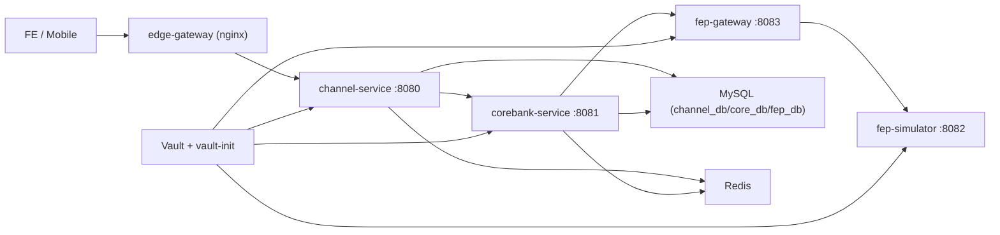
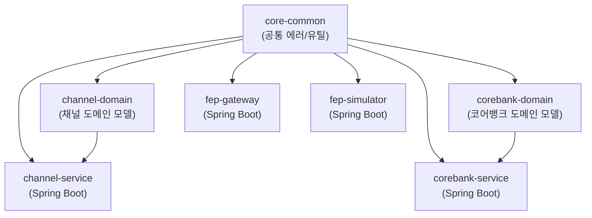

# Google Antigravity Introduction 적용 판단 및 FIXYZ BE 구조/컨벤션

기준일: 2026-03-05
대상 코드베이스: `./BE`

## 1. 적용 판단

판정: **부분 적용(개발 프로세스에는 적합, 런타임 구조에는 비적합)**

- Google Antigravity는 백엔드 프레임워크가 아니라 에이전트 기반 개발 플랫폼이다.
- 따라서 `Spring Boot + Gradle multi-module`인 현재 FIXYZ BE에 직접 런타임 의존성을 추가하는 방식은 부적절하다.
- 대신 **개발/리뷰/검증 워크플로**에 적용하면 효과가 크다.

### 1.1 근거

- Codelab Introduction은 Antigravity를 에이전트가 `plan → execute → validate`를 수행하는 플랫폼으로 설명한다.
- 동일 문서에서 복잡한 작업은 `Planning` 모드를, 검토 균형은 `Review-driven development`를 권장한다.
- Terminal/Browser 실행 권한은 정책 기반으로 제어하며(allow/deny, review), 아티팩트(Implementation Plan, Walkthrough, screenshots 등) 기반 검증을 강조한다.
- 현재는 개인 Gmail 계정 기반 public preview 전제가 있어, 팀/기업 적용 시 보안 정책을 별도로 둬야 한다.

### 1.2 FIXYZ BE에 대한 최종 판정

| 항목 | 판정 | 적용 방식 |
| --- | --- | --- |
| 코드/아키텍처 런타임 직접 적용 | 불가 | 기존 Spring Boot 구조 유지 |
| 개발 프로세스(설계-구현-리뷰) | 강하게 권장 | Planning + Review-driven + Artifact Gate |
| 보안 통제 | 필수 | Terminal Deny/Allow, Browser URL Allowlist, 수동 승인 기본 |

## 2. Antigravity 기준 FIXYZ BE 구조도

## 2.1 런타임 구조도 (서비스 호출/경계)



## 2.2 코드 구조도 (멀티모듈 의존)



## 2.3 권장 디렉터리/패키지 골격

```text
BE/
  core-common/
    src/main/java/com/fix/common/
      error/
  channel-domain/
    src/main/java/com/fix/channel/domain/
  corebank-domain/
    src/main/java/com/fix/corebank/domain/

  channel-service/
    src/main/java/com/fix/channel/
      config/
      filter/
      controller/
      application/        # use-case/service
      infrastructure/     # db/client/adapter
      support/            # mapper, util

  corebank-service/
    src/main/java/com/fix/corebank/
      config/
      filter/
      controller/
      application/
      infrastructure/
      support/

  fep-gateway/
    src/main/java/com/fix/fepgateway/
      config/
      filter/
      controller/
      application/
      infrastructure/

  fep-simulator/
    src/main/java/com/fix/fepsimulator/
      config/
      filter/
      controller/
      application/
      infrastructure/
```

## 3. 컨벤션 (Antigravity 적용형)

## 3.1 모듈 경계 컨벤션

- `core-common`은 공통 타입만 유지하고, 서비스별 비즈니스 로직을 넣지 않는다.
- `*-domain` 모듈은 도메인 모델 중심으로 유지하고 웹/인프라 의존을 넣지 않는다.
- `*-service` 모듈은 API, 유스케이스, 외부 연동을 담당한다.
- 서비스 간 호출은 내부 엔드포인트와 내부 시크릿 헤더(`X-Internal-Secret`)를 기본으로 한다.

## 3.2 API 컨벤션

- 외부 공개 API: `/api/v1/**`
- 내부 API: `/internal/v1/**`, `/fep-internal/**`
- 헬스 체크: `/actuator/health`
- 서비스 식별 `ping` 응답은 최소 `service`, `status` 필드를 포함한다.

## 3.3 오류/예외 컨벤션

- 비즈니스 예외는 `FixException(ErrorCode, message)`를 사용한다.
- API 오류 응답은 `ApiErrorResponse` 포맷을 강제한다.
- `@RestControllerAdvice`로 서비스별 공통 예외 매핑을 유지한다.

## 3.4 설정 컨벤션

- 서비스 포트는 현재 값 고정 유지:
  - `channel-service: 8080`
  - `corebank-service: 8081`
  - `fep-simulator: 8082`
  - `fep-gateway: 8083`
- 환경 분리: `application.yml`, `application-openapi.yml`, `application-prod.yml`
- 시크릿은 환경변수 주입을 기본으로 하고, 로컬 기본값은 개발 전용으로만 사용한다.

## 3.5 DB/마이그레이션 컨벤션

- DDL 변경은 Flyway 버전 스크립트(`V{n}__*.sql`)만 허용한다.
- 로컬 시드는 repeatable(`R__*.sql`)로 관리한다.
- JPA `ddl-auto`는 `validate` 유지(스키마 자동 생성 금지).

## 3.6 테스트 컨벤션

- 단위 테스트: 서비스 내부 순수 로직 검증.
- 통합 테스트: Testcontainers 기반(`MySQL`, 필요 시 `Redis`) 유지.
- 컨트랙트 테스트: 에러 포맷/보안 필터/문서 공개 정책을 서비스별로 고정 검증.

## 3.7 Antigravity 운영 컨벤션 (핵심)

- 기본 대화 모드:
  - 단순 수정: `Fast`
  - 다중 모듈/설계 변경: `Planning` (필수)
- 리뷰 정책: `Review-driven development` 기본
- Terminal 실행 정책:
  - 기본은 수동 승인(`Request review`)
  - 최소 deny list: `rm`, `sudo`, `curl`, `wget`
- Browser 정책:
  - Browser URL Allowlist 운영
  - 문서/공식 레퍼런스 도메인만 허용
- 머지 전 필수 아티팩트:
  - `Task List`
  - `Implementation Plan`
  - `Walkthrough`
  - 코드 diff 검토 코멘트

## 4. 실제 적용 절차 (팀 운영)

1. `main` 브랜치 대상 작업은 Antigravity `Planning` 모드로 시작한다.
2. 에이전트 산출 `Implementation Plan`을 리뷰 후 승인한다.
3. 구현 단계에서 내부 API/보안/오류 컨벤션 위반 여부를 체크한다.
4. `Walkthrough + 테스트 결과`를 리뷰하고 승인한다.
5. 승인된 변경만 PR에 반영한다.

## 5. 제외/보류 항목

- Antigravity 기능을 애플리케이션 런타임(서비스 코드/배포 산출물)에 직접 통합하지 않는다.
- Agent-driven 완전 자동 실행(무검토)은 `main` 대상 작업에서 사용하지 않는다.

## 6. 참고 소스

- Getting Started with Google Antigravity (Google Codelabs): https://codelabs.developers.google.com/getting-started-google-antigravity
- Build with Google Antigravity (Google Developers Blog, 2025-11-20): https://developers.googleblog.com/build-with-google-antigravity-our-new-agentic-development-platform/
